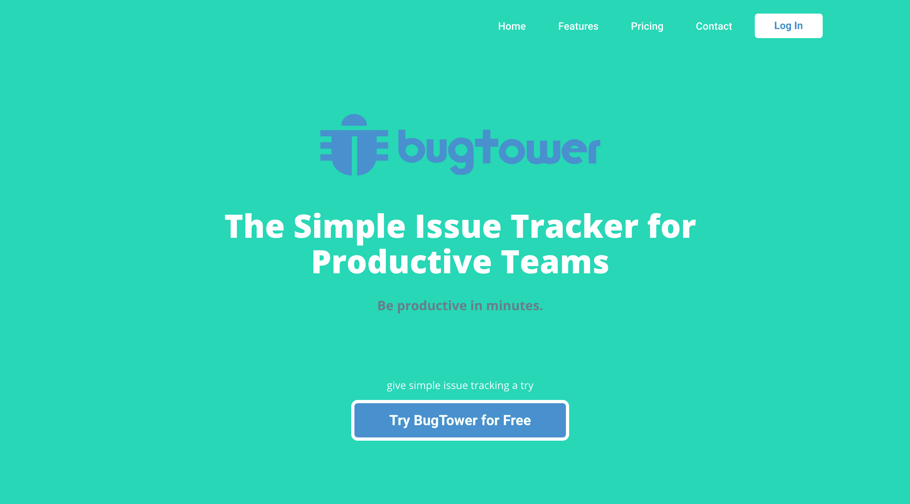
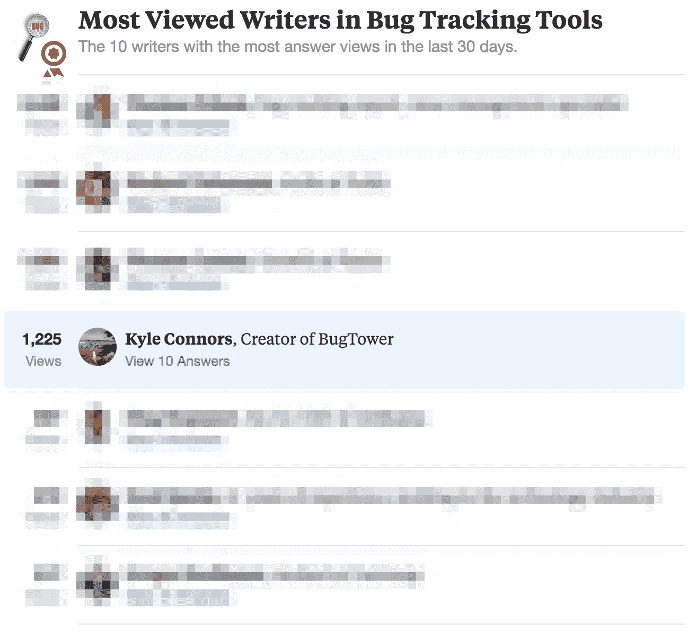
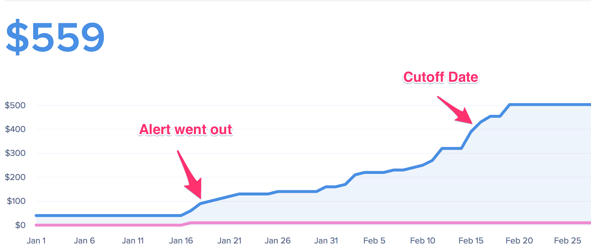

# 我如何最终启动了一个副业项目，并将其增长到每月 800 美元

> 原文：<https://www.indiehackers.com/interview/how-i-finally-launched-a-side-project-and-grew-it-to-800-mo-370d9c1f3c>

## 你好！你的背景是什么，你在做什么？

我叫 Kyle Connors，是纽约布鲁克林的一名软件开发人员。

我运行 [BugTower](https://bugtower.com) ，这是一个简单的问题跟踪应用程序，用于维护和构建软件的团队。我在没有任何外部资助的情况下从头开始构建这个工具。

截至 2017 年 3 月，BugTower 每月产生约 840 美元的收入。

## 是什么促使你开始使用 BugTower？

我在一家开发机构工作，在那里我们为各种各样的客户开发定制软件，其中很大一部分是非技术人员。我们的客户大量参与测试我们为他们构建的软件——包括功能验证和问题报告。管理这种沟通通常涉及以下内容之一:

*   电子邮件:这对客户来说是最容易的，但它可能会丢失，最终成为管理的噩梦。
*   开发人员工具/软件:大多数问题跟踪应用程序都是相当技术性的，并且有陡峭的学习曲线。我们的许多客户缺乏时间或愿望来学习另一种工具，所以他们最终不使用这些应用程序，并返回到电子邮件。
*   电子表格:或多或少和电子邮件一样的问题。

所以我开始构建一个简单的错误跟踪工具，任何人都可以立即投入使用。

我没有做太多的初步市场调查——大多数时候，我只是搔搔自己的痒处，解决我看到的问题。我知道肯定还有其他人面临同样的问题。

 

## 构建最初的产品需要什么？

我在过去已经开始了许多兼职项目，这些项目已经变成了无用的、半成品的应用程序，放在我的电脑上。我花了一些时间来思考为什么我没能启动这些项目，我想到了以下几点:

*   我试着解决一些并不是真正问题的事情。这些很酷的想法会突然出现在我的脑海中，我会立即开始编写代码，只是后来意识到它们不是任何人都会使用的项目。
*   我想做的太多了。这种过度扩张通常包括分析该领域的竞争对手，并说服自己需要在功能、设计等方面与他们匹敌。
*   我想使用令人兴奋的新技术(语言、框架等)。).这花费了太多的时间来构建解决核心问题的工具。
*   我害怕发射。“还不够好。”“这是错误的。”“人家不会觉得有用的。”你陷入过度思考，最终基本瘫痪。

这将是一场苦战，需要时间。确保你在为小胜利做准备。

TweetShare

我知道我已经找到了第一个要点——这是我经历过的一个真正的问题。当然，它不会是下一个独角兽，但它是一个痛点。如果我能避免以前尝试中的陷阱，我觉得我能成功。

根据我到目前为止学到的经验，以下是我关注的几点:

*   我专注于解决核心问题——围绕创建和更新一些基本信息(标题、描述和严重性)的简单工作流。
*   我使用了我所知道的——Python 和 Django，AWS 用于托管，Stripe 用于支付处理。
*   我需要发射——我不在乎人们怎么想。我只想专注于发射。

总而言之，建立最初的 MVP 大约需要 2-3 个月。我有一份全职工作，所以即使在今天，我的主要障碍还是空闲时间。我周末工作，有时进展似乎很慢。但是我实际上认为用有限的资源工作是一个优势——它迫使你集中注意力。

## 你是如何吸引用户并发展 BugTower 的？

我成功地推出了 MVP，并把它放在野外，但我绝对没有客户排队。我想尽快找到用户，所以我暂时排除了长期的流量选项，比如 SEO。我知道我的选择是立即产生流量，要么支付广告费用，要么推销。我两样都做了。

我把 Adwords 的每日限额设定为大约 15-20 美元。它给我带来了一些客户，但对于一个自举产品来说，它太贵了。此外，我还没有完全确定客户的长期价值。(我还是没有！)

为了赶时髦，我决定在论坛上发帖。这些，尤其是 Quora，很快为产品提供了大量的目标人群。许多用户询问简单的错误跟踪工具。我只是提供了 [BugTower](https://bugtower.com) 作为答案。这是一个稳定的获取新客户的流量来源。

quora:bug 追踪工具中点击率最高的作者。

## 你的商业模式是什么，你是如何增加收入的？

[BugTower](https://bugtower.com) 是一款 SaaS 产品，收取月费。我从一开始就知道，我想打造一款从第一天起就充满活力的产品。然而，我确实在开始的时候犯了一些典型的错误。

首先，我有一个过于慷慨的免费计划。第二，我的付费计划太便宜了。我的免费计划允许 3 个项目和无限用户，而我的入门级付费计划是 10 美元/月，10 个项目和无限用户。

我有几十个客户注册并坚持使用该软件，但几乎没有人为此付费。免费计划太好了——没有人需要升级。我知道我不能继续自掏腰包支付费用(一个月几百美元)，所以我决定取消免费计划并提高价格。我想知道人们是否会为 BugTower 买单。如果他们不同意，我会关闭它。

我提前大约 30 天通知了我当时的免费计划客户，并允许他们享受即将改变的较低费率。这是一个艰难的决定，我受到了一些严厉的批评，但大多数客户都理解。在过渡期内，大量的人转向付费计划。

2016 年 1 月至 2016 年 3 月 BugTower 收入。

我每隔一段时间(30 天、20 天、10 天等)给客户发一系列电子邮件提醒他们。)在这个时期结束之前。每一次，都有更多的客户升级。

我使用对讲机与客户交流，这是我强烈推荐的。你需要一些与顾客沟通的方式。

截至 2017 年 3 月， [BugTower](https://bugtower.com) 的营收约为 842 美元/月。在最初的 6 个月里，我面临着来自以前的免费客户的大量流失(在更便宜的遗留计划上)。这似乎很自然，因为他们最初的目标是使用免费产品。

从那以后，我吸引了新客户，他们注册了更昂贵的计划，并逗留了更长时间。然而，客户流失肯定是这类产品的一个问题，因为一些客户将它用于一次性项目，然后就不再使用它了。

不管怎样，费用很低，而且 [BugTower](https://bugtower.com) 目前是盈利的。我目前的支出是:

*   [AWS](http://aws.amazon.com) :约 130 美元/月
*   对讲机:125 美元/月
*   发送网格:大约 20 美元/月
*   [Baremetrics](https://baremetrics.com) :每月 25 美元

如果你打算在 SaaS 独自创业，我强烈建议从第一天开始收费，不要提供免费计划。一个(免费)试用期肯定，但没有免费计划。你需要知道人们是否会为你的产品付费，而你根本没有时间等待免费增值模式的到来。

## 你未来的目标是什么，你打算如何实现它们？

几个月前，BugTower 的收入达到了顶峰。从那以后就有点停滞了。我想让它达到每月稳定增长 8-10%的水平。我倾向于遵循典型的开发者模式，过于关注开发，而没有给予营销足够的爱。

至于产品，我正在听取我的客户对下一步发展的意见。我最近发起了一项调查，询问我的客户他们最想要的特性和增强功能(我给出了几个选项)，他们的答案最终与我的想法相反。

只构建对你的产品绝对必要的特性，其余的留待以后。

TweetShare

我已经预料到了对我缺少的一个大功能的请求，比如集成，但是他们真的只是想要更好的方法来做他们已经可以做的事情(例如搜索和过滤)。持续吸引和接触您的客户非常重要。

从长远来看，我希望 [BugTower](https://bugtower.com) 存在于更多地方——第三方集成、嵌入等。，但我们的目标是继续让 BugTower 尽可能简单。这是客户选择 BugTower 的主要原因，我认为这一点不会改变。否则，它将只是另一个复杂的问题跟踪器。

## 你面临的最大挑战和克服的障碍是什么？

找到时间是最大的挑战。我不得不放弃一些周末来做一些有意义的工作，这意味着牺牲一些我的社交生活。而是找到平衡。你需要确保你在进步，但不要过度劳累和精疲力竭。

我还要说，动力有时是一个挑战。当你几个星期没有新客户的时候，很难坚持不懈，但是你需要专注于小的成功。让客户伸出手告诉你他们有多爱你的软件，这一切都是值得的。

营销也是一个挑战。我倾向于把大部分时间花在开发上，营销成了事后的想法。我认为这对开发人员来说很常见——他们只是想投入到构建一些东西中。

这里最困难的是上下文切换。开发和营销需要非常不同的心态。你很难专注于你正在开发的功能，然后花几天时间专注于完全不同的东西。为了避免这种情况，我建议在每项职责上花一批时间(大约 1 周)。

最后，我本可以在区分需要做的事情的优先次序方面做得更好。例如，我花了相当多的时间来构建一个 iOS 应用程序，但很少有客户使用它。

我还构建了一个早期潜在客户说他们需要的功能，但它从未转化他们。这段时间用在其他地方会更好。很容易说服自己去做。“只需要几个小时，”你想。但这是宝贵的时间。

## 你最大的优势是什么？有什么特别有用的吗？

我认为知道我正在解决的问题以及如何开发和设计 [BugTower](https://bugtower.com) 帮助很大。我可以简单地开始工作，不需要任何外界的帮助。这比依赖别人要容易 100 倍，因为我可以把我脑子里的任何东西付诸行动，而不必担心沟通不畅。

我也有保持专注的能力，所以我不经常分心(虽然它发生了！).有太多令人分心的事情——新想法、要学习的技术、要添加的新功能等等。因此，避免屈服于他们是一个持续的挑战。

比以上任何一个都重要的是，我要说我的主要优势是运气。我很幸运，甚至有选择和资源在业余时间建造像 BugTower 这样的东西。不是每个人都有这种奢侈。对许多人来说，这是不可能的，或者是极其困难的。

## 对于刚刚起步的独立黑客，你有什么建议？

实话实说吧——靠自己白手起家是很难的。除了制造产品之外，还需要大量的工作。但这是可能的，而且有成千上万的人正在成功地做到这一点。记住这一点很重要。我推荐几个建议:

*   现在就开始做——阅读别人的成功，而自己却没有任何进步，这很容易让你分心。向他人学习当然是有帮助的，但它不会为你建立任何东西。
*   无情地划分优先级并启动——只构建对你的产品绝对必要的功能，其余的留到以后。你需要专注于尽快发布。如果你让一个功能拖得太久，你会失去动力，一事无成。
*   享受小胜利——这将是一场苦战，需要时间。确保你为小胜利做好准备，以保持动力。

以下是我推荐的一些网站、书籍和资源:

*   [Mixergy.com](https://mixergy.com)—企业家采访大卫·华纳。我关注这个已经有一段时间了。我总是喜欢听别人的故事，我从中学到了很多。
*   [返工](https://37signals.com/rework)——杰森·弗兰德和大卫·海涅迈尔·汉森(Basecamp 创始人)的书。这有助于你对如何创业有一个正确的心态。
*   [牵引力](http://tractionbook.com) —加布里埃尔·温伯格和贾斯汀·马雷斯的伟大著作。它探索了许多不同的营销渠道，以及如何攻击它们。
*   知名博客—[Baremetrics.com](https://baremetrics.com)、[Intercom.com](https://www.intercom.com)、[Groovehq.com](https://www.groovehq.com)

## 我们可以去哪里了解更多？

你可以在 BugTower.com[查看 BugTower。如果你想亲自联系，你可以在我的个人网站上找到我的电子邮件—](https://bugtower.com) [elyk.me](http://elyk.me) 。

如果你有任何问题，请在下面的评论中提出来。谢谢！

—[<picture id="ember5200311" class="user-avatar ember-view user-link__avatar"></picture>凯尔·康纳斯](/kyle?id=c8BWn0YwHCTZt1VUoUYOm5sw7br2)【bug tower】的创造者

## 想像 BugTower 一样建立自己的事业？

你应该加入[独立黑客社区](/)！🤗

我们是几千名创始人，互相帮助建立有利可图的业务和副业。来分享你正在做的事情，并从你的同事那里获得反馈。

还没准备好开始使用你的产品吗？没问题。这个社区是一个认识人、学习和实践的好地方。随意[随便浏览](/)！

——[<picture id="ember5200316" class="user-avatar ember-view user-link__avatar"></picture>考特兰艾伦](/csallen?id=ibTLPyjwVebnZjMGKvz6ztarnuV2)，独立黑客创始人

7votes