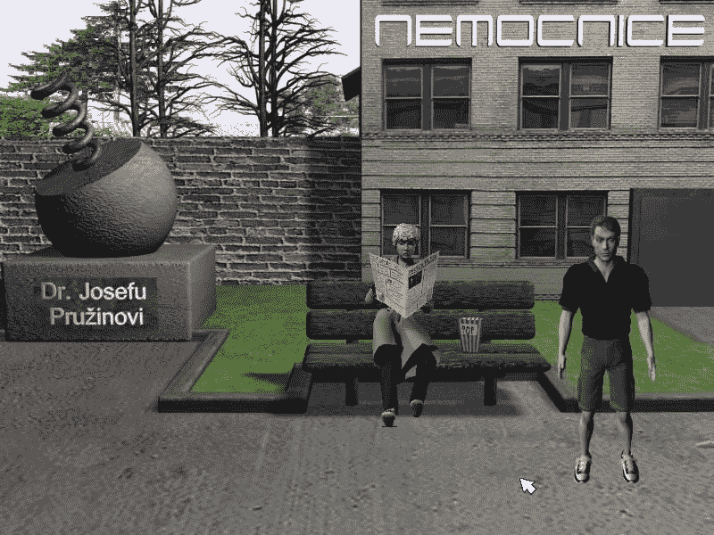
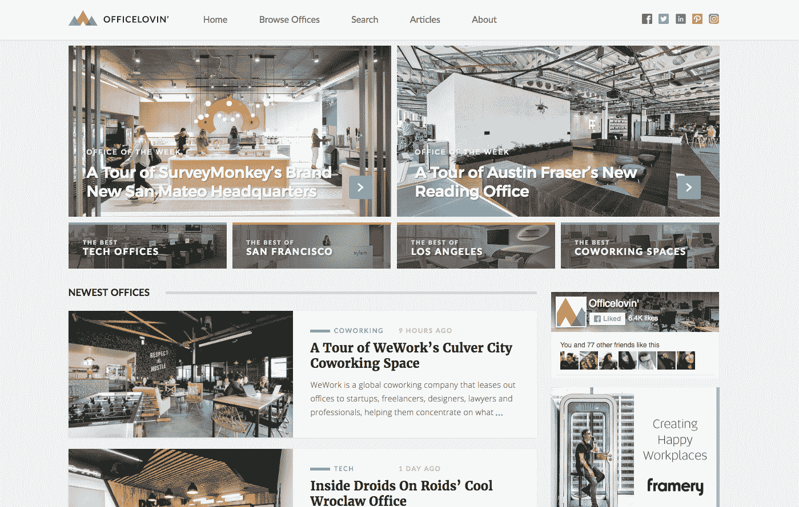

# 我是如何用这笔钱建造一个 3000 美元/月的办公室陈列柜的

> 原文：<https://www.indiehackers.com/interview/how-i-followed-the-money-to-build-a-3k-mo-office-showcase-a504f2c172>

## 你好！你的背景是什么，你在做什么？

你好！首先，谢谢你让我上独立黑客:)。我叫迈克尔·普塔切克。我来自捷克的布拉格，但是六个月前我和我的女朋友搬到了圣地亚哥。

我从小就是个 IT 人。这一切都是从我收到我的第一台 Commodore 64 电脑开始的，我立刻爱上了在上面玩游戏和用 [BASIC](https://en.wikipedia.org/wiki/BASIC) 编程。我在 13 岁的时候开始制作我的第一个真正的网站，两年后我编写了我的第一个点击冒险游戏，叫做博胡斯博士。它有一个经典的陈词滥调的故事，你的角色是一个著名的医生，他需要找到某种未知疾病的治疗方法并拯救世界:)。它花了一年多的时间来开发，这可能是我所完成的最困难的事情。

直到今天，我仍然认为自己是一个真正没有天赋的程序员，但是我非常享受编程的过程，以至于我马上就知道制作产品是我想做的事情。所以在那几年里，我很少做其他项目，包括[czechcrunch . cz](http://www.czechcrunch.cz/)——捷克共和国最大的科技/创业杂志(只有捷克语版本)。

但三年前，我决定主要关注全球市场，尤其是美国，因为我觉得那里有更大的机会。正是在这段时间里，我爱上了办公室。

[office lovin’](https://www.officelovin.com/)是一个展示世界各地最佳办公室的网站。我与大约 150 名建筑师合作(包括 Rapt Studio、Design Blitz、Gensler 等公司。)，他们在 Officelovin 上展示了他们最好的办公室设计，并向我们提供了他们项目的授权照片和信息。

到目前为止,“Officelovin”已经展示了 Zendesk、Lyft、优步、Airbnb、Spotify、The Honest Company 等公司的办公室，其中许多都与我们独家分享，对此我非常高兴。

我们有两个主要的用户群，他们非常不同:

1.  建筑师
2.  来自技术/创业行业的人(设计师、程序员、极客)

他们中的大多数来自美国，但欧洲也有非常强大的存在。目前，我们已经在 Officelovin 上展示了 1340 个办公室。

我目前并没有太关注收入，因为谢天谢地，我从其他项目中赚了足够多的钱来支付我的生活水平。Officelovin 的收入每月只有大约 3500 美元——全部来自广告。

 

## 是什么促使你开始爱上办公室？

尽管我没有这个领域的专业学位，但我一直喜欢漂亮的建筑。作为一名极客，我自然开始注意到越来越多的公司(尤其是科技/创业行业的公司)在办公室上花费越来越多的钱——几乎到了办公室成为他们主要招聘工具之一的地步。

如果你真的去想，这是有道理的。如今，员工在办公室度过了很多时间，尤其是在初创公司和科技公司，没有人愿意在没有窗户的山洞里工作。大多数公司知道这一点，并试图让他们的员工和团队感觉像在家里，而不是在工作，所以你可以看到所有这些休息区，自助餐厅，乒乓球台等。

所有这些都给了我一个想法，那就是做一个网站，以最好的办公室为特色。事情开始得很慢，但在推出几个月后，我在 ProductHunt 上得到了关注，然后 [TheNextWeb](https://thenextweb.com/insider/2015/09/05/officelovin-tech-startup-offices-new-hiring-tools/) 和[office lovin’](https://www.officelovin.com/)从那时起就一直在增长。我立即收到了人们的大量反馈，这是我真正开始意识到用户喜欢使用这个网站，它有很大的潜力。

正如我之前所说，当时我有一些其他项目，这无疑是有帮助的，因为它们让我专注于 Officelovin 的产品方面，而不是不断地考虑数字和收入。

## 构建最初的产品需要什么？

这些天，我试着在我的大部分项目中使用 Laravel，但是对于[办公室恋情，我决定走一条不同的路线。对于一个杂志式的项目来说，重新发明轮子并从头开始编程是没有意义的，所以我使用了 WordPress。我对它很熟悉，它也运行在 PHP 上，这使我可以根据自己的需要对它进行定制。](https://www.officelovin.com/)

我在周末制作了网站的第一个版本，但那只是一些我做了一些调整的高级模板。但我最近决定从头开始彻底重新设计网站，并在两个月前推出全新版本。

后来我把它提交给了 ProductHunt，花了大约三周的时间——包括 WP 开发和图形设计。

在家工作和稳定的收入无疑对大部分时间专注于这个项目有很大帮助。

我尽量避免技术堆栈的趋势。这些年来，我遇到了许多优秀的程序员，他们都有一个共同点——他们不断尝试学习新的技术、框架和趋势。

不要担心你使用的技术——只要尽快运送产品。

TweetShare

然而，他们的问题是他们从来没有发布过完整的项目或产品。为什么？因为他们总是开始编写一些东西，花几个周期试图让代码看起来更好更干净，然后嘣:一个很酷的新技术出现了，吸引了他们的眼球。然后，他们突然转变或重写他们的整个项目，以适应这个很酷的新技术或框架。冲洗并重复——一遍又一遍。

这是一个永无止境的循环。然而，实际的产品从来没有被运出。所以必要的话我就用 PHP，Laravel，jQuery，Wordpress，仅此而已。是的，它很可能不酷，但大多数用户并不关心你使用的技术。

## 你是如何吸引用户和发展办公室恋情的？

我认为 ProductHunt 和 T2 的 NextWeb 产生了巨大的影响。他们在一天之内就把数万人带到了这个地方。两个月前，当新版本( [Officelovin'](https://www.officelovin.com/) 2.0)出现在 ProductHunt 上时，它获得了大约 590 张赞成票，所以很多新用户看到了这款产品。

我个人不太相信付费营销或者类似冷邮件的方法。我觉得他们有点咄咄逼人。我真的很喜欢皮特推销产品的方式。我称之为“诚实营销”，你只需要创造一个人们喜欢的好产品，然后让口碑来处理剩下的事情。

不要太咄咄逼人，在谈判时总是试图使用双赢的局面。

TweetShare

我认为现在很多人都在试图玩弄这个系统，不断地思考某种变通方法。但我认为，如果你有一个真正好的产品，无论如何，你的用户/客户都会找到你。

## 你的商业模式是什么，你是如何增加收入的？

目前，所有的收入都来自横幅广告。我试图用“溢价”的术语来描述，即我只挑选我个人看好的公司。有时这会引起问题。

我得说我是一个非常直接也非常糟糕的销售人员——当我觉得广告商的服务对他们和喜欢办公室的访客没有共同利益时，我会拒绝他们。这肯定会破坏网站的收入，但另一方面，它使它看起来更优质和真实，我也觉得我在那里建立了一些价值。由于网站是有机增长的，我每个月可以多收一点，这对于我来说已经足够了。

还有一些我目前正在开发的新功能(例如，Officelovin ' Jobs)应该会对税务部门有所帮助。正如我所说，在当今的招聘环境中，办公空间是一个重要的招聘工具，因此有很多机会从中创造商业模式。

就收入而言，我给其他人的最大建议是不要太咄咄逼人，在谈判时总是试图利用双赢的局面。从长远来看，这肯定对你有益。

| 月 | 收入 |
| --- | --- |
| 四月 | 2000 |
| 五月 | 2300 |
| 六月 | 2700 |
| 七月 | 3000 |
| 八月 | 3500 |

## 你未来的目标是什么？

我的目标是让[office lovin’](https://www.officelovin.com/)成为建筑师和设计师展示作品的首选网站。我还想把它建成一个网站，让这些专业人士去激励自己。

我目前正在考虑把它变成一个有个人资料和论坛的社区网站，这样人们可以讨论新的趋势，投票赞成/投票反对的产品，标记家具等。也就是说，我想保持它的干净和简单，因为我相信我们正处于一个网站和服务过于复杂的时代，人们已经有点厌倦了。

我最近也开始在 Officelovin 上采访有趣的建筑师和设计师，这样我就可以提供更多有趣的内容。

 

我的流量目标是未来四个月达到 10000 读者/天。正如我之前提到的，在这一点上，收入对我来说并不重要，因为我相信赚更多钱的关键是增加你的流量和产品质量。

## 你面临的最大挑战和克服的障碍是什么？

这肯定会是交流。这不仅适用于[办公室恋情](https://www.officelovin.com/)，也适用于我的其他项目。

我远程工作，我的大多数项目/团队都在使用 [Slack](https://slack.com/) 。我意识到，当你远程工作时，你真的需要过度沟通——即使是最简单或最愚蠢的事情。否则东西在翻译中会迷失方向，影响整个产品。Tobias van Schneider 有一篇关于这个的很棒的文章，他说:

> 这是在远程团队中工作的最重要的方面。你不得不过度沟通，几乎到了你自言自语的程度。
> 
> 远程工作的好处和挑战在于，你并不真正知道团队中的其他人在做什么。你不能在他们的桌子上和他们打招呼，走过去或者在午餐时交谈几句。远程同步将意味着你必须安排一个电话或通过聊天打扰他们，这基本上违背了目的，因为你不能整天开会以确保你赶上每个人。远程与人合作时，我最大的痛苦就是这些人不交流。那些不问任何问题的人，那些不告诉别人他们在做什么或者他们已经完成了什么的人。在家或任何其他偏远的地方工作时，很容易完全消失并在雷达下飞行，你必须积极地与之斗争。

这个我百分之百同意。或者更可能是 200%。

## 有没有发现什么特别有帮助或者有优势的？

有趣的是，我已经停止阅读大多数商业和创业书籍，因为我觉得它们几乎都是一样的，给你一些基本的提示，写成 400 页的书，让它们的作者变得富有。有趣的是，这些作者中的一些人从未真正推出过产品。相反，他们只有通过出版一本关于如何成功的书才获得成功。我觉得这有点悲哀，我不想支持。

所以我更喜欢去 Hacker News、Product Hunt、Indie Hackers、Reddit 和 Quora，与企业和项目背后的真实人物交谈，以获得灵感和学习新事物。

我被诊断患有多动症，这一直是我最大的优势和劣势。我很难把注意力集中在我不在乎的事情上。在学校里，这总是给我带来很多问题，所以我的父母自然想对此做些什么，他们把我送到一位医生那里，医生给我开了多动症药片。

我非常喜欢编程，以至于我马上知道制作产品是我想做的事情。

TweetShare

这些几乎立刻让我变得更加专注和有条理，但过了一会儿我意识到我感觉不像我自己，而是像一个没有感情的僵尸。所以几个星期后，我把它们冲进了马桶，从此再也没碰过它们。后来，我对多动症这个普遍问题了解得越多，我就越意识到我可以做一些事情来减轻它的影响，比如吃更好的食物和定期锻炼。

另一方面，多动症给了我一个巨大的优势——一种被称为“高度集中”的精神状态。当有我真正喜欢做的事情时，我会出现严重的视野狭窄，我会强烈地专注于那一件事，完全迷失在时间中，工作速度非常快:)。对我来说幸运的是，一般来说电脑会让我进入这种状态，所以我在做我的项目时没有问题。

## 对于刚刚起步的独立黑客，你有什么建议？

不要担心你使用的技术——只要尽快运送产品。

一旦上线，收集反馈，努力每天都做得更好。

## 我们可以去哪里了解更多？

我是一个内向的人，所以我一直很沉默，直到两个月前我开始在 Twitter 上活跃起来。

这对我有很大的影响，因为它帮助我与其他志同道合的人讨论技术相关的问题，也帮助我收到了很多很好的反馈。我的推特账号是 [@ptacekmi](https://twitter.com/ptacekmi) 。

我最近也开始写一个中型博客，你可以在这里找到。

外面有比我聪明得多的人，他们有更好的记录，所以我不确定我是否是寻求建议的合适人选。但是如果有人有任何问题，我当然很乐意回答。:)

—[<picture id="ember8089076" class="user-avatar ember-view user-link__avatar"></picture>michalptacek](/michalptacek?id=GZLyrIYcAGbLTToiviCXRywPVOE2)，Officelovin 的创建者

## 想像办公室爱情一样建立自己的事业吗？

你应该加入独立黑客社区！🤗

我们是几千名创始人，互相帮助建立有利可图的业务和副业。来分享你正在做的事情，并从你的同事那里获得反馈。

还没准备好开始使用你的产品吗？没问题。这个社区是一个认识人、学习和实践的好地方。随意[随便浏览](/)！

——[<picture id="ember8089081" class="user-avatar ember-view user-link__avatar"></picture>柯特兰艾伦](/csallen?id=ibTLPyjwVebnZjMGKvz6ztarnuV2)，独立黑客创始人

11votes