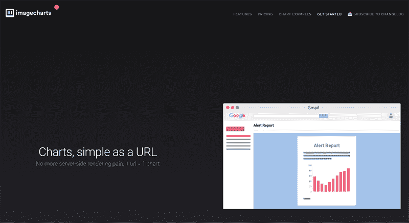
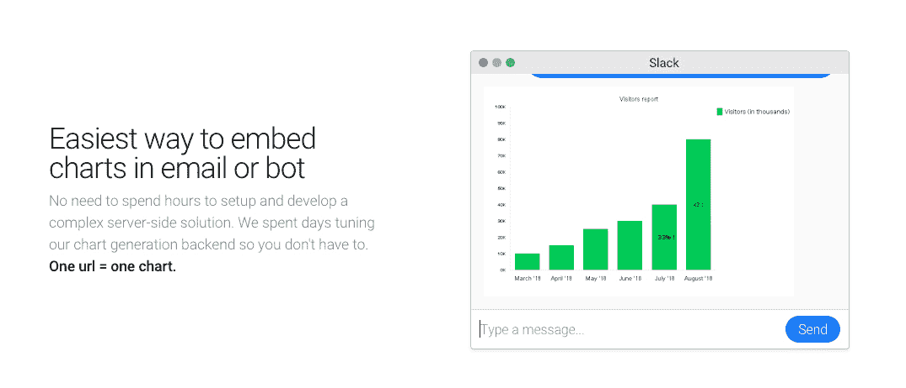
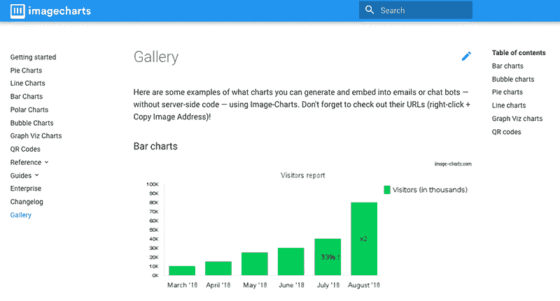

# 我如何在另一种产品的降价中发现机会

> 原文：<https://www.indiehackers.com/interview/how-i-found-opportunity-in-another-products-deprecation-7bf1c20d4b>

## 你好！你的背景是什么，你在做什么？

我的名字是弗朗索瓦·纪尧姆，但是每个人都叫我 FG。我是法国领先的地区性报纸《法国西部报》的数字开发主管和架构师。早在 2012 年，我就与人合伙创立了 Bringr，这是一款针对社交媒体的实时监控工具，允许用户监控品牌的在线活动(甚至是那些他们不拥有的品牌)，根据自定义标准获得提醒，并生成报告。那是我的第一笔生意，我最终把它卖给了一家专注于电子商务行为定位的领先软件公司。

然后我在 2016 年创建了 [Image-Charts](https://www.image-charts.com/) ，这是一个让通过电子邮件、聊天机器人和许多其他渠道发送生成的图表变得快速而简单的工具。编写或维护服务器端解决方案没有任何麻烦或额外成本。图像图表使得像 Dropbox、Spotify 和探索频道这样的公司能够大规模地做到这一点。

 

今天，Image-Charts 每天生成 100 多万张图表，带来 3400 美元的 MRR 收入。由于谷歌图像图表的日落，2019 年 3 月的流量增加了 20 倍以上。太疯狂了。

## 是什么促使你开始使用图像图表？

这颗种子是在 2015 年底首次播种的。我正在为 Redsmin 开发一个警报功能，我需要找到一种方法来自动生成好看的图表。因为我不想自己实现它，所以我开始寻找现有的解决方案；当时唯一可用的工具是[谷歌图像图表](https://developers.google.com/chart/image/)。它是免费的，但自 2012 年 4 月以来一直在贬值。这意味着该工具可以在没有事先通知的情况下随时完全关闭。不酷。

唯一可能的替代产品有一个与谷歌图像图表不兼容的 API。如果我继续使用这个解决方案，我将不得不重建我的引擎，这将是一个巨大的时间投资。我决定最好是建立自己的工具，这就是我如何开始逆向工程谷歌图像图表。

Image-Charts 最初是作为我自己的 Google Image Charts 的替代品建立的。当然，我是为 Redsmin 使用它的，但我也想让其他对 Google Image Charts 失望的人也能使用它。我想让用户保留几乎所有的现有设置，以便尽可能平稳地迁移到图像图表。使用与 Google Image Charts 相同的 API 来生成 URL 是一个先决条件。从营销的角度来看，我知道这也有助于转化新用户。

随着用户群的增长，我开始通过要求客户为新功能的开发付费，或者至少订阅我的三个可用付费计划中的一个来验证新功能的请求。这就是我如何在 2016 年让我的第一批付费客户回来的——六个月(是的，那是很多！)写完我的第一行代码之后。

 

## 构建最初的产品需要什么？

我只能在业余时间从事这个项目，因为我仍然全职为收购 Bringr 的公司工作，我花了一整天的时间来构建最初的产品。

令人高兴的是，我没有在这个项目上投入一分钱，甚至没有托管费。它是 100%自举的，主要构建在流行的框架和应用程序上，如 [NodeJS](https://nodejs.org/en/) 和 [Netlify](https://www.netlify.com/) 。我已经在 [StackShare](https://stackshare.io/image-charts/image-charts) 上详细介绍了整个图像图表堆栈。

有时候时机可能是你最好的盟友....只要确保您的基础架构能够快速扩展即可。

TweetShare

我的市场验证策略非常简单。因为 Image-Charts 是 Google Image Charts 的替代品，所以毫无疑问市场是存在的，尤其是因为它周围的社区。

之前*不清楚的是开始构建新功能所需的策略。我本可以开发我的用户要求的所有东西，或者只为我自己的个人需求构建我想要的东西…但是我没有那样做。我觉得最好的选择是 100%确定某个特定的功能会增加产品的价值，并且客户会愿意为此付费。因此，我开始在开发客户要求的任何东西之前向他们收费。*

## 你是如何吸引用户和增加图像图表的？

我的策略集中于为我的理想客户提供尽可能多的价值:全世界的开发者伙伴。为此，我没有举行典型的产品发布会。我通过分享我遇到的问题的解决方案来为开发者社区做贡献。

这就是为什么我的第一步是在现有的 GitHub 项目上做 pull 请求，这些项目由于谷歌图像图表的贬值而受到影响，例如 [LegGCharts](https://github.com/tgalopin-archive/LegGoogleCharts/pull/2) 、 [Quiche](https://github.com/ryanrolds/quiche/pull/9) 和[谷歌图表助手](https://github.com/segy/GoogleChart/pull/3)。我帮助维护他们的代码，让他们更容易迁移到图像图表。我认为这种方法对大多数开发人员来说意义重大。

我还在 GitHub 上构建并发布了 [MJML 图表](https://github.com/image-charts/mjml-chart)，GitHub 是一个用 MJML 框架构建的 JS 库/插件，可以在电子邮件中将图表显示为图像。我认为，通过在 GitHub 上免费提供这些内容，我可以瞄准那些对图像图表有特殊需求的开发者，这也有助于提高产品的可见性。

特别有效的是回答 StackOverflow 上的问题。通过在谷歌中定位搜索查询，并确定一个问题可能给我带来的流量，我会发布以图像图表为特征的答案作为解决方案。我做这个的时候总是很小心；我确保首先给问题提供很大的价值，并且只在相关的时候谈论图像图表。

我尝试了另一种策略，结果效果不太好。我使用生成器为 Scala、PHP、Ruby、Perl 和 Python 等特定语言创建库，以使图像图表更容易集成。但是它太多了——数量并不意味着质量——而且产品对于那么多新的库来说还不够成熟。

很多时候，当我开始一个新项目时，我会在我的个人博客上为[写一篇文章，很多朋友和我一生中遇到的人都会关注这篇文章。这总是获得建设性反馈或开始可能带来新客户的对话的好方法。](https://blog.fgribreau.com/)

在业余时间，我也是一个会议爱好者。我每年都参加几个。我不时地讲述我的经历和学习，这可以让我愉快地谈论我所开发的产品。而且因为受众往往是由开发者组成的，他们中的一些人最终可能会成为我的客户。

但是真正帮助我的生意赚钱的，也是我从第一次使用图像图表开始就一直在等待的，是官方对谷歌图像图表的反对。这件事发生在 2019 年 3 月，就在同一天(由于我在 SERPs 的良好地位)，许多新的人订阅了。然而，它确实略微增加了流失率(从 0%到 1-2%)，但这是意料之中的。

我相信在 [ProductHunt](https://www.producthunt.com/) 上发布会给 Image-Charts 带来很大的知名度。这绝对是我未来几个月要考虑的事情。但我在等待，直到我发布期待已久的功能，如视网膜支持，复合图表，和多轴支持。

 

## 你的商业模式是什么，你是如何增加收入的？

Image-Charts 是一家 SaaS 公司，和大多数 SaaS 公司一样，用户通常从创建一个免费账户开始。一段时间后，一些人会进入付费阶层。Image-Charts 从这些订阅计划和请求新功能的用户那里获得收入。我不愿意开发用户不愿意付费的东西。这也是验证请求背后真正需求的一种方式。这是 Image-Charts 赚钱的唯一两种方式。Image-Charts 不向第三方出售任何类型的用户数据。

优化成本，尤其是在开始阶段，是非常有用的。除了储蓄，它就像复利一样——它允许你把你存的钱再投资到发展你的业务上。目前，图像图表每月花费 200 多美元，主要成本是运行在谷歌云平台上的基础设施(全球成本的⅔)。剩下的花在了 [GitLab](https://about.gitlab.com/) 和 [Cloudflare](https://www.cloudflare.com/fr-fr/) 上。

测试定价选项很有帮助，我从和 Redsmin 一起做的实验中学到了很多。例如，为年度计划提供折扣有助于巩固收入。我还了解到，你不希望对免费增值或“廉价”计划中包含的功能过于慷慨。如果你有一个杀手锏，那就把它留到最高级的时候。之后很难在不引起任何不满的情况下移除它。

## 你未来的目标是什么？

在接下来的几个月里，我对 Image-Chart 的主要目标是实现我上面提到的三个关键特性(Retina 支持、复合图表和多轴支持),并进一步支持 Google Image Chart 的特性。这些功能将吸引新客户，并将仅在高级层中提供。改善开发者体验(DX)也在路线图上。

一旦这些新功能推出，图像图表将准备在 ProductHunt 上推出。我对这次发布抱有很高的期望，因为 ProductHunt 是一个我热爱和尊重的社区。唯一需要注意的是，根据产品的质量和上市策略，它可以提升或扼杀你的产品。

如果我能够在 2020 年达到 11-17K MRR，我计划聘请一名全职开发人员来帮助改善和管理基础设施以及服务可靠性和客户支持帮助，这样我就可以退一步。

如果你有一个杀手锏，那就把它留到最高级的时候。

TweetShare

## 有没有发现什么特别有帮助或者有优势的？

一路上有一些事情帮助了我。就在线服务而言，我真的很喜欢 Netlify 和谷歌云平台所做的，尤其是因为他们的 Kubernetes 引擎。这两个产品都有助于减少我为自己的产品编码所花费的时间。

早期的小优化可能会产生巨大的长期影响，您希望尽早发现它们。我做的一个好的决定是在从第一天开始用图像图表生成的图表中包含一个水印。它提供了少量的可见性，但当你每天生成超过一百万个图表时，它可以驱动很多新的访问者。

有时候时机可能是你最好的盟友。对于图像图表，谷歌图像图表的关闭有助于获得新用户。你的产品也可能有类似的机会。只要确保您的基础架构能够快速扩展即可。

## 对于刚刚起步的独立黑客，你有什么建议？

你需要非常投入你的项目。做一个能解决你自己问题的产品。你正在经历的问题很可能也会被其他人经历。并且不要试图一次装运所有东西；关注市场，测试它，然后迭代。

依赖现有产品，尽可能使用托管服务。将某些任务具体化可以帮助你关注最重要的事情。

订阅相关的时事通讯(SaaS 周刊、创始人周刊等),扩大你在行业中的人脉。)以及围绕你的产品建立一个社区。这是我已经努力了一段时间的事情，我仍然有很大的改进空间。个人品牌是棘手的，需要耐心。一个好的第一步可能是开始你自己的博客，或者在社交媒体和任何你的客户所在的地方更加活跃。

## 我们可以去哪里了解更多？

你可以在 image-charts.com 的[试试图像图表。我在](http://image-charts.com/)[我的个人博客](https://blog.fgribreau.com/)和 [GitHub](http://github.com/fgribreau) 上写下我的项目和实验。

而如果你想伸出手， [Twitter](https://twitter.com/FGRibreau/) 是最好的方式。

哦，我最近还在写一本名为 [NoBullshit Tech-Lead](https://getnobullshit.com/) 的书，收集了我在科技公司打造产品和团队时学到的一切。如果你喜欢这个主意，去看看吧。英文版将很快推出。

感谢大家的阅读。下面有什么后续问题可以随时问我！

—[<picture id="ember5305716" class="user-avatar ember-view user-link__avatar"></picture>弗朗索瓦-纪尧姆·里布罗](/fgribreau?id=ohYALBCsUqgPlgL09XcKfFoec9K2)【图像-图表的创始人

## 想建立自己的企业像图像图表？

你应该加入[独立黑客社区](/)！🤗

我们是几千名创始人，互相帮助建立有利可图的业务和副业。来分享你正在做的事情，并从你的同事那里获得反馈。

还没准备好开始使用你的产品吗？没问题。这个社区是一个认识人、学习和实践的好地方。随意[随便浏览](/)！

——[<picture id="ember5305721" class="user-avatar ember-view user-link__avatar"></picture>考特兰艾伦](/csallen?id=ibTLPyjwVebnZjMGKvz6ztarnuV2)，独立黑客创始人

26votes