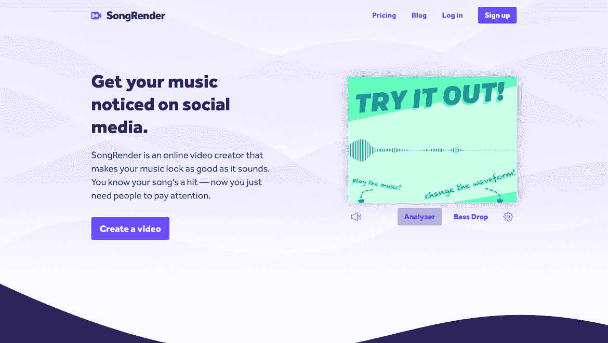
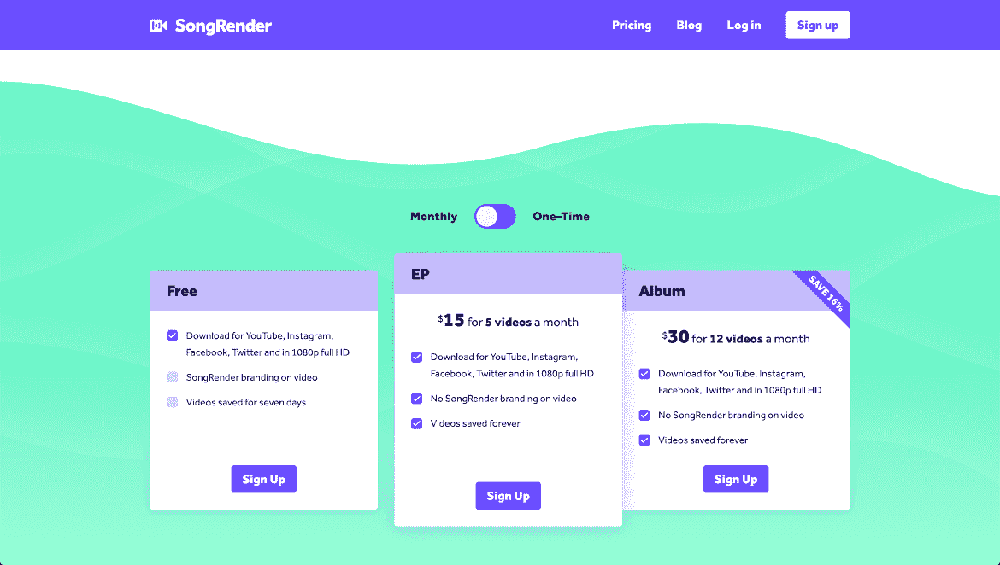
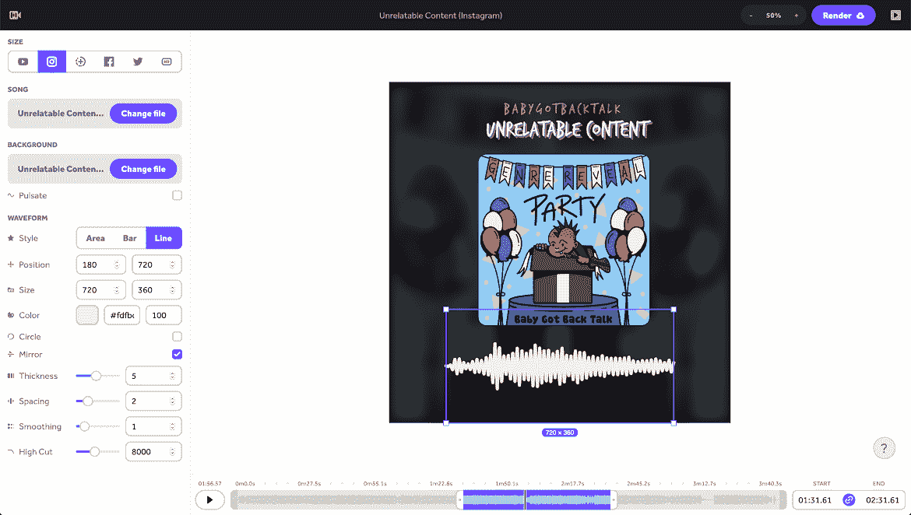

# 我是如何在不使用知名应用程序的情况下获得项目成功的

> 原文：<https://www.indiehackers.com/interview/how-i-found-side-project-success-without-using-big-name-apps-4987cb74c1>

## 你好！你的背景是什么，你在做什么？

嗨！我叫 Jake Lazaroff，是一名住在纽约的设计师、程序员和音乐家。除了我的全职工作，我最关注的两个项目是我的乐队 [babygotbacktalk](https://babygotbacktalk.bandcamp.com) 和我的应用 [SongRender](https://songrender.com) 。

SongRender 是一个 web 应用程序，可以让您制作音乐可视化视频，这是一个带有与音轨同步移动的图形的视频。我为想在网上推广音频的人做的。通常，这意味着音乐家和播客。

目前，SongRender 每月从定期订阅中获得不到 100 美元的收入，每月从个人销售中获得约 600 美元的收入。

## 是什么促使你开始使用 SongRender？

现代社交媒体的一个奇怪之处在于，如果没有视频，分享音频实际上是相当困难的。例如，Twitter 不会让你预览你的 feed 中的音频内容，你根本不能向 Instagram 发布音频。

当我在头脑风暴如何推广我的乐队时，我注意到很多 YouTube 频道会使用一个带有专辑封面和底部一点波形的视频来可视化音乐。说实话，我一开始没打算做 app。如果我找到了一个便宜易用的解决方案，我会直接使用它。但唯一的选择似乎是基于网络的笨重服务，或者投资和学习复杂的软件，如 AfterEffects。对我来说，真正扼杀现有服务的是，它们只提供静态预览，你必须实际去渲染你的视频，看看它最终会是什么样子。

除此之外，我没有做太多的正式验证。我知道我想制作这些视频，而且我已经找到了一些相当成功的竞争对手，试图找到一个现有的产品，所以我猜测这是有市场的。我和其他音乐人聊过几次，我和我的兄弟聊过，他为主要唱片公司做过营销。

## 构建最初的产品需要什么？

构建第一个版本花了大约五个月的时间。我知道如何构建一个 web 应用程序，但我对音频可视化一无所知，所以很多最初的工作只是研究如何实际构建产品。我花了很多时间在数字信号处理的[栈交换上。我*仍然*没有太多坚实的数学基础，但是我想出了足够多的方法，至少做出了足够好的东西。](https://dsp.stackexchange.com)

把艺术推向世界会让世界变得更好

TweetShare

最有价值球员非常简单。没有用户帐户，您无法存储数据。你必须在一个会话中上传你的音乐和艺术作品，并创建你的视频，而不用关闭浏览器标签，当它完成渲染时，它会通过电子邮件向你发送视频链接。你一次只能制作一个视频，而且没有订阅。简而言之，我想出了为自己的乐队制作视频所需的最低要求，并朝着这个目标努力。

现代云基础设施令人惊叹；除了域名，基本上不需要任何前期投资。

## 你的技术是什么？

SongRender 在前端使用 [React](https://reactjs.org/) ，在后端使用 [Node.js](https://nodejs.org/en/) 。我选择 React 是因为我已经对它很熟悉了，也因为这个社区是迄今为止最大的前端框架。我出于需要选择了 Node:我需要相同的呈现代码在浏览器和服务器上运行，这意味着使用 JavaScript。

启动和运行这个程序最困难的部分是弄清楚渲染是如何进行的。在我完成算法之后，软件方面的工作很快就完成了:[节点画布](https://github.com/Automattic/node-canvas)渲染单个帧，这些帧 [ffmpeg](https://ffmpeg.org/) 转化成视频。

但是基础设施有点棘手。最初，我认为它很适合无服务器功能，但大多数云提供商没有提供足够的运行时间或内存。最终，我决定采用当前的设置，这是一个普通的节点服务器，从 Redis 队列中提取作业。

基础设施主要运行在 [Netlify](https://www.netlify.com/) 和 [DigitalOcean](https://www.digitalocean.com/) 上，还有少量的支持服务。早期，我决定避免支持科技巨头，主要是因为他们都参与了我认为不道德的行为，尽管作为一个小企业，支持其他公司对抗巨头也感觉不错。

有一件事对我有帮助，那就是让技术栈尽可能简单和标准。我试图体现 Marco Arment 的[为应用开发者提供虚拟主机](https://marco.org/2014/03/27/web-hosting-for-app-developers)和 Dan McKinley 的[选择无聊技术](https://mcfunley.com/choose-boring-technology)的精神。服务器是基本的 Linux 机器，数据库是 Postgres，API 使用 REST。React 是唯一大的前端依赖；我没用过 Redux 或者 Mobx 或者 sagas 之类的。

## 你特意避开科技巨头的产品，你的网站上有一些对谷歌特别严厉的评论。这种方法有没有导致任何独特的斗争或令人惊讶的好处？

我一点都没纠结过。他们的很多产品都非常商品化。事实上，为大多数科技巨头提供的服务找到替代品相当容易:用 [Fastmail](https://www.fastmail.com/) 代替 Gmail，用 [GitLab](https://about.gitlab.com/) 代替 GitHub，等等。

在许多情况下，我认为较小的产品往往更加专注和完善。谷歌分析感觉缓慢而笨拙，我不知道一半的数字是什么意思，但我总是很开心地看着我的[英寻](https://fathoms.io/)仪表盘。DigitalOcean 的 web 界面比 AWS 的痛苦少一百万倍。

另一方面，我不得不接受这样一个事实:科技巨头往往是我使用的较小服务的过渡性依赖。如果我不能使用任何一家大型科技公司的服务，我就必须切断自己与整个互联网的联系。

## 你是如何吸引用户和发展 SongRender 的？

我在独立黑客网站上发布了[！](https://www.indiehackers.com/product/songrender/hi-indie-hackers-its-launch-day-for-songrender--LZoNMjSm84k6LdSAPgC)

发布日相当平静。我发布了我的社交网站和一些相关子网站的链接。最有效的是 [r/musicmarketing](https://www.reddit.com/r/musicmarketing/comments/avs9y5/i_made_an_app_to_turn_songs_into_videos_to/) ，尽管它的社区相对较小，但却带来了销售！第一天看到的结果非常令人鼓舞。感觉我真的在做正确的事情。

不幸的是，除了 3 月份在 Designer News 上发表了一篇有效的帖子之外，接下来的几个月里，流量和收入都停滞不前。

| 月 | 游客 |
| --- | --- |
| 2019 年 2 月 | 342 |
| 2019 年 4 月 | 286 |
| 2019 年 6 月 | 122 |
| 2019 年 8 月 | 92 |
| 19 年 10 月 | 156 |
| 2019 年 12 月 | 174 |
| 2 月 20 日 | 1089 |
| 2010 年 4 月 | 675 |
| 2010 年 6 月 | 2194 |
| 8 月 20 日 | 2740 |

2019 年是忙碌的一年。我搬了家，订了婚，开始计划婚礼，我的乐队被预约在一个重要的节日演出。现在 SongRender 是一个兼职，因此我没有太多的时间来做产品或营销。在 SongRender 的第一个生日上，我在我的 [recap 博客帖子](https://jake.nyc/words/songrender-turns-one/)中写了一些关于这个的内容，但是试图平衡一个兼职项目与一份工作、其他爱好和关系可能是困难和孤独的。

我的主要推广策略是在相关的子栏目上发帖。他们在很大程度上为我 2019 年的流量和收入负责，但最终我认为这不太可能推动爆炸式增长。Reddit 上的大多数社区对自我推广非常过敏，所以我倾向于坚持专门的推广线索，可以预见，这些线索比社区整体的参与度要低。

较小的链接聚合器几乎没有为我做什么。我把 SongRender 提交给了我能找到的所有人: [BetaList](https://betalist.com/) ， [AlternativeTo](https://alternativeto.net/) 等等。也许他们给了 SongRender 一个边际 SEO 提升，但他们带动了很少的流量。虽然值得注意的是，观众往往是与技术有关的人，这不一定与我的客户群重叠。像 [Designer News](https://www.designernews.co/) 和 [Product Hunt](https://www.producthunt.com/) 这样的大型聚合网站在推动流量方面很成功，但是转化率非常低。

我尝试过冷淡地联系博客，但基本上一无所获。

搜索引擎排名非常有帮助。在过去的一年半时间里，SongRender 的搜索流量慢慢上升到每月 3000 次点击左右。

流量和收入的最大驱动力最终变得很不走运:一家名为 LightMV 的网站将 SongRender 列入了他们排名很高的[最佳在线免费音频可视化综述](https://lightmv.com/best-free-audio-visualizer-online.html)。到目前为止，它是该应用程序的最大推荐人，甚至超过了 SongRender 营销网站。

这里有一点很重要，那就是你不应该太担心“强制性”的发布平台，比如产品搜索或黑客新闻。不是因为你不太可能成功；更确切地说，即使你这样做了，由一个受众与你的客户群一致的人来做特色会更有效，即使这个受众比较小。必然的结果是，不接触博客和音乐人可能意味着把钱留在桌子上，所以这将是我未来营销策略的核心部分。

SongRender 还有最后一个独特的增长策略:无限的免费层，警告视频在角落里有水印。我知道作为一个自举开发者，人们会选择提供免费层，但是我认为水印是一个双赢。如果用户不想付费移除水印，SongRender 会在他们分享视频时获得免费广告。我可以通过查看品牌搜索查询(专门搜索“songrender”)来推断哪些流量是由水印驱动的。二月份，这些查询的峰值导致了比我的产品搜索发布更多的流量！

## 你的商业模式是什么，你是如何增加收入的？

11 月，我发布了我认为是 [SongRender v2](https://songrender.com/blog/re-introducing-songrender/) 。我添加了用户账号，保存项目的能力和所有渲染的列表。这是一个巨大的用户体验胜利，它解除了许多功能，包括一个至关重要的功能:价格层。

SongRender v1 除了渲染视频之外没有存储任何东西，所以人们必须以每条 5 美元的价格购买一次性视频。但是现在我有了用户账户，我增加了购买捆绑视频的功能。这立即生效；二月份的收入几乎是一月份的两倍，尽管只有几笔额外的购买。几个月后，终于加了包月，一直在缓慢但稳定的增长。

我增加收入的另一个方法是找到人们最有可能想买东西的点。例如，很多人渲染带有水印的视频，然后付费重新渲染没有水印的视频。当我意识到这一点时，我添加了一个提示，当用户去下载带水印的视频时，立即重新渲染。据我估计，这至少促成了 15 到 20 笔交易。

| 月 | 游客 |
| --- | --- |
| 2019 年 2 月 | 48 |
| 2019 年 4 月 | 17 |
| 2019 年 6 月 | 24 |
| 2019 年 8 月 | 74 |
| 19 年 10 月 | 19 |
| 2019 年 12 月 | 39 |
| 2 月 20 日 | 60 |
| 2010 年 4 月 | 70 |
| 2010 年 6 月 | 595 |
| 8 月 20 日 | 705 |

## 达到月盈利了吗？

没错。SongRender 现在每月都有盈利，可以说感觉很棒。这有点难以预测，因为大部分收入来自个人销售而不是订阅，并且数字海洋的账单根据人们提供的视频数量而变化。

上个月的利润约为 470 美元，这个月看起来甚至更好！

## SongRender 目前是一个边项目，你在 2019 年看到了你的大部分增长。新冠肺炎是如何影响它的？你有更多的时间来开发应用程序吗？它是否产生了不同的产品问题？

我不认为新冠肺炎有特别的影响。我没有从我的用户那里听到任何影响他们使用的消息。

我想，被困在室内让我可以在本来有社交义务的时候继续工作。

但封锁期对我来说仍然很忙:除了歌曲渲染，我还和我的乐队完成了录制并发行了一张专辑，并重新计划了我现在的妻子的婚礼。不完全是一个平静的生产力时期！

## 你同时处理这么多不同的项目让我震惊。你每天或每周在 SongRender 上花了多少时间？

老实说，我可以投入到 SongRender 中的时间每周变化很大，甚至每月都有变化。最近压力最大的时候可能是今年 7 月，那时我刚刚成立了一个有限责任公司，我的乐队发行了我们的专辑。很难准确地估计，但我敢打赌有几个星期我花了 15-20 个小时。显然，同时进行两个时间密集型项目并不理想，但我想让每个项目都发生令人兴奋的事情给了我能量。

更可持续的是如果我在项目之间交替。举例来说，当我的乐队去年录制我们的专辑，或者准备在 Afropunk 演出时，有几个星期我可能会花一个小时的时间来创作歌曲。另一方面，有时候乐队要求不高，我可以在歌曲创作上投入很多精力。我想说我每天花在 SongRender 上的时间绝对最多的是工作日的 3-4 个小时，周末可能是 5-6 个小时。

倦怠也是真实的！在今年夏天投入了大量的工作后，过去的一个半月里，我从乐队和 SongRender 中休息了一段时间。不过，现在我又开始重拾它了——不能离开太久。如果我能控制自己的节奏，我的生活可能会更容易，但当我开始做某件事时，我会变得很沮丧，并不断思考。

我想你是对的，我确实有很多项目——这有点可笑，因为我总是觉得我应该控制住自己。我希望我能像以前一样多画画，我喜欢进入游戏开发或棋盘游戏设计，我对不同的应用程序和我想探索的其他音乐流派有各种各样的想法……基本上，我很难阻止自己开始一吨我永远无法完成的新东西，哈哈。有时我担心，如果我能专注于一件事，成功的可能性会大得多，但我不认为我能让自己做到这一点。

## 你未来的目标是什么？

我是一个非常有内在动力的人。最终我的目标是创造自由。朝九晚五的工作花费了我很多时间，我可以用这些时间来开发其他应用程序、制作音乐、设计游戏、画画或写作...

我希望 SongRender 成为一家生活方式企业，能够养活我和我的家人，这样我就可以从事其他我现在没有带宽的创造性活动。

## 你面临的最大挑战和克服的障碍是什么？

对我的基础架构感到满意！我在技术决策和运营上浪费的时间可能比其他任何事情都多。

我是使用无服务器、容器还是普通服务器？

*我应该设置持续部署吗？*

人们很容易陷入这样的陷阱，认为这些是重要的事情，做起来很有趣，但最终用户并不在乎。

## 有没有发现什么特别有帮助或者有优势的？

让我坚持下去的是我真诚地关心 SongRender。即使当我精疲力尽，需要休息的时候，不久我就会开始考虑要实现的新特性或者要重构的东西。

找到你内在关心的东西。

TweetShare

用它来创作我自己的音乐给了我很多灵感。如果你和我一样，我的建议是找一些你真正关心的事情。如果我没有，我不知道我能坚持这么久。

## 社会原因对你来说很重要。你觉得 SongRender 有助于让世界变得更美好吗？

这是一个相当大的问题！我认为，让世界变得更美好意味着什么，这值得深究。显然，SongRender 无助于应对气候变化或系统性种族主义。

我有时会想起 Eevee 的一篇博文。一位读者问她个人的乌托邦是什么样的，她的回答归结为“我希望每个人都有制作东西的自由。”我同意这个观点。我从事编程的原因是因为我的童年是在画画和设计中度过的，我想把其中的一些想法用铅笔和纸无法做到的方式变得有形。我自学吉他，因为当我不再听别人制作的音乐时，我开始听到还没有人制作的音乐，我必须把它带到现实世界中。

我很大程度上认为艺术本质上是一件好事；总的来说，把艺术推向世界会让世界变得更好。所以在这个意义上，如果 SongRender 可以帮助人们把他们的艺术展示出来，或者如果视频本身就是某人想要制作的艺术，那么是的，我确实认为它有助于让世界变得稍微好一点。

## 对于刚刚起步的独立黑客，你有什么建议？

对我来说，创业就像在乐队里一样。目前，人们很容易认为参加大型演出或被某个热门网站曝光有可能让你大吃一惊。然而，事实上，你是通过练习、尽可能做出最好的音乐以及不懈地追逐机会和粉丝来成长的。

【T2

当然，这并不意味着你应该完全忘记产品搜索发布。但是请记住，与反复改进产品、推广产品和寻找客户的累积效应相比，一个突发事件的影响可以忽略不计。

## 我们可以去哪里了解更多？

你可以在[songrender.com](https://songrender.com)查看 SongRender，或者在[推特](https://twitter.com/songrender)或 [Instagram](https://instagram.com/songrender) 关注它。

我的个人网站是 jake.nyc 和 Twitter。

最后但同样重要的是，你可以在 [Bandcamp](https://babygotbacktalk.bandcamp.com) 、 [Twitter](https://twitter.com/babygotbacktalk) 和 [Instagram](https://instagram.com/babygotbacktalk) 上找到我的乐队 babygotbacktalk。我们刚刚发布了我们的首张专辑“流派揭示党”:[听听吧](https://open.spotify.com/album/4W2CFdeZFzU3AYopLGDMQJ?si=LZcpLXpZTgKuh0gfnlq9og)！

——[<picture id="ember5301035" class="user-avatar ember-view user-link__avatar"></picture>Jake Lazaroff](/jakelazaroff?id=7SLwkmPSyjUpQzXAa0KpZqAHfT92)【SongRender】创始人

## 想像 SongRender 一样建立自己的事业？

你应该加入独立黑客社区！🤗

我们是几千名创始人，互相帮助建立有利可图的业务和副业。来分享你正在做的事情，并从你的同事那里获得反馈。

还没准备好开始使用你的产品吗？没问题。这个社区是一个认识人、学习和实践的好地方。随意[随便浏览](/)！

——[<picture id="ember5301040" class="user-avatar ember-view user-link__avatar"></picture>柯特兰艾伦](/csallen?id=ibTLPyjwVebnZjMGKvz6ztarnuV2)，独立黑客创始人

29votes