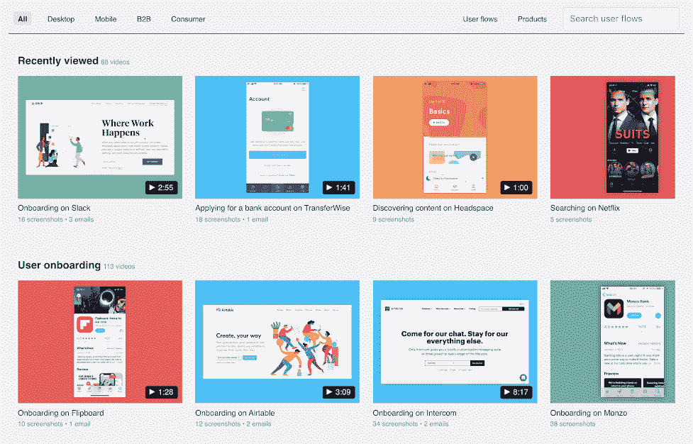
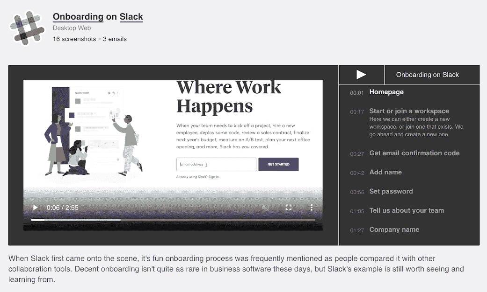

# 我是如何在几乎放弃后获得牵引力并变得盈利的

> 原文：<https://www.indiehackers.com/interview/how-i-gained-traction-and-became-profitable-after-almost-quitting-18dc0bc62d>

## 你好！你的背景是什么，你在做什么？

我是 Ramy Khuffash，我负责管理[页面流](https://pageflows.com/)——这是一个用户流记录库，记录了设计师和产品经理用来学习最佳实践的成熟产品。

在我全职研究页面流之前，我在伦敦签约成为一名全栈 web 开发人员。我一直想创业，并已经建立和推出了一些产品，但页面流是第一个有点成功的。

它拥有 500 多名客户，每月收入约为 4500 美元。

## 是什么促使你开始使用页面流？

当我作为一名 web 开发人员工作并构建了一堆辅助项目时，我总是发现 UI 设计方面的事情非常有趣。

我对设计的其他方面不是特别感兴趣，比如排版或徽标，我想我不是唯一的一个，所以我创办了一个名为 [UI 运动](https://uimovement.com/)的时事通讯，专门分享有趣的 UI 设计动画。

在一次成功的产品搜索发布后，该简讯继续有机增长，现在拥有超过 27，000 名订户。

 

发布一年后，我准备开发新的东西。这一次我想做一些人们愿意付钱的东西。我采访了 UI Movement 的订户，询问他们希望看到我接下来做什么，以及他们可能愿意为什么付费。

尽管我在我认为的“客户开发”方面做得相当糟糕，但在对话中还是出现了一个主题。人们喜欢看到时事通讯中分享的实验性用户界面设计，但是希望有一个从更现实和实用的用户界面灵感中学习的资源。

这就是页面流的想法诞生的地方。这将是一个不断增长的热门产品用户流记录库。设计普通用户流的人，比如[用户入职](https://pageflows.com/user-flow/user-onboarding/)、[升级](https://pageflows.com/user-flow/upgrading/)或[邀请队友](https://pageflows.com/user-flow/inviting-people/)可以学习最佳实践，而不是重新发明轮子。

尽管自那时以来发生了很大变化，但这一核心理念仍然未变。

## 构建最初的产品需要什么？

从技术上讲，页面流的第一个版本非常简单。我在 Django 建造了它，因为那是我所知道的。

记录和注释用户流视频花了很长时间。我不记得我在这上面花了多长时间，但是有很多个深夜。

那时，我每周只签约三天，所以我可以花更多的时间在录音上，而不仅仅是晚上和周末。从我有了这个想法到我开始与 UI 运动的观众分享它，只用了一个多月的时间。

## 你的技术是什么？

我从 Django 开始，因为这是我学习的第一个框架。我今天还在用 Django。对于前端，我开始只用 HTML 和一点 jQuery，但最终切换到 Vue.js。

我最近重新设计了前端，只使用 HTML 和 Javascript，因为我发现 Vue 对于这样一个简单的网站来说是不必要的。我在这里进一步解释一下。

该网站由[数字海洋](https://www.digitalocean.com/)托管，因为它非常实惠，有一个很棒的用户界面，而且他们的向导是首屈一指的。

我也使用:

*   [Letterfuel](https://letterfuel.com/) 发送简讯邮件
*   [邮戳](http://postmarkapp.com/)用于发送交易电子邮件和解析用户流记录期间捕获的传入电子邮件
*   URLBox.io ，这是一个独立的黑客伙伴用来截图这些邮件的

## 你是如何吸引用户和增加页面流量的？

UI 运动从第一天起就是流量的主要来源。

我还在产品搜索上推出了各种迭代，每次推出都被更广泛的设计社区所采纳。

我可以尝试无数的事情，但是作为一个单独的创始人，我一次只能尝试一两件事情。

TweetShare

UI 移动和页面流显然都是为设计师设计的，这使得它们比我推出的其他产品传播得更广。

有很多有影响力的设计社区和网站总是在寻找新的有趣的东西与他们的观众分享。例如，像[书签设计](https://www.bookmarks.design/)和[设计笔记](https://www.designnotes.co/)这样的网站持续带来良好的流量。

我还没有真正关注 SEO，但它已经开始自己推动增长。客户在搜索像“ [Slack onboarding](https://pageflows.com/post/desktop-web/onboarding/slack/) ”这样的特定用户流后发现该网站虽然到目前为止这还不是一个巨大的驱动力，但随着我添加更多的视频，它应该会增加。

## 你的商业模式是什么，你是如何增加收入的？

我推出了 14 美元包月的页面流，结果失败了。几周后，只有一个人报名。

从那以后，我实际上放弃了这个想法。我让所有的用户流记录免费访问，并转移到其他项目。在阅读了这么多关于收费更高和只有每月收费 20 美元以上的企业才可行的建议后，我想如果人们连每月 14 美元都不愿意支付，我是不可能做到这一点的。

大约一年后，我从谷歌分析(Google Analytics)上看到，这些视频获得了不错的流量，因此我认为值得将它们放在付费墙后面，看看人们是否愿意一次性支付 29 美元的小额费用，而不是按月订阅。我的其他产品都卖得不好，所以我没什么损失。

我用一个假的付款表格建立了一个登录页面，令我惊讶的是，有几个人试图在 24 小时内付款。那时，我匆忙用 [Stripe](https://stripe.com/) 建立了一个合适的付费墙，从那以后人们就开始注册了。

随着时间的推移，我尝试了各种定价模式，最终确定了每年 99 美元和每季度 39 美元的计划。

我还远远没有找到正确的定价模式。大多数客户偶尔会看几个用户流视频。有些人每天都看，相当多的人只是想看几个他们正在研究的特定流程的视频。很难找到适合所有人的定价模式，但我会继续尝试。

| 月 | $ |
| --- | --- |
| 2019 年 4 月 | 3001 |
| 19 年 5 月 | 4332 |
| 2019 年 6 月 | 3897 |
| 2019 年 7 月 | 5126 |
| 2019 年 8 月 | 4501 |
| 2019 年 9 月 | 4905 |
| 19 年 10 月 | 5402 |

包括托管费和一名会计师的费用在内，每个月大约需要 300-400 美元。

## 你未来的目标是什么？

我的主要目标是页面流量增长到 1 万美元 MRR。

我不太确定我将如何做到这一点，或者在一个相当利基的市场上用这样一个低价产品是否可能，但我会尝试。

目前，我专注于通过改进网站内容来减少用户流失，并通过 SEO 和任何增长实验来增加观众。

我将继续与客户交流，试图找出为什么有些人从产品中获得的价值比其他人更多，以及我可以做些什么来增加产品的价值或找到更多可能从产品中获得价值的人。

## 你面临的最大挑战和克服的障碍是什么？

我的主要挑战是管理好自己的心理健康。我一直在怀疑自己。几天过去了，没有新客户注册，很难保持积极性。

加入一个[策划小组](https://en.wikipedia.org/wiki/Mastermind_group)，并经常与其他独立黑客会面，这让我一直保持在正轨上。

我还患有“发光物体综合症”。虽然 Page Flows 是我迄今为止最成功的产品，但我花了大量时间研究其他还没有真正实现的想法。我不认为建设副业有什么不好，但我拒绝重复花费几个月时间建设没人要的东西的错误。

如果你试图建立一个小型的生活方式企业，听取那些试图建立百万美元企业的人的建议可能弊大于利。

TweetShare

另一个挑战是优先化。到目前为止，页面流量的有机增长正在放缓，所以我需要想办法让它更上一层楼。我可以尝试无数的事情，但是作为一个单独的创始人，我一次只能尝试一两件事情。

## 如果你必须重新开始，你会做什么不同的事？

在花了几周时间努力寻找付费用户后，我不会一开始就放弃页面流量。我也会花更少的时间去构建雄心勃勃的功能和产品，而不是首先确保我能提供人们想要并愿意支付的东西。

## 有没有发现什么特别有帮助或者有优势的？

我每周都和其他几个独立黑客打电话，这对我保持正轨很有帮助。

责任感很强，但最大的好处是成为有相似经历的团队的一员。

独立黑客聚会和本地合作空间也是联系其他独立黑客的好地方。

 

我看过最有冲击力的书是[妈妈测试](http://momtestbook.com/)。它完全改变了我与客户交谈的方式，让判断客户告诉你的痛点是否值得尝试解决变得超级容易。

## 对于刚刚起步的独立黑客，你有什么建议？

没有转换到 29 美元的终身会员资格，页面流量永远不会起作用。人们乐于花几美元一次性购买，但 14 美元的月订费是一个更大的决定。如果我从较小的定价计划开始，我可能会避免花一年时间在失败的产品上。

订阅业务是如此吸引人，但我认为大多数独立黑客应该考虑从较小的一次性购买产品开始，他们可以立即开始销售。

弄清楚你想要实现什么也很重要，然后从中筛选建议。如果你试图建立一个小型的生活方式企业，听取那些试图建立百万美元企业的人的建议可能弊大于利。

## 我们可以去哪里了解更多？

你可以在这里查看[页面流量](https://pageflows.com)。我也有了[个人网站](https://rocketgems.com)，我最终会开始在上面分享更多。

我总是很高兴在 Twitter 上收到其他独立黑客[的来信，并且很乐意在下面的评论中回答你的任何问题。](https://twitter.com/ramykhuffash)

—[<picture id="ember5246544" class="user-avatar ember-view user-link__avatar"></picture>Ramy khufffash](/Ramy?id=TnRrx8QoFCP3Ec8kjA86RhD6UGx1)，页面流量创始人

## 想要像页面流一样建立自己的业务吗？

你应该加入独立黑客社区！🤗

我们是几千名创始人，互相帮助建立有利可图的业务和副业。来分享你正在做的事情，并从你的同事那里获得反馈。

还没准备好开始使用你的产品吗？没问题。这个社区是一个认识人、学习和实践的好地方。随意[随便浏览](/)！

——[<picture id="ember5246549" class="user-avatar ember-view user-link__avatar"></picture>柯特兰艾伦](/csallen?id=ibTLPyjwVebnZjMGKvz6ztarnuV2)，独立黑客创始人

55votes