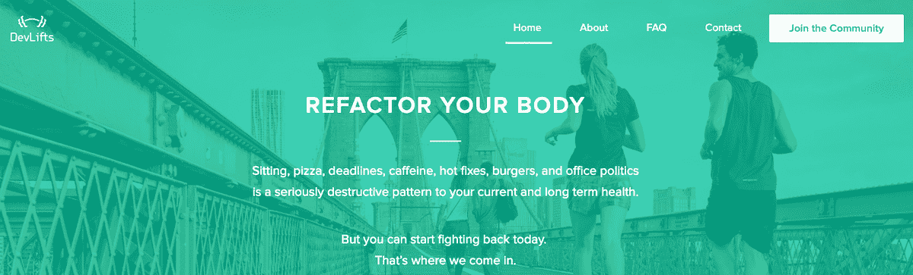
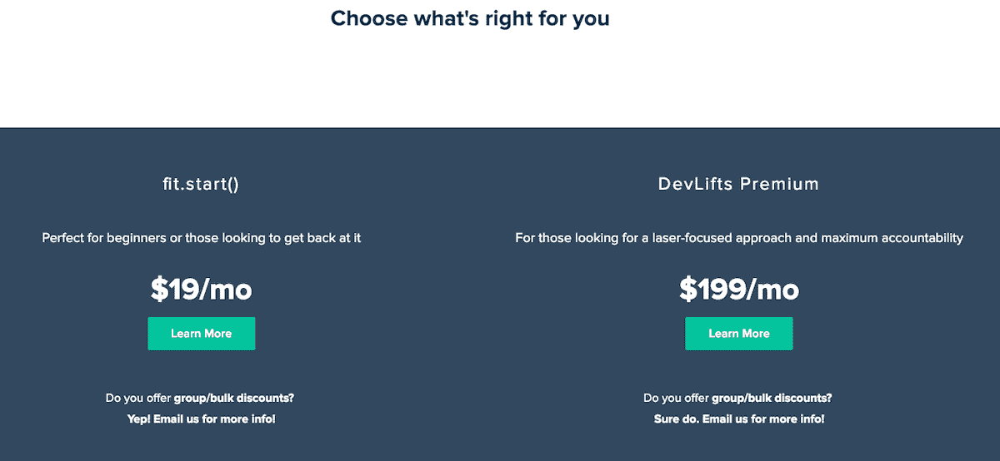
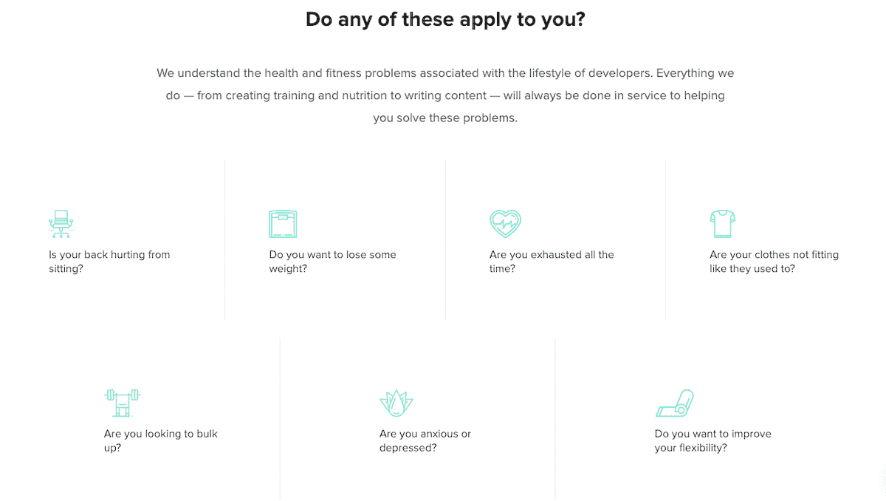

# 在这个过程中，我是如何保持体形并开始侧滑的

> 原文：<https://www.indiehackers.com/interview/how-i-got-in-shape-and-started-a-side-hustle-in-the-process-bbf0b5de27>

## 你好！你的背景是什么，你在做什么？

👋嗨！我是 J.C .希亚特，26 岁，来自密西西比州杰克逊市的开发人员。我从事专业开发工作已经有六年了，而且(un？)专业 10 年左右。我在一家名为 [Trinity Apparel](https://trinity-apparel.com) 的定制服装公司担任前端工程师。

我去年开始做 [DevLifts](https://devlifts.io/) 。我们提供锻炼计划、营养信息和社区支持，帮助开发人员保持健康，过上健康的生活。

## 是什么促使你开始使用 DevLifts？

2015 年，我的身体状况非常糟糕。仅仅几年时间，我的体重就增加了 50 磅。我一直又累又焦虑。我的背很疼。我只有 23 岁，但我觉得自己老了很多很多。那时，我在杰克逊经营一家产品代理公司，我最好的朋友泰德为我工作。由于萨德是一名私人教练，而且非常热衷于健身，我问他是否能帮我减肥。

几个月过去了，我感觉好多了。我在工作中有了更多的精力和注意力。我睡得更好了。我已经完成了一个很好的身体重组，甚至比我在高中真正活跃的时候还要好。

此后不久，萨德离开去了海外，但我坚持了下来。我喜欢健身对我的工作和个人生活产生的影响，因为萨德出色的训练，我已经可以自我调节我的健身了。2017 年初他回来的时候，我跟他说，我想把他为我做的事情拿来做给其他开发者看。总的来说，我们的行业有很多不健康的习惯，我找不到任何人专门为我们开发者解决这个问题。

我们开始与开发人员交谈，了解其他人是否和我一样缺乏锻炼和营养。很明显，我不是唯一一个对健身知之甚少甚至一无所知的开发者。

 

## 构建最初的产品需要什么？

在确信它值得测试后，我们凑了大约 1500 美元来支付网站设计和在 [Syntax.fm](https://syntax.fm/show/020/fitness-nutrition-and-losing-weight) 上的播客广告。我在几天内建立了网站，我们在 2017 年 11 月底启动。反响非常热烈(第一周销售额接近 15k 美元！).

如果你正在考虑开始你自己的兼职，最重要的事情是你已经开始了。

TweetShare

整个过程，从设计到我们的第一次销售，花了大约一个月。我们想出了我们能想到的最基本、最容易实现的产品:一次性收费出售的个性化健身和营养计划。

我们还将堆栈精简到最低限度的实施:

*   我已经做了一个简单的静态 HTML/Sass/Gulp 样板文件。没有后端(实际上直到今天)
*   [Freshbooks](https://freshbooks.com) 结账(我们上线的时候没有现场结账！).我们*首先手动*发送发票。这最终让我们损失了大约 5000 美元的收入，但几乎没有时间来启动和运行
*   Google Sheets 制定并交付计划
*   [日历](https://calendly.com)和[缩放](https://zoom.us)用于入职电话
*   [空闲时间](https://slack.com)用于社区聊天和与客户的私人谈话
*   扎皮尔把这一切联系在一起

## 你是如何吸引用户和发展 DevLifts 的？

我们在 Syntax 广告播出的同一天推出。这集播出后不到 30 分钟，销量就开始激增。这一集是关于开发人员的健康和营养，看起来我们真的触到了痛处。

最初，我们的目标只是获得 100 个客户，这样我们就可以完善我们的流程，并通过客户访谈获得更多的洞察力。为了激励这一点，我们为前 100 名客户提供了 30 分钟的免费视频咨询。我们在三天内达到这个目标。

我们继续赞助更多的语法剧集(我们今天仍然赞助剧集)，它仍然是我们的一个高性能频道。

我认为我们的发布会如此成功是由许多因素同时促成的，但最主要的因素是:

*   **影响者营销**—Syntax 的主持人 Wes 和 Scott 拥有大量的观众和很大的影响力。他们的观众完全由开发人员组成，所以我们赞助他们再合适不过了。
*   时机——我建议考虑一下你发布的时机。有什么季节性的事件或节日你可以借鉴吗？对我们来说，我们在新年前六周启动了这项活动，这是一个完美的时机，因为人们经常把健身作为他们新年决心的一部分。这不一定是故意的，但它最终成为了一个真正的福音。

## 你的商业模式是什么，你是如何增加收入的？

今天，我们通过会员制赚钱。我们基本上有两个“层次”的成员:

*   fit.start() —包括根据广泛的目标给出模板化的计划。这不太贵，但也不太个性化。它仍然很棒，因为我们让我们的锻炼非常适合初学者(我们的大多数客户很少有或没有锻炼的经验)。
*   高级——这基本上是我们最初推出的产品(个性化健身计划),但演变成了会员模式。一切都是高度定制的。这是全方位的个人训练，但很遥远。

早在 7 月份，我们就将我们的商业模式改进为一种循环会员模式，这对我们来说非常好。正如你在[我们的 IndieHackers 简介](https://www.indiehackers.com/product/devlifts/revenue)上看到的，我们的收入一直在持续增长。有了更可预测的收入来源，我们就可以决定下一步该做什么。

没有付费顾客的生意不是生意。

TweetShare

我们也仍然非常精干。不算信用卡手续费或我和萨德每月给自己的健身津贴，我们每月的支出不到 400 美元。通常，我们把剩下的钱花在播客广告上。除了健身津贴，我们还没有开始给自己发工资。

我们也最终停止发送新书发票，并在 3 月份在我们的网站上实现了信用卡结账，这有助于我们的转化率。今天，我们使用 [Snipcart](https://snipcart.com) 来处理结帐和会员资格(它们非常适合没有后端的网站)，我们使用 Stripe 来处理支付。

 

## 你未来的目标是什么？

自发布以来，我们一直处于我们所称的“第一阶段”。我们目前设想还有两个阶段，不确定之后是什么。

第二阶段包括启动并运行我们所有的[开源项目](https://github.com/DevLifts)。这些项目将允许我们通过移动应用、API 等交付计划，它们将成为我们未来目标的基础。这正在进行中，我们有十几个社区成员在贡献(我们给所有贡献者提供免费计划🙂).

第三阶段可能会发生，也可能不会发生，但我们仍然希望至少测试一下，并就此与一些公司进行一些对话。我们最终希望采取更多的会议方式，让公司赞助 DevLifts，反过来，我们为科技行业提供免费的健身计划，并为公司提供一个非常有效的招聘工具，不会让开发人员感到厌烦。

当然，这听起来非常神秘，我可能应该尽快在这里写一篇关于这个计划的文章。如果能得到一些反馈，那就太好了。如果你在营销/开发部门工作，尤其是在一家中大型公司，我真的很想找时间和你谈谈。

TL；DR——我们认为我们有办法帮助成千上万的开发者获得免费的计划，帮助公司找到优秀的人才，而不需要花费大量的招聘费用，并且赚足够的钱让我和萨德开心。

我们最大的障碍可能是缺乏行业意识——我们希望在未来几年让健身和健康成为科技领域的热门话题。

 

## 对于刚刚起步的独立黑客，你有什么建议？

如果你正在考虑开始你自己的兼职，最重要的是你已经开始了。其他的都是次要的。

有主意了吗？去和潜在客户谈谈你认为你正在解决的问题。

验证你的想法。将您的价值主张归结为解决客户问题的核心内容，并构建一个原型。把它放回那些潜在客户面前。重要的是:让他们付钱给你。没有付费顾客的生意不是生意。不一定要完美。这可能会非常尴尬。但是如果你能让人们为蹩脚的版本付钱，事情只会越来越好。

有付费顾客吗？**跟他们说话！经常！**随机 ping 他们，看他们能不能聊 10 分钟。询问他们是否喜欢你的产品。问他们讨厌什么。让他们感觉像是你公司的一部分。认真对待他们说的每一句话，当你一遍又一遍听到同样的话时，**照做**。

了解你的客户(那些付钱给你的客户和那些还没听说过你的客户)是一笔无价的资产。

## 我们可以去哪里了解更多？

*   背景:[“为了更好的表现，我重构了自己的身体”](https://medium.com/@jchiatt/i-refactored-my-body-for-better-performance-ab83f08f0c9f)
*   网址: [https://devlifts.io](https://devlifts.io)
*   [查看我们的博客](https://medium.com/devlifts)
*   推特: [@DevLifts](https://twitter.com/devlifts)
*   GitHub:[https://github.com/devlifts](https://github.com/devlifts)
*   indie hacker[配置文件](https://www.indiehackers.com/product/devlifts)

你对 DevLifts 或者跑侧滑有什么疑问吗？我很乐意尽我所能帮忙！在下面的评论里 Ping 我！

——[<picture id="ember7998501" class="user-avatar ember-view user-link__avatar"></picture>j . c .希亚特](/jchiatt?id=XlCnvsiB4LO45tHecpoQC0HXYpt2)，DevLifts 创始人

## 想像 DevLifts 一样建立自己的事业吗？

你应该加入独立黑客社区！🤗

我们是几千名创始人，互相帮助建立有利可图的业务和副业。来分享你正在做的事情，并从你的同事那里获得反馈。

还没准备好开始使用你的产品吗？没问题。这个社区是一个认识人、学习和实践的好地方。随意[随便浏览](/)！

——[<picture id="ember7998506" class="user-avatar ember-view user-link__avatar"></picture>考特兰艾伦](/csallen?id=ibTLPyjwVebnZjMGKvz6ztarnuV2)，独立黑客创始人

21votes