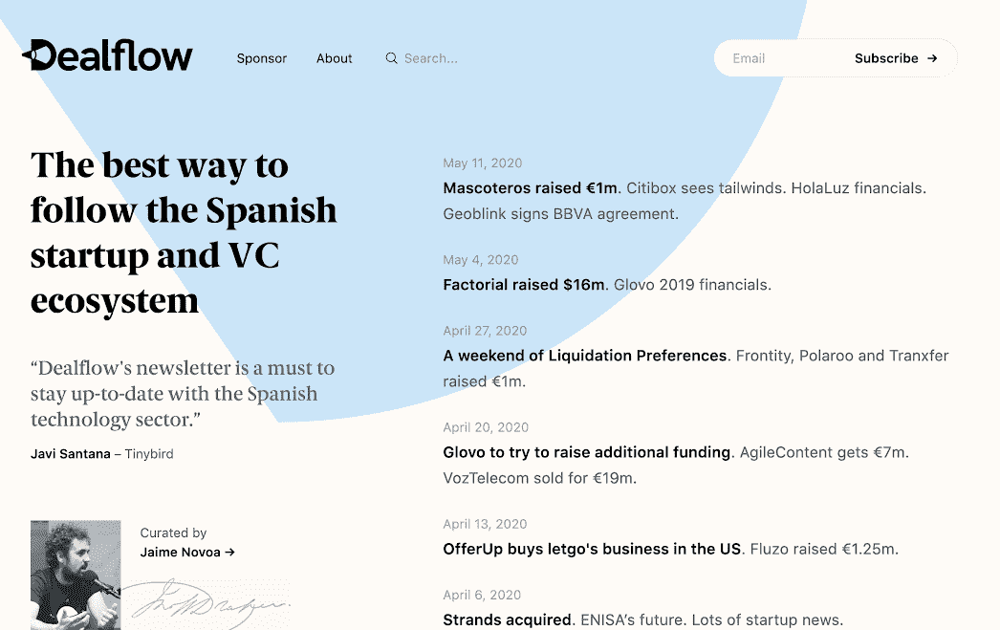
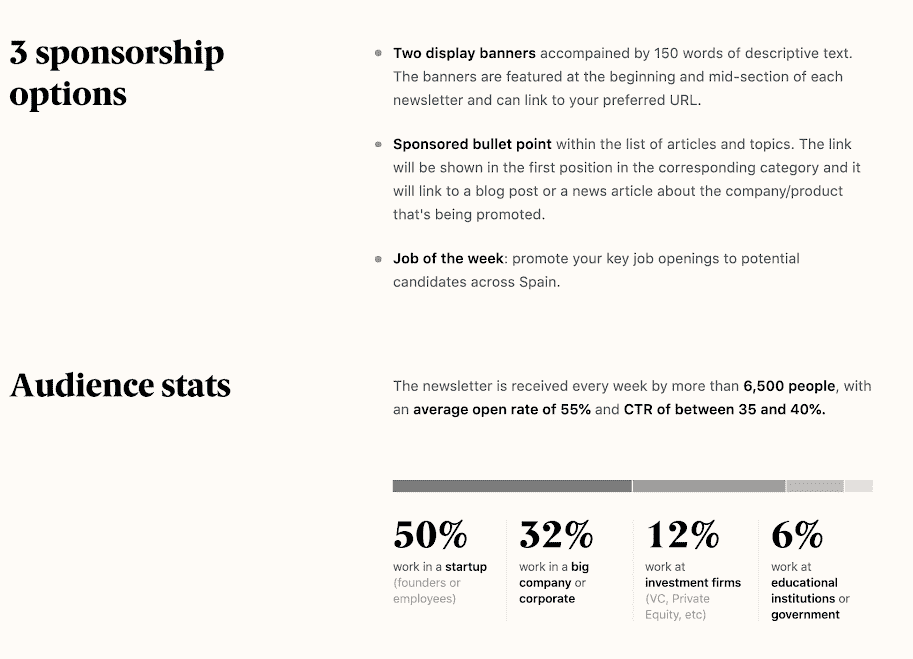
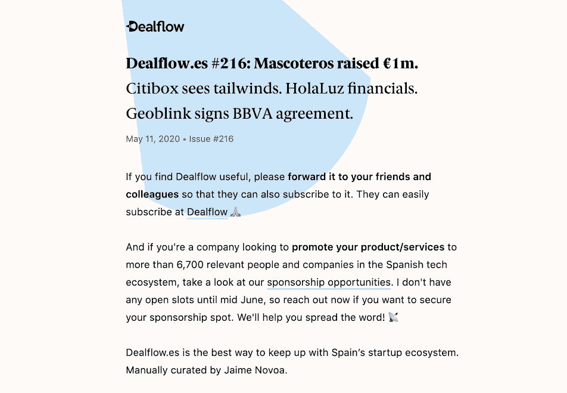

# 在我的博客未能盈利后，我是如何发展出一份盈利的时事通讯的

> 原文：<https://www.indiehackers.com/interview/how-i-grew-a-profitable-newsletter-after-failing-to-monetize-my-blog-ef057962e2>

## 你好！你的背景是什么，你在做什么？

嗨！我叫 Jaime Novoa，全职在西班牙的风险投资公司 K Fund 工作。在作为一名科技记者为各种当地和欧洲出版物报道西班牙创业生态系统四年后，我偶然进入了风险投资行业。

2014 年，我推出了一份名为 [Novobrief](novobrief.com) 的出版物，用英语描述西班牙的创业场景，这样西班牙以外的人就可以了解这个国家正在发生什么。我从来没有能够适当地将出版物货币化，当我加入风投公司时，我基本上停止了更新它。几个月后，我以 15，000 美元的价格卖掉了博客，但我得到了自己创建的时事通讯，因为买家对它不感兴趣。

交易完成后，我将时事通讯的商标改成了 [Dealflow.es](dealflow.es) 。Dealflow 是一份每周时事通讯，帮助人们了解西班牙初创企业的最新情况，主要面向初创企业人士、创始人和投资者。我整理他人发布的新闻文章、博客文章和推文，并围绕一封简单易读的电子邮件进行组织。

这份时事通讯目前有 6800 多名订户，我通过广告来赚钱。这是一个兼职项目，每周只花我两到三个小时，目前每月产生约 1900 美元的收入。

## 是什么促使你开始使用 Dealflow？

我过去常常自己写一些关于西班牙创业场景的原创文章，并且非常认真地对待它。我真的想成为最好的西班牙科技记者。然而，我很快意识到，作为一个人的行动，我不能及时获得所有的新闻。

这就是为什么我决定推出时事通讯作为博客的一个特色。时事通讯不仅包括我发表的文章，还包括其他记者和西班牙创业公司自己发表的文章。

当时，西班牙缺少一份了解我们的初创公司进展情况的出版物，这一点今天依然如此，所以我认为提供一份每周总结(这是正确的节奏，因为当地的行业没有那么大)可能是一个不错的选择。人们开始喜欢它，订阅它，并与他们的同事和朋友分享它，雪球越滚越大。

一旦我拥有了大约 1000 到 2000 名订户，我就开始考虑提供每周赞助。我认为，品牌会对向少数但高度参与的受众推广其产品和服务感兴趣。原来我是对的！我最初开始向我认识的初创公司免费提供赞助，这引起了其他公司的注意，业务也由此发展起来。

我已经连续出版了四年的时事通讯(现在的名字是 Dealflow.es ),我仍然非常喜欢它。

## 构建最初的产品需要什么？

因为我只是试图验证提供每周创业相关新闻摘要的想法，所以我不想一开始就把事情搞得太复杂。

创办时事通讯的好处是有很多免费软件，而且大多数电子邮件营销服务向作者和公司提供免费增值计划。第一版时事通讯是用 [Revue](getrevue.co) 制作的。我的第一个方法是试图找到我正在策划的文章的共同主题，以避免发送无结构的电子邮件，并尽可能轻松地阅读新问题。

最后，我根据不同的新闻主题对文章进行了分类，比如资金、营销和广告、创业、公司、有趣的阅读等等。四年多来，我一直保持着这种结构。

我最喜欢的一点是，我不需要花费太多精力来制作每一份时事通讯。作为一种习惯，我总是在每天吃早餐的时候阅读新闻，所以我所做的就是把我认为适合那周时事通讯的文章加入书签。我没有把我收藏的所有东西都包括进去，但是这就是管理的意义所在！星期天，我会坐下来几个小时，完成最终产品。

享受你所做的事情:如果我真的不喜欢，我不会每个星期天早上早起去做我所做的事情。

TweetShare

与 Dealflow 相关的成本并不多，只是支付电子邮件订阅服务和一名会计师的费用，这意味着考虑到我每周只花两到三个小时，整个业务相当有利可图。

## 你的技术是什么？

我想没有编码技能的好处之一就是我不能构建复杂的东西。当前版本的 Dealflow 由两个软件组件组成:Mailchimp 和一个建立在免费开源 CMS[10 月](octobercms.com)之上的网站。

当我将简讯的品牌改为 Dealflow 时，我决定也要围绕这个项目建立一个网站，所以我在西班牙聘请了一家名为 [Sensa](sensa.design) 的设计和开发机构，来帮助我建立 Mailchimp 和 December 之间的设计和连接，这样每次简讯发布后都会自动交叉发布在网站上。后者有助于在所有新闻的后端建立一个小型数据库，我们已经建立了一个搜索引擎，以便任何人都可以找到 X，Y，Z 初创公司或投资者在过去四年中一直在做什么。

为了跟踪赞助、财务和其他事项，我也试图让事情尽可能简单。我目前使用各种 Google Sheets 来管理发票、我的发布日历和其他任务。有一段时间，我试图将所有数据转移到更复杂的 CRMs 和类似的工具中，但我很快意识到我不需要任何特殊功能，我可以用工作表完成大部分后台工作。

## 你是如何吸引用户和发展 Dealflow 的？

这份时事通讯的订阅者有机增长到了近 7，000 人。我从来没有做过付费营销。

事实上，我已经在博客和 Twitter 上建立了一个观众群，这无疑帮助我吸引了订户。一旦我让少数高度参与的人每周阅读它，口碑就开始了，从那以后它就这样发展了。

还有一件事也帮助我增加了受众，那就是如果订阅者发现我的工作对他们的工作有用并提供了信息，请他们与他们的同事和朋友分享时事通讯。当我在周一早上看到同一家公司的五到十个人在大约一个小时内注册时，这实际上是非常酷的，因为这意味着该办公室的某人喜欢该简讯，并向他们的同事推荐了该简讯。

其他真正帮助我改进时事通讯的战术建议是征求大量反馈。一开始，我会给每一个决定取消订阅的人回信，以便获得第一手反馈，并继续迭代和改进。我把这些反馈记在了心里，这些年来，我根据与退订者的互动修改了一些东西。

还有一件有助于增加读者数量的事是我给我认为可能感兴趣的人的个人推荐。正如我之前说过的，我多次听到人们抱怨关于西班牙创业公司的新闻分散在各种报纸、Twitter 账户等之中。一旦我听到或发现任何这样的对话，我会礼貌地推荐查看 Dealflow，因为我相信它可以满足这些人的需求。

## 你的商业模式是什么，你是如何增加收入的？

我通过广告赚钱。我为公司提供赞助每份时事通讯的机会，以便向以技术为导向的受众推广他们的产品和服务。

我想，当我有 1000 到 2000 名订阅者时，我就开始尝试用简讯赚钱了。我有一个想验证的假设，所以我首先联系了一些我认识的创业公司，给他们提供免费赞助时事通讯的可能性。我向他们提供免费宣传，所以他们都同意了。

当我这样做了几个星期后，我开始收到一些公司发来的电子邮件，这些公司也希望有机会推广他们的产品。从那以后就没有停止过。我自己从来没有为了提供赞助机会而接触过公司，到目前为止我创造的所有收入都是内部收入。

2018 年我有大约 6000 美元的收入，2019 年增加到 12000 美元。今年我认为我可以达到 20，000 美元大关，但我没有任何具体的目标或指标。我真的很喜欢我做的事情，这是我得到的奖金，所以我不会沉迷于增长或达到特定的收入里程碑。

在收入方面，还有两件事帮助我走到了这一步。

第一个是创造一种匮乏感。我这么说的意思是，四年来，我从未出版过未经“赞助”的时事通讯。如果出于某种原因，一家公司在最后一刻取消了他们的赞助，我会给我认识的公司一个大折扣，有时甚至是免费的。我觉得这造成了一种稀缺感，如果你作为一家公司也想在时事通讯上推广你的产品和服务，你必须迅速投入。

另一个方面与定价有关。大多数人现在都知道这一点，但我认为给新产品或服务定价是最难的事情之一，因为你基本上不知道什么是便宜或昂贵。

我开始要求€每份简讯 50 英镑，现在我向€收取 450 英镑，我对此很满意。为了达到€450，我做的一件关键事情就是一直测试定价。如果每个月都有十家公司来询问赞助机会，我会给其中两家开出不同的价格，有时是原价的两到三倍，只是为了理解价格上限是多少。这个练习是达到当前价格的关键。

## 你未来的目标是什么？

我不想把事情逼得太紧。我不想设定收入或用户目标，如果达不到目标，我可能会感到难过。我感到非常荣幸能够做一些我真正喜欢做的事情，为此获得报酬，最重要的是，创造一些实际上对我作为早期投资者寻找新的创业公司的日常工作有用的东西。

我每周日起床都期待着整理通讯，这是我四年多来一直在做的事情，我希望继续下去。

## 如果你必须重新开始，你会做什么不同的事？

回到时事通讯的来源博客，我会从一开始就试图将它货币化。我当时的想法是，我会给自己几年的时间，首先建立一个观众群，然后赚钱。我错了，我应该从一开始就专注于创收。

我在这方面很糟糕，但我得到了第二次通讯的机会，对此我很感激。

## 你面临的最大挑战和克服的障碍是什么？

我想我有时面临的主要挑战是思考这可能成为一个更大的业务。也许可以，但我实际上喜欢它是一个小但相当有利可图的项目。

有时候，阻止自己努力的雄心并不容易。

## 有没有发现什么特别有帮助或者有优势的？

我读的书不多，所以如果我说那是灵感的重要来源，那我是在撒谎。

有时候，阻止自己努力的雄心并不容易。

TweetShare

我在 2000 年代中期开始听播客，我从这种格式中学到了很多。这些年来，我也听了大概数百次与技术相关的采访和演讲(YouTube 是最好的)。关注主持人提问的方式，人们如何回复，了解如何在短时间内提供有价值的见解，对我绝对有帮助。

## 对于刚刚起步的独立黑客，你有什么建议？

我想说两件事，这两件事很可能被重复了一千次:

*   享受你所做的事情:如果我真的不喜欢，我不会每个星期天早上早起去做我所做的事情。

*   管理你的期望:如果我有一个目标，比如说，每年收入翻倍或者类似的目标，我可能会不断感到沮丧或焦虑。我很高兴，自从我开始写时事通讯以来，我已经设法大幅增加了收入，但这是我工作的结果，而不是我为自己设定的目标的结果。

## 我们可以去哪里了解更多？

你可以在 [Dealflow.es](dealflow.es) 上找到更多关于时事通讯的信息，并在 Twitter 上关注我，邮箱: [@jaimenovoa](https://twitter.com/jaimenovoa) 。

—[<picture id="ember5280088" class="user-avatar ember-view user-link__avatar"></picture>Jaime Novoa](/jaimenovoa?id=pGk9os9Gdyf51LCIGxZmcjZlpxK2)【deal flow . es 创始人

## 想像 Dealflow.es 一样建立自己的企业？

你应该加入独立黑客社区！🤗

我们是几千名创始人，互相帮助建立有利可图的业务和副业。来分享你正在做的事情，并从你的同事那里获得反馈。

还没准备好开始使用你的产品吗？没问题。这个社区是一个认识人、学习和实践的好地方。随意[随便浏览](/)！

——[<picture id="ember5280093" class="user-avatar ember-view user-link__avatar"></picture>柯特兰艾伦](/csallen?id=ibTLPyjwVebnZjMGKvz6ztarnuV2)，独立黑客创始人

31votes