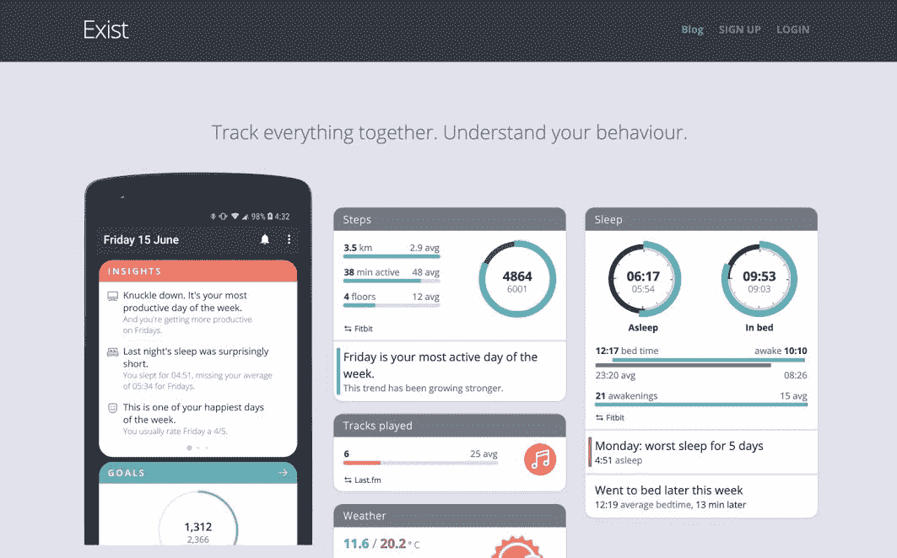
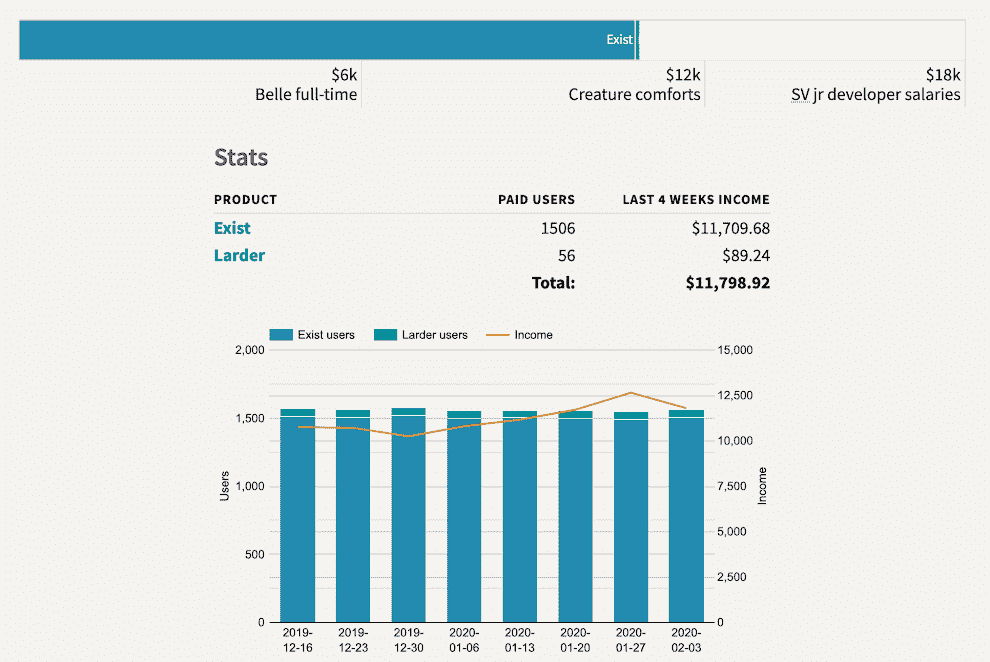
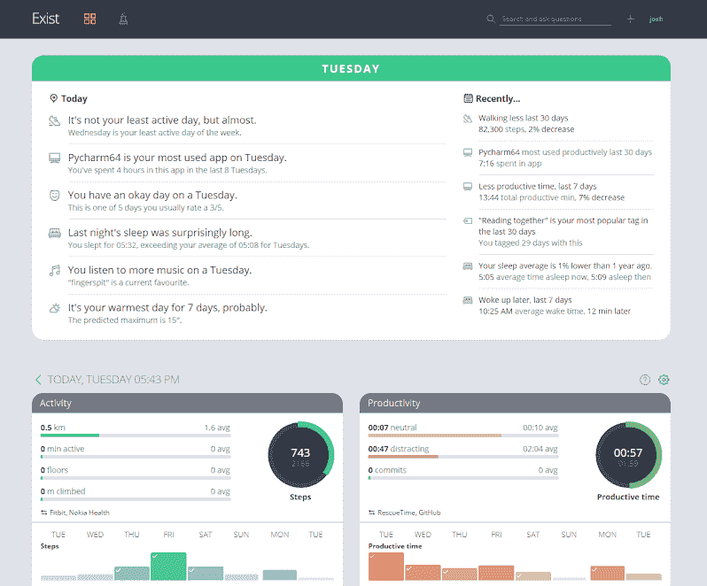

# 我如何通过使用其他应用程序的数据将我的应用程序增长到 14k 美元/月

> 原文：<https://www.indiehackers.com/interview/how-i-grew-my-app-to-14k-mo-by-using-other-apps-data-506709a593>

## 你好！你的背景是什么，你在做什么？

嗨！我是贝尔。我是一名 iOS 开发人员，也是一家名为 [Hello Code](http://hellocode.co) 的独立软件公司的联合创始人。我们的总部设在澳大利亚的墨尔本，只有我和我的联合创始人乔希。我们的主要应用程序叫做 [Exist](https://exist.io/) ，它是一款 SaaS 产品，拥有 web、iOS 和 Android 应用程序。

Exist 是一项个人分析服务，它结合了你已经使用的所有服务的数据(想想 Fitbit、Apple Watch、Todoist、GitHub、Twitter 等。)，并在这些数据中发现您自己可能没有发现的趋势和相关性。

我们目前每月收入约为 14，000 美元，这足以支付我们两人的全职工资。

## 是什么促使你开始使用 Exist？

在 Moves 应用首次流行起来使用手机内置的加速度计跟踪你的脚步后不久，我们就开始开发 Exist。有一段时间，我对使用 Moves(现在已经废弃了)很感兴趣，但是增加步数的新鲜感很快就消失了。这是在 Apple Watch 和 Android Wear 之前，在 Apple Health 和 Google Fit 之前，在 iPhone 甚至内置了用于检测运动的特定处理器之前。Fitbit 和 Jawbone 刚刚开始让人们对健身追踪器感兴趣，我们很好奇这些健身追踪可能会走向何方。

我们看到的问题是，当新鲜感消失和“数字疲劳”出现时，人们正在尝试移动或购买 Fitbit，但很快就放弃了跟踪他们的活动。我们希望找到一种方法，将这些数字转化为易于理解的见解和知识，帮助人们理解自己的行为。

我们意识到，关于你每天走或不走很多路的原因，有很多背景知识缺失，而且很多背景知识是你自己无法理解的，所以我们开始连接来自多个来源的数据，并揭示我们用户行为的相关性和趋势。

## 构建最初的产品需要什么？

当我们开始在 Exist 上工作时，Josh 是一名自由职业的 web 开发人员，而我在 Buffer 做全职的内容营销工作。Exist 是作为一个附带项目开始的，Josh 在业余时间开发 MVP，而我则在测试版发布前的准备阶段从事市场营销工作。

我们在 2013 年 6 月开始开发 Exist，到 11 月份，我们有了第一批 beta 测试人员。在这个早期阶段，我们建立了一个登录页面，上面有一个邮件列表，人们可以通过它来了解我们何时发布。这很有帮助，既让我们保持动力(因为我们知道人们感兴趣)，也让我们在产品准备推出时找到第一批客户。

到 2014 年初，我们对我们的步伐如此缓慢感到沮丧，因为我们必须适应我们的全职工作。因此，2014 年 2 月，我们发起了一场众筹活动，为我们的开发提供资金，并获得了第一批付费用户。支持者可以以低于我们随后推出的价格预先购买年度订阅，我们希望筹集足够的资金来支持我们两人全职工作六个月。我们没有接近那个目标，但我们确实得到了足够的信息来验证这个想法，并增强了我们继续前进的信心。

在发布之前开始营销你的产品。

TweetShare

2014 年 4 月，我们向那些早期支持者开放了我们的测试版，他们在我们准备公开发布时帮助我们塑造了它。这是我们第一次从 Exist 赚到钱，在此之前，这都是出于爱。对我们来说，这是一个巨大的推动，因为我们最终获得了一些收入，并让真正的用户试用产品并提供反馈。

## 自从你开始工作以来，你的角色发生了怎样的变化？

正如我之前说过的，当我们开始在 Exist 上工作时，我是一名远程工作的内容营销人员，为其他科技公司工作，而 Josh 是一名自由网络开发人员。我们从一个响应式的网络应用开始，并没有具体的计划来创建移动应用。然而，一旦 Exist 上线运行，我就开始修补 iOS 开发，并发现我真的很喜欢它。在完成一些教程后，我开发的第一个应用是一个基于 Exist API 的小型单一功能 iOS 应用。

从那时起，我不断学习 iOS 开发，不断添加我的第一个应用程序，直到它成为 Exist 的一个成熟的 iOS 客户端。Josh 已经有了一些使用 Android 的经验，所以他创建了一个 Android 客户端。随着时间的推移，我们发现移动应用变得越来越受关注，我们的许多用户每天花在移动应用上的时间比我们的网络应用更多。

Apple Health 也成为我们的一大关注点，因为随着时间的推移，它增加了对更多数据的支持，许多第三方开发人员将数据同步到其中，所以这是我们的 iOS 用户获得大量数据的一个很好的方式。在将尽可能多的 web 应用程序内容构建到我们的移动应用程序和支持 Apple Health 之间，iOS 应用程序已经成为我的全职工作。虽然我肯定应该在营销上花更多的时间，但我更喜欢开发，所以这几天它占据了我大部分的时间。

## 你是如何吸引用户并发展壮大的？

我们在 Exist 上做的最好的事情之一就是在我们发布之前大力推进市场营销。我们制作了一个登录页面，人们可以在那里注册一个邮件列表，以便在我们上线时得到通知，我们非常幸运地在预发布阶段获得了一些关于该产品的新闻，这有助于我们的邮件列表增长。

当量化自我运动开始获得更多的兴趣时，我们也恰好处于正确的时间和正确的地点，随着自我跟踪变得越来越普遍，我们能够驾驭这一浪潮。参与其中帮助我们获得了更多的兴趣和关注，因为许多杂志和网站都在寻找量化的与自己相关的故事来写。

我们一直知道，我们希望 Exist 成为一个没有免费层的付费产品，因为它依赖于为每个用户存储大量数据，这使得每个用户都大大增加了我们的服务器负载。此外，我们想要一个可持续的业务，并不热衷于免费增值模式，在这种模式下，我们必须花费大量的时间和精力来支持和尝试转化免费用户。

因为我从事内容营销，所以我们专注于此，并开设了一个博客，定期发布关于量化自我运动、自我跟踪以及锻炼和培养良好习惯等相关主题的帖子。我们联系了像 Lifehacker 和 Zapier 这样的网站，并在其他网站上获得了一些客座博文，也有一些我们的博文被转载。当时，Lifehacker 和 Fast Company 等大型内容网站热衷于转载其他网站的帖子，因为他们每天都需要发布大量内容。再版的文章总是包括一个链接回到原来的，以及一个作者的简历，所以这是一个有助于建立我们的观众和名字识别的方法。

在我们最好的几个月里，我们的博客点击率达到了 33，000 次，是访问量的主要驱动力。在 Buffer 和后来的 Ghost 工作期间，以及在 Campaign Monitor 和 Zapier 等公司工作期间，我也在自己的博客之外在线发表了很多文章。只要有可能，我的简历中就会有一个链接，这有助于我们成长。

另一件效果很好的事情是，从一个拥有大量观众的人那里得到一个有机的提及，但这种提及时断时续。Merlin Mann 在他的播客中提到过几次 Exist，我们因此获得了大量注册。我们也在最近来自威尔·惠顿的博客文章[中被提及，这也让我们获得了注册。我们从来没有接触过有影响力的人(除了事后说谢谢)，所以当这样的事情发生时，总是一个很好的惊喜。他们倾向于在我们不知道的情况下注册并使用 Exist 几个月，然后努力告诉他们的观众，这对我们很有帮助。](http://wilwheaton.net/2019/07/i-exist/)

对我们来说唯一不起作用的是直接向媒体伸出手。这些年来，特别是在早期，我们很幸运地接触到了一些记者，我们在电台和网络文章中做了一些采访，甚至在《GQ》杂志中也有所提及。但是任何时候我们直接联系媒体都是失败的，所以我们已经不再用这种方法浪费时间了。

## 你的商业模式是什么，你是如何增加收入的？

尽管我们一开始有过获得风险投资的想法，但我们很快意识到那不是我们的路。我们希望保持小规模，缓慢而谨慎地成长，因为我们不是在寻找出口；我们希望这是一个可持续的业务，我们可以在未来几年继续努力。我们乐于看到更多可持续发展的独立软件企业涌现，并不感到有压力将你的企业迅速发展成一个帝国。我们只是想做一些人们愿意掏钱购买的东西，这样我们就可以随着时间的推移不断改进。

Exist 从一开始就是 SaaS 的产品，提供包月和包年两种订阅选项。我们没有分级定价，所以很简单:在你免费试用后，你要么付费，要么删除你的帐户。我们的付费计划是每月 6 美元，年度计划是每年 57 美元，所以如果您每年付费，您可以节省两个半月的时间，但您获得的功能是相同的。这种方法使事情对我们和用户都变得简单。使用某些功能或达到极限或诸如此类的事情从来没有任何问题。

我们使用 Stripe 处理我们的信用卡交易，我们还让 Stripe 处理我们的免费试用，这意味着用户必须输入信用卡才能创建帐户。这无疑提高了尝试该产品的门槛，但也意味着人们更有可能转化为付费用户。这是一种权衡，意味着注册人数更少，但注册质量更高，到目前为止，我们对这种妥协感到满意。

## 你对如何经营公司非常开放和透明。这对您的业务有何影响？

当我们第一次开始做 Exist 的时候，我在 Buffer 工作。当时它还是一家小得多的公司，我能够看到 Buffer 的领导们以各种方式探索开放和透明。我对 Buffer 的透明性印象最深的一次是我们被黑的那一天。在世界各地，Buffer 远程团队中的每个人都轮流参与进来，帮助进行技术工作，以克服黑客攻击，增强我们的安全性，提供客户支持，并讨论我们在哪里出了问题，导致这样的攻击发生。

我在 Buffer 的营销团队工作，我们做的事情之一是发布一篇博客文章，向我们的客户解释发生了什么。Buffer 的领导对黑客攻击持开放态度，解释了什么客户信息被暴露，攻击是如何发生的，以及我们计划如何改变未来，以确保它不会再次发生。

我们建立了一个依赖其他公司的业务，这真的很难。

TweetShare

其他平台上 Buffer 团队对该博客帖子和公开消息的反应非常积极。我期望它是负面的，或者最多是中性的，但是事实上，团队对发生的事情如此开放，使得我们的许多客户更加喜欢 Buffer *了。那次经历给我留下了深刻的印象，让我意识到在商业中透明是多么罕见，顾客是多么欣赏它。*

这些天，我们保留了一个[公共统计页面](https://hellocode.co/stats/)，详细记录了我们一段时间以来的收入情况。我们还维护了[Exist](https://changemap.co/hellocode/exist/)的公共路线图，用户可以投票选出他们最喜欢的建议，帮助我们确定工作的优先级。路线图有助于我们找出用户感兴趣的内容，同时也有助于我们传达我们的计划和我们目前正在做的事情。我们对只有我们两个人的事实持开放态度，并试图以个人的方式交流，而不是假装是一家大公司。我们发送的每封电子邮件，包括回执电子邮件，都来自我们的一个个人电子邮件地址，因此如果用户需要帮助，他们可以直接回复我们。

为了更深入地了解我们的用户如何使用 Exist，以及他们希望它在未来如何改进，我们每年都会向所有当前用户发送一份调查。然后我们在博客上写下结果，包括我们未来一年的计划，这些都受到调查结果的影响。[下面是详细介绍我们 2018 年调查结果的博文](http://blog.hellocode.co/post/exist-survey-2018/)。

我们也试着在我们的博客上写下对每一年的回顾，讨论我们这一年的计划完成了多少，以及发生的任何其他重大事件。下面以 [2018 年回顾](http://blog.hellocode.co/post/2018-review/)为例。最后，我们偶尔会[录制一段播客](https://hellocode.simplecast.com)，回顾运营我们公司的幕后情况，包括我们正在做出的决定、我们正在经历的困难以及我们一直在做什么。

## 你面临的最大挑战和克服的障碍是什么？

我们建立了一个依赖其他公司的业务，这真的很难。我们的集成来了又走，因为公司死了(例如 Jawbone)，或者他们改变了允许谁访问他们的 API 以及如何访问(例如 Instagram 很快就只允许企业使用他们的 API)。我们还发现 API、文档和数据本身的质量因服务而异，因此 Exist 中的相同数据可能或多或少会有问题，这取决于您从哪里同步它。

所有这些都让我们的工作有时令人沮丧，因为在很多方面，我们最终都是为这些其他公司提供客户支持，因为我们的用户很难按照他们想要的方式设置他们的帐户和设备，当 Exist 中的数据反映出原始服务中的问题时，他们就会来找我们。

我们还有一个不断增长的用户集成请求列表，这些请求针对的是不通过 API 提供用户数据的服务。我们花了很多时间向用户解释，如果另一个设备或应用程序的开发者不向我们(和用户)提供它，我们就无能为力。一些应用程序只允许白名单中的用户访问他们的 API，我们已经一次又一次地忽略了访问的应用程序，没有任何解释。这类事情可能很难，但我们尽量不让它占用我们太多的时间，而是专注于可能的集成，并鼓励其他开发人员创建 API 和其他方式让用户拥有他们的数据。我们相信这是很好的实践，对每个人都有好处。

对此，我们最好的防御措施是分散负担，所以我们不会把所有的鸡蛋放在一个篮子里。当 Jawbone 死亡，我们不得不删除集成，我们已经有几个其他的集成提供活动和睡眠数据，所以没有一个大的漏洞。对于社交媒体等行业来说，这就更难做到了，Instagram 和 Gmail 等特定服务已经垄断了市场，但在可能的情况下，我们会尝试将我们的依赖分散到不止一种服务上，以减轻我们产品价值依赖其他公司的压力。

## 有没有发现什么特别有帮助或者有优势的？

我们发现有几种不同的东西对我们的业务特别有帮助。

首先，我们很幸运，量化的自我运动在我们跳上它之后一直在增长。我们发现早期对自我跟踪的兴趣很有趣，它帮助我们提出了 Exist 的想法，但我们的时机恰到好处，所以我们可以乘风破浪，这纯粹是运气。

第二点是，公开承认自己是一家仅由两个人运营的独立公司，帮助我们与用户建立了更牢固的关系和信任

帮助我们的另一件事是在早期阶段就有一个 API，特别是对于喜欢修改数据的开发人员或用户。我们有一个小型用户社区，他们正在创建自己的集成，建立实验或数据分析，并在我们的用户群中共享用我们的 API 创建的工具。

【T2

其次，没有免费计划的简单商业模式帮助我们与用户建立了信任。我们一直很清楚，我们反对出售用户数据或引入可能影响我们决策的投资者。我们的用户一直是我们的重中之重，因为他们为我们的产品付费，这使我们从同一领域的其他产品中脱颖而出。

最后，我们的产品建立在整合的基础上，我们惊讶地发现，这是获得新注册的好方法，因为我们的整合往往是与拥有类似受众的产品进行的，这些产品可以帮助我们获得更多的受众。

## 对于刚刚起步的独立黑客，你有什么建议？

在发布之前开始营销你的产品。这将有助于你验证市场，在你制作第一个版本的时候增强你的信心，并且在你准备发布的时候会有很大的帮助。

如果你发现一个运作良好的营销渠道，坚持下去。很难(也很浪费时间和金钱)找出哪些营销渠道或方法对你的企业有用，所以不要浪费那些看起来有用的。

我们还发现狗食(即自己使用我们的产品)非常重要。这不仅有助于我们发现错误和改善用户体验，而且对开发我们的产品愿景，以及有信心拒绝与我们想法不一致的功能请求也有很大帮助。让我们从中获得价值有助于指导我们，这样我们就不会陷入添加用户建议的每个小功能的陷阱，而是对新功能如何融入产品整体做出更深思熟虑的决定。

## 我们可以去哪里了解更多？

你可以在这里找到更多关于[的信息](https://exist.io/)，或者[使用我的推荐代码](https://exist.io/?referred_by=belle)注册免费试用，获得 60 天的免费期(而不是通常的 30 天)。你可以在 [Hello Code](http://hellocode.co/) 网站上找到更多关于我们公司的信息。

当然，如果你有什么具体的问题，可以在下面的评论里问我，或者在推特上找我 [@bellebcooper](http://www.twitter.com/bellebcooper) 。

——[<picture id="ember8162586" class="user-avatar ember-view user-link__avatar"></picture>百丽·库珀](/belle?id=quBkeVqR6UNJrbZ5eIDq0vktmd83)，存在的创始人

## 想像 Exist 一样建立自己的事业？

你应该加入独立黑客社区！🤗

我们是几千名创始人，互相帮助建立有利可图的业务和副业。来分享你正在做的事情，并从你的同事那里获得反馈。

还没准备好开始使用你的产品吗？没问题。这个社区是一个认识人、学习和实践的好地方。随意[随便浏览](/)！

——[<picture id="ember8162591" class="user-avatar ember-view user-link__avatar"></picture>柯特兰艾伦](/csallen?id=ibTLPyjwVebnZjMGKvz6ztarnuV2)，独立黑客创始人

57votes