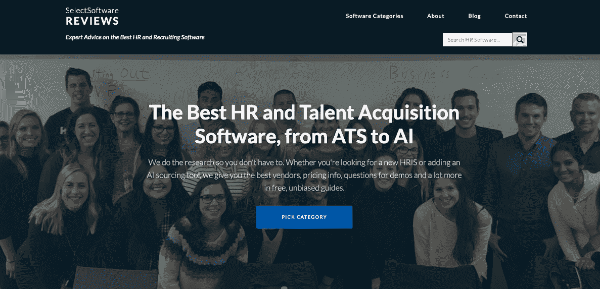
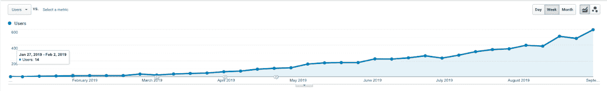
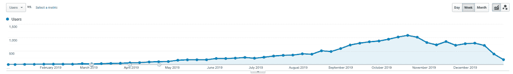
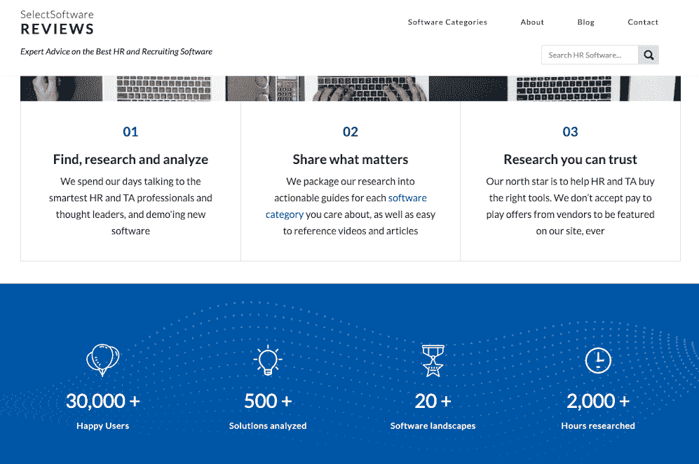

# 我是如何用 SEO 将我的生意增长到六位数的

> 原文：<https://www.indiehackers.com/interview/how-i-grew-my-business-to-six-figures-with-seo-c7719a77c7>

## 你好！你的背景是什么，你在做什么？

我的名字是菲尔·斯特拉祖拉，我是[选择软件评论](http://selectsoftwarereviews.com/) (SSR)的创始人，这是一个致力于帮助人力资源和招聘团队通过免费在线指南找到并购买最好软件的网站。

我们有点像 [NerdWallet](https://www.nerdwallet.com/) 或 [Wirecutter](https://www.nytimes.com/wirecutter/) ，但专门专注于人力资源和招聘软件领域。我们的目标是为希望向其人力资源技术堆栈添加工具的团队提供最佳的无偏见建议。

我花了十个月的时间赚到了我的第一笔广告费。但是现在我的生意给我带来了六位数的收入。我最近雇佣了我的第一个全职员工，这是我非常自豪的事情，因为我已经完全从客户收入中为公司提供了资金。(一开始我做了几个月的咨询工作，也有所帮助，但下面会有更多内容。)

我还开始了一项小型投资业务。我很早就开始投资 Pinterest、Shopify、Twilio、Fiverr 等公司。因此一直在通过买断私营科技公司的早期员工，将这些收益投资回类似的资产类别。但是我只花了大约 20%的时间在这上面，所以我将这篇文章集中在我的 HR 软件评论网站 SSR 上。

## 是什么促使你开始选择软件评论？

我最初的职业生涯是在风险投资领域开始的，主要是对 SaaS 公司进行早期软件投资。我是一个金融迷，也对科技创业感兴趣，所以这对我职业生涯早期的我来说是一份很棒的工作。

我一直想开一家公司，所以我去了商学院，因为出于某种原因，我认为如果你想创业，这就是你应该做的！我还自学了编码。我参与了许多项目，其中大部分都失败了，最终我在 SaaS 建立了一个小型公司，并雇佣了一个人来代替我担任总经理。

这家公司在人力资源领域，所以我通过自己制作的视频系列[和很多领域的专业知识，在那里有了一个小的个人品牌。我想开始另一项业务，并且真的很喜欢学习技术。所以我开了一个关于人力资源技术最新进展的博客，这个博客最终变成了一个人力资源软件的评论网站。](https://www.nextwavehire.com/blog/microsites-careers-site-roi)

博客开始起飞，所以我有一个稳定的实习生来帮助我获得链接和一堆搜索引擎优化的东西，导致真正快速的流量增长，并最终有能力通过广告赚钱。

我很幸运，因为当时我在风投公司做的一些投资收入很少，足以支撑我的生活方式(我一直过得很节俭)，现在这项业务为我自己提供了收入。

## 构建最初的产品需要什么？

第一个产品是一个 Squarespace 网站！我是一名全栈式 web 开发人员，过去甚至构建过自己的 [CMS](https://en.wikipedia.org/wiki/Content_management_system) ，但是使用像 Squarespace 这样的 [WYSIWYG](https://en.wikipedia.org/wiki/WYSIWYG) 编辑器来启动和运行是如此容易。除了网站建设者，我的很多“产品”是内容。

我真的很喜欢写和分享我所学到的东西，所以在早期，我很容易就产生了很多内容。我还开始制作大量视频，以便人们能够习惯看到我的脸，并在第三方网站上识别我们的内容。

当我开始允许在 SSR 上做广告时，我必须做大量的电子表格工作。我的广告模型是按点击付费的，所以我需要跟踪谁点击了什么，什么时候，点击了多少，等等。所以我建立了[谷歌标签管理器](https://marketingplatform.google.com/about/tag-manager/)(相对于想要建立自己的点击跟踪软件的诱惑)，和一堆电子表格，加上用于计费的 Stripe。

从发表第一篇博文到赚到我的第一笔收入花了大约十个月的时间，但是当我的第一笔收入打入银行账户时，感觉很好。:)

在我刚建立网站的时候，我还参加了一个每周 10 小时的咨询工作。我很幸运，我积累了很多人力资源和招聘知识，有人愿意支付我六位数的工资，让我每周工作十个小时。这种咨询也有助于我的内容创作工作，因为我花了很多时间和这个团队在一起，在一年的时间里，他们的员工从 300 人增加到 3500 人。我们购买了价值超过 100 万美元的工具，雇佣了大量人员，并且必须在快速增长期间的短时间内解决几乎所有你能想象到的招聘问题。

## 你的技术是什么？

尽管经历了自学成为全栈 web 开发人员的痛苦，我实际上是无代码的超级粉丝，因为它允许我快速测试和移动。一年多之后，我们放弃了 Squarespace，转而使用 [Webflow](https://webflow.com/) 作为我们的网站 CMS。它允许在设计方面有很大的灵活性，而且他们的 API 也很棒。另外，Squarespace 根本不适合让第三方在你的网站上工作，因为他们缺乏备份和不同的权限级别。

确保成功的最好方法是找到有效的衍生产品。

TweetShare

我还用另一个无代码平台 Bubble 定制了一个广告引擎。这让我每月节省了大约 20 个小时繁琐且容易出错的电子表格工作来管理我们网站上的广告，还让我们的客户数量增加了一倍，因为我可以利用业余时间做更多的销售。

## 你是如何吸引用户和增加精选软件评论的？

我从未真正“启动”过我们的网站。我从一开始就知道，SEO 是我真正能够驱动高意向软件购买者的唯一方式，这种购买者最终会赚钱。所以从第一天起，我就非常关注获取链接和构建好的内容。

我确实花了几周时间和几百美元在不同类型的广告上，比如 adwords、LinkedIn、脸书、Quora、Reddit...但是让人们访问我们的页面的成本太高了，所以这真的没有意义。

具有讽刺意味的是，正是我在博客上写的一篇关于 SaaS 估值的随机帖子(就像我说的，我是一个超级金融迷)，然后由 T2 发布到黑客新闻上，这给了我们第一次大量的链接。它在头版停留了一段时间，人们开始链接到它。这几乎与人力资源软件无关，访问我们网站的受众也无关紧要，但这让谷歌开始注意到我们的网站，并开始对我们的其他页面进行排名。

在这段时间里，我写了大量的客座博文来宣传我们的网站，大概一周两到三篇，持续几个月。我还每天做 15 分钟的 [HARO](https://www.helpareporter.com/) ，试图让自己被各种出版物引用。这些报价通常带有一个链接，它对我网站的流量增长非常重要。

2019 年 1 月的第一周，我们的有机网站访客为零。到 2019 年 10 月，我们每周有超过 1000 人。

然而，在那一年的 11 月，谷歌有了某种不喜欢我们网站的更新，一夜之间我们的流量下降了 30%！然后，软件购买的季节性开始了，我们的 12 月是一个非常低迷的月份。这是很难看到的，并使我一直偏执于我们的业务是如何依赖于搜索引擎优化。

## 流量下降 30%是毁灭性的！你如何应对谷歌的变化？

老实说，我最初花了几天时间对这一打击感到非常紧张，并每小时观察我的流量，看看它是否会神奇地回来。它没有。

衰退发生一周后，我去西雅图拜访了几个朋友，所以我有时间认真思考如何解决这个问题，而不仅仅是压力。

在那次旅行中，我注意到谷歌正在用他们的算法做一些事情，他们会抓取以给定方式构造的 HTML，并将其放在搜索结果的顶部，变成丰富的片段。所以，我重组了我的网站，我的大部分流量都回来了。

然而，这显然只是一个黑客，我想有一种方法来分散我的流量，而不是依赖谷歌的算法。因此，我加倍了我的时事通讯，并努力在人力资源社区建立一个品牌，而不是成为软件购买旅程中的一个无名小站。

建立一个品牌是非常困难的，甚至很难围绕一个像购买人力资源软件这样陈腐的话题建立一份时事通讯。但是，这些努力正在慢慢得到回报。虽然 SEO 在过去的一年里对我们很有帮助，但我们的时事通讯和直接流量也有了很大的增长。

## 你的商业模式是什么，你是如何增加收入的？

当我第一次创业时，我是做顾问来帮助支付账单。我认为这个网站给了我更多的可信度，有几家公司愿意付给我聘金来帮助他们招聘。但我知道我不想永远用时间来换美元。

网站启动六个月后，我试图开始通过广告赚钱。起初，我开始为广告商制作定制视频，每个视频 500 美元，然后链接回他们的登陆页面。我的第一个客户通过我网站上的一个视频获得了一份价值 100 万美元的合同。所以我可能会收取更多的费用！:)但是我发现对我的喜好来说有点太不可缩放了。

我尝试了一些其他模式:赞助活动、赞助网络研讨会、赞助内容...这些都不符合我的兴趣，也不符合我创建可扩展业务的愿望。

2019 年 8 月，我开始在我的网站上提供每次点击成本广告。这使得我已经审查过的软件供应商能够为他们的登陆页面带来更多的流量，最终为他们带来商机和客户。这是一种与可扩展性相一致的商业模式。在电子表格和谷歌标签管理器中跟踪所有的点击是非常具有挑战性的，但我知道最终我可以建立一个系统来管理这一切。

第一个月，我预订了 200 美元，但到了 10 月份，我的金额达到了 1100 美元左右，到 2020 年 1 月，我的月收入超过了 5000 美元！我现在可以雇佣几个承包商，我的第一个全职员工也是基于这项业务的收入。

## 只有在长时间的辛勤工作和很少的回报之后，你才能看到收入的巨大增长。你是如何激励自己继续走过那段时期的？

像许多有创业精神的人一样，我的动力不仅仅是钱。

这无疑是我动力的一部分，但当我早上醒来时，我关注的是我的企业面临的问题以及如何解决这些问题，而不一定是解决这些问题的经济结果...当然，如果你不注意你的时间可以用在投资回报率最高的地方，这可能是一件坏事！)

## 失败的代价是什么？

我希望这不会显得太傲慢，但我不认为赌注有那么高。我很幸运，在我很小的时候就开始积累我的存款，并且我的投资收入已经足够维持生活了。我也有一份相当不错的咨询工作，如果我想的话，我可以把它变成一份工作。最后，我询问了一些人对这个新项目的意见，其中三个人试图雇佣我。所以，我在经济上并没有处于危险的境地，而且有很多数据告诉我，如果其他的都失败了，我可以找到一份相当好的工作。

当然，我想确保我能够过上我想过的生活，这种生活是建立在自主创业的基础上的。所以从这个角度来看，成功是非常重要的，至少在可预见的未来，失败会关上那扇门。

## 你从事评论工作。负面评价曾让 SaaS 公司感到不安吗？你是怎么处理的？

我肯定有很多 SaaS 人力资源部的公司对我不满。我是一个讨厌对抗的人，所以我处理这些情况并不总是很容易。

我总是回到我的北极星，帮助人力资源团队寻找和购买合适的软件，我对公司非常透明，告诉他们为什么做了或没有做，以及他们如何改进。

有些人仍然很不高兴，我收到了许多激烈的电子邮件交流，甚至有一些公司试图通过贿赂进入网站！但如果我知道自己忠于 SSR 的使命，我就能应对愤怒的公司带来的压力。

## 你未来的目标是什么？

我的目标是成为人力资源和招聘人员在购买软件时最信任的咨询场所。对我来说，最重要的事情是找出如何在这个领域用很少的营销资金建立一个品牌。这真的可以归结为始终如一地创造有用和有见地的内容！

从经济上来说，我希望未来五年的现金流达到每年七位数，这在当前的轨道上是非常可行的。我现在专注于如何扩大我们的内容创作，并使我们的流量来源多样化。

我也想在这个过程中再开创一两个生意。当我把 80%的时间花在某件事情上，20%的时间花在其他事情上时，我觉得自己最快乐。

正如我前面提到的，在过去的一年里，我实际上已经开始了一项小型投资业务，我正在购买科技公司早期员工的股票。我用投资 Twilio、Shopify、Pinterest(通过我以前的工作进入了每家公司的 A 轮融资)等公司获得的收益购买了非常棒的私营公司的股票，其中第一家公司将于今年上市。

## 对于刚刚起步的独立黑客，你有什么建议？

在创业公司中，找到产品/市场的契合度就是一切。我见过拥有相同资源的相同团队悲惨地失败，然后取得惊人的成功。当然，他们从失败中学到了一些东西，但主要是他们找到了人们想要的产品。因此 YC 的座右铭是*制造人们想要的东西*！

为了找到产品/市场的契合点，你需要尽可能保持精简和客观。你不能投入大量的时间来构建一些完美的产品，然后欺骗自己认为它很棒，即使没有用户吸引力。

我从一个 Squarespace 网站开始。我甚至没有为我的 MVP 设置 WordPress！我也有具体的目标，希望在某个日期之前达到，比如流量或收入，否则这个实验就不会成功，我就会转向另一个迭代，或者另一个想法。在决定做什么之前，我已经扼杀了这个想法的十几个版本。许多最初的想法我都忘记了，直到我看到一个我整理的旧字体，或者一个我不再拥有的领域的谷歌分析账户。

确保成功的最好方法是找到有效的衍生产品。我基本上是在做 Wirecutter 做的事情，不过是为了 HR 软件。你可以做一个类似 CRM 的产品，但是是专门为体育用品经销商打造的，或者是为 crossfit 运动员打造的袜子。

如果你不照顾好自己，你几乎肯定会筋疲力尽，然后你就完了。

TweetShare

最后两条建议是，一次非常努力地专注于一件事，并且去做。专注，你需要把你所有的精力投入到一件事上，这样它才会起作用。要让你的创业公司获得动力，有太多的小事要做。在刚开始做的时候，我接触过的很多*人都没有开始做，因为他们潜意识里害怕失败。拥抱痛苦，为自己攻击了坚硬的东西而拍拍自己的背，去争取吧。*

好吧，我最后的建议是照顾好自己。几乎每天我都冥想和锻炼。我睡八个半小时，我吃得很好，我经常见到我的朋友和家人。所有这些都和创业一样，因为这让你可以日复一日地埋头苦干。如果你不照顾好自己，你几乎肯定会筋疲力尽，然后你就完了。

## 我们可以去哪里了解更多？

在 LinkedIn 上联系是打招呼的最好方式。我也有一个偶尔更新的[博客](http://philstrazzulla.com/)，和一个[推特](https://twitter.com/philstrazzulla)，在那里我基本上是个潜伏者。

也请随时在下面的评论中发布任何问题！

—[<picture id="ember8234885" class="user-avatar ember-view user-link__avatar"></picture>Phil Strazzulla](/philstrazz?id=jyr8LpsgMvhE7XjRntTvQCmaBS83)【SelectSoftware Reviews 创始人

## 想像 SelectSoftware Reviews 一样建立自己的业务吗？

你应该加入[独立黑客社区](/)！🤗

我们是几千名创始人，互相帮助建立有利可图的业务和副业。来分享你正在做的事情，并从你的同事那里获得反馈。

还没准备好开始使用你的产品吗？没问题。这个社区是一个认识人、学习和实践的好地方。随意[随便浏览](/)！

——[<picture id="ember8234890" class="user-avatar ember-view user-link__avatar"></picture>考特兰艾伦](/csallen?id=ibTLPyjwVebnZjMGKvz6ztarnuV2)，独立黑客创始人

32votes