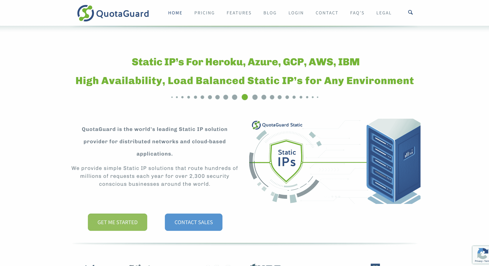
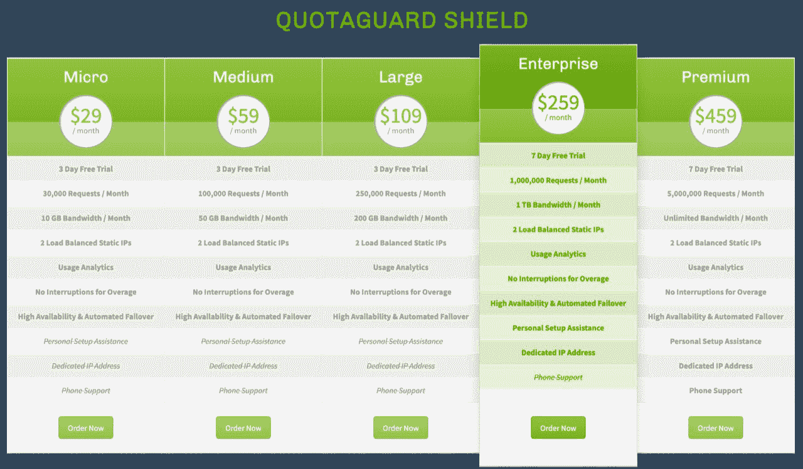
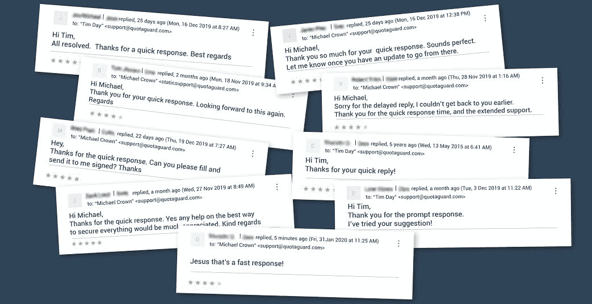

# 我如何将我的退休项目发展到盈利

> 原文：<https://www.indiehackers.com/interview/how-i-grew-my-retirement-project-to-profitability-6b291a6154>

## 你好！你的背景是什么，你在做什么？

我叫 Michael (Tyler Crown 只是我的用户名)，从 2015 年开始我就在做 QuotaGuard，我的动态和静态 IP 代理服务。

我目前住在内华达州的拉斯维加斯，但我已经在世界各地生活、学习和工作过，包括中国、波兰、香港、荷兰和美国大约四分之一的州。我作为一名软件开发人员、信息安全/软件顾问和企业主已经工作了二十多年。我曾在 2014 年试图退休，但在中断两年后，我真的想回到构建、扩展和管理软件项目的工作中，以避免无聊和过时。

QuotaGuard 产品套件主要由基于云的应用程序提供商、大型云托管服务，甚至其他独立黑客使用，以帮助保护受保护和敏感的企业资源，或从外部连接到其他互联网服务，如电子商务网站。

自 2015 年以来，该业务已发展到 2000 多家客户，每年为我们的客户发送数亿次请求。

## 是什么促使你开始使用 QuotaGuard？

我想在 2014 年末回到软件开发和运营领域。我遇到的一个开发人员有几个他一直在研究的想法，但他对继续研究这些想法不感兴趣，因为他有一个不同的机会想要追求。他最初的想法，为云提供动态和静态的代理服务，听起来有点“有趣和有前途”,所以我接手了这个项目，深入研究他的产品，看看我能否从他开始的东西中建立一个可行的业务。

最初的产品在其有限的市场上表现良好，但没有获得任何类型的长期可持续性。此外，产品集已经分裂成三个独立的、相互竞争的服务，最终用户很难知道订购什么产品才能获得他们需要的功能。

在熟悉代码和当前部署的集成之后，我回顾了所有旧的客户服务记录，看看人们对产品和整体体验有什么看法。我注意到客户询问产品的确切功能，但他们对产品名称、竞争产品和混杂的信息感到困惑，以至于他们没有意识到他们的解决方案就在他们面前。

我不记得“啊哈”的时刻，但在某个时候，简化、删除和削减几乎所有目前可用的东西是有意义的。开始撤下产品，减少供应品，解决相互冲突的营销信息和产品名称，基本上以一个产品、一个解决方案、一个问题的方式重新开始。

这种将所有注意力都放在一个产品和一个代码库上的方法有一些“准验证”,因为我曾见过那些付钱给客户的人实际上要求购买产品，并证明他们会为此付费。这不是我经历过的最彻底的产品验证过程，但总比什么都没有强。

这里的教训不仅仅是转向，而是有时用全新的眼光看待一个项目。我对已经完成的事情也没有情感依恋，消除了可能影响我决策的沉没成本顾虑。因此，我可以更容易地把它拆成最基本的元素，然后再试一次。

准系统解决方案是重新标记一个静态 IP 解决方案，淘汰另一个，让动态 IP 解决方案“按原样”运行，并且只专注于一个静态 IP 代理服务。由于已经建立了两个静态 IP 代理解决方案，第一个问题是如何合并两个代码库和客户、两个完全不同的营销计划和两个不同的产品名称。

事实证明，这比用同样的想法从头开始更难，因为您已经有了在您未来的计划中没有作用的遗留代码，但是仍然必须维护，因为客户每天都在积极地使用它。

## 构建最初的产品需要什么？

我阅读了我所能找到的关于如何成为一名成功的小型软件开发工程师的所有资料，比如 [patio11](https://twitter.com/patio11?ref_src=twsrc%5Egoogle%7Ctwcamp%5Eserp%7Ctwgr%5Eauthor) 、 [Joel on Software](https://www.joelonsoftware.com/) 、 [Ramit Sethi](https://www.iwillteachyoutoberich.com/) ，并查阅了所有可用的“如何在在线业务中取得成功”的资源。在这些资源中，有一点总是被强调，那就是专注于你的利基市场，并保持这种专注非常狭窄，几乎比你认为可行的范围还要狭窄。令人欣慰的是，这个概念一直存在，我一直专注于将产品分解成一种服务。

为了很好地解决这一个问题，我不得不拒绝许多其他想法(比如请求静态 IP/VPN 解决方案)。我想，如果我能只做这一项服务，让它完全无懈可击，让我的客户满意，这将比试图同时解决两三个几乎没有关联的问题要好。

项目、开发和部署的资金来自我自己的积蓄。我给年轻工程师的一个建议是，如果他们想留在他们花了几十年完善的职业道路上:省钱，因为当你到了 35-40 岁，你可能会从软件开发的角色中解脱出来，要么进入管理层，要么离开。年龄歧视是硅谷引以为豪并公开吹嘘的一种歧视性做法，所以确保你关注并相应地计划。

如果你想自己创业(尤其是当你在 30 多岁时看到不祥之兆)，你需要一些钱来维持生活。拥有自己的现金有很多好处，因为你可以按照自己的速度工作，不需要回答任何人，并且在最初几次失败时保持沉默(这种情况会发生)，从而保持你的尊严。

## 你的技术是什么？

我继续在相同的主堆栈上构建，这是为了代理，因为它运行更有效，也更容易部署。Ruby 用于我们的 dashboard 应用程序以及与外部市场的集成。服务本身运行在 AWS 和 IBM Softlayer 上，用于请求路由任务。不言而喻，Stripe 是我们唯一的支付提供商。退休后，除了多喝几杯啤酒，我什么也没做，但我能够全职工作，并外包给非关键元素，如图形、网站维护等。

安全的数据包路由服务是许多企业的关键组成部分，需要有尽可能接近 99.99999%的正常运行时间。它不能停机四个小时来执行更新或从代理问题中缓慢恢复。可伸缩性、安全性和可靠性是最重要的，所以一旦所有的脂肪被剥离，这就是应用程序的主要焦点。

在我未来的努力中，我不确定我是否想做一个如此关键的产品，因为它带来了很多压力和 24 小时的焦虑。在过去的五年里，我没有一天醒来时不担心一夜之间可能会出什么问题，我的收件箱里会有 40 张客户通知单。任务关键型应用程序的优势在于价格较高，但您必须确保在系统扩展时能够支持您的基础架构。

## 你是如何吸引用户和增加 QuotaGuard 的？

QuotaGuard 最初是作为一个附加产品放在 Heroku 平台市场上的，我坚持使用这个模式。增加了更多的市场，但是它们有不同名称、不同代码基础、不同基础设施的问题...基本上一个问题在 15 个不同的地方用 10 种不同的方法解决了。有些我只是留在那里枯萎和死亡，另一些我重塑品牌，重新整合，并尽我所能让客户流失，这样我就可以永远删除旧的基础设施。这不是一个简单的过程，我一直试图摆脱的一个平台刚刚在 2019 年 10 月将最后一个客户迁移到我们当前的 QuotaGuard 基础架构，这是四年后的事情。

客户服务不仅仅是回答问题的成本中心...这是你的店面。

TweetShare

因为产品的重组，本质上没有“发布”。事实上，我试图让它尽可能的安静，这样付费用户就不会意识到我在用一种不同的服务替换它们下面的东西，尽管这种服务更可靠、更稳定、更可扩展。幸运的是，我从未遇到过服务迁移或废弃的问题。

随着静态 IP 服务的拆除、重建和更名，我开始建立更传统的销售流程来获得新用户。

我做了几件事让顾客不断出现在我们的门前敲门:

*   *StackOverflow / Quora:* 在线回答可能与静态 IP 解决方案相关的问题。
*   *谷歌 Adwords:* 大量的自我学习来张贴我认为相当 noob 的广告，但他们开始看到转化。
*   *登陆页面:*我完全重做了它们，这主要有助于 Adwords 的转换，而且它现在看起来足够好了，可以展示给我的朋友们！
*   我把 QuotaGuard 放在更多的市场上，比如微软 Azure 和 IBM Cloud。

关于市场的一个额外的词:市场确实从顾客的每一美元收入中拿走了很大一部分。然而，他们也做市场营销、退款、账单和大多数技术问题的所有工作。在市场上比上述任何其他方法都更快地将你的名字和业务展现在成千上万的潜在客户面前。

在市场上也传达了合法性，你可以说，“微软，Heroku，IBM，等等。审查了我们的解决方案，并在他们的公司市场上向他们自己的业务部门、合作伙伴和客户推广了我们的解决方案。那么，您还需要哪些保证来相信我们的系统能够处理您的用例？”

到目前为止，最成功的销售渠道是客户服务门户，人们通过我们的支持系统与我联系，询问各种技术和账单问题。

我之前在一家电子商务公司工作，客户服务团队利用客户服务沟通渠道推动销售漏斗。这是我以前从未见过的，而且非常有效。客户会写信来问我们是否可以修复这个错误或添加功能。我们会查看他们的网站，看看问题所在，看看他们的商店还有哪些地方需要改进。我们会回信说，“是的，这是解决问题的方法。还有，你为什么像其他人一样，没有 X、Y、Z 就在经营你的店？”然后我们会添加一些使用这些工具的理由。在几封来回的电子邮件中，我们会让他们为他们的电子商务商店再购买五个附加产品。他们只是不知道这些产品的存在是为了加快他们的结账速度，让面向客户的体验更好。

在那里，我了解到客户服务渠道是发展业务和解决客户问题的秘密武器。直到今天，除了有线电视和电话公司，我还没有被任何其他公司以同样的方式通过客户服务推销过。

客户服务不仅仅是回答问题的成本中心。这不是一个“游戏”，看谁能在最短的时间内关闭门票，这是你的店面。

只要你所建议的是解决一个真正的问题，而不是向他们兜售一些不相关的产品，然后它就可以成为未来销售和客户保持的巨大推动力。

| 年 | 客户 |
| --- | --- |
| '15 | 536 |
| '16 | 928 |
| '17 | 1434 |
| '18 | 1852 |
| '19 | 2110 |
| 1 月 20 日 | 2200 |

## 你的商业模式是什么，你是如何增加收入的？

QuotaGuard 是 SaaS 式计费的完美用例。目前，我们只接受使用月订阅，只是为了保持简单。

简单是我做生意的信条。我允许的每一个一次性解决方案都是对我未来“完成任务”能力的时间债务。

我不在乎有人在我面前晃来晃去要多少钱，一旦我开始为一个客户定制代码，或者为另一个客户定制支付计划，我总是会后悔。在这一点上相信我，即使我知道这是一个人必须通过几次打破规则来自己学习的课程之一。

我们允许我们的直接注册客户免费试用，市场通常有自己的定价计划规则，但通常会有一段时间的试用或免费计划。我目前的客户中大约有 75%是付费客户，所以这确实表明许多在市场上注册免费计划的客户只是把它放在那里。我会在一段时间后清除未使用的帐户，但教训是“不要允许无限期的免费试用”，如果你能帮助它的话。

就像我说过的，我喜欢条纹。除非你希望在增长的经济体中销售 B2C，否则一开始绝对没有理由支持 PayPal。我们今天只根据要求提供，而且只针对大客户，但 PayPal 仍然是我遇到的最糟糕的解决方案。

在过去 4 年中，QuotaGuard 的收入几乎是我接手时的 10 倍，这是因为客户越来越多，随着客户进入更高的层级或增加更多订阅，ARPU 也在不断增加，以及专注于提供顶级客户服务。我讨厌一直这么说，但客户服务是企业成败的关键。

我密切关注开支，并会花几个小时来消除每月 5 美元的开支，这样我就可以继续尽可能地节省开支。我所有的财务任务都是手工完成的(除了填写年度税务表格)，我可以轻松地每年花几千美元让别人来做，但我认为手工处理费用对保持业务脉搏至关重要。

其中一项任务是每月一次的任务，我仍然会将它添加到我创建的定制电子表格中。没有一个会计软件能像一个简单的电子表格那样处理数据，向你展示你需要了解的 SaaS 企业的确切数字。

【T2

## 你未来的目标是什么？

QuotaGuard 继续借助业务运营向云迁移的势头。我继续探索更多的机会，这些机会集中在我狭窄的领域，但可以扩展我们为客户提供的服务。我喜欢在云的基础设施上工作，并且一直在寻找用更简单易用的工具更好地为云社区服务的方法。

最近，我们推出了 QuotaGuard Shield，这是一款符合 HIPAA 标准的端到端加密解决方案，因此我的主要精力放在了为该产品增加吸引力上。我的目标是到 2020 年 3 月底让 100 名客户使用 Shield。为了实现这一目标，我的主要精力将放在将从新产品中受益的现有客户面前，以及推广产品的传统广告和客户服务支持上。

云是一个降低商业成本的机会，所以即使在潜在的衰退中，我也希望能够保持 QuotaGuard 的稳定，因为更多的公司为了应对更紧张的预算而将更多的项目转移到云上。

## 你面临的最大挑战和克服的障碍是什么？

我将从我所面临的最大挑战开始，这是我们所有人都面临的挑战，没有人愿意承认这一点。而是大部分开发者并不是真的想创业。

我们有意识地告诉自己“这”是我们想要做的，但潜意识里我们只把开发和无关紧要的业务任务提升到我们的待办事项列表中，优化所有错误的事情，只是在真正的游戏中做一个忙碌的茶水男孩。

一旦出现与编程无关的正常业务，我们的门面就很明显了。比如学习财务会计和现金流量表、报税、购买网络入侵保险、聘请律师、召开公司会议以保持法律合规性、处理季度和年度税务、寻找商业会计师、雇佣员工、与当地商业银行建立关系、核实财务现金流等...每当这些项目出现时，我们会想，“我会很快更新并从我的列表中检查它。”

每个人都对此感到内疚，包括我自己，我花了太多的时间学习新语言，而花在真正经营一家企业上的时间太少了。在说“我是一名企业家”和实际成为一名企业家之间，有一大堆责任要推卸。

我最大的错误之一是对增长和可伸缩性的现实规划。

我仍然无法相信在七个不同的全球地区全天候运营该服务会变得如此复杂，涉及广泛的垂直业务领域，并处理数十个独特的使用案例。从一个客户到数千个客户需要大量的资源、战略规划和可伸缩性。我的建议是为规模做计划，永远不要停止思考，“如果这在一年内增长两到三倍，会发生什么？”然后不要去想收益；考虑一下您的基础设施是否能够真正处理它。

我还犯了一个错误，把我的客户服务外包了几个月。我完全不知道我的客户想从服务中得到什么和需要什么。这是每个车主和操作员每天都需要了解的一个关键脉冲项目。永远不要完全外包客户服务，这是你了解你的业务真实情况的唯一方法。

为技术项目招聘总是一个挑战，自从我独立工作以来，我已经花了很多时间试图改进这个挑战。目前，我只会和从[到](https://www.toptal.com/)的开发人员合作，因为他们为我做所有的筛选和面试。我知道当他们为一个项目推荐一个候选人时，这个人会在开发、运营甚至客户关系的各个方面都比我聪明和优秀。众所周知，和比你聪明的人在一起。

Toptal 是很贵的，所以在你到达那个点之前，你真的要从很多候选人中挑选出真正有技能、渴望和耐心与你合作的人。这是一个我研究了很多的话题，所以如果有人有问题，请联系我。

## 对于刚刚起步的独立黑客，你有什么建议？

我写下了一些一般不会被提及的小贴士。

*如果潜在客户从一开始就要求回扣，或者希望你与竞争对手展开价格战，礼貌地告诉他们你不是他们长期寻求的解决方案。*

如果你提供的产品或服务能为你的客户带来价值，他们应该询问诸如安全性、功能、SLA、客户服务义务等问题。如果价格是他们最关心的问题，他们已经买不起你了，不要在他们身上浪费时间，让他们成为别人的客户。你需要对那些会消耗你宝贵时间的顾客进行控制，就像你选择朋友一样，你每天剩下的时间都要和他们在一起。你的 Adwords 中第一个负面关键词应该是“免费”这个词。

解雇不良顾客。永远不要让顾客辱骂你的员工。

我意识到如果你有十个客户，其中两个对你不好(不付钱，想要退款，不停地抱怨，让你为他们编写解决方案，等等)。)，你永远不会想要解雇他们，但你会希望自己在未来解雇了他们。

给你的员工充分的权力解雇那些对他们不好的顾客。如果你看到有人在电子邮件中纠缠你的团队成员，介入并礼貌地让客户离开。主动帮助他们迁移到不同的服务，然后“免费”将他们转移到你最强的竞争对手那里。

这是你的生意和你的生活，你不会与这样对待你朋友的人交往，你完全有权利拒绝为任何人服务，因为你是一个“生意”，他们就有权利辱骂你、你的同事或你的名字。

有趣的是，当你解雇坏客户时，你永远不会注意到这有多么有益，因为他们不再浪费精神带宽。只有当你不解雇客户时，你才会意识到下次快速摆脱他们是多么重要。

[理查德·布兰森](https://twitter.com/richardbranson)说，“我一直发现人类条件中更有趣的特质之一是，一个问题得到快速有效的处理，几乎总是会比最初的系列交付令人满意时产生更多的长期客户忠诚度。”

这再正确不过了。我们的大客户几个小时都无法进入他们的商店，可以这么说吧，他们对我的不满情有可原。但我发现，如果我尽快回复任何客户服务单，即使只是承诺努力解决，也几乎总能弥补发生的任何事情。

记住，大多数错误是由有缺陷的系统造成的，而不是有缺陷的人。我们都在技术中，无论我们如何努力使技术防弹，技术都会失败。重要的是你的反应速度，让你的客户知道你已经意识到问题的存在，你正在解决问题，你会和他们在一起直到问题解决。自我发布的行动后报告，无论多么单薄，也有助于培养客户的长期忠诚度。

解雇坏顾客。永远不要让顾客辱骂你的员工。

TweetShare

我读了很多书。如果让我推荐一本我以前没看过的关于 IH 的书，我会说是《美第奇效应》。它展示了在领域、学科、爱好或项目之间转换的行为如何成为获得无计划的独特见解的有效方式。这对于从我们以软件为中心的世界之外的未被充分代表的利基市场中发现软件商业想法是很棒的。

## 我们可以去哪里了解更多？

我身兼三职，其中三分之一是 QuotaGuard 等各种 SaaS 企业的所有者/经营者，三分之一是其他所有者软件投资的运营经理，还有三分之一是网络资产的买方/卖方，以增加我自己的投资组合。

我是一个骄傲内向的人，所以 Twitter 和脸书不是值得我花费时间的社区空间，但你可以通过电子邮件([【电子邮件保护】](/cdn-cgi/l/email-protection))或通过 [LinkedIn](https://www.linkedin.com/in/michaelfrew/) 联系我。特别是如果你想一对一地谈论作为一个内向的人在软件行业的公司和企业家方面工作是什么感觉。

最后，如果你对这次采访有任何问题，请不要犹豫，在评论或电子邮件中提出来。自从 Courtland 开始关注独立黑客以来，这是一件很棒的事情，实际上被放在网站上是一件很丢脸的事情，所以我很乐意回馈给其他正在奋斗或有任何软件业务建设问题的人。开始吧！

—[<picture id="ember5201686" class="user-avatar ember-view user-link__avatar"></picture>迈克尔·弗雷](/MichaelFrew?id=Dt5cBIc7fiX3gCdV6oK48K4CdTP2)，QuotaGuard 的所有者/非创始人

## 想像 QuotaGuard 一样建立自己的事业？

你应该加入[独立黑客社区](/)！🤗

我们是几千名创始人，互相帮助建立有利可图的业务和副业。来分享你正在做的事情，并从你的同事那里获得反馈。

还没准备好开始使用你的产品吗？没问题。这个社区是一个认识人、学习和实践的好地方。随意[随便浏览](/)！

——[<picture id="ember5201691" class="user-avatar ember-view user-link__avatar"></picture>考特兰艾伦](/csallen?id=ibTLPyjwVebnZjMGKvz6ztarnuV2)，独立黑客创始人

22votes