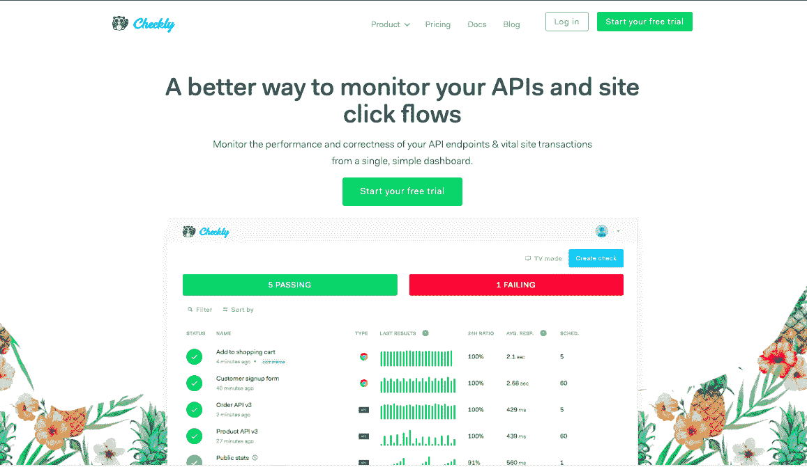
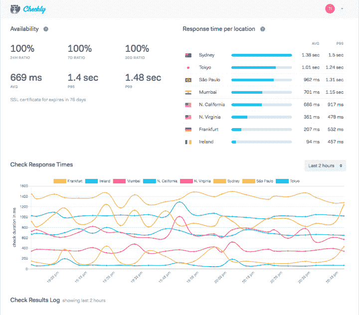
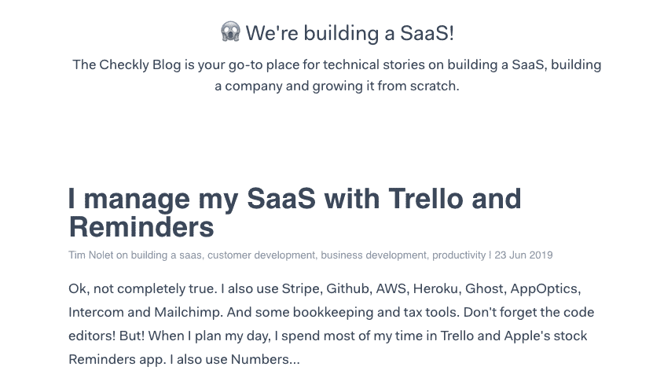

# 我如何通过奖励早期用户将我的 SaaS 增长到$1K MRR

> 原文：<https://www.indiehackers.com/interview/how-i-grew-my-saas-to-1k-mrr-by-rewarding-early-adopters-9b9d52ea2d>

## 你好！你的背景是什么，你在做什么？

我是蒂姆。我是一个将近 40 岁的网络、IT 和工程师，实际上研究过艺术史。我来自荷兰的乌得勒支，但过去五年我一直住在柏林。我也半认真地在乐队演奏，喜欢用吉他和合成器创作音乐，而且我非常擅长 Xbox 上的战地。

[Checkly](https://checklyhq.com/) 是一个 API 和站点事务监控 SaaS。我的客户使用它来积极参与他们的 API 端点，并检查他们的关键点击流，如登录、注册、添加到购物车等。使用谷歌木偶框架。

我刚刚跨过了 1000 美元的 MRR 大关，还刚刚签下了我最大的客户员工和最大的客户订阅。

 

## 是什么促使你开始使用 Checkly？

在一家德国电动汽车初创公司担任 IT 主管期间(你好[联合国大学](https://unumotors.com/en)！)，每次我们的注册或销售渠道中断时，我都会收到首席执行官的短信。有很多技术债务，没有很多测试，这对于一家初创公司来说是完全正常的。

我想主动监控我们基础设施中最关键的部分，但是现有的许多工具要么:

*   卡在 1999 年
*   太简单(没有认证、脚本或调度选项)
*   太贵或太“企业化”

几年前我已经开了一家公司(嗨[吸血鬼](https://vamp.io/)！)然后我就冒险了。尽管我在这个领域有很多经验，但我大部分时间都是通过自由职业来筹集资金的。另外，我有一些积蓄。大约 20，000 欧元花在了基本支付我自己的工作上。

## 构建最初的产品需要什么？

构建 Checkly 与所有其他开发人员的故事非常相似。我坐立不安，低估了时间，在有顾客之前做了彻底的改变。老样子。以下是我搞砸的一些更令人尴尬的事情:

*   **选择技术我并不真正了解**而不是尝试和信任。三个月后，我用 Postgres 替换了 MongoDB。我想用 AWS Lambda 做任何事情。后来我把一大堆东西迁移回“普通”应用程序，因为这太麻烦了。
*   **低估前端工作**。我对 Vue.js 没什么意见，但我很确定我花了比我预计的多 300%的时间来做好它。前端比人们想象的要难多了。
*   **由于没有*真实*可用的暂存环境，节省了几美元**。一旦你的应用遇到某种程度的复杂性，你就需要它。

作为自由职业者，我在 Checkly 兼职工作了大约六个月。但是我仍然一直在添加和调整东西。它从未真正完成。我用的是 Heroku 和 AWS，Node.js 和 Vue.js，数据库在 Postgres。

在构建过程中，给我印象最深的是，没有太多关于构建 SaaS 应用程序的深刻而有用的知识。这就是为什么我最近开始了我的[“我们正在建设一个 SaaS！”博客](https://blog.checklyhq.com)，现在已经有几百名订阅者。

## 你是如何吸引用户并迅速成长的？

首先，我做了一个私人测试——我在[的博客文章](https://hackernoon.com/things-i-learned-from-my-saas-projects-private-beta-period-cd69a11d9e58)中写了相关内容——这有助于反馈。大多数私人测试注册(大约 200 个)来自测试列表、Twitter 和黑客新闻。我在 Hotjar 测试期间管理反馈。

不卖；每个人都讨厌这样。只是轻轻推了一下，并有一些幽默。

TweetShare

然后我就在所有常用的渠道上推出并公布了。我认为发射有点被高估了。不是关于那一天，而是关于发射后的几年。

当我做了三件事时，大部分成长开始了:

*   我开源了一个名为[木偶记录器](https://chrome.google.com/webstore/detail/puppeteer-recorder/djeegiggegleadkkbgopoonhjimgehda)的 Chrome 扩展，不用编码就可以在浏览器中记录点击脚本。这获得了巨大的关注，超过 5000 名 Github 明星和 11K 用户，以及谷歌开发者博客上的一个功能和在会议上发言的机会和嗡嗡声。我可以把相当大比例的注册归因于人们通过木偶记录器找到 Checkly。今年晚些时候，我有一些宏大的计划。
*   我*真的*开始以稳定的速度写有深度的长篇文章。我订阅了一份《幽灵》( Ghost)杂志，并为此花费了大约 20%的时间。我最近的三篇文章登上了黑客新闻和相关 Reddit sub 的头版。
*   加入相关的 Reddit 小组和 Slack 小组，成为活跃的成员。在我这里，这些大多是 [/r/devops](https://www.reddit.com/r/devops/) 和[devopsengineers.slack.com](https://devopsengineers.slack.com/)。我在那里分享博客帖子，但也真诚地参与讨论。不卖；每个人都讨厌这样。只是轻轻推了一下，并有一些幽默。

## 你的商业模式是什么，你是如何增加收入的？

切利是一个经典的 SaaS。不同的计划，你每月或每年支付。没有魔法。

我给了早期顾客一个不错的折扣。这真的有助于吸引人们，Stripe 使处理支付变得非常容易。我们现在正在做大约 1100 美元的 MRR，我们的大部分增长都发生在 2019 年。

| 月 | 收入 |
| --- | --- |
| 19 年 1 月 | 400 |
| 2019 年 2 月 | 500 |
| 19 年 3 月 | 520 |
| 2019 年 4 月 | 620 |
| 19 年 5 月 | 1070 |
| 2019 年 6 月 | 1048 |

我大幅调整了价格，在某个阶段，价格实际上翻了一番。我们最初的计划是 15 美元，现在是 29 美元。客户明白这一点。对于那些在市场上与新来者一起冒险的人来说，这是早期定价。

想想几年，而不是几个月。一夜成功是一个神话。

TweetShare

至于任何 SaaS，利润率相当不错(60%至 70%)，但我的非可变成本与可变成本相比，现在仍然是一个相当大的块。这将随着我们的成长而改变。

然而，增加收入仍然是一个巨大的挑战。获得更多的知名度和认知度是现在的关键。我对产品及其转化能力相当有信心，但人们首先需要知道你的存在并考虑你；否则竞争对手会抢走它们。我在 2019 年关注三点:

*   始终如一地在博客和文章中提供内容。每周，全年。
*   倾听当前客户的意见并与之合作，积极让他们参与路线图。他们需要成为粉丝和支持者。
*   耐心。B2B 监控 SaaS 市场是艰难的。

## 你未来的目标是什么？

我的目标是全职搬到 Checkly，所以我必须提高收入。这是我唯一的目标——更多的客户，更多的收入。

## 你面临的最大挑战和克服的障碍是什么？如果你必须重新开始，你会做什么不同的事？

天啊，无尽的名单。两个突出，一个技术和一个推广。

避免创业工业综合体。

TweetShare

首先，我低估了我的基础设施需要有多稳定。我的客户使用 Checkly 来监控*他们的*基础设施。这意味着它需要比他们的“更好”。我经历了一些停机，给一些客户退款，花了大量时间重构我的基础设施。

*   更好的记录
*   单独的队列和工作人员(AWS SQS 和 Heroku)
*   更好的监控(恰当的自定义指标)
*   更多更好的测试

这是一个成功，但相当痛苦，基本上使业务中断了两个月。

第二，我没有把足够的营销精力放在我的客户身上。我在野外发微博，发帖，推广。我使用了完全没有重点的广告。你需要找到你的潜在客户聚集和参与的地方。

对我来说，这些是前面提到的 Reddit subs，Slack，还有黑客新闻。他们始终为 Checkly 网站提供最好、最多的推荐。在某种程度上，谷歌分析是你的朋友。

 

## 有没有发现什么特别有帮助或者有优势的？

盖伊·川崎在 Youtube 上有一个非常有趣和有用的一小时的演讲，叫做[企业家犯的 10 大错误](https://youtu.be/Oe5c9KK3ZIs?t=1069)。他的清单上的第三点，“销售解决一切”，是一个奇妙的宝石。记住这一点，你会没事的。

## 对于刚刚起步的独立黑客，你有什么建议？

1.  避免创业工业综合体。平台、会议、律师、(一些)加速器、书籍、自助指南、大师。并非所有的都是不好的，但“创业”是一个行业，你是客户。它是否以任何方式增加了当前或长期收入？没有吗？那你很可能不需要。
2.  想想几年，而不是几个月。一夜成功是一个神话。
3.  专注于一件事。成为专家。“24 天 24 家创业公司”是被误导的。
4.  Eric Ries 的《精益创业》不是一个指南，而是一个你可以用来评估自己处境的数据点。成功没有“金科玉律”。在特定的市场、特定的公司、特定的产品、特定的时间，有一些规则是有效的。
5.  获得推荐。只要给一个忠诚的客户发一封友好的电子邮件，他们就有 50%的可能会答应。
6.  给三个月的折扣什么的。与客户终身价值相比，这可能微不足道。

 

## 我们可以去哪里了解更多？

[Checkly 博客](https://blog.checklyhq.com)是我分享建设 SaaS 所有(技术)方面知识的主要渠道。我也使用[推特](https://twitter.com/tim_nolet)，但是我不太擅长。

我还想为独立黑客提供为期一年的任何计划的 50%折扣。只需在[https://checklyhq.com](https://checklyhq.com)注册一个试用账户，并在这里填写表格[。](https://checklyhq.typeform.com/to/Pqok1L)

——[<picture id="ember5249029" class="user-avatar ember-view user-link__avatar"></picture>蒂姆·诺莱特](/tnolet?id=tZ1NGfvvXZQnrWtNygYCISwWLPJ2)Checkly 创始人

## 想像 Checkly 一样建立自己的事业？

你应该加入[独立黑客社区](/)！🤗

我们是几千名创始人，互相帮助建立有利可图的业务和副业。来分享你正在做的事情，并从你的同事那里获得反馈。

还没准备好开始使用你的产品吗？没问题。这个社区是一个认识人、学习和实践的好地方。随意[随便浏览](/)！

—[<picture id="ember5249034" class="user-avatar ember-view user-link__avatar"></picture>考特兰艾伦](/csallen?id=ibTLPyjwVebnZjMGKvz6ztarnuV2)，独立黑客创始人

20votes