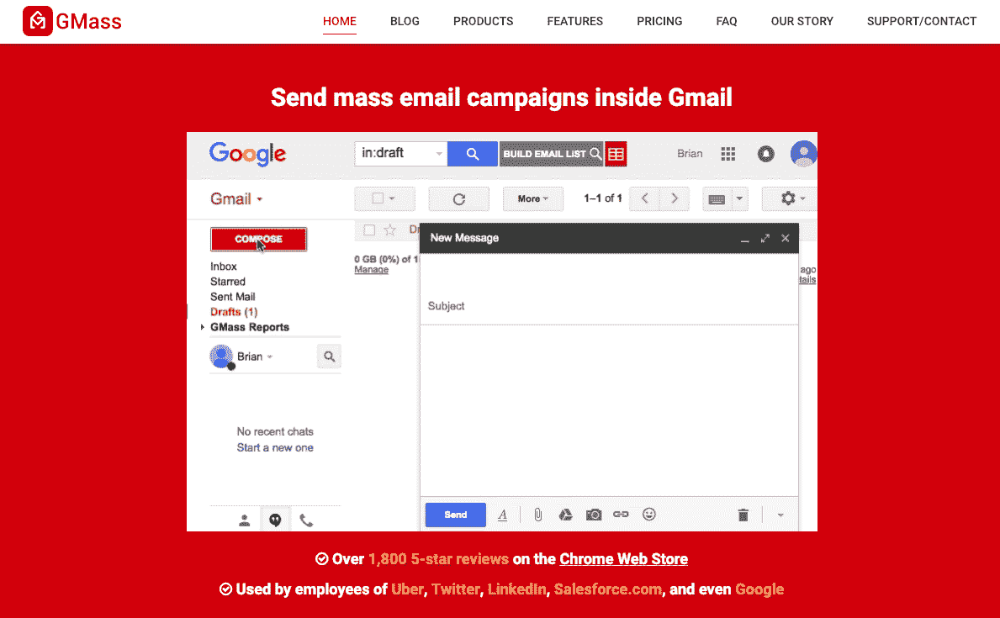
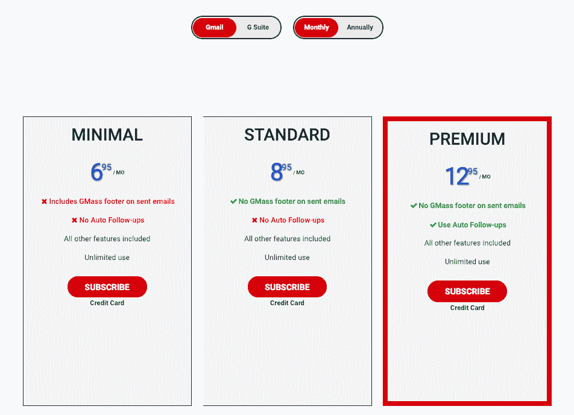
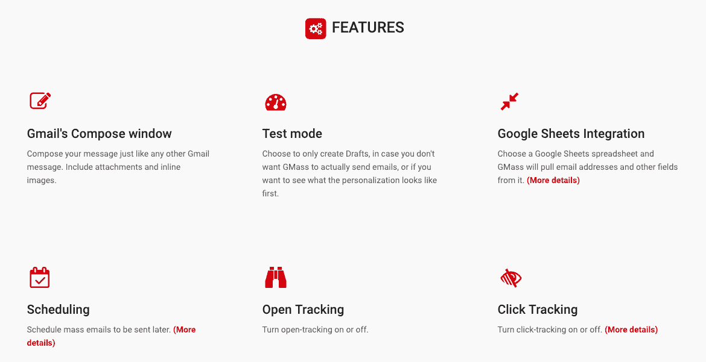

# 我如何在现状改善的情况下达到每月 11.5 万美元

> 原文：<https://www.indiehackers.com/interview/how-i-hit-115k-mo-with-a-status-quo-improvement-c45d11ad17>

## 你好！你的背景是什么，你在做什么？

我是 Ajay Goel，职业是软件开发人员，我正在开发 GMass，这是 Gmail 的电子邮件营销插件。企业家和销售人员使用 GMass 在他们的 Gmail 账户中发送电子邮件。电子邮件活动的范围可以是针对现有客户的促销活动、针对潜在客户的冷冰冰的电子邮件活动，或者针对订户列表的公告。

GMass 每月产生约 13 万美元的收入。

 

## 是什么促使你开始使用 GMass？

GMass 不是我第一次涉足电子邮件营销领域，实际上我在 2013 年建立并出售了另一个名为 JangoMail 的电子邮件营销平台。后来，我知道我想建立一些别的东西，但不确定会是什么，所以我在中间徘徊了一段时间。然后在 2014 年，谷歌为 Gmail 推出了他们的 API。这让我很兴奋——在所有平台中，我花在 Gmail 账户上的时间最多。当时，我正在做一个项目，我希望能够从我的 Gmail 帐户发送少量的电子邮件活动(给 10 或 20 个人)。已经有很多知名的 Gmail 插件，比如 Boomerang、Yesware 和 Grammarly，所以我认为有人也为电子邮件活动开发了一个好工具。当我找不到任何东西时，我真的很惊讶。

刚刚卖掉了 JangoMail，我犹豫着要不要马上回到电子邮件营销领域。我确信我接下来会做一些不同的东西，但是当我在市场上找不到我需要的东西时，我知道我必须自己做。

## 构建最初的产品需要什么？

我在一个自由职业者的帮助下，用了大约两周的时间构建了 GMass 的第一个版本。我写了前端和后端的规范。我把前端开发成 Chrome 扩展，自由职业者用 C#写后端，用 SQL Server 做数据库。硅谷一家名为 Streak 的知名公司刚刚发布了一个名为 [Inbox SDK](https://www.inboxsdk.com/) 的 Gmail 前端库，所以我在此基础上构建了 GMass Chrome 扩展。

当时我的 JavaScript 技能不是特别强，任何为 Gmail 开发插件的人都必须对 JavaScript 了如指掌，因为他们本质上是在黑 Gmail UI，所以 Inbox SDK 的可用性给了我 JavaScript 的超能力，否则我不会有。我非常兴奋有一个工作版本可以玩，我付给自由职业者 5000 美元来建立我需要的后端，条件是他在七天内交付他的部分，他做到了。

所有这些都发生在我住在夏威夷瓦胡岛的一个旅馆房间里的时候。我当时的女朋友在那里获得了她的瑜伽证书，这个项目持续了一个月。当我们离开夏威夷时，我已经有了 GMass 的工作原型。

大多数成功的企业不是基于革命性的想法，而是对现状的改善。

TweetShare

该产品的第一个版本只做了一件事:你像往常一样，将一堆姓名和/或电子邮件地址粘贴到 Gmail 撰写窗口的“收件人”栏中，然后点击一个按钮，向每个收件人发送单独的个性化电子邮件。所以，如果你输入 10 个地址，你会在你的已发送邮件文件夹中看到 10 封邮件。发送是实时进行的，所以当有人想发送到 1000 个地址时，麻烦的第一个迹象就出现了。因为我让所有东西都在一个简单的循环中运行，当邮件发送时，Gmail 界面会一分钟又一分钟地挂起。这显然是一个糟糕的用户体验，所以修改架构来处理异步发送是我在最初发布后所做的第一个重大改变。完成后，我让用户能够为未来安排活动，并在以后跟踪打开和点击，从而充实了产品。

## 你是如何吸引用户和壮大 GMass 的？

我第一次在[startups subredit](https://www.reddit.com/r/startups/)上公布 GMass 是在 2015 年 8 月底。那时，你可以命名并给出你正在做的工作的链接，但是规则已经改变了。我的 reddit 帖子在 r/startups 上连续 24 小时排名第一，这推动了一些初始注册。接下来，我在 2015 年 9 月推出了 [GMass on Product Hunt](https://www.producthunt.com/posts/gmass-2) ，获得了巨大成功。它带来了大量的流量，用户注册数量激增，每三分钟就有一个新账户诞生。感觉真好。然后，就像许多大规模启动的创业公司一样，流量逐渐减少。一旦尘埃落定，我们大约每小时有一个新用户，其中大多数人甚至没有发送测试电子邮件。

我们在 Chrome 网上商店的上市也带动了一些注册。出现 GMass 的一个搜索短语是“邮件合并”，我希望如果你在 Chrome 网上商店搜索，GMass 会出现。当时，搜索结果只显示了相关点击量的前三名，GMass 排名第四。但是我注意到前三名产品中有一个是不再受支持的废弃产品。我联系了该工具的开发者，委婉地询问他是否愿意完全移除他的产品，并解释了原因。令人惊讶的是，他答应了。

## 你的商业模式是什么，你是如何增加收入的？

GMass 通过收取月订阅费来赚钱。计划从每月 7 美元到每月 20 美元不等。我在发布一年后开始收费——在此之前，它对所有人都是免费的。我开始收费的主要原因是为了减少使用该系统的垃圾邮件发送者。作为一个免费的、不受监控的电子邮件营销解决方案，GMass 吸引了网络的底层。在转向支付计划之前，一名联邦调查局特工告诉我，“GMass 已经成为骗子的首选工具。”

我向我的用户群发送了几封电子邮件，宣布即将到来的货币化，让他们知道在我切换开关后，他们将不得不付费发送更大的活动。我得到的大多数反馈都是负面的。一大堆“去你的”之类的话，说我误导了他们。这并没有困扰我，因为我总是听说人们在生气的时候比高兴的时候更有可能表达自己的观点。我写 Yelp 评论的时候也是这样。有一天午夜，当我终于按下开关时，我坐在我的邮箱前，一次又一次地加载，等待新用户的第一个通知。

一个小时过去了...没什么。两个小时过去了...没什么。我甚至可以看到用户收到“嘿，抱歉，您必须订阅才能发送此活动。这里有一个订阅链接”的消息，并点击该链接，但没有放入他们的信用卡。出什么事了吗？我把自己的信用卡放进去测试。成功了。又一个小时过去了，我仍然是唯一的订户。那一刻，我感到一阵恐慌。也许人们认为 GMass 不值得花钱。也许我定价太高了。也许我犯了一个巨大的错误。厌倦了思考这个问题，我上床睡觉，希望明天早上会有更好的事情发生。

我睁开眼睛做的第一件事就是拿起手机查看邮件。谢天谢地，在我打盹的八个小时里，有几个人订阅了。回想起来，我是在午夜打开开关的，那时最活跃的用户在海外的印度和中国。因此，它没有立即引发一波新用户潮是有道理的。

我选择 Stripe 作为我们的支付提供商，并不是因为任何深刻的原因，而是因为我更喜欢他们的 API 文档，而不是布伦特里的，布伦特里是 PayPal 的一部分，我发现 PayPal 的整个生态系统都过时了。后来，在来自信用卡不太普及的国家的用户提出要求后，我最终把 PayPal 作为一个选项。使用 PayPal 的订阅支付平台经营一家 SaaS 公司是一件痛苦的事情。他们的文件非常过时，而且经常不正确。我们继续支持我们的 PayPal 集成，只是因为 PayPal 在全球范围内如此受欢迎，但我希望它能尽快消亡。

GMass 是纯软件业务。我们现在不做任何付费广告，所以我最大的支出是我们的亚马逊 AWS 账单，大约 8000 美元/月。下一个最大的支出是营销和搜索引擎优化相关。我有一个自由市场营销人员和两个搜索引擎优化公司为 GMass 工作。

 

## 你未来的目标是什么

我对 GMass 的主要目标是将它发展到在我有生之年仍被人们亲切地记住的程度。当我卖掉我的第一家公司时，我在财务上有了保障，所以有了这次创业，我更关注我的遗产，而不是利润。

在指标方面，我对 GMass 的短期目标是拥有 10，000 名活跃付费用户。我现在已经很接近了。我也希望我的电子邮件列表有 100 万个地址。如果知道我只需点击几下鼠标就可以把我想要的任何信息传达给一百万人，我会感到非常强大。现在大约是 25 万。我希望到 2019 年底，GMass 的年运行率将达到 300 万美元。我完成这一切的策略是为我们的网站建立更多的工具，以吸引更多的流量。

不要陷入专注于最热门趋势的陷阱。用一些快乐的用户构建一个可靠的产品。

TweetShare

我们一直在缓慢地这样做，但我将在 2019 年变得更加积极。例如，我们建立了这个叫做[收件箱、垃圾邮件或促销的工具？这样，任何电子邮件营销人员，即使他们没有使用 GMass，也可以看到他们的电子邮件到达了哪里。几周前，我发布了一个](https://www.gmass.co/inbox)[域名统计数据库](https://www.gmass.co/domains)，这样人们就可以研究一个域名，查看我们对该域名的投递率，以及该域名会产生什么样的退信代码。我计划增加更多的数据，比如[的 WHOIS 数据](https://en.wikipedia.org/wiki/WHOIS)，以及组织领导层的联系数据，因为我希望这成为关于域名信息的标准来源，这样当你搜索任何域名时，我们关于该域名的页面就会出现。

GMass 一直缺乏的一个领域是与 Salesforce 和 Hubspot 等 CRM 系统的集成，所以我明年也会在这方面努力。

## 你面临的最大挑战和克服的障碍是什么？如果你必须重新开始，你会做什么不同的事？

我们采用的软件设计方法面临的一个持续挑战是，我们侵入了 Gmail 界面，这不是谷歌认可的编程方法。谷歌定期更新 Gmail 的代码，这导致 GMass 崩溃，要跟上这些变化是一场持久战。

作为一名软件开发人员，他的技能现在主要是基于后端的，我从来没有强调过设计和用户体验。甚至在今天，我还从用户那里得到反馈，说“这看起来像是一个软件开发者为其他软件开发者设计的。”他们没有错！如果我能回到过去，我会很早就请一位 UX 设计师来帮我完成从广告创意到发送的流程。

发布后大约六个月，我的首席开发人员发邮件告诉我他要辞职了。这是一件大事，因为我没有及时更新我的软件开发技能。我知道经典的 ASP 和 VB6。我不知道如何编程。NET 和 C#，这就是 GMass 的基础。一个更明智的 CEO 会雇佣一个新的开发人员来接手老开发人员留下的工作，但我的控制狂决定最好的行动是学习代码库和学习 C#，这样我就可以做出自己的改变，希望永远不会再处于那种危险的境地。我仍然是首席开发人员，尽管我可能不应该是。我应该关注很多其他的事情。

## 有没有发现什么特别有帮助或者有优势的？

将 GMass 作为 Chrome 的扩展，在 Gmail 界面内运行，而不是在 Gmail 界面外运行，这是一个关键的决定，我相信这个决定已经得到了回报。因为我的竞争对手，现在有很多，已经建立了外部接口，让您创建和发送活动。我们最大的不同之处，也是我认为其他人很难复制的一点是，我们在 Gmail 内部工作*。*

时机的把握也是 GMass 成功的关键。尽管我推出的时候已经有数百种电子邮件营销服务，但在 Gmail 中几乎没有这样的工具。谷歌的 Gmail API 和 Streak 的 Inbox SDK 对 GMass 的诞生至关重要。

此外，我睡觉时使用 CPAP 机器，我发现它能让我只睡五到六个小时，让我在醒着的大部分时间里保持高效。在我的 CPAP 之前，我每天睡 9-10 个小时只是为了感觉正常。很奇怪，但是在过去的几年里，我的 CPAP 机器一直是我生产力提高的最大功臣。

 

## 对于刚刚起步的独立黑客，你有什么建议？

大多数成功的企业不是基于革命性的想法，而是对现状的改善。媒体倾向于关注革命性的想法，所以很容易认为一个想法如果不是开创性的就不值得追求。但就我而言，电子邮件营销在我创办 GMass 时就已经存在了，但我发现了一个尚未实现的利基，并以此建立了一项业务。

我发现我的企业家朋友经常陷入关注最热门趋势的陷阱，而不是与少数快乐的用户一起构建一个坚实的产品。甚至在你有一个坚实的产品之前，你很容易陷入如何推出 ICO(首次公开募股)或安排与投资者会面的困境。

我认识一个开发应用程序的企业家，他过于关注应用程序的安全性。除非你的应用程序的基本功能是安全，否则你不需要担心这一点，直到你有一些实际的用户需要保护。

我的建议是，在担心其他任何事情之前，先做一些至少有少数人从中获得价值的东西。

哦，不要花太多时间设计完美的标志，代表你所有的核心价值观和你的人生使命。一开始没人在乎你的 logo。

## 我们可以去哪里了解更多？

我的邮箱是 [【邮箱保护】](/cdn-cgi/l/email-protection#6c0d060d152c1b031e08160902420f0301) ，GMass 的网址是 www.gmass.co。我是推特上的 [@PartTimeSnob](https://twitter.com/PartTimeSnob) 。我所有关于 Gmail 和电子邮件营销的文章都在我的博客上。

我很乐意在下面的评论中回答你的任何问题。

——[<picture id="ember5306437" class="user-avatar ember-view user-link__avatar"></picture>阿贾伊·戈埃尔](/RealAjayGoel?id=i63mgFbbLeQ7ZvvHs6D8EcMUvDD3)，GMass 创始人

## 想像 GMass 一样建立自己的事业？

你应该加入独立黑客社区！🤗

我们是几千名创始人，互相帮助建立有利可图的业务和副业。来分享你正在做的事情，并从你的同事那里获得反馈。

还没准备好开始使用你的产品吗？没问题。这个社区是一个认识人、学习和实践的好地方。随意[随便浏览](/)！

—[<picture id="ember5306442" class="user-avatar ember-view user-link__avatar"></picture>考特兰艾伦](/csallen?id=ibTLPyjwVebnZjMGKvz6ztarnuV2)，独立黑客创始人

105votes