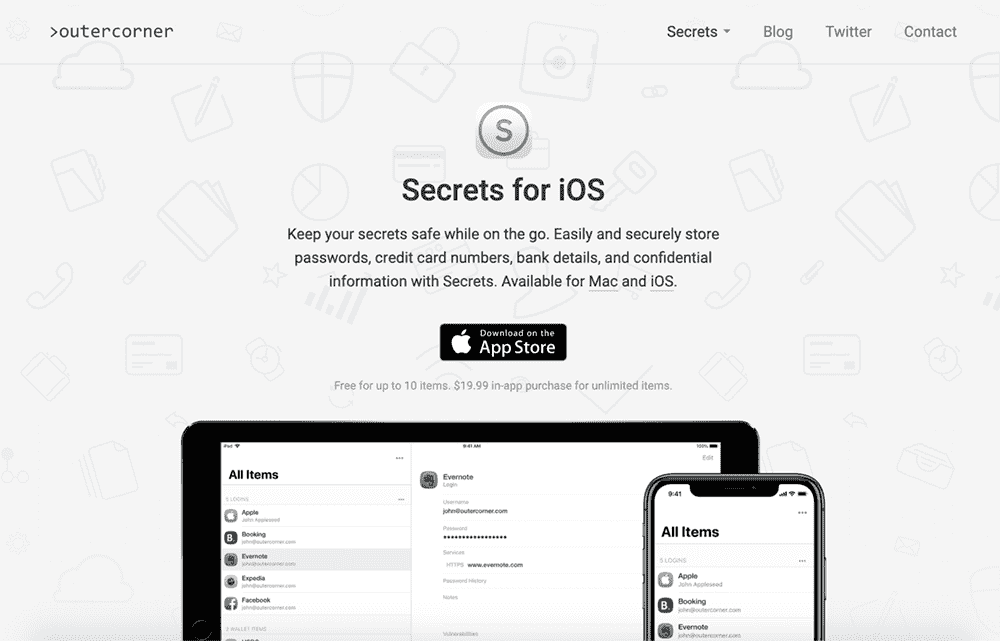
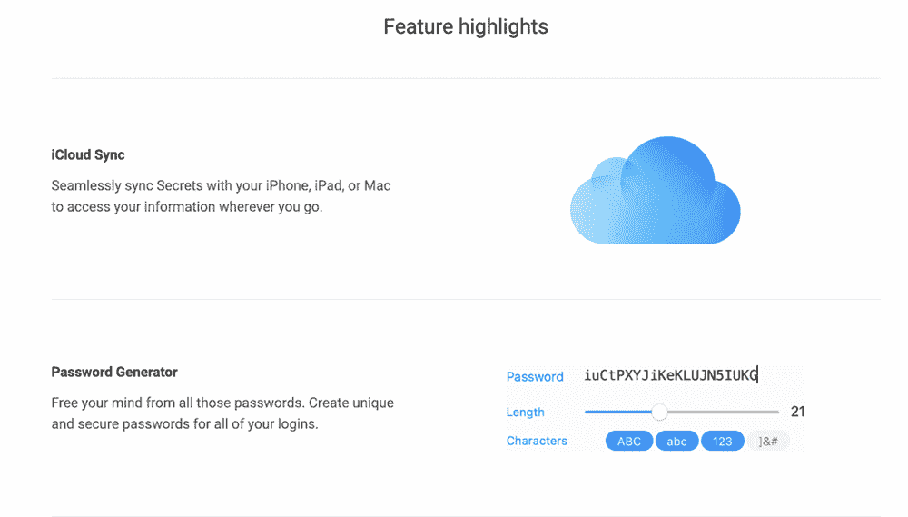
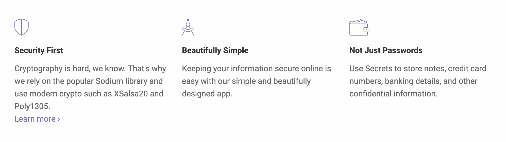

# 我是如何通过全职投入来推动产品增长的

> 原文：<https://www.indiehackers.com/interview/how-i-jumpstarted-product-growth-by-taking-the-full-time-plunge-3a46b5e2e5>

## 你好！你的背景是什么，你在做什么？

你好，我叫 Paulo，我已经专门为苹果平台开发了 10 多年了。我与人共同创立了一家名为 [Survs](https://survs.com/) 的公司(一种网络调查工具)，为一家大型葡萄牙电信公司开发 iOS 应用程序，并为苹果公司工作了几年。

目前我正在开发[的秘密](https://outercorner.com/secrets-ios/)，这是一个专属于 MacOS 和 iOS 的现代密码管理器，它被精心设计为易于使用和安全。它有一个漂亮简单的界面，并使用最先进的加密技术存储用户数据。

在兼职《秘密》多年后，大约 10 个月前，我终于开始全职工作了。当时，Secrets 已经出现在 App Store 上，但并没有赚那么多钱——每月大约 300 美元。从那时起，我已经能够缓慢但稳定地将收入增加到每月约 15000 美元，甚至在 App Store 上出现了。

 

## 是什么促使你开始接触秘密？

秘密的想法可以追溯到 2009 年。在攻读硕士学位期间，我曾做过系统管理员，熟悉信息安全的许多困难方面。我意识到，建立一个密码管理器将满足我拥有自己的业务和构建 iOS 和 MacOS 应用程序的愿望。

就在我即将完成硕士学位的时候，我有机会和一些同事结对，从事调查工作。最终，我把日常工作从系统管理员变成了 iOS 应用开发者。

不过，与此同时，我不断完善秘密的概念。作为一名 iOS 开发者，我在 Survs 上的经历对于构建秘密来说是无价的。

最终，Survs 的发展停滞不前，一些团队成员离开了，这促使我查看我的笔记，并决定最终开始构建这个东西。

## 构建最初的产品需要什么？

打造度秘这样的客户端 app，最大的投入就是时间。我有专业知识来开发这样一个应用程序，但兼职意味着要在深夜或清晨工作很长时间。

我的第一次承诺是在 2011 年 1 月。我花了五年多的时间兼职开发 Secrets，在 2016 年发布了它。我首先用 Objective-C 构建了一个加密框架，包装了 OpenSSL 并实现了 [OpenPGP](https://tools.ietf.org/html/rfc4880) 标准。这本身就是一项巨大的任务，但因为我知道这将是这个应用的主要支柱之一，所以我不想走捷径。

事实证明，为 Mac 和 iOS 构建同步引擎非常耗时。有时候我觉得我永远也不会在 App Store 上买到它。我一直在缩小我理想的 MVP 的范围，这样我就可以真正推出这个东西了。最初的版本有一个密码管理器应该有的最低限度。但是球出界了，这感觉很棒。

我继续做了两年兼职，直到我在 2018 年成为全职独立制作人。

那时我是苹果公司的承包商，收入颇丰。然而，签订合同有一些法律限制，最终苹果需要雇用我。作为苹果员工的问题是，你不允许在 App Store 上保留兼职项目。

我的梦想是拥有自己的事业，所以我拿出一些现金，在秘密上投资了这么多年，最终决定机不可失，时不再来。你可能已经猜到了，我选择了“现在”，离开苹果，全职从事秘密工作。

 

## 你是如何吸引用户和增长秘密的？

我故意没有为最初的版本做太多广告。我知道这听起来可能很奇怪，但我当时没有一大群测试人员，我想慢慢开始。

于是我默默的先推出了一个付费 app，通过搜索 App Store 获得了我的第一批几个找到我的用户。

在对该应用在现实世界中的表现有了一些信心后，我在几个月后推出了 2.0 版本的免费增值应用；最多可免费使用 10 件物品，通过应用内购买解锁无限数量的物品。

对于 2.0 的发布，我在一些苹果相关的博客上安排了赞助，比如 [MacStories](https://www.macstories.net/) 。我还在 Product Hunt 和 Hacker News 上发表文章，并联系了业内的许多其他记者。发布进行得相当顺利，但之后流量和下载量迅速下降。

我尝试过付费广告，包括苹果的搜索广告，但结果并不理想。

在业务的各个方面都要有效率。专注于创造能给用户带来最大价值的功能。

TweetShare

我目前的策略是增加网站的有机流量，同时致力于应用商店的优化。

到目前为止，我已经:

*   开始了我自己的博客，在那里我经常链接到秘密。这个博客已经有了一些有机流量，它的一些文章已经被链接到热门网站和时事通讯上，比如 [iOS Dev Weekly](https://iosdevweekly.com/) 。

*   我试着为其他版本调整应用商店的关键词。但老实说，我在这里并没有取得多大成功——我觉得下载量、收视率和收入在苹果的搜索排名中占据了更大的比重。

*   每次更新，我都会通过电子邮件向记者(包括用该应用已经支持的 10 种语言中的任何一种写作的记者)介绍新功能。在这些冷冰冰的电子邮件之后，我得以出现在非常受欢迎的法国网站上。仅此一点就足以打破法国应用商店那周的前 10 名生产力排行榜。

*   我还在每次重大更新前通过苹果应用商店[的推广请求页面](http://appstore.com/Promote)联系苹果。最近苹果注意到我的一个联系人，实际上是秘密。毫无疑问，这是我迄今为止下载量和销量的最大提升。

 

## 你未来的目标是什么？

现在我的目标是月收入达到 3K。我一直在缓慢但稳定地成长，并希望继续这一趋势。

在特性方面，我计划实现一些与众不同的特性，这些特性可能会吸引更多关注安全性的用户。

## 您目前的定价模式是什么，您是如何得出这个价格的？

目前秘密是免费使用多达 10 个项目。每个平台(Mac 和 iOS)的 19.99 美元的应用内购买可以解锁无限项目。

最初我将 Mac 版定价为 19.99 美元，iOS 版定价为 9.99 美元。我通过观察竞争对手和大约 30%的折扣来决定这些价格点。对于市场上的成熟玩家，我知道我必须在价格上竞争，才能起步并建立用户群。

在这些价位上，Mac 和 iOS 版本带来的收入几乎相同，尽管我在 iOS 上的活跃用户是其四倍。但在 Mac 上，我将大约 50%的用户转化为高级版本，而在 iOS 上，这一比例仅为 10%左右。

对于 Secrets 3，我试图将 iOS 版本的价格改为与 Mac 相同(基本上是 Mac 的两倍)，转化率仅下降了 2%左右。所以总的来说，这似乎是一个好的举措。

我的下一步将是通过一些促销活动或应用程序中更好的行动号召来提高转化率。

创业是一个反复的过程。推出你的产品只是第一次迭代。

TweetShare

## 你面临的最大挑战和克服的障碍是什么？如果你必须重新开始，你会做什么不同的事？

当然，我最大的问题是营销。当我在实现功能、规划路线图或提供客户支持时，我觉得我知道自己在做什么。但是说到广告，SEO，ASO 等。，我还是觉得完全迷失了。

如果我不得不重新开始，我可能会试着早点去做全职。当我在制作《秘密》的时候，我只是在做一些功能，但是创业远不止这些。你必须在你的网站和应用商店页面上工作；你必须计划发布和里程碑；你必须做新闻发布。而这一切都需要时间。所以你越早开始全职工作越好。

## 对于刚刚起步的独立黑客，你有什么建议？

事实上，几个月前，我在一家独立企业做了一次关于自举的演讲。

以下是一些关键要点:

*   **有长远眼光**:我注意到有一种倾向，那就是专注于产品发布，并且非常努力地工作；但是，当发射低于预期时，人们真的不知道该做什么。创业是一个反复的过程。推出你的产品只是第一次迭代。如果你有一个长期的愿景，重复和保持专注会容易得多。

*   **为自己做点什么**:这背后有几个原因。更明显的是，如果你在为自己构建东西，你可能已经意识到了问题领域和潜在的竞争对手。但另一个不太明显的原因是，建立自己的企业非常具有挑战性。它充满了起起落落，当你情绪低落时，如果你对你正在建设的东西充满热情，如果它证明对你有用，那么重新站起来会容易得多。

*   效率是关键:这在任何行业都很重要，尤其是对独立企业。通常情况下，你会与更大的玩家竞争，所以你需要在业务的各个方面都保持高效。例如，你应该试着专注于创造能给你的用户带来最大价值的功能。避免构建需要维护的特性，尽可能自动化所有的事情。

*   **控制你的成本**:你应该仔细考虑把钱投资到哪里，尤其是在考虑订阅服务的时候。你可能需要很长时间才能盈利，你肯定不需要额外的压力。

*   停止等待最佳时机:拥有一份舒适的工作和可预测的收入是很难放弃的。我当然不着急。即使这样，我也是被迫的。回想起来，我确实认为我应该早点做这件事。

## 我们可以去哪里了解更多？

你可以在公司网站[outercorner.com](https://outercorner.com/)了解更多秘密，或者关注我的[博客](https://pfandrade.me/)或[推特](https://twitter.com/pfandrade_)订阅。如果你有任何问题，请在评论中提出来！

——[<picture id="ember5284705" class="user-avatar ember-view user-link__avatar"></picture>保罗·安德拉德](/pfandrade?id=NnsvUnT6NYUXaqPhwfsMpseJuVi1)【秘密的创始人

## 想像秘密一样建立自己的事业？

你应该加入独立黑客社区！🤗

我们是几千名创始人，互相帮助建立有利可图的业务和副业。来分享你正在做的事情，并从你的同事那里获得反馈。

还没准备好开始使用你的产品吗？没问题。这个社区是一个认识人、学习和实践的好地方。随意[随便浏览](/)！

——[<picture id="ember5284710" class="user-avatar ember-view user-link__avatar"></picture>柯特兰艾伦](/csallen?id=ibTLPyjwVebnZjMGKvz6ztarnuV2)，独立黑客创始人

9votes