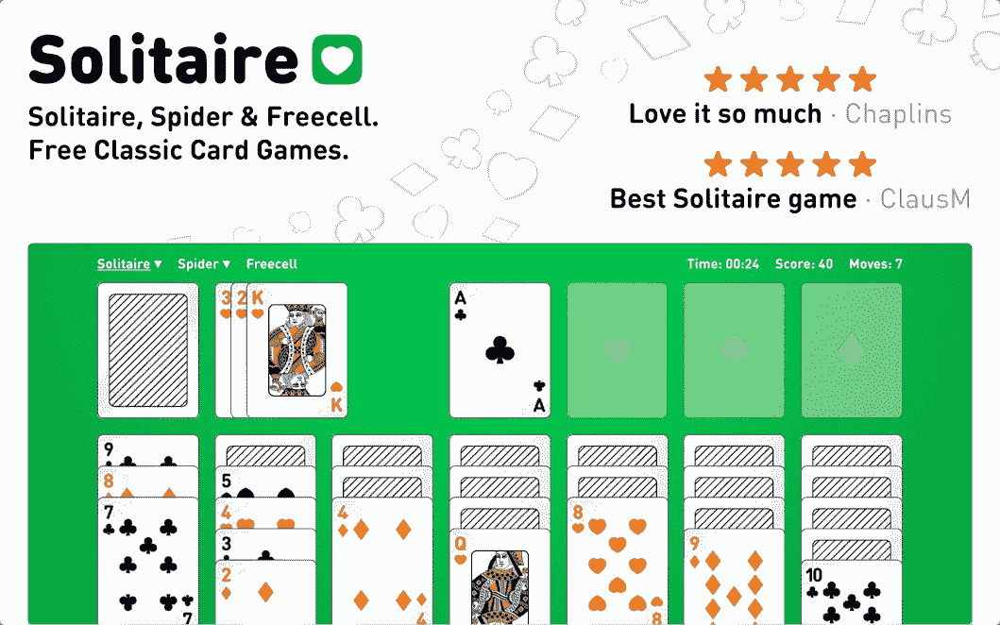
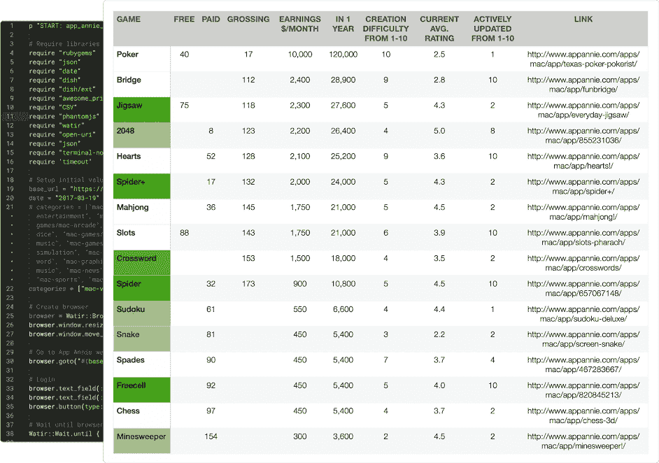
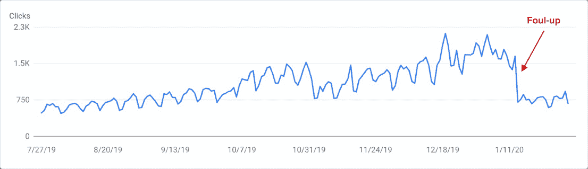

# 我如何让我的副业保持可控和盈利

> 原文：<https://www.indiehackers.com/interview/how-i-keep-my-side-project-manageable-and-profitable-eb5544135c>

## 你好！你的背景是什么，你在做什么？

嗨！我是霍尔格，来自丹麦哥本哈根的设计师出身的开发者。在过去的几年里，我一直在做[在线纸牌](https://online-solitaire.com/?referrer=indie-hackers)，一个你可以玩经典纸牌游戏的网站。

单人纸牌游戏实际上已经成为我的一个副业有一段时间了。这款应用几年前以原生 Mac 应用的形式出现，通过 Mac 应用商店销售，每月收入约 800 美元。

在创建了这个应用程序之后，我最终和我的一个朋友去了纽约，创办了一家名为 Slang 的初创公司，这是一个运动鞋和街头服饰的市场。这让我的纸牌应用程序永远被搁置了。在几年没有维护之后，这款应用程序漏洞百出，最终被苹果应用商店下架。

正如许多其他创业公司一样，Slang 最终被其竞争对手击败了。经过三年的努力工作，我有点累了，决定休息几个月来整理一下思路，也许可以做一个小项目。我的眼睛又一次转向了纸牌游戏，我最终从零开始建立在线纸牌游戏。

目前，在线纸牌每月收入约 1500 美元，我希望将来能赚得更多。

【T2

## 是什么促使你开始玩在线纸牌游戏？

我想说我对玩单人纸牌游戏有一种燃烧的热情，但事实是，我想看看我是否能在做一个我喜欢的小规模项目的同时创造一些被动收入。

在我睡觉的时候建造一些可以赚钱的东西是我最初从阅读帕特里克·麦肯齐关于他的 Bingo Card Creator 的[年度报告](https://www.kalzumeus.com/2012/12/29/bingo-card-creator-and-other-stuff-year-in-review-2012/)中得到的灵感，Bingo Card Creator 是他的一个副业，最终变成了一项真正的业务。看到他如何制作一个简单的(坦白地说，并不是很创新的)产品，并从中获得被动收入，给我留下了深刻的印象。

我决定做一些类似的事情，从某种意义上来说，我不想“发明”一些新的东西，因为那非常困难。我想对现有产品做一个更好的版本。这让我想到了以下选择想法的标准。

1.  我希望增长的主要来源来自搜索。原因是我绝对讨厌做市场营销，拓展，坦白说，我也不太擅长。
2.  我想让这个想法得到验证。换句话说，我想找到人们已经在使用的应用程序/网站，但我认为还有改进的空间。
3.  我希望这种改进部分与设计和用户体验有关，因为这是我的优势之一。
4.  我希望最初的产品从开始到发布只需要几个星期，这样我就可以验证它是否值得继续开发。

我已经有了一点开发 Mac 应用程序的经验，已经开发了一个简单的计算器，所以我知道在 Mac 应用商店里寻找应用程序将是一个好的开始。我最终编写了一个脚本，从应用商店分析平台 [App Annie](https://www.appannie.com/en/apps/mac/top/) 中抓取游戏，并根据平均评分、人气和收入对应用进行排名。基本上，我要找的是收入相对较高、评级较低的热门应用。

正如你从图表中看到的，我最后提出了一些建议。我估算了不同应用的收入以及制作难度。在此基础上，我决定使用 solitaire，因为它似乎是所有参数的一个很好的组合，并且有多个 solitaire 应用程序，如 Spider 和 Freecell，所以有可能在以后扩展。

## 构建最初的产品需要什么？

最初的 Mac App Store 版本是在三到四周的全职工作中完成的，我在 web 版本上也花了差不多同样的时间。这两个最初的版本都是在我没有全职工作的时候制作的，所以我可以花时间来完成它。

在最初的版本制作完成后，改进和更新一直在进行。我从来没有打算把在线纸牌游戏变成一门生意，所以让它作为一个有趣的小项目来运营对我来说很重要。这意味着我不一定会回复所有的邮件(尽管我会阅读它们)或者实施所有的建议(尽管我会考虑它们)。

## 你的技术是什么？

在线纸牌是一个 React 应用程序，它使用 [Firebase](https://firebase.google.com/) 作为其数据库。我在纽约的时候经常使用 Firebase，我喜欢它在处理用户和数据库方面的简单。我还没有找到一个很好的使用 Firebase 实时功能的用例，但我认为这是一个很好的特性，所以如果你有任何想法，请告诉我！

对于动画，我使用 [GSAP](https://greensock.com/gsap/) 。这无疑是我用过的最好最流畅的 JS 动画库。纸牌可能看起来不像是你能想到的动画最密集的游戏，但是相信我，它有足够的动画(和动画序列),在纯 JS 或 CSS 动画中做一些事情不是一个选项。

我正在用[桌面](https://www.todesktop.com/)制作游戏的[下载版本](https://online-solitaire.com/#download)。它可以让你为你的站点创建一个 Mac、Windows 和 Linux 的二进制文件。这仍然是一个相对较新的服务，还缺少一些功能，但从与背后的人交谈来看，他们真的很有帮助，他们似乎进展很快。

## 你是如何吸引用户和发展在线纸牌的？

都是让用户通过搜索找到你。换句话说，都是关于 SEO 的。没有人会写关于你新的创新纸牌游戏的长文。每个人都知道纸牌是什么，没有多少新的可以说。这是人们想玩游戏时寻找的东西之一，否则它不会进入他们的大脑。

以在线纸牌游戏为例，在 Moz 的[页面优化](https://moz.com/products/pro/on-page-optimization)的帮助下为 SEO 优化页面，并慢慢建立反向链接，这是在谷歌上排名的关键。我的排名不是很好，但我每天从谷歌获得大约 1000 次点击。

我曾经一天有大约 2000 次点击，但是由于我这边的一次失误，我又降到了 1000 次。这个网站以前是由另一个域名托管的，但是当我有机会买下 online-solitaire.com 的时候，我就加入了。糟糕的是我忘记更新旧域名，所以所有重定向到新域名的反向链接都被删除了。

## 你的商业模式是什么，你是如何增加收入的？

广告收入。这是没有办法的。我一直在考虑为那些花几个小时玩单人纸牌游戏的人(相信我，他们是存在的)制作一个订阅模式，但单人纸牌游戏是绝大多数乡亲都不愿意付费的东西。

当你决定一个广告网络时，给收入几个月的时间来“适应”。

TweetShare

我自己并不喜欢广告(大惊喜)，但我必须在广告上赚些钱，以证明我最终花费的时间是值得的。我实现了一个“隐藏广告”功能，人们可以点击它来隐藏广告一天，如果人们使用广告拦截器，那么我不会用弹出窗口告诉他们关闭它来烦他们。

我对收入的最大影响是广告提供商的选择。广告网络的格局很大，可能会非常混乱，所以对不同的提供商做一些研究是有好处的。我在 Reddit 上搜索了很多关于人们经历的内容。当你决定一个网络，给收入几个月的时间来“适应”。

我第一次使用 Google Adsense，每天净赚大约 10 美元，然后我尝试了 Monumetric，每天赚大约 25 美元，现在我在 Freestar 工作，每天赚大约 50 美元。如果收入策略是基于广告的，我肯定会推荐尝试不同的网络，因为不是所有的网络对所有的网站都一样有效。

## 你未来的目标是什么？

首先，也是最重要的，我想保持这一方忙碌。我不想让在线纸牌成为我必须依赖的收入来源。竞争相当激烈，如果在线纸牌游戏被淘汰，我不希望这是一场灾难。换句话说，我不希望这个网站让我夜不能寐。

至于暑假，我想花一些在拓展单人纸牌游戏的选择上。目前该网站有[克朗代克](https://online-solitaire.com/?referrer=indie-hackers)、[蜘蛛](https://online-solitaire.com/spider-solitaire?referrer=indie-hackers)和[空当接龙](https://online-solitaire.com/freecell?referrer=indie-hackers)，这是三个最受欢迎的单人纸牌游戏，但还有大量不同的单人纸牌游戏。

我也想变得更擅长做搜索引擎优化相关的东西。这是我真的不喜欢的任务之一，但尽管如此，它能让你的网站在谷歌上排名，从而让用户访问你的网站。

## 你面临的最大挑战和克服的障碍是什么？

我很难接受的一件事是和其他人谈论这个应用程序。在过去的几年里，我的纸牌应用有时是我一直在做的最有趣的项目，但它有点难以认真对待，因为它只是一个愚蠢的旧游戏。所以每当人们问我此刻是否在做什么有趣的事情时，我都会有点犹豫是否要提及。

与人交谈并获得他们的反馈是改进你的产品的最好方法，即使你的产品只是一个愚蠢的旧游戏。

## 如果你必须重新开始，你会做什么不同的事？

如果我能重新开始，我会把更多的精力放在我不喜欢做的事情上。

我喜欢设计和开发(至少在某种程度上)，但当涉及到营销和 SEO 时，我更喜欢让别人接手。如果你是一个人的团队，那就不是一个选择。

## 有没有发现什么特别有帮助或者有优势的？

Mac 应用商店和网络的最初版本都是在次优环境下诞生的。我在乔布斯离职期间制作了 Mac App Store 版本，在与人合伙创办一家初创公司的间隙，我制作了 web 版本。因此，在“糟糕”的情况下尽力而为绝对是对我有帮助的事情。

如果我能重新开始，我会把更多的精力放在我不喜欢做的事情上。

TweetShare

我认为有设计背景对我也有好处。有很多好的纸牌应用程序，但大多数似乎是由程序员在没有太多设计投入的情况下开发的。

## 对于刚刚起步的独立黑客，你有什么建议？

船，船，船。首先也是最重要的，尽可能快地把一些东西拿出来。我知道你以前听说过，但这是我能给出的第一条建议。你需要来自用户的初始确认，这样你就知道你在正确的道路上。如果你不相信，那么看看我的[拼图网站](https://online-jigsaw-puzzles.com/)。我在这上面花的时间和最初版本的纸牌一样多，而且每个月的用户数量微不足道。

了解你的优势*和*你的劣势。去年夏天的大半个月，我都在研究一个叫做[习惯性](https://habitualapp.io/)的习惯跟踪器，它从未真正启动过。我确信我可以在这方面做很多改进，但我永远不会知道，因为我是一个如此糟糕的营销人员，对于一个 iOS 应用程序来说，这可能会让你在获得用户方面陷入困境。因此，如果你缺少一些对你的项目成功至关重要的技能，你最好学习它们或者和拥有它们的人合作。

我仍然使用并保持习惯，所以如果你是某种类型的营销者，并从中看到了潜力，请[告诉我](/cdn-cgi/l/email-protection#680007040f0d1a1b01060c0a090d03280f05090104460b0705)。

## 我们可以去哪里了解更多？

如果你喜欢玩单人纸牌游戏，你绝对应该去 online-solitaire.com[试试。](https://online-solitaire.com/?referrer=indie-hackers)

如果您对网站有任何建议或反馈，请通过 [【电子邮件保护】](/cdn-cgi/l/email-protection#7e161112191b0c3e11101217101b530d1112170a1f170c1b501d1113) 告诉我。

如果你想和我本人取得联系，你可以在[holgersindbaek.com](https://holgersindbaek.com/)、[链接](https://www.linkedin.com/in/holger-sindbaek)找到我，或者给我发邮件[、、【邮箱保护】、、](/cdn-cgi/l/email-protection#ef878083888a9d9c86818b8d8e8a84af88828e8683c18c8082)。

欢迎提问，我会尽我所能回答你的问题。

——[<picture id="ember8080761" class="user-avatar ember-view user-link__avatar"></picture>杜尔夫·辛德贝克](/holgersindbaek?id=lG2W3H491ScdP6R5zgx0LprBlJg2)，在线接龙创始人

## 想像网上接龙一样建立自己的事业？

你应该加入独立黑客社区！🤗

我们是几千名创始人，互相帮助建立有利可图的业务和副业。来分享你正在做的事情，并从你的同事那里获得反馈。

还没准备好开始使用你的产品吗？没问题。这个社区是一个认识人、学习和实践的好地方。随意[随便浏览](/)！

——[<picture id="ember8080766" class="user-avatar ember-view user-link__avatar"></picture>柯特兰艾伦](/csallen?id=ibTLPyjwVebnZjMGKvz6ztarnuV2)，独立黑客创始人

37votes