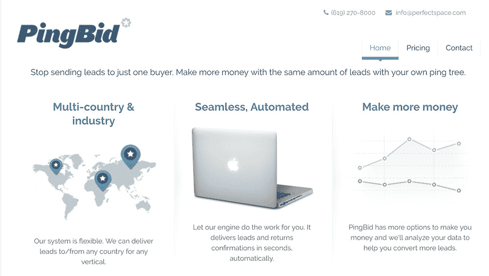
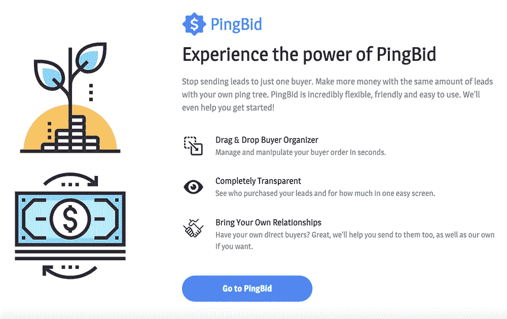

# 我如何保持我的 MVP 并达到 15K/月

> 原文：<https://www.indiehackers.com/interview/how-i-kept-my-mvp-lean-and-reached-15k-month-3a0d608605>

## 你好！你的背景是什么，你在做什么？

你好！我是内特·里特。我是德克萨斯州奥斯丁的一名技术型企业家，希望酒店的首席技术官，T2 完美空间的创始人，以及 T4 标签的推广者。

在 Perfect Space，我们开发金融科技产品，如 PingBid，这是一个借贷者和营销者之间的双边网络。该平台通过为每个贷款申请人与愿意为贷款服务的贷款人进行实时“反向拍卖”，自动优化营销人员的收入。

PingBid 目前每月产生约 1.5 万美元的收入，自成立以来总收入接近 300 万美元。

 

## 是什么促使你开始使用 PingBid？

在多年参与联盟营销行业，自由职业，并最终建立了一个网络开发机构后，我们很幸运有一个客户带着这个想法来找我们。他们不想预先付费，但愿意为通过平台销售的每一条线索支付佣金。几周后，第一个版本发布了，我们开始从第一条线索中获得收入。

当时，我和我的联合创始人正在组建我们的公司，在加州圣地亚哥生活时，为我们每个家庭提供支持。虽然我们喜欢建立代理机构(与微软、路虎、动视/暴雪等客户合作；我们做得很好)，我们都有建立 SaaS 产品的愿望。

发展网络的最佳方式是试图垄断一个节点。

TweetShare

## 构建最初的产品需要什么？

在代理行业，我们非常擅长于确定产品范围，并与客户合作，以获得人们愿意购买和使用的绝对最低产品。所以我们尽可能地逼迫客户。

由于范围非常简单，我们决定使用一个流行的 PHP 框架和我非常熟悉的 LAMP 堆栈来构建，因为支持某些东西并获得验证会非常快。

它最终只是一个 API 端点、数据库，以及客户为我们带来的对贷方 API 的几次 pings。没有品牌。没有名片。没有用户界面。没有登录。没有账户。没有报道。没有计费连接。

(直到今天，我喜欢挑战潜在的企业家、程序员和客户，当他们描述他们的 MVP 时，他们认为什么是真正“最小可行的”。)

令人欣慰的是，由于我们有承包商在我们的其他代理项目上工作，我们能够在项目之间的空闲时间投资建造它。由于开始时范围很小，我能够在几周内推出第一个版本。

 

## 你们是如何吸引用户和发展 PingBid 的？

我的商业伙伴是一家国家有线电视公司的前渠道开发员，所以他知道如何培养 B2B 关系。我们也有过一次幸运的经历，我以前创业公司的一个前同事不知何故通过小道消息听到了我们在做什么。他伸出手，让我们与我们的下一位客户取得联系，这位客户至今仍在我们手上。

事实上，我们有一个双边的 B2B 网络，我们知道利用我们正在建立的关系来发展——我们已经拥有的客户贷款人和营销人员。

这是我从最初的“完美空间”概念中学到的一件事。早在它成为一个代理机构之前(在 Craigslist 影响如此深远之前)，Perfect Space 就是一个出租房产的搜索引擎。我在创建企业的过程中了解到，网络需要在一方或另一方播种。发展网络的最佳方式是试图垄断一个节点。换句话说，尽最大努力让一个人/客户的整个网络都参与进来。这是你能采取的最有效的成长行动。它开始让雪球滚下山坡。

前两个客户已经非常了解这个领域的贷款人，所以他们为我们做了介绍，这对他们也有好处(贷款人越多，他们的潜在客户就越有可能获得更高的价格)。这些介绍导致了更多的营销人员介绍。齿轮以这种方式转动了很多年。

在最高点，我们每天通过 PingBid 运行超过 100，000 条线索，还有扩展的空间。该系统是以硬件为瓶颈构建的，所以我们所要做的就是随着负载的增长和线索的不断涌入，添加负载平衡器和复制数据库服务器。

我们做的最好的决定是从一个比任何人认为的 MVP 都小的产品开始，从大门打开的那一刻开始赚钱。

TweetShare

## 你的商业模式是什么，你是如何增加收入的？

我们只是通过向营销人员/销售人员收取销售给贷方/买方的所有线索的百分比佣金来赚钱。

我们向客户提供的一个独特价值是利用我们与贷方的关系，这样他们可以立即开始销售。我们还在对帐期后通过 ACH 或电汇提供付款(和付款收据),因为付款金额很大，通常每月发生一次。直到今天，我们仍然没有像 PayPal 或 Stripe 这样的支付系统来保持低成本。由于我们与贷款人和营销人员(他们最大的担忧是现金流)合作，这对所有参与者来说都是最佳的，而且收费比当前的支付系统更低。

今天，我们每个月大约赚 15000 美元。这个数字远远低于我们在高峰期的水平。金融科技领域虽然有利可图，但也有不良参与者。我们发展得如此之快，以至于没有时间对我们所有的客户进行适当的审查，所以我们在这方面遇到了一些问题。我们最终停止了新客户的招聘，这些新客户没有我们已经信任的客户的个人推荐。这减缓了我们的增长，但减少了追踪欺诈所需的时间。我们很高兴重新获得了这种平衡，我们喜欢培养关系和提供优质服务。

也就是说，我们最终确实构建了所有的东西，它已经成为一个相当自助的平台(包括登录、报告等)。

最终，我们决定关闭该机构，但继续运营 PingBid。令人高兴的是，它继续运行良好，我们的客户仍然对它提供的价值非常满意。事实上，在过去一年左右的时间里，我们已经有贷方决定将他们从其他来源获得的线索出售给其他贷方。

| 年 | 收入 |
| --- | --- |
| '13 | 5509 |
| '14 | 439824 |
| '15 | 387946 |
| '16 | 625905 |
| '17 | 194540 |
| '18 | 149601 |

## 你未来的目标是什么？

PingBid 目前的未来是以维护模式生存。我和我的商业伙伴享受着我们的劳动成果，保持着这样一个可扩展的平台的运行，以及我们多年来建立的关系，这种关系不断为我们提供新的改进思路。

虽然我们一直在考虑收购要约，但我们也继续增加其他可以连接但不是必需的服务，如为最终没有向贷款人承诺的申请人提供短信和/或电子邮件跟进系统，供他们的呼叫中心使用。

## 你面临的最大挑战和克服的障碍是什么？如果你必须重新开始，你会做什么不同的事？

如果有机会，有两件事我可能会做得不同。

首先是花更多的时间和精力寻找减少网络欺诈的方法。这对我们的收入、动力和情绪都是致命的。如果我们那样做了，我们今天肯定会坐在某个海滩上。

我也会花更多的时间在会议上营销，以获得更多的客户。

这两者的结合将再次显著增加收入。仍然有机会做到这两者，只需在平台上做一点工作，通过更新的 UI 和一些附加功能来加快速度。

另一件可能对我们伤害最大的事情是我们住在圣地亚哥；尽管它是世界上最棒的居住地之一，但它的价格也高得惊人。如果我们有更低的生活成本，我们今天可能仍然会把它作为我们的主要收入来源。

## 有没有发现什么特别有帮助或者有优势的？

我们在 PingBid 上做的最好的决定是从一个比任何人想象的 MVP 都小的产品开始，从大门打开的那一刻就开始赚钱。尽管现在这已经是老生常谈了，但是从一开始，遵循精益创业方法和书籍就是这个产品成功的原因。

如果没有收入，我们也会过得更艰难。我仍然向每个人建议创业，但是如果你在企业界赚大钱，就很难离开金钱。在收入已经足够养活你的情况下，努力工作意味着你现在必须做出新的选择。

今天，我把我的效率归结为几个习惯:心怀感激，把时间花在能让我更接近目标的最重要的事情上，冥想，锻炼，给予他人明确的赞扬。事实上，我使用一个名为“完成”的应用程序来帮助我每周专注于做那些活动。

我们经常被*纠缠，他*会想要我们制造的产品，但是我们没有充分考虑*什么时候*会想要它们。

TweetShare

## 对于刚刚起步的独立黑客，你有什么建议？

阅读 [*蓝海战略*](https://www.amazon.com/Blue-Ocean-Strategy-Uncontested-Competition/dp/1591396190) 和 [*精益创业*](https://www.amazon.com/Lean-Startup-Entrepreneurs-Continuous-Innovation/dp/0307887898) ，了解客户发展情况。

别说话了。听着。如果痛苦足够强烈，就会有人为你买单。如果他们不给你钱，也没什么大不了的。

比起了解典型的消费者，我是一个更好的 B2B 人员，但我最近学到的一件事是思考与营销相关的“何时”。

我的意思是，我们经常被“谁”想要我们制造的产品所困扰，但是我们没有充分考虑到*何时*他们想要这些产品。

30 岁的女人不想要尿布。一个刚生完孩子的 30 岁女人肯定知道。父亲可能也是。在“何时”锁定“谁”是非常重要的。

为了提炼这一点，我现在问自己这个问题:**什么时候**是我的目标客户绝对需要我的产品的时候？

我在其他产品上犯的大多数错误都发生在我没有考虑“何时”的时候，而是纯粹关注“谁”(或者更糟，关注我自己的产品而不是我客户的话语/痛苦)。

## 我们可以去哪里了解更多？

如果你是借贷行业的营销人员，并且有兴趣了解更多，你可以访问 PingBid.com 或 T21 的完美空间，并亲自与我联系。

我喜欢在 Twitter 上谈论商业、哲学和标签，所以请随时加入我的讨论。

最后但同样重要的是，我喜欢独立黑客，所以请在下面的评论中给我留下想法、问题、个人思考或令人愉快的打油诗！

—[<picture id="ember8069096" class="user-avatar ember-view user-link__avatar"></picture>内特·里特](/nateritter?id=BX3exhxSrHWodrcaXPJWICONlsu2)【PingBid】创始人

## 想像 PingBid 一样自己创业？

你应该加入独立黑客社区！🤗

我们是几千名创始人，互相帮助建立有利可图的业务和副业。来分享你正在做的事情，并从你的同事那里获得反馈。

还没准备好开始使用你的产品吗？没问题。这个社区是一个认识人、学习和实践的好地方。随意[随便浏览](/)！

——[<picture id="ember8069101" class="user-avatar ember-view user-link__avatar"></picture>柯特兰艾伦](/csallen?id=ibTLPyjwVebnZjMGKvz6ztarnuV2)，独立黑客创始人

21votes