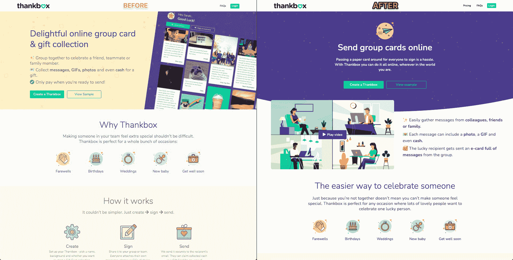
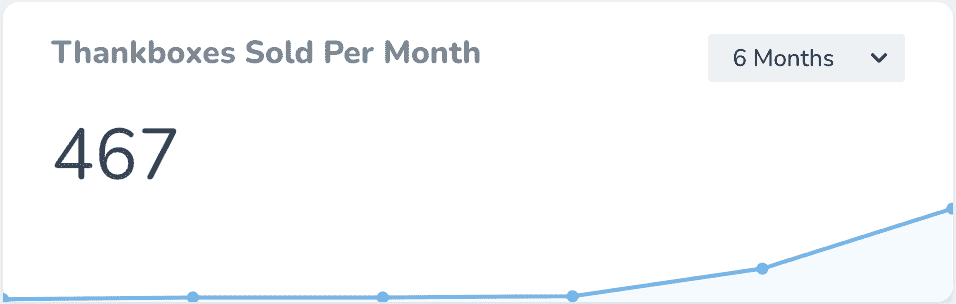
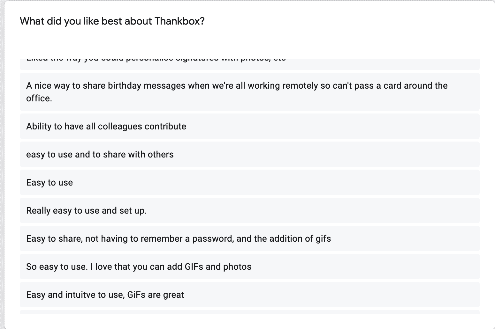
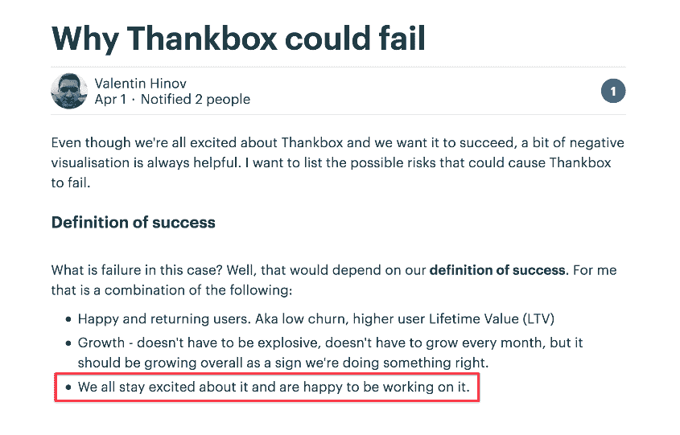

# 在 COVID 危机期间，我是如何启动我的创业公司并使其增长 500%的

> 原文：<https://www.indiehackers.com/interview/how-i-launched-and-grew-my-startup-by-500-during-the-covid-crisis-d526999b35>

## 你好！你的背景是什么，你在做什么？

你好，我叫瓦伦汀，我是 [Thankbox](https://thankbox.co) 的创始人，这是一个非常简单易用的在线团体卡和现金收款服务。我认为这是许多可爱的人庆祝一个幸运儿的数字方式。

我来自保加利亚，目前住在苏格兰可爱的爱丁堡。2010 年来到苏格兰学习电脑游戏编程。毕业后，我甚至在游戏行业工作了近两年，主要是做手机游戏。

然后我逐渐过渡到常规应用程序，因为当时对这种技能的需求越来越大。我甚至在 2015 年制作了自己的一款名为 [Bargain Bytes](https://play.google.com/store/apps/details?id=com.rockspin.bargainbits&hl=en_US&gl=US) 的应用程序，这是一款简单的应用程序，用于跟踪 Steam 等商店何时对游戏打折。事实上，它最终获得了相当数量的用户，并且仍然有大约 1000 名活跃用户，尽管我不再支持它。那是我第一次自己动手做东西并推广的经历。

然后我试着做了一个社交网络应用，叫做[策划](https://curated.app/)。我花了两年时间，学到了第一次创业时需要学习的所有艰难的课程。主要的问题是在验证之前进行构建，没有明确的商业化或用户获取策略。这是一堂昂贵的课，让我意识到还有很多东西要学。所以当我决定做 Thankbox 的时候，我试着应用我学到的所有经验。

## 是什么促使你开始使用 Thankbox？

我住在英国，那里有很大的办公室庆祝文化。我参加过许多不同的团队，每个团队都会庆祝一些事情，比如有人离职、某人的生日或工作周年纪念，方法是拿到一张纸质卡片，每个人都在上面签名。虽然最终结果很好，收件人也很高兴，但整个过程总是很麻烦。名片通常会在最后一刻被人的经理买走。然后他不得不在办公室里追着人们(小心翼翼地)签名。一些不在办公室的人根本无法做出贡献。如果有一个信封现金收集，人们将不得不跑到 ATM 机取钱离开那里，因为谁还会使用实物现金，对不对？

2019 年 11 月，在另一个这样的场合，我心想“肯定有更好的方式来做这件事，在线”。我做了一些研究，发现真的没有什么能涵盖这两个方面——信息和现金收集。这时，一个灯泡亮了——这是我能做的事情！因此，我开始头脑风暴早期的设计，最终成为 Thankbox。我刚刚购买了域名，并开始规划一个登录页面，但后来我暂停了进一步的工作，因为我当时有太多的事情要做——全职自由职业者(我仍然在做)，并作为技术顾问加入另一家初创公司。

然后 2020 年 3 月发生了。每个人都将远程工作。一天早上，我正在冥想(我每天都试着做至少 10 分钟)，突然这个思维模式像火车一样击中了我:“这是做 Thankbox 的最佳时间”。"如果有时间做这件事，那就是现在"。“没人能再做纸卡的事情了；公司将需要一种方法来做到这一点”。这完全毁了我的冥想😅但它一直在我脑海里挥之不去。Thankbox 的第一个版本在两个月后的五月上线。

## 构建最初的产品需要什么？

我在 2020 年初才开始学习网站建设——在此之前，我所有的经验都是在应用程序方面。我当时也在从事全职合同，没有足够的时间在边上快速做这个。我觉得为了利用每个人都远程工作的事实，时间是至关重要的。Thankbox 必须尽快完成，而且必须做得正确。我和我的妻子谈过了，我们同意了一套预算，我们可以放心地投入到 Thankbox 中。但是那个预算不允许支付一个开发者 2 到 3 个月的费用——我需要一个替代方案。

所以我求助于我的一个好朋友——[@ Joe _ Pritchard](https://www.indiehackers.com/joe_pritchard)——她以前帮助过我一些网页开发工作。他是一个非常优秀的开发人员，做了大量的自由网络工作。我们聊了聊 Thankbox，他提出建立一个利润分享协议，作为交换，他将推出该产品的第一个版本。我们同意，一旦 Thankbox 达到一定的收入里程碑，他将获得一年每月利润的一部分。这很棒，因为它大大降低了我整个项目的风险。我也知道 Joe 在设置初始堆栈方面会做得非常出色。

这意味着对我来说，最初的现金投资大部分是支付给我的设计师，让他为我工作并勾画出主屏幕——v1 工作大约需要 1000 美元。她是我在 2019 年讨论 Thankbox 的第一批人之一。她真的对这个想法充满热情，这驱使她很快地改变了最初的设计。

因此，开发于 2020 年 3 月中旬开始——我尽可能地帮助 Joe，同时尽可能多地了解技术堆栈——**Laravel、PHP、Vue、Typescript、CSS 都是我必须快速学习的东西**，因为在 v1 发布后，我将负责几乎所有的开发工作。

我从之前的创业中学到了重要的一课，那就是尽可能缩小范围。所以 Thankbox 在开始的时候只是意味着拥有运行所必需的最少的特性——我们坚持了这一点。我们在 2020 年 5 月 7 日[发布了它——在工作开始后不到两个月。](https://twitter.com/ValCanBuild/status/1258293464443346945?s=20)

## 你的技术是什么？

事实上，[几个月前曾详细写过我的技术栈](https://www.valcanbuild.tech/a-bootstrappers-tech-stack/)——大部分没变，但我会在这里总结一下。

Thankbox 目前运行的是每月 10 美元的数字海洋水滴。我从每月 5 美元开始，但由于 1GB 的内存限制太小，不得不扩大规模。目前的 droplet (2GB RAM)表现非常好，我远离任何严重的 CPU 或内存限制，即使在我最忙的日子里。

后端由 Laravel 提供支持，用 PHP 编写。Laravel 是我对全栈开发的介绍，我很喜欢它。主要是因为它能让我跑得超快。雄辩，他们的 ORM，是抽象 mySQL 查询的绝佳工具。他们的第一和第三方集成在让您快速启动和运行方面非常出色。我想它肯定会成为我未来项目的首选框架。我使用最多的东西之一是 Nova，他们的付费管理面板包。它让我能够非常轻松地设置一个仪表板来跟踪我的指标，并轻松地管理应用程序。只需一次性支付 199 美元，它就能获得百倍回报。

前端大部分是用 Typescript 写的 Vue 单页 app (SPA)。我确实在我的登录页面和一些其他实用程序页面中使用了一些服务器端渲染的 Laravel 刀片组件。进入 Vue 真的很容易——尽管我以前从未使用过 React 之类的东西，但它立刻就吸引了我。它的基于组件的方法很容易得到，而且它非常适合我选择的 CSS 框架 Tailwind。

然后，我使用一系列标准工具:

*   用于发送交易电子邮件的邮件枪
*   支付和收款礼品卡捐款条纹
*   面向媒体和资产存储的 Cloudinary & S3。虽然我正在考虑最终从 Cloudinary 中脱离出来，因为它的长期存储非常昂贵，而且我只使用了它提供的大约 5%的功能。
*   ❤️聚焦隐私分析机构 Fathom

除了 Cloudinary 的图像存储问题，到目前为止我还没有遇到任何令人讨厌的缩放问题🤞。

## 你是如何吸引用户并发展 Thankbox 的？

2020 年 3 月开发开始后，我就开始在推特上发布关于 Thankbox 的消息，并在我的 LinkedIn 上发帖。我的追随者不多，但有些人注意到了这一点，并对此产生了兴趣。我早期的很多动力都来自我的个人网络。

在我发布的那天，我惊讶地看到一个 Thankbox 几乎立刻就被创建了。是我的一个大学老朋友在推特上关注我。他在育碧工作，就在我发布的那天，他们有人离开了他们的团队，他决定使用 Thankbox，这样他们就可以说再见了。他当天就买了它，他的整个团队都很喜欢它！我很激动——我一点也没想到会这样。这给了我一股动力和认可，我至今仍记忆犹新。

第一个月，我完成了 6 笔销售，收到了很多反馈。在最初的几个月里，Thankbox 主要被爱丁堡的公司使用，这些公司通过我或其他认识我的人发现了它。这真的很棒，因为这些都是我可以要求诚实反馈的用户——他们希望看到我成功。他们热衷于指出漏洞或明显缺失的功能。这个夏天，它真的帮我完善了产品。

在最初的几个月里，我也注意到了网络效应。我在育碧的朋友买了第一个 Thankbox？自从他把它引入他的团队后，我已经从他们公司拿到了 20 多份不同的销售订单。或者我注意到有人在离开公司时会收到一个感谢盒，然后建议把它作为在新工作场所使用的团体卡工具。

我知道我有产品/市场契合度，但现在我需要产品/渠道契合度。从 7 月到 10 月，我尝试了不同的吸引人的渠道，希望其中一个能够吸引更多的人。我试过脸书& LinkedIn 广告、竞赛、付费博客帖子，但没有一个管用。尽管如此， [Thankbox 缓慢地保持增长](https://www.indiehackers.com/product/thankbox/passed-100-130-in-monthly-revenue--MFu-JZ70yurvOzYnEHP)——主要是由于那些小的网络效应复合。

10 月初，我和我的小团队(大部分是兼职分包商)就我们的登录页面进行了一次坦诚的对话。我们知道产品很好——我们的用户是这么告诉我们的——但是到达页面的新用户并没有足够快地“理解”它。所以我们开始重新设计和澄清它——我还花了 300 美元在 Fiverr 上制作了一个解释者视频——非常划算，[视频非常棒](https://www.youtube.com/watch?v=1bCoaCAzPFk)。结果是立竿见影且富有成效的——它综合了提供的产品，人们很快就明白了:

就在那之后，我决定尝试搜索广告，就在那时[事情开始起飞](https://www.indiehackers.com/product/thankbox/finally-found-a-good-acquisition-channel--MKnQ2z3J7evujxzu5WS)🔥回想起来，这很有意义——在脸书做广告没有任何效果，因为 99%的人在任何时候都不需要发送团体卡——**你要么现在就需要，要么就不需要。**搜索在线团体卡服务的人- **他们现在就需要**。我开始的时候预算很少，大约 15 美元/天，但却立竿见影。

从那以后，我增加了一点，做了更多的广告优化，但增长是惊人的。我在 10 月份卖出了 29 个 Thankboxes，11 月份卖出了 167 个，12 月份卖出了将近 500 个(在我写这篇文章的时候还没有完成)。这些新用户大多喜欢它，并带来了许多其他人。广告成倍增加了网络效应，并导致了一个刚刚开始稳定的增长率。

## 你的商业模式是什么，你是如何增加收入的？

Thankbox 有一个非常简单的直销商业模式——人们为他们购买的每个 Thankbox 支付 5.99 美元。我认为 Thankbox 在这一领域优于其他产品的一个主要优势是，它不需要用户付费来设置他们的团体卡。我甚至不要求他们注册-我只是要求他们的电子邮件，然后给他们发送一个链接来管理它。然后当他们准备好要寄的时候就付钱。

我在很早的时候就尽可能多地消除了进入障碍——我想让人们尽可能快地开始工作。一旦有人制作了一个感谢盒，并在里面收集了至少两条信息，他们就有超过 90%的可能购买它。这是我想推荐给那些正在努力完成销售的人的建议——让人们尽可能容易地使用你的产品！

我在 2020 年 5 月发布了 Thankbox。它经历了一段稳定增长的时期，直到 11 月，在这一点上它扶摇直上——从 10 月的每月约 190 美元收入到 11 月的 1000 美元，在我写这篇文章时，12 月中旬的收入约为 2600 美元。到目前为止，我最好的一天赚了 540 美元。这是我制造的最成功的产品。

正如我之前提到的，我付钱给一些分包商来帮助我——因为我仍然全职承包自己。迄今为止，后者帮助支付了前者的费用。但这也意味着 Thankbox 在开始收回成本之前，必须开始每月获得大约 25000 美元的收入。幸运的是，12 月是第一个出现这种情况的月份。

## 你未来的目标是什么？

我正在开发一些新功能来增加收入。第一个是高级 Thankbox 层——可能定价在 9.99 美元左右——为客户的 Thankbox 提供额外的选择，如视频消息和更多主题。我已经有用户要求这些，所以我知道他们会很受欢迎。

第二项更复杂的工作是为经常使用 Thankbox 的企业添加订阅包。我有一些大公司每月购买 4 或 5 张卡，所以给他们一个订阅选项是有意义的。这也将为我提供一个更可靠的收入渠道。

我打算尽快解决的一个挑战是建立一个合适的客户支持系统。Thankbox 是一个 B2C 产品，随着使用的增长，客户支持查询也在增加。如果没有适当的管理，这将会占用我太多已经很少的时间。

我的长期目标是全职做 Thankbox 我的目标是希望在 2021 年实现。

## 你面临的最大挑战和克服的障碍是什么？

甚至在开始之前，我必须解决的最大挑战之一就是如何处理产品的现金回收方面。我想让用户能够在他们留给朋友的信息中添加现金，然后将所有现金汇集成一张礼品卡，收件人最终会收到。我可以很容易地用 Stripe 收款，但是当 Thankbox 寄出时，我如何将它转换成礼品卡呢？

我花了几周时间寻找一个可以做到这一点的服务，当我找到一个后，我不得不说服他们让我使用它们。它们大多是为给自己员工发放礼品卡的企业量身定制的，而不是一些随机的公司从其客户那里收钱，然后将其转换为给其他人的礼品卡。幸运的是，他们给了我一次机会。我现在已经通过他们的服务发行了超过 16k 美元的购物卡。

我要克服的另一个障碍是会计，虽然听起来很无聊。由于 Thankbox 处理大量的现金收款，为了让我的账目保持有序，我必须对它有一些信心。我投资了一点钱，开始的时候和一个会计师聊了聊，他帮助我理解了我必须跟踪什么&如何跟踪。我甚至最终编写了自己的工具来生成会计报告，这样我就可以避免自己在做这些报告时出现任何错误。Stripe API 在这方面非常出色。

## 有没有发现什么特别有帮助或者有优势的？

关于我上面所说的，在你开始之前，在你最不了解的领域做一点准备。虽然创业总是需要一点信念的跳跃，但至少知道自己在跳什么是有好处的。

如果你有能力组建一个团队，即使像我这样是兼职的，也要用他们来填补你知识和技能的空白。尽管这降低了我实现盈利的速度，但我爱我的小团队——每个人都以某种方式帮助我，Thankbox 的成功是我们所有人共同努力的结果。

Thankbox 的一大优势在于它的发布时间——在不可能交换实体卡片的时候发布。另一个是保持产品简单易用。这是我发给第一次购买 Thankbox 的顾客的调查的摘录。看看有多少人提到“容易”这个词——这就是我的目标。

在过去的几年里，真正帮助我理解这一点的书籍是唐纳德·米勒的《建立一个故事品牌》(T3)和艾普丽尔·邓福德的《显然很棒》(T5)和《非常棒》(T6)。当我迭代产品时，我会不断地回到他们身边。至于在线资源，我最近发现了 [First 1000](https://first1000.substack.com/) substack，它非常棒——它讲述了知名初创公司如何获得他们的第一批客户——这是一本非常有用的读物。[营销实例](https://marketingexamples.com/)，我相信大多数 indiehackers 都很熟悉，这也是一个金矿。

## 对于刚刚起步的独立黑客，你有什么建议？

接受这样一个事实，你将通过艰难的方式学到很多东西。你可以阅读世界上所有的建议，但是你不可避免地会犯别人以前犯过的错误，即使你被警告过。在我犯了很多核心错误之后，我得到的很多创业建议只有在回想起来才有意义。不要因此而失望，这是旅程的一部分。

与爱你和支持你的人分享你的成功和艰辛。当你是一名独立创始人时，这一点至关重要。对我来说，这个人一直是我的妻子。她是我最大的粉丝，从 Thankbox 开始，她就一直分享我的快乐和悲伤。她在这方面的支持对我来说是无价的——当我情绪低落时，她可以激励我，当我开始迷失方向时，她可以让我停步不前。

我的最后一条建议是，记住创业的过程可以而且应该是有趣的。你完全可以享受创业的乐趣，即使它并不“成功”(无论你如何定义)。事实上，我在开始做 Thankbox 的两个星期后，就在我们团队的 Basecamp 板上写了这个:

## 我们可以去哪里了解更多？

我在我的[推特](https://twitter.com/ValCanBuild)上最活跃，在那里我分享我在建立 Thankbox 时的起起落落。你也可以关注我的[博客](https://www.valcanbuild.tech/)。从一开始我就在 [Thankbox 的 IH 页面](indiehackers.com/product/thankbox)上发布了我的里程碑，所以你也可以在那里关注我的进展。

我也想利用这个机会给我的分包商小团队一个大喊。[乔](https://var.digital/)，[芭芭拉](http://design.barbasboth.com/)，[亚历克斯](linkedin.com/in/agwmarten) & [尼基](https://ntsanov.com/)——非常感谢你在这疯狂的一年里给予的帮助。

在 Thankbox 上工作让我对创业公司如何获得最初的用户非常感兴趣。如果你对我的旅程更感兴趣，我很乐意在评论中回答你的问题。

喜欢这次采访吗？[订阅《深度潜水》](https://www.indiehackers.com/post/deep-dive-valentin-hinov-of-thankbox-723727219e),每周在你的收件箱里获得小规模的采访和浓缩的信息。

——[<picture id="ember5242067" class="user-avatar ember-view user-link__avatar"></picture>瓦伦丁·希诺夫](/ValCanBuild?id=UXvPkbPLJpcj4Us8Id6q5E5XaI73)，Thankbox 创始人

## 想像 Thankbox 一样建立自己的事业？

你应该加入[独立黑客社区](/)！🤗

我们是几千名创始人，互相帮助建立有利可图的业务和副业。来分享你正在做的事情，并从你的同事那里获得反馈。

还没准备好开始使用你的产品吗？没问题。这个社区是一个认识人、学习和实践的好地方。随意[随便浏览](/)！

—[<picture id="ember5242072" class="user-avatar ember-view user-link__avatar"></picture>考特兰艾伦](/csallen?id=ibTLPyjwVebnZjMGKvz6ztarnuV2)，独立黑客创始人

84votes