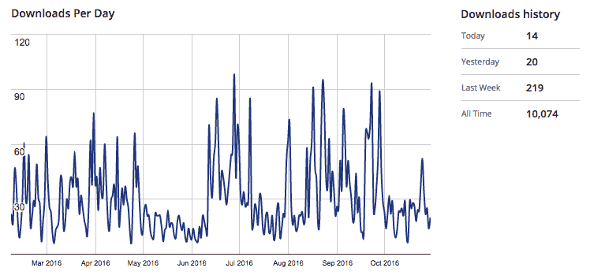
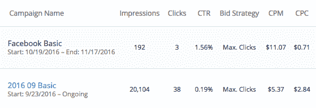
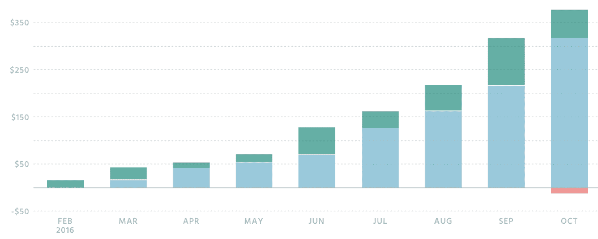

# 我如何启动我的 WordPress 边项目，使 350 美元/月

> 原文：<https://www.indiehackers.com/interview/how-i-launched-my-wordpress-side-project-and-make-350-mo-67877cc5da>

## 告诉我们关于你自己和你正在做的事情。

我叫科里·马斯。我从 1997 年开始做 web 开发，从设计师到前端开发再到后端开发。我一直喜欢客户工作，但我想用被动收入来巩固我的日常工作，所以我在 2003 年开始了我的第一次网上业务。像大多数开发人员一样，我为我的客户建立了一个 CMS。它极具挑战性，赚钱很少，最终失败了，但它让我尝到了将 web 应用作为副业的滋味。

从那以后，我已经推出了几十个——时间追踪器、活动策划器、会员网站和在线社区。只有一个——thebirdy.com——个人财务追踪软件，还算成功，我在 2013 年卖掉了它。大约在 2011 年，我看到 WordPress 的流行速度有多快，于是我把注意力从一般的网络开发转移到为客户建立 WordPress 网站上。我很高兴我做到了。WordPress 现在为超过 25%的互联网提供动力，为创业提供了巨大的机会。

2015 年，我遇到了一些很棒、很开放的人，他们在 WordPress 主题和插件上建立了成功的业务。除了为客户建立网站之外，他们激励我开始在 WordPress 中寻找将我的企业家精神和商业机会相结合的方法。

2015 年秋天，我找到了机会。在与一家本地初创公司合作时，我的任务是为我们的项目管理选择看板。我找到了很多 SaaS 应用，但是没有 WordPress 插件。我看到了创造新的受欢迎的东西的机会。

2016 年初，我为 WordPress 推出了[看板，这是一套完整的看板套件。它可以用于项目管理，作为 CRM，跟踪销售，管理新员工，等等，最常见的用户是自由职业者和小型开发团队。这个插件现在已经有大约 10，000 个安装，600 个普通用户，和几十个付费用户。](https://KanbanWP.com)

## 你是如何开始你的事业的？

大约在 2014 年，我开始感觉到 WordPress 中存在商机，但我接触到的成功企业有限。我看不出在 Code Canyon 上卖 5 美元的插件能算一笔生意。

2015 年，两件事改变了我的认知。第一件事是我为一个客户建立了一个大型的 Woocommerce 网站，从购买超过 1000 美元的附加组件开始。第二件事是我在亚特兰大参加了一个 WordPress 会议，遇到了 Ninja Forms 的人，Andy Wilkerson，和其他几个基于 WordPress 产品真正做生意的人。

我继续开发 SaaS 应用，但开始在 WordPress 插件中寻找机会。2015 年秋天，我发现 WordPress repo 中没有看板插件，于是抓住机会成为第一个。首先，我开始构建一个简单的 MVP 风格的插件版本，在 WordPress 插件 repo 中保留/kanban url。

我买了可用的 kanbanwp.com 域名，我也联系了拥有 wpkanban.com T2 的人，但似乎没有做任何事情。他很好，让我以略高于成本的价格买下了它。

我在[的高级 WordPress 脸书小组](https://www.facebook.com/groups/advancedwp)上发帖，询问人们是否对 beta 测试感兴趣。在我的帖子被撤下之前的几个小时内，我收到了 80 个请求。(论坛的规则我没看。你必须链接到真正的代码，而不仅仅是一个电子邮件注册表单。)

我自己设计了一个简单的标志，并建立了网站。然后我在 2015 年 10 月上传了插件的第一个版本，并开始运行。在支持免费版几个月之后，我更新了网站，加入了购物车，并在一月份推出了第一个插件。几天之内我就拿到了第一份订单，兴奋极了！从那以后，我一直在慢慢地添加更多的插件。

## 你是怎么找到时间和资金来建造一切的？

过去，我曾几次开展网上业务，但都没有获得付费客户，所以我总是用自己的钱来资助他们。这一次，我和妻子达成协议，只允许我使用公司实际赚到的钱。我喜欢这种挑战，它迫使我在如何使用收入上非常有策略。到目前为止，每一分钱都回到了生意中。

时间是另一个挑战，因为我在白天的工作中，在晚上和周末为 WordPress 运行[看板。我通常在早上工作几个小时，我喜欢在周六早上工作，那时我最喜欢的广播节目正在播放。有时候我会在晚上工作，然后在周日偷偷溜一会儿。](https://KanbanWP.com)

当我听应用过滤器播客时，我遇到了第一个大挑战，Pippin Williamson 谈到后悔没有使用自定义表格。大约在这个时候，我收到了很多支持多种插件板的请求，我意识到我的插件代码不支持这种支持。在接下来的几个月里，我完全重写了核心插件，以使用自定义表格和容纳多个插件。这既艰难又耗时。

当然，有时候我可以看到业务进展得更快，但我开始时知道这将是一份兼职工作，并预计需要三到五年时间，我才可能把它视为一份全职工作。这样低慢的期望，我从来不会失望，也很少会有压力，这对我来说是最重要的。我明白了，当我感到周围的业务压力很大时，我不会做出好的商业决策。

## 你们是如何吸引用户，壮大 KanbanWP 的？

WordPress 生态系统吸引我的部分原因是 WordPress 插件 repo。与苹果应用商店不同，它的准入门槛要低得多，也不需要学习新的编程语言。

我发现的另一个“秘密”来自多年的客户工作。我为客户建立了各种类型的 WordPress 网站，从博客到电子商务商店，再到网络应用。几乎每一个企业主，而不是工作在他们的业务(博客，营销等)，会花几个小时浏览插件回购，寻找插件，以增加网站的功能。这感觉很有成效，但却是一种常见的拖延形式。那时我才意识到插件回购对于向潜在客户营销插件是多么强大。

除了少数几个，我的客户都是从 WordPress 插件回购中找到免费插件的。我还通过在 WordPress 博客上发表关于产品的文章，在播客和研讨会上演示产品来吸引客户。

该网站平均每天有 20-40 名访问者。一半以上是主要看我们产品的新访客，这是有道理的，因为人们仍在了解 WordPress 的[看板。](https://KanbanWP.com)

更有趣的统计数据来自 WordPress 插件回购。该插件已经安装了超过 10，000 次。在过去的三个月里，活跃用户从 400 增加到了 600 多。不幸的是，WordPress.org 没有提供更具体的统计数据，但总体来看，这很有趣，也很有价值。

在我写这篇文章的时候，大概有 10，000 次下载，600 次持续安装(6%的转化率)，70 个客户(0.7%的转化率)。

一个月来，我一直在尝试通过广告滚动重新定位广告。这导致了 2.84 美元的点击费，没有转换。我只是刚刚开始尝试在脸书重新定位广告，最初显示出更多的参与度，但现在真的说出来还为时过早。

## 你的营收背后有什么故事？

WordPress 最常见的收入模式是通过年度订阅提供一个免费的核心插件和付费插件。这违背了许多新的 SaaS 思维，但我决定不试图与众不同。目前在 WordPress 的世界里有很多关于这个的讨论，一些产品开始提供每月循环计划。

我提供了几个月的免费核心插件，以收集对可以产生良好付费附加功能的特性的反馈。我从用户管理开始，然后在六个月的时间里添加了评论、附件、通知，最后是对多个公告板的支持。每个附加组件每年 30 到 50 美元，所有附加组件的捆绑包每年 150 美元。

定价在任何地方都很难，尤其是在 WordPress 生态系统中，你有很多公民认为一切都应该免费，因为 WordPress 本身是开源和免费的。我的价格是通过比较其他产品、顾客反馈和我的直觉来确定的。我也收到了很多反馈，我应该像其他看板应用程序一样对每个用户收费，但我对这样定价很犹豫，因为这很不“WordPress-y”。

我用免费版的 profitwell.com 跟踪了我的月环比增长 15%的目标。到目前为止，我们从二月份开始每个月都这样做。我们目前大约在 350 美元 MRR。

我使用 Stripe 和自制的购物车，并使用自定义代码来管理软件许可和更新。许多——也许是大部分 WordPress 付费插件使用简单的数字下载来管理一切，我现在希望我只是付了钱，而不是自己滚动，但这违背了我只花我赚的钱的原则。

## 你未来的目标是什么？

我为 WordPress 设计[看板的最初和主要目标是有东西可谈。WordPress 社区可能是 WordPress 生态系统的最大好处，也是寻找业务和/或客户的最佳途径。所以这可能是老生常谈，但是在社区中有一个可以谈论的产品会带来更多通过写作和教学脱颖而出的机会，从而带来更多的销售。这也有助于建立我的个人品牌，为我将来可能从事的任何事业做准备。](https://KanbanWP.com)

我的第二个目标是软件总是稳定的。这在过去让我感到压力很大，让我无法让软件自动运行几个星期，而我则转向业务本身。

最终，我希望这成为一种生活方式的业务，理想的是有一个小团队来帮助支持，开发和销售，但我认为这是几年后的事情。

## 如果你必须重新开始，你会做什么不同的事？

在开始创业或写一行代码之前，我会听所有我能得到的 WordPress 播客，尤其是[应用过滤器](http://applyfilters.fm)、 [Officehours.fm](http://officehours.fm) 、[摄魂师. fm](http://mastermind.fm) 和[马特报告](https://mattreport.com)。我从他们的经历和错误中学到了很多关于插件开发和 WordPress 商业的东西。

我会从第一天开始就找人合作，一起分担开发工作，一起讨论想法。作为一个单独的创始人可能会有压力、不知所措和孤独。

我不会自己写购物车，而是购买简单的数字下载。我总是使用第三方应用来解决常见的业务问题，这样我就可以专注于产品本身。

我会优先考虑写作，并养成这个习惯，这是我从来没有做到的。写好内容的博客仍然是一个非常有价值的营销渠道，但这是一个很难养成的习惯。

## 对你真正有帮助的是什么？

WordPress 有数量惊人的播客和充满有用信息的博客，包括技术和商业相关的。你将会遇到的几乎所有问题都已经在网上解决和讨论过了。

最近增加的是脸书集团和松弛渠道。如果你想涉足 WordPress 业务，在脸书加入[支持 WordPress 产品](https://www.facebook.com/groups/supportingwpproducts)和[销售 WordPress 产品](https://www.facebook.com/groups/sellingwpproducts)，以及[为时事通讯和 Slack 社区发布状态](https://poststatus.com)。无价的。

## 你会和有抱负的独立黑客分享什么建议？

我认为管理你的期望是至关重要的。每一个有应用想法的程序员都相信，在推出他们的 MVP 后 90 天，他们将成为亿万富翁。我知道我相信了。我无法告诉你有多少次我在蟋蟀的声音中启动了一个应用程序，几个月后又失望地把它关闭了。

2014 年，我承诺离开我在网上开始的任何新项目五年。现在，我更深入地评估每一个想法，并更加努力地把这个想法说出来。从那以后，我发起的五个项目中有两个慢慢取得了少量成功。他们可能不会让我成为百万富翁，但他们向我证明了合理的期望和耐心是关键。

## 我们在哪里可以更多地了解你？

我的博客不一致，这里写商业[这里写](http://gelform.com/blog)，这里写 WordPress 商业[这里写](http://gelwp.com/articles)，包括[一个关于我花钱的列表](http://gelwp.com/articles/what-ive-spent-on-kanban-for-wordpress-after-9-months)。

推特: [@gelform](https://twitter.com/gelform) ， [@gelwp](https://twitter.com/gelwp) ， [@KabanWP](https://twitter.com/KabanWP)

你也可以在下面留言，我会尽量回复你的！

—[<picture id="ember5267494" class="user-avatar ember-view user-link__avatar"></picture>科里·马斯](/coreymaass?id=fAPYRxQIq4XM0Iz2IzFjtDExZeB3)，看板的创造者为 WordPress

## 想像 WordPress 的看板一样建立自己的企业吗？

你应该加入[独立黑客社区](/)！🤗

我们是几千名创始人，互相帮助建立有利可图的业务和副业。来分享你正在做的事情，并从你的同事那里获得反馈。

还没准备好开始使用你的产品吗？没问题。这个社区是一个认识人、学习和实践的好地方。随意[随便浏览](/)！

——[<picture id="ember5267499" class="user-avatar ember-view user-link__avatar"></picture>考特兰艾伦](/csallen?id=ibTLPyjwVebnZjMGKvz6ztarnuV2)，独立黑客创始人

7votes