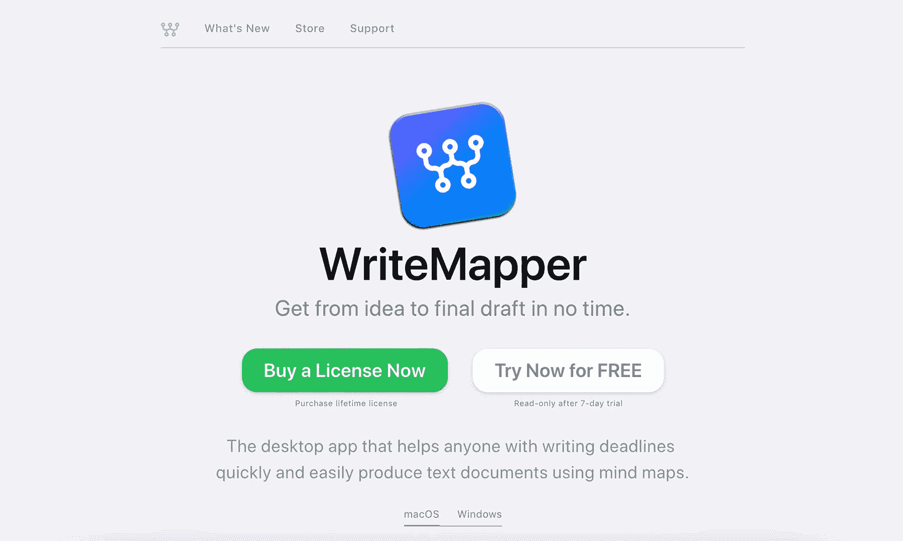
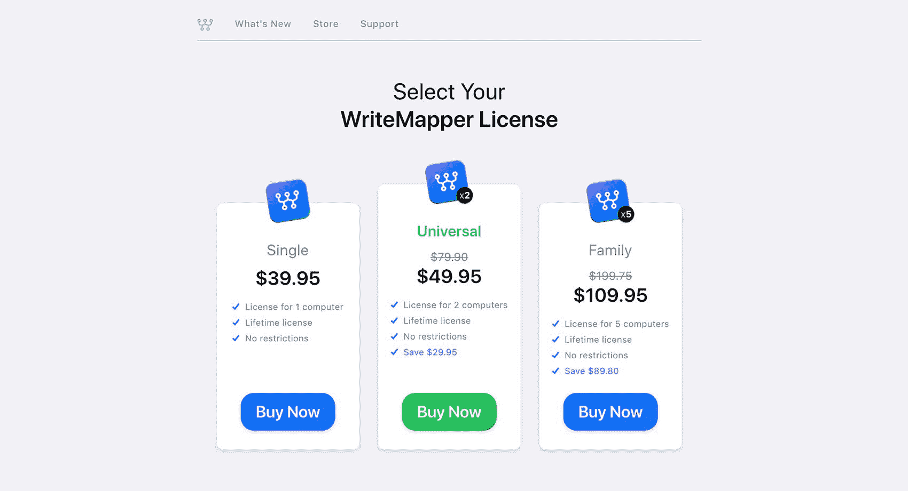
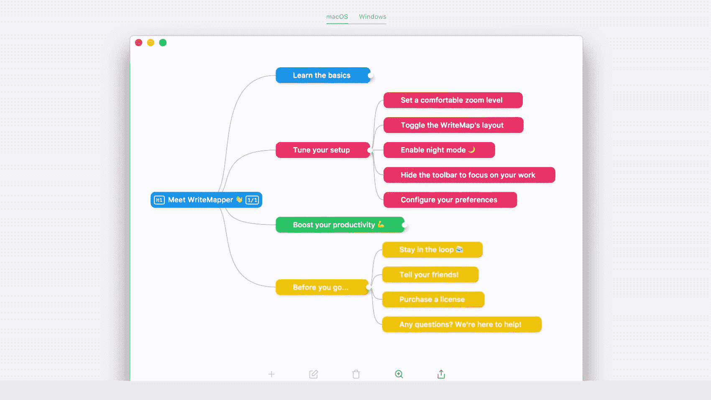

# 我如何从过去的错误中吸取教训来开发创收产品

> 原文：<https://www.indiehackers.com/interview/how-i-learned-from-past-mistakes-to-build-a-revenue-generating-product-e3d343259f>

## 你好！你的背景是什么，你在做什么？

我叫关，28 岁，自学成才，现居新加坡，从事设计和开发工作。

在整个学校，我是你典型的超常发挥者。我成绩全优，是运动队队长和学校级长。在大学期间，我创建了一个创收的学校商品活动，创办并领导了一个酿酒俱乐部(是的，🍺)，也是学生会的活跃分子。一年半后，我放弃了计算机科学课程，开始建立自己的软件产品业务，事实证明这比我想象的要困难得多。

2017 年 8 月，我推出了 [WriteMapper](https://writemapper.com) ，这是一款思维导图桌面应用程序，可以帮助任何在截止日期前写作的人快速轻松地将他们的想法转化为文本文档。月与月之间的收入并不一致，但 WriteMapper 的平均月收入约为 1，000 美元。

 

## 是什么促使您开始使用 WriteMapper？

我开始编写 WriteMapper，因为我厌倦了失败。在我 20 岁出头的时候，我通过做自由网站开发来为自己争取时间开发自己的软件产品。我这样做了好几年，希望能找到同样的 SaaS 式的成功，在媒体上获得如此多的关注。在做了至少六个没有任何结果的项目后，我决定全力以赴，全力以赴用自己的产品赚钱。

一旦这成为焦点，下一步就是确定一种人们愿意花相当多的钱购买的软件产品。经历了这么多次失败后，我对 SaaS 的产品不再抱有幻想，所以我知道我想避开它。我决定开发一款 macOS 生产力应用，可以帮助用户更快更好地完成工作，因为这一类别的现有应用已经以每份 20 至 200 美元的价格出售。

创业世界将失败视为荣誉的象征，但该死的是，我厌倦了连续多年创造没人付钱的产品。

TweetShare

之后，我需要弄清楚这个应用程序实际上会做什么。为此，我采用了 [Trevor McKendrick 的](https://www.indiehackers.com/interview/identifying-a-gap-in-the-market-and-reaching-1-on-the-app-store-02e756f768)方法来产生产品创意和验证产品:浏览 Mac App Store 中最赚钱的应用。经过我的初步研究，我把它缩减为思维导图或写作应用，因为这两种应用的需求似乎都很高。

我犹豫了一会儿，试图证明我如何才能做出比现有产品更好、更不同的东西。Mac 用户是一群挑剔的人，在这些类别中已经有一些设计良好的应用程序表现非常好。我也不想制造一个降价的竞争对手，所以我觉得很难选择。

在这里，我求助于书籍的智慧。W. Chan Kim 的蓝海战略(Blue Ocean Strategy)认为，残酷的竞争只会导致竞争对手争夺日益萎缩的利润池，而持久的成功不是来自与竞争对手的竞争，而是来自创造“蓝海”——尚未开发的成熟增长的新市场空间。读这本书让我顿悟:我可以将这两种想法合二为一，从而创造一片属于我自己的蓝海。一旦我有了产品想法，就只需要想出一个完美的名字，设计应用程序的标志，注册域名，并开始构建产品本身。

## 构建最初的产品需要什么？

为了全职开发 WriteMapper，我在今年早些时候做了几份自由网络开发的工作，只要我生活节俭，这些工作就能让我支付我的生活费用。我发现全力以赴很重要，因为我从未有过一次把时间和注意力分散在多件事情上的好经历。

WriteMapper 是一款基于 Electron framework 的桌面应用。我以前从未制作过桌面应用程序，但作为一名自学成才的开发者，我非常乐意投入到新的框架中，并学习如何开发产品。我花了大约四个月的时间进行全职开发，才拥有了一个我觉得可以向世界展示的应用程序。最初，它只在 macOS 上提供，尽管后来我也向 Windows 开放了。

为了做好产品设计，我总是在开始写一行代码之前考虑理想的用户体验。我最好的设计作品总是用一张空白的 A3 大小的纸和一支笔完成的。这种方法为 WriteMapper 带来了回报，因为我得到了[的反馈](https://www.reddit.com/r/apple/comments/6xlas7/comment/dmgra99)，人们真的很喜欢这款应用，因为它的设计非常好。

我特别关注的另一件事是，在创建一个功能丰富的产品和缩小范围之间划一条线，以便我能够尽快推出产品。为了帮助实现这一点，我首先将产品应该为用户做什么的本质提炼为一个非常清晰简单的陈述:帮助用户将他们的想法转化为一个文本文档草稿，根本不用花时间。这个指导性的声明帮助我做决定，比如在没有图像支持的情况下发布产品，并在发布后添加。

## 你是如何吸引用户和发展 WriteMapper 的？

WriteMapper 最初是在[产品搜索](https://www.producthunt.com/posts/writemapper)上发布的，在那里它受到了相对较好的欢迎，出现在首页并获得了 500 多张赞成票。两天之内，Product Hunt 吸引了大约 16000 名访客访问我的网站，我的第一个付费客户在发布后几个小时内就来了。

在来自 PH 的第一波访客之后，我在 Reddit 的 [/r/macapps](https://www.reddit.com/r/macapps/comments/6whrc1/writemapper_is_a_new_mac_app_i_made_that_turns/) 上发布了 WriteMapper，确保分享我认为有趣的细节，并回复了每一条评论。作为一个小的 subreddit，1)开始没有很多帖子，2)通常没有努力提供背景故事或原始发帖人的积极评论，我能够让我的帖子在 subreddit 的首页停留相当长一段时间。

不要忽视你最初的成功，不管多么小。

TweetShare

也是在这个时候，我开始积极接触主流在线媒体，看起来他们愿意报道新发布的 macOS 应用程序。我在一天之内尽可能多地搜索了应用新闻网站，确保找出之前报道过其他 Mac 应用的记者。从那里，我可以创建一个 24 名记者的联系名单，并向他们每个人发送一封简短的电子邮件。这一努力让 WriteMapper 登上了[《福布斯》](https://www.forbes.com/sites/ralphjennings/2018/04/04/why-google-ibm-and-microsoft-all-decided-to-expand-in-taiwan-this-year/#36eef4e65c72)和[Mac](https://www.cultofmac.com/499990/writemapper-mind-maps-text-editor/)Cult。

然后我决定再大一点，贴在 [/r/apple](https://www.reddit.com/r/apple/comments/6xlas7/hi_i_made_a_mac_app_that_lets_you_turn_ideas_into/) 上，订阅用户超过 60 万(相比/r/macapps 的 19k)。除了确保遵守 subreddit 的规则之外，我还使用 WriteMapper 在/r/macapps 和 Cult of Mac 上的积极接受作为社交验证，证明该产品也会引起这个社区的兴趣。这篇文章很受欢迎，最终获得了 13000 次投票，并吸引了近 9000 人访问 WriteMapper 的网站。

这些努力累积起来，仅在 WriteMapper 推出的前两周就吸引了近 1.6 万名访客，约 2.1 万次页面浏览，然后转化为实际销售额。

| 一天 | 游客 |
| --- | --- |
| 8 月 21 日 | 5 |
| 22 | 1607 |
| 23 | 568 |
| 24 | 370 |
| 25 | 257 |
| 26 | 119 |
| 27 | 354 |
| 28 | 1854 |
| 29 | 589 |
| 30 | 244 |
| 31 | 320 |
| 9 月 1 日 | 266 |
| 2 | 8732 |
| 3 | 1027 |
| 4 | 307 |

注意:流量的峰值分别来自我在 Product Hunt、/r/macapps 和/r/apple 上的帖子。

## 你的商业模式是什么，你是如何增加收入的？

WriteMapper 作为消费者应用程序出售，客户可以从我们的[网站](https://writemapper.com/store)一次性付费购买。一开始，单本售价为 26.95 美元，两本为 38.95 美元，五本为 89.95 美元。我最近将这些价格提高到 39.95 美元、49.95 美元和 109.95 美元，这似乎没有产生任何不利影响，也没有引起新客户的任何负面反馈。

我觉得对于某些 B2C 产品，包括像 WriteMapper 这样的生产力桌面应用程序，一次性购买的商业模式可能比实现重复计费更有效。这类应用的本质更适合一次性支付。最重要的是，许多消费者不愿为一个应用每月支付哪怕仅仅 3 美元，这也会给你的产品和品牌的形象蒙上负面的阴影。

 

在发布产品搜索之前，我特意在 WriteMapper 的网站上实现了 Stripe，这真的很快而且超级简单。这使得该应用在发布时就能盈利，尽管自最初的发布活动以来，销量已大幅下降。平均下来，这款应用自推出以来每月能赚 1000 美元左右。

以下是逐月收入明细:

| 月 | 收入 |
| --- | --- |
| 8 月 17 日 | 701 |
| 9 月 17 日 | 3399 |
| 十月十七日 | 1383 |
| 十一月十七日 | 541 |
| 十二月十七日 | 756 |
| 1 月 18 日 | 316 |
| 2 月 18 日 | 179 |
| 3 月 18 日 | 290 |

## 你未来的目标是什么？

查看我每月的收入数字，我可以看到收入与 WriteMapper 在任何给定时刻获得的曝光度密切相关。这款应用面临的首要问题是晦涩难懂。我计划从两个方面解决这个问题:

首先，通过发布 WriteMapper 应用程序的 iOS 版本。发布另一个应用程序将允许另一个发布事件发生，希望有类似水平的活动和嗡嗡声。新的和值得注意的产品也会在网上媒体上报道，这将使 WriteMapper 得到更多的曝光。将应用程序开发到我满意的程度非常耗时，也非常困难，但看起来我应该很快就能推出它了。

第二，我最近开了一个[博客](https://clearfounder.com)，在那里我分享我对开始和从事独立业务的想法和研究。我一直觉得，对于创业或商业相关的事情，我有很多有趣的想法和强烈的观点藏在脑海里，这是一个很好的方式来表达它们，同时也为我的产品创造更多的曝光率。拥有一个像 [WriteMapper](https://writemapper.com) 这样的伟大工具(真的，这太不可思议了——我甚至惊讶于我第一次使用它写作时，这个过程变得如此简单)让我很容易就能写出内容，我很快就会发表更多我的作品。

## 你面临的最大挑战和克服的障碍是什么？如果你必须重新开始，你会做什么不同的事？

创业世界将失败美化为荣誉的徽章，是你应该为之自豪的荣誉条纹——但是我厌倦了连续多年创造没人付钱的产品。受到创业公司关于想法不重要的说辞的影响，我一有想法就全力以赴去执行，比我应该做的次数多得多，认为仅仅做工作就能把产品带到某个地方。

我对如何创业的想法过于根深蒂固地植根于保罗·格拉厄姆的写作和商业哲学中，我没能认识到，处于早期阶段的伟大初创企业往往不是非常伟大的企业。

在试图打造一款盈利产品的过程中，对我帮助最大的一件事就是阅读。

TweetShare

我不是硅谷的创始人，我刚刚为我的新公司筹集了 100 万美元，并打算在未来一年雇佣 50 名员工，所以我为什么也要尝试建造他们正在建造的东西呢？

我需要支持和转移我的焦点，并解决缺乏经验的问题。我没有足够的知识去思考如何自己创业。这花了一段时间，但一旦我确定了问题，我开始求助于书籍来寻找线索和见解，这非常有帮助。

## 有没有发现什么特别有帮助或者有优势的？

在试图打造一款盈利产品的过程中，对我帮助最大的一件事就是阅读。事实上，我甚至可以说，如果我能从头再来一次，我会把前半年的时间花在当学生和阅读书籍上。当我开始把阅读更多地视为一种学习形式，在实际阅读这本书的同时做笔记时，阅读变得最有影响力。我也变得更能辨别我所读的东西，通过研究什么书可能能够回答我的具体问题，或者解决我知识中的具体空白。

除此之外，独自工作确实简化了决策过程。没有其他人在身边，显然没有必要将我的想法传达给团队中的另一个人，让他们仔细考虑，然后等待他们的决定以达成共识。我发现整个过程效率很低。

 

在设计和开发工作方面，自学也非常有帮助。当涉及到创建软件产品时，除了时间和精力之外，我可以在不花费任何成本的情况下产生一个非常好的结果。这也培养了我无所不能的心态，帮助我迎接挑战，而不是回避挑战。

最后，我不得不提到我的女朋友，自从被她的美貌迷住后，我就一直和她在一起😉在大学期间。她总是在我身边，在我过去几年经历的起起落落中，她一直是情感支持的支柱。如果没有她，我可能会彻底放弃创业，WriteMapper 肯定也不会存在。

## 对于刚刚起步的独立黑客，你有什么建议？

独立黑客中有很多建议，敦促人们从发布一些东西开始，任何东西都可以。实际上，我需要听到一些相反的声音——更有意识、更有选择性地选择投入时间和精力的地方。理想的方法可能介于这两个极端之间，所以你需要足够的自我意识和诚实，以确定哪一个是对你来说正确的建议。

自学培养了一种无所不能的心态，帮助我迎接挑战，而不是回避挑战。

TweetShare

为了完善你的商业运作的心智模型，我会鼓励你有意识地早些阅读。再次像对待学生一样对待自己，努力积极理解你所吸收的知识。在我读过的所有书中，这三本书是迄今为止最有影响力的:

*   [*蓝海战略*](http://a.co/7quLXAJ) 作者 W. Chan Kim 和 renée maoborgne。我思考如何设计一个企业并决定你的想法是否好的方式改变了游戏规则。
*   [*加里·凯勒的《一件事》*](http://a.co/3kKm0OI) 。这是我遇到的关于个人和企业生产力的最强有力的概念。
*   [*如何致富*](http://a.co/hqhjWLb) 菲利克斯·丹尼斯著。已故的菲利克斯·丹尼斯本人身价数亿，所以他知道自己在说什么。这本书写得非常诚实和中肯，帮助我消除了心理上的逻辑矛盾。

此外，不要忽视你最初的成功，无论多么小。给你的企业成长所需的时间和努力，而不是期望它马上起飞。仅仅因为你在新闻中听到的成功似乎是一夜之间发生的，并不意味着所有成功的产品都是瞬间成功的。尽你所能从这些故事中吸取教训，并把它们作为打造你自己成功之路的线索。全盘复制他们取得成功的方式可能不会给你带来同样的结果，因为你不是他们——了解你所处的环境，以及它与他人有何不同。

## 我们可以去哪里了解更多？

您可以访问 [WriteMapper 的网站](https://writemapper.com)了解更多信息，那里也有免费试用版可供下载。我还会在我的博客 [ClearFounder](https://clearfounder.com) 上发表长篇文章，讲述我在建立独立软件业务中所学到的东西。

感谢您的时间和关注！我希望这次采访对你开创和发展自己的独立事业有所帮助。我很乐意详细阐述采访的任何部分和我的经历，请在下面的评论区让我听到你的想法和问题！

—[<picture id="ember5223030" class="user-avatar ember-view user-link__avatar"></picture>关](/gx?id=TfQwZKkBceMPUeKg3HkOTyCSmVT2)【write mapper】创始人

## 想像 WriteMapper 一样建立自己的事业？

你应该加入独立黑客社区！🤗

我们是几千名创始人，互相帮助建立有利可图的业务和副业。来分享你正在做的事情，并从你的同事那里获得反馈。

还没准备好开始使用你的产品吗？没问题。这个社区是一个认识人、学习和实践的好地方。随意[随便浏览](/)！

——[<picture id="ember5223035" class="user-avatar ember-view user-link__avatar"></picture>柯特兰艾伦](/csallen?id=ibTLPyjwVebnZjMGKvz6ztarnuV2)，独立黑客创始人

88votes