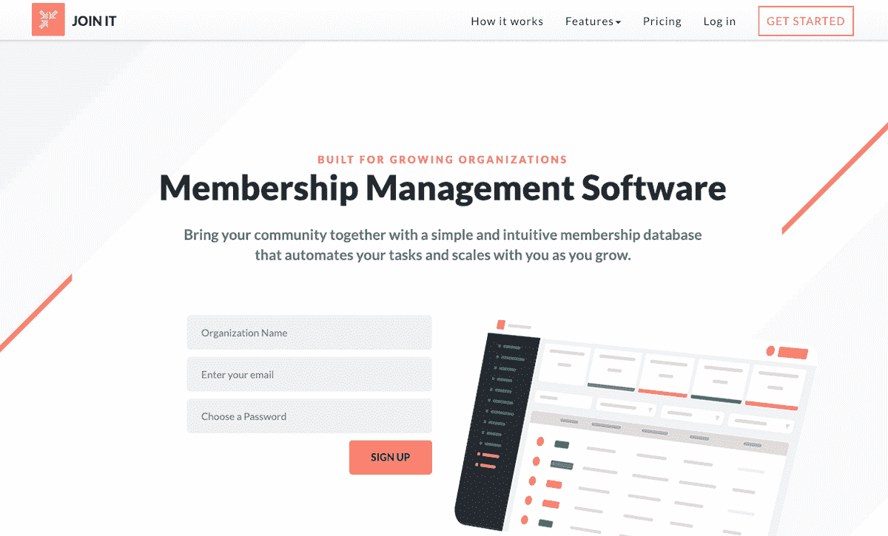
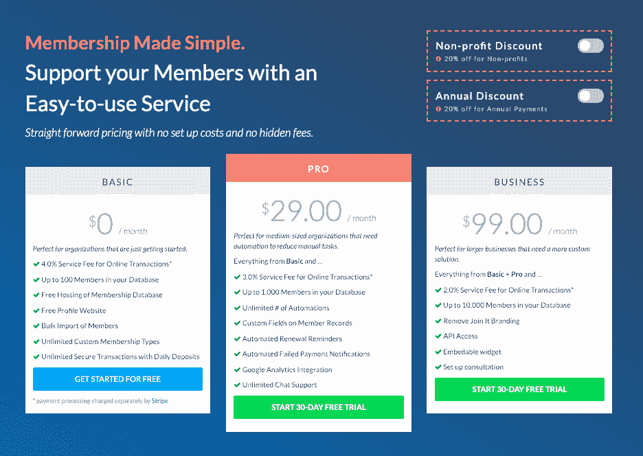
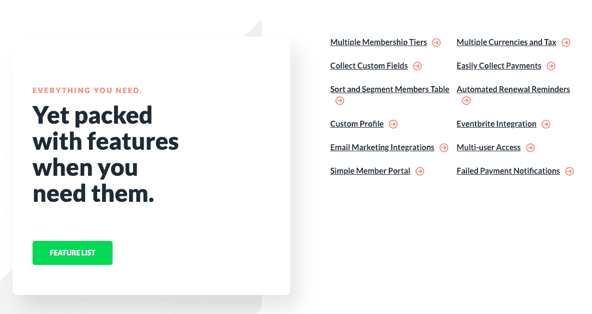

# 我是如何学会编码、辞掉工作并自举解决方案的

> 原文：<https://www.indiehackers.com/interview/how-i-learned-to-code-quit-my-job-and-bootstrapped-a-solution-3d2afa0b80>

## 你好！你的背景是什么，你在做什么？

你好。我的名字是[米奇·科勒兰](https://twitter.com/colleran)，我正在自举[加入它](https://www.joinit.org)，这是一个 SaaS 平台，通过自动化重复任务来帮助组织销售和跟踪他们的会员资格(想象一下我们的典型客户，想象一下需要销售年度会员资格来支持组织的当地戏剧团体或专业协会)。

在加入 It 之前，我在 Eventbrite 度过了美好的六年，在那里，我通过在销售、市场营销以及产品管理团队中的角色获得了广泛的“技术教育”。2016 年底，[我离开开始加入 It](https://medium.com/bootstrap-saas/the-why-behind-join-it-4859bf893a99) ，搬到西班牙三个月，从那以后一直全职做加入 It。

截至 2018 年 12 月，Join It 每月收入 18，000 美元，并且还在增长！

 

## 是什么促使你开始加入它？

在领导 Eventbrite 的 API/开发者平台时，我负责构建与 SaaS 平台(如 MailChimp、SurveyMonkey、WordPress 等)的集成。我们轻松构建了与 SaaS 平台的集成，提供广泛的功能(电子邮件营销、调查、CMS 等)。)但是我接触的每一个“会员管理”平台都拒绝了我，所以我一直在想“这个需要存在。”

当时，我也在自学编码，所以我创建了一个 MVP(重点关注最小的*)并运行了一个小型的 Google AdWords 活动。这使得它很容易推动一些入境交通，并在潜在客户面前。有一次，我让五个顾客放下他们的信用卡开始免费试用，我辞掉了工作，开始全职工作。*

 *## 构建最初的产品需要什么？

以前高中的时候做基本的网站，但是决定开始[加入 It](https://www.joinit.org) 的时候，对开发 web 应用一窍不通。所以我开始在构建最初产品的同时自学如何编码(JavaScript/Node.js)。

我花了大约九个月的时间熬夜和周末，从一无所有变成了一个 MVP，这让我很舒服。这应该会更快，但我仍然是一个初学者软件开发人员，并有一份全职工作。

我做的最好的决定是卖掉我的 MVP，尽管感觉太早了。

TweetShare

在推出 MVP 并全职开发该产品后，又花了三个月的时间，我才从 MVP 变成了可以真正销售的产品，并有信心展示给客户。这是我在西班牙度过的时光。典型的一天是 10 小时构建服务，2 小时直接与客户交谈(电话、聊天或电子邮件)。

移居西班牙有两大好处:

1.  更长的跑道，因为我的钱花得更多了(我的 Airbnb 是我以前在旧金山月租的 1/4)
2.  没有社交干扰，更容易集中注意力

这是一个相当紧张的三个月时间，但它是建立服务的基础。在这个阶段结束时，我终于有了一个我有信心的产品和我们的前 10 个付费客户，所以我觉得是时候专注于发展业务了。

## 你是如何吸引用户并让他们加入进来的？

截至 2018 年 12 月，我们有大约 700 家付费组织加入其中，我们仍处于似乎必须单独争取每一位客户的阶段。

我们的价格点相对较低(我们最受欢迎的计划是每月 29 美元)，在这个价格点上，大多数 SaaS 公司不会通过电话/聊天直接与客户接触，因为在这个客户价值上无利可图。因此，对我们来说，以我们的价格吸引潜在客户是“做不可扩展的事情”的典型例子

如果你假设在 MRR 花 18，000 美元，我们就能获得客户/入职/成功——不会。甚至。关闭！我们仍在努力建立我们的收购渠道。

迄今为止，我们的收购相对均衡地分布在多个渠道:谷歌广告、有机搜索和口碑。

有三个渠道**没有**为我们工作:

1.  付费推荐项目——更多的人来自传统的口头宣传，而不是使用我们的推荐项目
2.  冰冷的电子邮件——根据我们的经验，如果一个人不积极评估，就不可能说服他改变会员制度
3.  社交广告——我们可能会在未来再次尝试，但脸书/Twitter 广告以前曾导致低质量的线索

## 你的商业模式是什么，你是如何增加收入的？

加入 It 的收入有两个组成部分。首先，我们使用标准的 SaaS 模式，并收取订阅费来访问软件。第二，当组织通过平台销售会员资格时，我们还会收取交易服务费(在这种情况下，我们使用 Stripe Connect，这非常容易)。

 

这种双重模式使我们能够将订阅费用保持在尽可能可承受的水平，这使得较小的组织更容易使用该平台，同时从处理较大数量会员销售的组织收取较高的费用。此外，它还协调了我们和客户之间的激励机制(例如，如果我们推出帮助他们销售更多会员资格的工具，或者我们提高他们的结账转化率，我们两个人的口袋里都会有更多的钱)。

去年，我们将价格提高了 50%(对 [@patio11](https://twitter.com/patio11) 大声喊出来)，并没有看到对收购的负面影响。2019 年，我们计划再次提价。我坚信，由于我们不断地给这项服务增加新的功能，它变得越来越有价值，所以，当然，我们应该收取更多的费用。

此外，我们通过永远保留现有客户定价来避免来自客户的任何负面抵制。在 SaaS 的企业中，对现有客户保留旧价格是显而易见的。

| 月 | 收入 |
| --- | --- |
| 2017 年 1 月 | 300 |
| 2017 年 4 月 | 1500 |
| 17 年 11 月 | 6000 |
| 2018 年 7 月 | 12000 |
| 2018 年 12 月 | 18000 |

## 你未来的目标是什么？

我们的客户一致肯定我们已经达到了产品-市场匹配，但我认为我们仍在寻找我们理想的商业模式-市场匹配。

正如我提到的，我们将改变定价，目标是对使用我们平台的大型组织收取更多费用。通过提高客户的平均价值，我们将能够在客户支持和客户成功方面投入更多，并实现更快的增长。然而，即使按照我们目前的增长率，我们今年也不得不招人。因此，带来第一位非创始人的全职员工绝对是我很高兴在 2019 年跨越的里程碑。

然而，更广泛地说，我的目标是建立一个可持续发展的公司，在未来的 25 年里。我玩得很开心，感觉我们才刚刚开始。:)

 

## 你面临的最大挑战和克服的障碍是什么？如果你必须重新开始，你会做什么不同的事？

作为白手起家的创始人创业时，人们关注的焦点是缺乏资金，但让我措手不及的挑战之一是这种感觉有多孤独。

没有投资者，就没有多少人可以和我们一起检查，让我们负责。没有投资者，你组建团队的速度会很慢，所以在很长一段时间里只有你一个人。

让我措手不及的一个挑战是，作为一名白手起家的创始人，感觉有多孤独。

TweetShare

在我较弱的时候，我考虑过进行小规模融资，只是为了建立一个外部顾问/导师网络，他们对我们的成功有既得利益。相反，我一直在接触处于类似位置的其他人，我 2019 年的目标是更加积极主动地会见 SaaS 中小型公司的其他创始人/首席执行官/高管(如果是你，[让我们连线](https://twitter.com/colleran)！).

## 有没有发现什么特别有帮助或者有优势的？

关于在 2019 年建设一个 SaaS 的最好的事情之一是剧本已经写好了，很容易在网上发现！说真的，如果你有任何关于*或* SaaS 的问题，你通常可以通过谷歌搜索找到。

此外，Twitter 上有一群了不起的 SaaS 创始人/高管正在透明地建设他们的公司。追随这些人在构建 Join It 时产生了难以置信的影响:

*   来自 Buffer 的乔尔·加斯科因
*   来自扎皮尔的韦德·福斯特和迈克·努普
*   来自 KnowYourTeam 的克莱尔·卢
*   来自 ConvertKit 的内森·巴里
*   帕特里克·麦肯齐来自 Stripe
*   来自 Eventbrite 的 Julia Hartz
*   来自斯赫德的泰勒·麦克奈特
*   来自 CloudPeeps 的凯特·肯德尔
*   来自萨斯特尔的杰森·莱姆金

最后，我向所有聆听的人歌颂 Stripe。我们通过 Stripe Atlas 组建公司，通过 Stripe Billing 销售订阅，并通过 Stripe Connect 收取服务费。我坚信，如果没有 Stripe 的这些工具，我就不可能构建 Join It。

## 对于刚刚起步的独立黑客，你有什么建议？

**“运吧。现在。是的，现在！”**

我做的最好的决定是卖掉我的 MVP，尽管感觉太早了。航运给我带来了大量有用的反馈和批评(还有一点点肯定)。

尽早发货违背了大多数人的本能。在你的脑海中，你认为这个服务只需要多一些功能或者多一点修饰。但是你必须忽略这些本能，把你的产品推出去。这是唯一的办法。

即使在今天，当我在开发一个新功能、考虑价格变化或撰写电子邮件宣传活动时，我也必须提醒自己遵循这条建议。

当我这样做的时候，我总是很高兴。

## 我们可以去哪里了解更多？

如果你有兴趣聊更多关于 SaaS、创业或非营利组织的话题，那么一定要在 Twitter 上滑入我的 DMs:[@ Colleran](https://twitter.com/colleran)。

要了解更多关于加入它，请查看我们:[https://www.joinit.org](https://www.joinit.org)。

此外，我会在下面的评论中，所以如果你想知道更多，请在这里提出问题！

——[<picture id="ember5265560" class="user-avatar ember-view user-link__avatar"></picture>米奇科伦](/colleran?id=Ziy3TUbsJYal1Lw8j96gURBM56l2)，加入它的创始人

## 想建立自己的事业吗？

你应该加入[独立黑客社区](/)！🤗

我们是几千名创始人，互相帮助建立有利可图的业务和副业。来分享你正在做的事情，并从你的同事那里获得反馈。

还没准备好开始使用你的产品吗？没问题。这个社区是一个认识人、学习和实践的好地方。随意[随便浏览](/)！

——[<picture id="ember5265565" class="user-avatar ember-view user-link__avatar"></picture>考特兰艾伦](/csallen?id=ibTLPyjwVebnZjMGKvz6ztarnuV2)，独立黑客创始人

78votes*