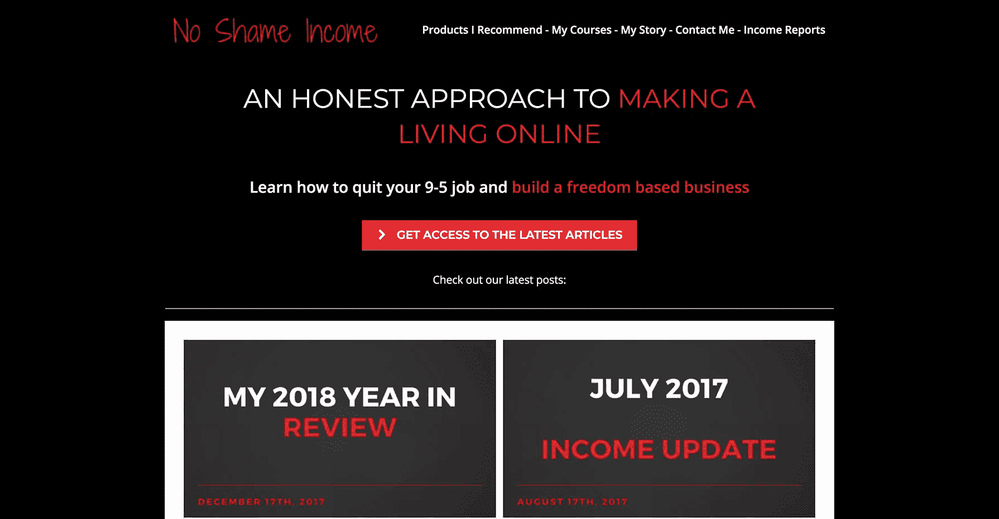
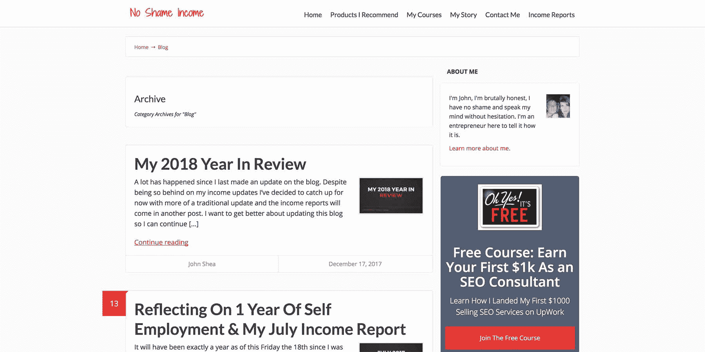
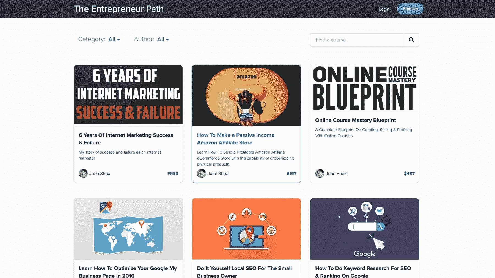

# 我如何利用合作关系来建立我的在线课程受众

> 原文：<https://www.indiehackers.com/interview/how-i-leveraged-partnerships-to-build-my-online-course-audience-010522f628>

## 你好！你的背景是什么，你在做什么？

我的名字是约翰·希亚。我经营着一个名为“无羞耻收入”的在线博客。大约在 2012 年，我在脸书看到有人谈论用博客在线赚钱后，开始涉足在线营销领域。

我被在互联网上赚钱的想法所驱使，并决心*把它搞清楚*。

我花了几年时间[从一件事跳到另一件事](http://www.noshameincome.com/blog/becoming-an-essentialist-6-years-of-internet-marketing-success-failure/)尝试各种各样的事情来在网上获得成功。我花了几年时间才明白，我不会通过不断购买别人的产品来赚钱。

我意识到似乎每个在网上赚钱的人都在卖东西。

我的[无羞耻收入](http://www.noshameincome.com)博客目前是我的**大本营**，人们可以在那里了解我正在从事的在线谋生工作。

收入来源之一是销售在线课程和创造有助于解决具体问题的产品，尽管我也与当地企业合作，帮助他们提供营销服务，如搜索引擎优化或网页设计。

 

## 是什么激励你开始无耻感收入？

在我做网络营销的第一年，我用自己的名字写了一个糟糕的博客来发布内容。我最终在 VoicesOfMarketing.com 开了一个播客，做了大约两年。

在经历了一段艰难的时间从我的播客中赚钱并最终不想再继续下去之后，我决定用一个更大胆的名字开始一个新的博客。

我从中学就认识的一个朋友总是声称我没有羞耻心——想想电视节目《无耻之徒》中的弗兰克。

我通常不会在网上给人留下这样的印象，但在我的私人生活中，我对每个人都非常诚实。正因为如此，我通常被认为是一个非常直率诚实的人，他似乎不太在乎我说什么或做什么。

如果我一个月赚了 10，000 美元，下个月赚了 2，000 美元，我不想害怕与人分享。

TweetShare

我认为在线空间可以使用这一点。我厌倦了看到所有的销售页面都是关于*多么棒的*产品的精彩推荐，而事实上外面有很多东西都是垃圾。

没有人愿意承认这一点，所以我认为我的 **[无羞耻收入博客](http://www.noshameincome.com)** 将是一个在网上诚实讲述我的成功和失败的好方法。

你真的看不到人们作为网络企业家所经历的真正的挣扎和沮丧。人们往往要么获得巨大的成功，要么根本没有成功。

我想通过我的博客展示真实的自己，分享好的和坏的:如果我一个月赚了 10，000 美元，下个月赚了 2，000 美元，我不想害怕与人分享。

## 是什么让你走到了今天？

作为一名企业家，我经历了很多起起落落。我在课程和项目上花了数千美元，有时是指导，结果好坏参半。

我不断地发现自己在证明为什么*购买下一个课程会是答案。*

我相信我必须做出的最大的改变**今天仍然在努力**，那就是**我必须改变我如何接近成功的心态**。

购买一个产品，采取一些行动，然后很快**放弃**是很常见的，因为你没有足够快地得到结果。我一直在寻找一种更好的方式，而事实上你在这个领域所做的一切都需要时间。

有些东西可能比其他东西更好，但最终我只想找到这样的东西:

*   我喜欢从事
*   实际上让我赚了钱
*   会被认为是真正的商业模式，而不是从现在起一个月内有效的方法

我的第一次突破是在 2014 年，当时我正在做一个名为[SkullClothing.net](http://www.SkullClothing.net)的关于头骨相关服装和配饰的利基网站

一个周四，在我的日常工作中，我有了这样的认识，我可以创建一个课程，讲述我是如何建立这个网站的，以及我采取了哪些步骤来做到这一点。

你真的看不到人们作为网络企业家所经历的真正的挣扎和沮丧。

TweetShare

那天我制定了教学大纲，到那个周末的周日，我已经完成了整个六周的课程。

我在一个名为 Udemy 的平台上发布了课程，在这个平台上，在线课程在市场上出售。

这发生在 2014 年 11 月初，所以在黑色星期五是一年中最重要的时候，我通过他们的市场赚了超过**850**美元，而没有从课程中得到*任何我自己的营销*。

我被迷住了，并决定继续学习课程。今天，我在 Udemy 上有超过 40 门课程和超过 70，000 名学生。

这不是一朝一夕的任务，但创建在线课程是我越来越热衷于做的事情。

今天，我从 Udemy 赚了 36，000 多美元，在 [Skillshare](http://www.noshameincome.com/skillshare) 赚了 20，000 多美元，还通过自己的网站卖了 30，000 多美元。

## 你是如何吸引用户并增加收入的？

第一年，我在博客上没做什么。我一直觉得我不太擅长创造流量，老实说，我现在仍然有这种感觉。

大多数访问者都来自我的电子邮件列表，这是我根据**产品和课程销售**建立的。我也为我的网站写了很多产品评论。这让我可以在谷歌上对一些文章进行排名，并从中获得每月的流量。

由于我的博客本身并不是增加我的读者的主要组成部分，我将分享对我有用的东西:

 

**合作伙伴**

我发现，寻找合适的合作伙伴对于建立电子邮件列表、推出产品和网上创收来说都是巨大的**。**

一个例子是我如何创建了一门课程，分享我是如何通过 Udemy 和 Skillshare 取得所有成功的。

几年前，在做我的播客时，我遇到了我现在的老朋友迈克·托马斯，他主持一个名为[缅因州](http://www.mikefrommaine.com)迈克的访谈节目。他几乎每天都采访产品创作者，并作为会员推广他们的产品。

我带着我的想法找到了迈克，向他展示了我在课程上取得的成功，所以我们决定把它包装起来，作为一个产品来销售。

分享这样做的所有细节本身就是另一门课程，但一般的方法是:

*   我创造内容和课程
*   Mike 接触了知名的联盟营销商进行推广
*   Mike 的合作伙伴 Brett 帮助创建了销售页面和销售文案，以及促销视频

在我女朋友的帮助下，我们推出了[视频课程现金包](http://videocoursecashkit.com/)(*她证明了自己是一个完全的新手，参加了这个课程并取得了销售*)整个发布活动赚了 **$58，000** ，由迈克、布雷特和我三人分享。

由此，我们有了 1000 多名买家，我可以将他们添加到我的电子邮件列表中，并在我认为合适的时候推广更多产品。

寻找合作伙伴的一个很好的地方就是在网络营销论坛上四处寻找。

我也强烈建议用个人视频来接近人们，介绍自己。通过这样做，你会从所有人中脱颖而出。

## 你的商业模式是什么，你是如何增加收入的？

当人们问我这个问题时，我只是告诉他们“我创建并销售在线课程”

 

尽管在过去的一年里投入了大量的精力，我一直在努力通过我自己的网站做到这一点，但我仍在学习，我不会放弃。

一般来说，我赚钱的其他方式是作为代销商推广其他产品，或者与企业进行本地营销，帮助它们在谷歌上排名。这两者都很赚钱，但最终我的热情还是在创造和销售课程上。

现在，我正在使用积极活动和点击漏斗的组合来划分我的电子邮件列表，让人们对我的教学感兴趣，然后向他们销售他们可以获得成功的高端产品。

我目前的主要工作是销售一门关于如何开始 SEO 咨询业务的课程。

这些年来，我在网上获得丰厚收入的另一种方式是创建网站和帮助企业进行 SEO。我兼职做这项工作已经赚了超过 50k 美元，这是建立一个真正的企业的最好方式之一。

你可以看看我的[深度文章](http://www.noshameincome.com/7-steps-to-starting-growing-an-seo-consulting-business#)，关于我现在如何与我合作的客户一起处理这种模式。

今天，我在[的任何地方都可以挣到 5000-10000 美元/月](http://www.noshameincome.com/income-report-chart/)，这是两种模式的结合。

## 你未来的目标是什么？

现在我最大的目标是**还清我的房子**。在我的世界里，这有点像我的最终目标，所以我可以有更多的自由用我的钱去冒险。很简单，我计划通过与更多客户合作和销售更多课程来实现这一目标。

最终，对我来说，这不是钱的问题，而是能够在我想做的时候做我想做的事情。

## 你面临的最大挑战和克服的障碍是什么？

可能对我来说，它一直是焦点。这是一个人们经常告诉我需要改进的地方:试图同时做太多的事情，但从来没有真正成为一个特定事情的大师。

这一直是一个挑战，所有新的闪亮的物体，课程，和潜在的网上赚钱的方式。

在这篇文章中，我分享了我个人故事的一个更长的版本，以及这些年来我所面临的所有挣扎。

这是一本很长的书(*几乎就像一本很短的书，但你会从我多年的错误中学到我是如何走到今天的位置的。*

如果我以不同的方式做事，我会更快地开始教别人我擅长的东西，并专注于在那个领域变得真正优秀。

## 有没有发现什么特别有帮助或者有优势的？

我使用一个叫做 [Nozbe](http://www.nozbe.com) 的待办平台来跟踪我的日常目标，并让自己对正在做的事情负责。

当我进行为期 30 天的学科挑战时，我也取得了巨大的成功，完成了更多的工作。你可以在这里跟随我的旅程。

## 对于刚刚起步的独立黑客，你有什么建议？

我只留下我最喜欢的两个技巧。

1.  **专注**:挑一件事，坚持下去。确保这是一个真正的商业模式，并且是你喜欢长期做的事情。
2.  心态:意识到成就伟大事业的潜力就在那里，并努力去实现它。高度重视你自己和你所提供的东西，不要害怕去追求它。相信自己，你会成功的。

## 我们可以去哪里了解更多？

你可以去我的博客[无羞耻收入](http://www.noshameincome.com)或者在[脸书](https://www.facebook.com/Aehs01)上找到我。

如果你想了解更多关于我的客户 SEO 成功的信息，一定要抓住[我的电子书](http://www.noshameincome.com/plan)关于我如何获得我的第一个客户。

—[<picture id="ember5331359" class="user-avatar ember-view user-link__avatar"></picture>aehs 01](/aehs01?id=fc4uTYaruSToRIdnDYeZiey6xLb2)【无耻所得】方正

## 想建立自己的事业像没有羞耻的收入？

你应该加入[独立黑客社区](/)！🤗

我们是几千名创始人，互相帮助建立有利可图的业务和副业。来分享你正在做的事情，并从你的同事那里获得反馈。

还没准备好开始使用你的产品吗？没问题。这个社区是一个认识人、学习和实践的好地方。随意[随便浏览](/)！

——[<picture id="ember5331364" class="user-avatar ember-view user-link__avatar"></picture>考特兰艾伦](/csallen?id=ibTLPyjwVebnZjMGKvz6ztarnuV2)，独立黑客创始人

5votes