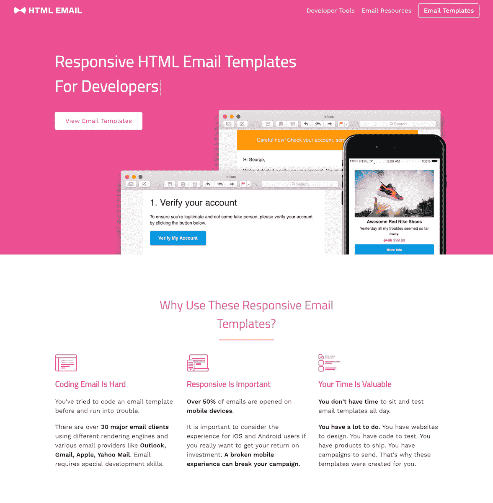
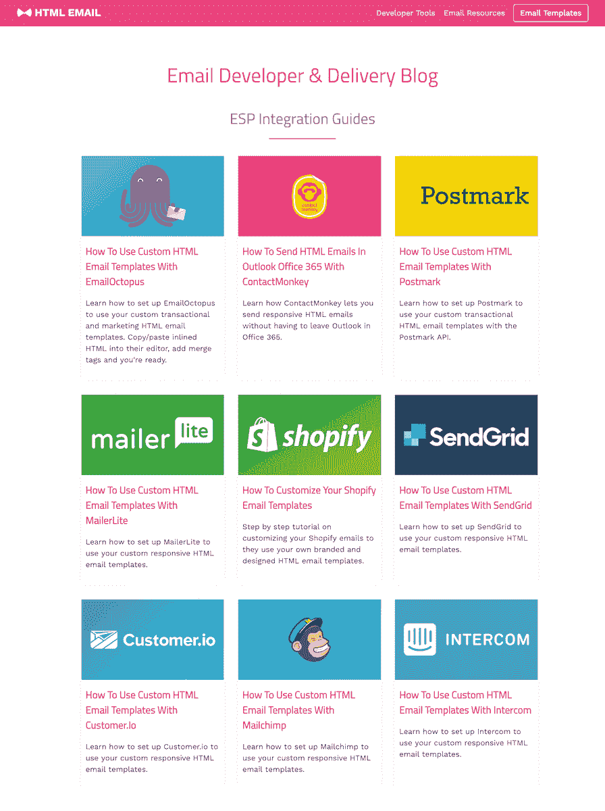
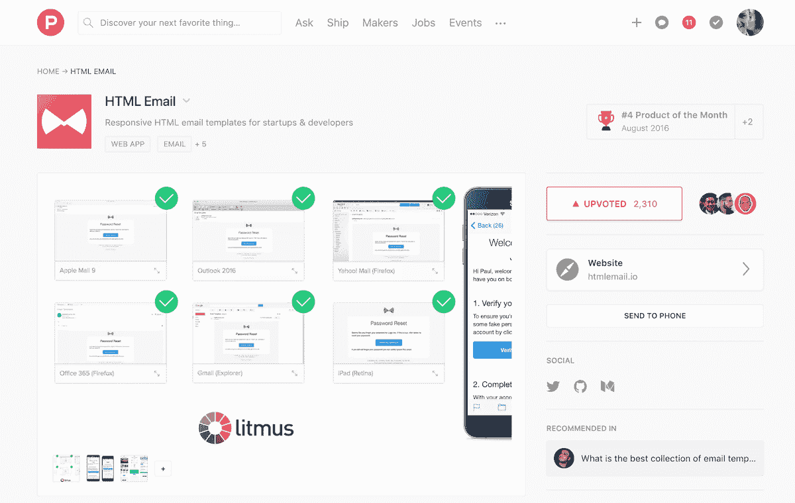
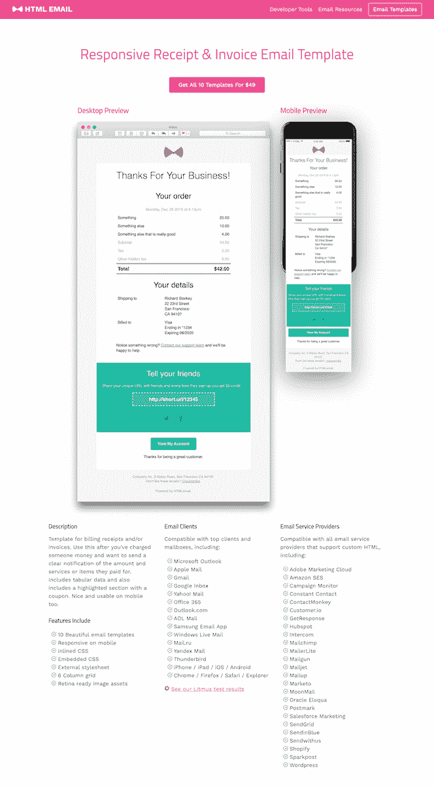

# 我如何注意到差距，建立解决方案，并把它作为我的副业

> 原文：<https://www.indiehackers.com/interview/how-i-noticed-a-gap-built-a-solution-and-made-it-my-side-gig-ec43f144b5>

## 你好！你的背景是什么，你在做什么？

嗨，我是李·门罗，来自北爱尔兰的设计师和开发人员，现在在旧金山工作。我与几家专注于开发开发工具的公司合作过，目前我是 OneSignal 的设计总监。

[HTML 电子邮件](https://htmlemail.io/)向初创公司和开发者出售电子邮件模板。这是一套 10 个电子邮件模板，反应灵敏，外观专业，随时可用。如果你正在构建一个新的应用程序，并且需要一些好看的模板，你可以使用这些。

10 个模板的标准许可费为 49 美元，扩展许可费为 299 美元。这家企业每月盈利 1700 美元。

 

## 是什么促使你开始使用 HTML 电子邮件？

我在 Rackspace 与 Mailgun 一起工作，我们为开发人员发送和接收电子邮件提供基础设施和 API。虽然我们解决了发送和接收电子邮件的问题，但显而易见的是，开发人员真的不喜欢为电子邮件编写 HTML。有太多的电子邮件客户端需要测试，而且这些客户端呈现 HTML 的方式都略有不同。开发人员有比处理跨电子邮件客户端测试 HTML 更有趣的问题要解决。

不要试图预先完成太多的事情，专注于一些小事情。

TweetShare

我开始写经验教训以及我如何[开发 HTML 电子邮件](https://www.leemunroe.com/email-design-workflow/)。然后我[开源了一些基本的模板和我用来创建电子邮件的简单工作流程。这些 GitHub 回购和博客帖子在 GitHub 上获得了大量的流量和兴趣，因此这是验证兴趣和需求的一个好方法。](https://github.com/leemunroe/)

## 构建最初的产品需要什么？

我开源了一个[框架](https://github.com/leemunroe/grunt-email-workflow)，开发者可以用它来启动和运行，但是开箱即用的东西非常简单。所以我花了几个月的时间，每隔一个周末工作几个小时，添加润饰并做测试，我认为这是销售这样一个强大产品所必需的。在电子邮件客户端中，花了很多时间来测试 HTML。

创建营销网站非常简单。我使用 Jekyll 启动了一个简单的页面。最初在 GitHub 页面上，我最终把它移到了 [Netlify](https://www.netlify.com/) 。

电子商务和支付处理通过 [Gumroad](https://gumroad.com/) 完成。他们的价格非常合理，并为您处理条纹和支付过程。我使用 Google Analytics 来跟踪人们来自哪里，什么渠道转化得最好，等等。

从营销策略的角度，我开始在自己的博客上写相关内容，并交叉发布到 Medium、LinkedIn 等渠道。然后，我用 Mailchimp 建立了一个订阅者列表，并把这个列表作为一份每周时事通讯发送出去，上面有三个有用的设计链接，以吸引他们。

随着时间的推移，我用[对讲机](https://www.intercom.com/)添加了更多的营销自动化功能，用于滴滴活动的[缓冲器](https://buffer.com/)帮助自动化我们的社交存在，[扎皮尔](https://zapier.com/)负责一些任务。

我还创建了一些其他工具，如 [CSS inliner](https://htmlemail.io/inline/) 来帮助保留，以及[设计系统](https://htmlemail.io/design-system/)来吸引设计师并帮助弥合设计和开发之间的差距。

 

## 你是如何吸引用户和发展 HTML 电子邮件的？

在发布之前，我有一份每周简讯，大约有 2000 名订户。多年来，我通过我的个人博客[建立了简讯列表。简讯每周会分享三到四个有用的设计链接。我用 Mailchimp 做列表。](https://leemunroe.com/blog/)

临近发布时，我开始在 [Dribbble](https://dribbble.com/shots/2881149-Responsive-HTML-Email-Templates) 和 [Twitter](https://twitter.com/leemunroe/status/762959290957201409) 上调侃一些预览，并发布了一个登陆页面，收集感兴趣者的电子邮件。这帮助我通过早期试运行和折扣代码锁定了这些人。

我也非常依赖一些行业专家。在发布之前，我确保向一些联系人提供模板的免费预览，征求他们的反馈，在某些情况下，还会要求我在登录页面上引用。由于他们的参与，到了发布日，他们更倾向于分享或转发，这有很大的帮助。

 

发布后，HTML 电子邮件被提交给[产品搜索](https://www.producthunt.com/posts/html-email)，我非常幸运地成为了当天的最佳产品。最初的流量提升真的有助于推荐和最初的销售高峰，这反过来又激励我在上面花更多的时间。

自发布以来，我们开展了一些重新参与活动。我们提供一些免费工具，包括一个基本的电子邮件模板、一个设计系统和一个 CSS 内嵌器。这些工具中的每一个都会在某个时候收集一个电子邮件地址，我们用它来开展点滴活动和发布每月简讯。我混合使用 Gumroad、Mailchimp、Zapier、Buffer 和 Intercom 来实现大部分营销自动化和重新参与。

## 你的商业模式是什么，你是如何增加收入的？

我们出售一套电子邮件模板。这是一项交易销售，而不是每月订阅。单一许可证 49 美元，无限许可证 299 美元。

当我推出 htmlemail.io 时，我们从第一天就开始收费。然而，多年来我一直在开源 HTML 模板并撰写最佳实践。我确实担心人们是否会为这些付费，因为很多东西都是免费的。如果你看看产品搜索或黑客新闻上的一些评论，你会发现其他人也有同感。在一天结束时，是的，有免费的电子邮件模板(其中一些是我创建的)，你可以使用它们，也可以付费购买这套，我认为它在完善性、健壮性和易用性方面做了额外的努力。

| 月 | 收入 |
| --- | --- |
| 2018 年 6 月 | 1465 |
| 2018 年 7 月 | 2368 |
| 2018 年 8 月 | 1410 |
| 18 年 9 月 | 1759 |
| 18 年 10 月 | 1627 |
| 18 年 11 月 | 2031 |

如今，我们每个月能赚 1500-2000 美元。付款由 Gumroad 处理，gum road 在引擎盖下使用 Stripe。

收入保持相当稳定。因为这些是一次性购买，所以订阅量不会逐月增长。当我们推出时，推荐和产品搜索等网站出现了高峰。自从发布以来，由于我们的博客和我在其他网站上写的[嘉宾帖子](https://www.smashingmagazine.com/2017/01/introduction-building-sending-html-email-for-web-developers/)，有机 SEO 成为了销售的主要渠道。

生意非常清淡。我正在使用一些低成本或免费的工具:

*   [Netlify](https://www.netlify.com/)
*   [Gumroad](https://gumroad.com/)
*   [对讲机](https://www.intercom.com/)
*   [Mailchimp](https://mailchimp.com/)
*   [扎皮尔](https://zapier.com/)
*   [缓冲器](https://buffer.com/)
*   [GitHub](https://github.com/leemunroe/)
*   [谷歌分析](https://analytics.google.com/analytics/web/)

## 你未来的目标是什么？

目前，我们专注于销售电子邮件模板，但我们也为电子邮件开发者提供其他工具，包括草图设计系统、CSS inliner 和测试电子邮件发送工具。我将这项业务视为电子邮件开发者的资源，而不仅仅是电子邮件模板。

从商业角度来看，我希望提供订阅服务，这样我们的客户就不会来了又走。就产品而言，我们现在有很多开发人员，我认为一些有趣的功能值得一看，包括优化端到端电子邮件开发工作流程或查看更高级的电子邮件功能，如交互式电子邮件组件。

 

## 你面临的最大挑战和克服的障碍是什么？如果你必须重新开始，你会做什么不同的事？

当我决定扩展网站并增加一个内容营销的博客时，我发现写内容是一件非常痛苦的事情。我试着雇佣一些自由撰稿人，但是质量并不总是很好，而且可能很贵。这仍是我努力改进的地方。我发现让其他电子邮件公司来写客座博文效果很好，因为内容是免费的，质量也很好，我们双方都受益。您现在可以看到，我们为开发人员提供了很多关于 [ESP 集成的内容。](https://htmlemail.io/blog/)

回想起来，我最初的计划是写并自己出版一本关于电子邮件开发的书，并和模板一起出售。虽然我很喜欢写博客，但写书比我想象的更有挑战性。谢天谢地，我最终决定把重点放在模板上，并使用我所拥有的。我在这里的建议是不要试图预先完成太多，专注于一些小事情。当然，我还没有写那本书。

## 有没有发现什么特别有帮助或者有优势的？

内森·巴里的书《T2 权威》给了我很大的灵感。内森是 [ConvertKit](https://convertkit.com/) 的创始人兼首席执行官。他有很多运输和销售产品的经验。他关于在发布产品之前开始营销工作的建议，比如建立电子邮件列表和写博客帖子，对我如何推出 HTML 电子邮件很有帮助。

在发布之前，我没有考虑的是许可。有人给我发消息说，他正在为他的代理购买模板，并想知道许可是如何工作的。这促使我创建了一个 299 美元的高端许可证，代理机构和大公司可以在多个项目或客户中使用。

## 我们可以去哪里了解更多？

您可以在这里找到我们的[电子邮件模板](https://htmlemail.io)并在 Twitter @leemunroe 上关注[我。](https://twitter.com/leemunroe)

我很乐意回答任何关于附带项目、电子邮件开发的问题，或者今天听听你的电子邮件开发工作流程，看看我是否能帮助改进它。

—[<picture id="ember5222849" class="user-avatar ember-view user-link__avatar"></picture>李门罗](/leemunroe?id=JoTex8LbraSPOYG9N9cDgsQGsBy1)，HTML 电子邮件创始人

## 想像 HTML 邮件一样建立自己的事业？

你应该加入独立黑客社区！🤗

我们是几千名创始人，互相帮助建立有利可图的业务和副业。来分享你正在做的事情，并从你的同事那里获得反馈。

还没准备好开始使用你的产品吗？没问题。这个社区是一个认识人、学习和实践的好地方。随意[随便浏览](/)！

——[<picture id="ember5222854" class="user-avatar ember-view user-link__avatar"></picture>柯特兰艾伦](/csallen?id=ibTLPyjwVebnZjMGKvz6ztarnuV2)，独立黑客创始人

64votes