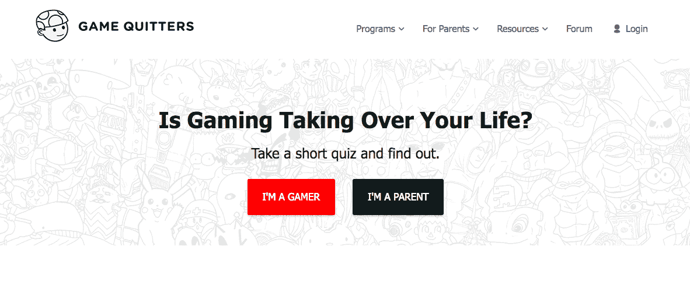
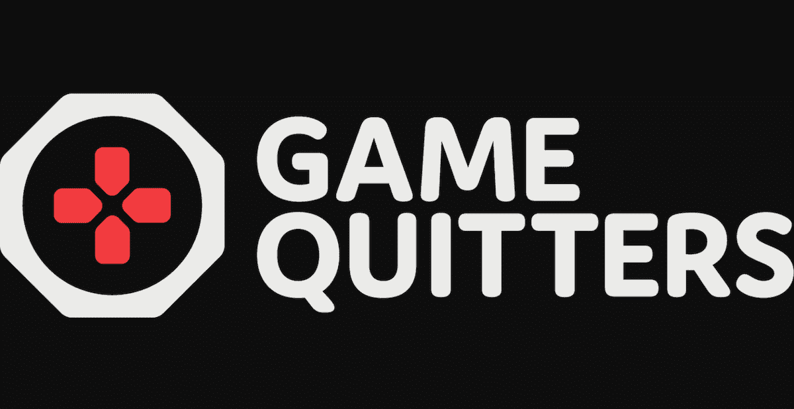
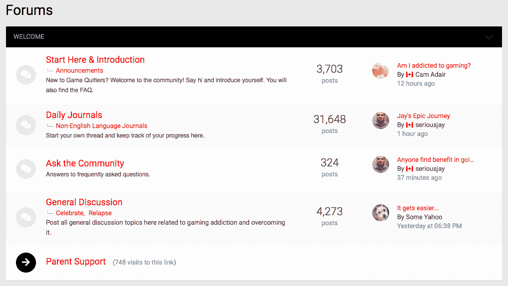

# 我如何克服我的游戏瘾，并建立一个帮助他人的企业

> 原文：<https://www.indiehackers.com/interview/how-i-overcame-my-gaming-addiction-and-built-a-business-to-help-others-56eaf03900>

## 你好！你的背景是什么，你在做什么？

我叫卡姆·王茂林，我是一名高中辍学生，来自加拿大卡尔加里，后来成为了一名社会企业家。2015 年，我创建了[游戏退出者](http://gamequitters.com/)，如今，它是最大的在线支持社区，帮助那些与视频游戏成瘾作斗争的人。

我们目前为 92 个国家的约 50，000 人提供服务，每月收入约为 6，000 美元。

 

## 是什么促使你开始接触游戏退出者？

游戏退出者始于我个人与电子游戏成瘾作斗争的经历。在八年级面临激烈的欺凌后，游戏成了我逃避的一种方式，最终导致我从高中辍学。我没有毕业，当我所有的朋友都去上大学的时候，我却住在父母的地下室里，每天打 16 个小时的电子游戏。

我超级抑郁，焦虑，甚至假装有工作欺骗了父母。尽管游戏让我得以逃避，但它并没有解决我的任何问题，我的抑郁症越来越严重，最终在一个特别糟糕的夜晚写了一封遗书。就在这个晚上，我意识到我需要做出改变，而这种改变是从退出游戏开始的。

几年后，我故态复萌，从两年不玩游戏变成连续五个月每天玩 16 个小时。这一切都是在一夜之间发生的，这让我产生了疑问——这些电子游戏到底吸引了我什么？我是如何从两年不玩游戏变成一天玩 16 个小时的？为什么我这么想玩？我意识到我玩游戏有特定的原因，不仅仅是因为“游戏很有趣”

我想我不是唯一一个在这个问题上挣扎的人，我很好奇像我这样的人能得到什么样的帮助。我谷歌了一下“如何戒掉玩电子游戏”，发现的建议都是扯淡。当我玩游戏的全部原因是为了避免学习时，我被告知“多学习”，或者“和你的朋友出去玩”，当我所有的朋友都是游戏玩家时，我就和他们一起玩视频游戏。

这就是你在 WikiHow 上所期待的那种建议，在 WikiHow 上，某个不了解某个特定主题的人被分配了一个任务，写一篇关于该主题的文章，因为这对他们的 SEO(以及广告收入)有好处。寻求帮助的人这样做是因为他们真的需要帮助，当他们读到让他们感到羞耻、减少他们的问题、全力以赴不起作用的建议时，他们就不会继续寻求更多的帮助。

这种缺乏有意义的帮助让我很恼火，所以我决定写一篇咆哮，讲述我的个人故事，并在一篇名为[如何永远戒掉玩视频游戏](http://kingpinlifestyle.com/how-to-quit-playing-video-games)的博客中分享我在康复过程中所学到的东西。这是一个真正的想要退出的铁杆游戏玩家的建议。实际上是建议起了作用。

这篇博客帖子迅速走红，我开始收到成千上万和我一样的人的来信。这些人年仅 10 岁、11 岁和 12 岁，他们阅读了一篇长达 6 页的长篇大论，并在一篇 1000 字的短文中分享了他们的生活故事，并说“我也是”我还听到了年龄在 56 岁和 56 岁之间的人的声音。

我会回复我收到的每一条评论和邮件，但是我从来没有发起过任何其他的东西。两年后，我受邀在 ted 大会上讲述我的故事，我的 TEDx 演讲也获得了巨大的反响。今天它已经有超过 30 万的浏览量。

最后，又过了两年，没有任何组织、政府机构或非营利组织介入解决这个问题，我决定我需要做更多的事情。我觉得有责任为人们提供更好的资源和工具，所以我推出了游戏退出者，并且从未回头。

 

## 构建最初的产品需要什么？

起初，我的计划只是为人们提供一个见面和互动的空间，并录制最常见问题的视频，以节省我回复所有电子邮件和评论的时间。

我计划成立一个脸书小组，但是在询问了社区之后，他们想要一个论坛，所以我同意了，尽管不太情愿。我的不情愿来自于这样一个事实:论坛需要节制，在开始时需要更多的投资——没有人喜欢一个死气沉沉的论坛。在最初的两年里，我回复了每一个帖子，虽然我在论坛上不再那么活跃了，但我最近总共发了 7000 个帖子。

我在一个很好的位置上全力以赴这个想法，因为我刚刚花了两年时间来考虑关闭我以前的业务后的下一步——一家个人发展公司，在那里我学到了一些在线营销和商业技能。我从那家公司存了大约 80，000 美元来资助一段时间内退出游戏的人。

更重要的是，我在过去的两年里四处旅行，参加研讨会，建立了一个难以置信的朋友和导师网络。我已经准备好成为这个社区的领袖，我相信这远比了解商业策略或营销更重要。

一家企业与其说是关于你需要做什么，不如说是关于你需要成为什么样的领导者，以实现你的愿景。

TweetShare

根据我从以前的生意中学到的经验，我想让放弃游戏的人保持苗条。我从一个 [YouTube 频道](http://gamequitte.rs/watchgq)开始制作视频，回答常见问题。我把它们发布到了 [StopGaming](http://reddit.com/r/stopgaming) reddit 社区，并尽可能多地与那里的人们互动。起初,[GameQuitters.com](http://gamequitters.com)只是一个简单的登陆页面，有一个电子邮件选择，最终变成了一个基于 Wordpress 的完整网站。

一天，一个朋友发信息给我，问我是否想和他一起购买一门名为《漏斗蓝图》的在线课程，作者是瑞安·戴斯，我说可以。我过去也做过类似的程序，但从未真正付诸行动，所以这次我给自己定了一个规则。为了观看下一个视频，我必须完成上一个视频的作业。回过头来看，这很重要，因为它迫使我一次一个地实际构建我的产品，而不是学习所有的信息却从不应用。

同样，为了保持一切简单并随着时间的推移而改进，我建立了一个名为 [60+新爱好想法](http://gamequitters.com/hobby-ideas)的线索磁铁，它回答了我每天收到的首要问题:“退出游戏后，你会怎么打发时间？”我在谷歌上搜索了像“活动想法”和“爱好想法”这样的短语，并把它们编辑成一个简单的可下载的 PDF。

下一步是制作一本简单的电子书，上面有我推荐的戒烟的主要步骤，我称之为“[重生](http://gamequitters.com/respawn)，售价 7 美元。今天，它仍然是我们的基础项目，但是这些年来，我通过视频、额外的技巧、资源、额外的采访和品牌设计对它进行了改进。你可以花 27 美元买到电子书，或者花 47 美元买到视频课程——这是视频游戏的平均价格。起初我使用 LeadPages，但现在我使用一堆 Wordpress、ConvertKit 和 Wishlist Member。

## 你是如何吸引用户和成长游戏退出者的？

我们从来没有一个官方的网站“发布”,而是专注于尽快在网上获得有价值的资源。我们知道，我们越早开始构建社区，我们就能获得越多的动力，发展得越快。

谢天谢地，在网站上线之前，我们已经做了一些基础工作，通过[我的病毒式文章](http://kingpinlifestyle.com/how-to-quit-playing-video-games/)，它在谷歌上因“如何戒掉玩电子游戏”而排名第一，我的 TEDx 演讲，以及 reddit 上已建立的 StopGaming 社区。为了抓住我们的初始用户，我们尽可能地利用这些资产。我在我的文章中添加了额外的链接，并在文章底部添加了一个行动号召按钮，返回 GameQuitters.com。

YouTube 是我们内容营销的主要来源。我们承诺每周发布一个新视频(最终每周两个视频)，并在 reddit 上分享。这些视频在描述中有链接，可以让用户回到我们的网站，我会回复我收到的每一条评论，这对想要成为社区一员的人有很大的影响。当我回应时，我经常听到他们的惊讶，分享他们不知道其他 YouTubers 用户会像我一样回应。我还回复了对我的 TEDx 演讲的每一条评论，这样观看它的人就会回到我们的频道。

为了建立这个社区，我们推出了一个免费的[论坛](http://forum.gamequitters.com)，在这里人们可以写日志并与志同道合的同龄人互动。虽然 reddit 社区很受欢迎，但 reddit 网站本身缺乏某些功能，例如用户可以拥有自己的主题(即自己的日志)，可以随时更新。我们没有试图与 reddit 社区竞争，而是将论坛定位为它的补充。今天，我们有超过 30，000 名世界各地的瘾君子分享他们的经历！

一致性并不性感，但很有效。

TweetShare

SEO 一直是我们能够很好利用的东西，我们把这场运动的发起归功于多年前“如何戒掉玩电子游戏”的排名。这里有两个我过去是如何做到这一点的例子:

1.  当 Pokémon GO 发布时，它成为了一个巨大的病毒轰动，所以我发布了一个名为“[你应该玩 Pokemon GO 吗？](https://youtube.com/watch?v=EHmC2D0_Hdg)”很快就获得了近 3000 的浏览量。

2.  最近，堡垒之夜已经成为世界上最热门的游戏之一(在新闻界非常有争议)，所以我写了一篇[堡垒之夜成瘾家长指南](https://gamequitters.com/parents-guide-to-fortnite-addiction/)，其中我将“堡垒之夜成瘾”作为关键词，而不仅仅是有很多竞争的“堡垒之夜”。几天之内，我们的向导就蹿升到了谷歌排名的首位，现在我们每周都能收到 1300 名来自这篇文章的独立访客。

我们的另一个主要关注点是媒体。幸运的是，“电子游戏成瘾”是媒体的热门话题，我们已经尽可能地利用了这一点。我经常出现在媒体上，在过去的两年里有超过 75 个特写，其中许多最初是由记者发起的，他们提出了一个有趣的、当地的、及时的故事。

我在我的[指南中用音高模板概述了这个公式。尽管媒体不会带来大量的流量，但高质量的反向链接对提高我们的搜索引擎优化来说是非常好的，并且提高了我们的专业可信度，以我的经验来看，这会带来更多的口碑。](https://medium.com/@camerondare/how-i-landed-25-media-interviews-in-5-days-and-how-you-can-too-79fdf8643b72)

最后，我们继续调整和优化我们的网站。6 月份，我们有一篇文章即将发表在《纽约时报》上，我认为它会增加我们的访问量，所以我和一位设计师一起修改了主页，同时坐在我租的 Airbnb 的沙发上，做了一个关于你是否有新版本的视频游戏成瘾的测试。结果让我们大吃一惊。

最初，随着流量的增加，我们看到了巨大的成果，有几天仅测试就增加了 150 多封电子邮件，但一旦流量恢复正常，我们仍然看到平均电子邮件注册量增加了 233%，从每天 15 封增加到现在的 35 封。自 5 月份以来，我们的测验已经帮助超过 7，934 人了解了关于电子游戏成瘾的重要信息。

我还定期向世界各地的学生、家长和心理健康专家发表演讲，我们 T2 也发表研究报告，推进关于游戏成瘾主题的学术文献。

 

## 你的商业模式是什么，你是如何增加收入的？

Game Quitters 是一家[开放式创业公司](http://gamequitters.com/open)，这意味着我们的指标是透明的，包括收入、用户和流量。

头两年，增加收入不是我们的主要目标。相反，我们专注于建立社区。我们这样做有两个原因:首先，我们想确保无论你是谁，如果你需要帮助来戒除视频游戏瘾，你将能够免费获得帮助。其次，我们知道，如果我们能够发展我们的品牌，并在我们的网站上建立一个大型的集中社区，那么随着视频游戏成瘾问题继续成为一个越来越大的问题，我们将有无限的机会增加收入。

我给有抱负的企业家的最大建议是从一开始就赚钱。

TweetShare

直到去年，我们的主要收入来源是我们的重生在线项目、一些不定期的教练服务和演讲活动。Respawn 每月收入约 1000 美元，全年都有零星的辅导和演讲。2016 年，我们的总收入为 40，181 美元，2017 年为 54，995 美元。到 2018 年，我们将接近 10 万美元。

从 2017 年中期开始，我决定开始建立一个更可持续的业务，因为我们已经实现了我们的最初目标，即提供一个任何人都可以免费获得帮助的平台。我们开始增加收入，为父母推出了一个名为 [Reclaim](http://gamequitters.com/reclaim) 的在线项目，价格为 97 美元，每月额外产生 1500 美元。

我们还发展了战略伙伴关系。去年夏天，我们与青少年数字排毒夏令营合作，为每个营员提供一个善后计划，为我们创造了 12，000 美元的收入。这种将我们的资产授权给夏令营和治疗中心的“善后”模式将是我们 2019 年的主要业务发展目标之一。

我们每月收入的最大波动是由于演讲活动的时间安排不一致。例如，在 2018 年 9 月，我们将从演讲活动中获得 0 美元，而在 2018 年 10 月，我们将获得超过 7，000 美元。

虽然演讲对我们来说是一个很好的收入来源，而且我们有额外的商业发展想法，把我们的工作坊授权给一些组织。我们专注于将我们的在线产品增加到每月 5000 美元的收入，以增加我们现金流的稳定性，并将通过优化我们的渠道、改进我们的产品以及通过客座博文和针对父母的内容来增加流量来实现这一目标。

我给有抱负的企业家的最大建议是从一开始就赚钱。虽然我们没有追求 100%的回报，但我们确实有一个付费项目，这给了我们重要的确认和现金流。它还帮助我克服了为产品收费的个人困难，因为当我收到一封电子邮件，有人分享说我的课程帮助他们找回了生活，这提醒了我为什么一开始就有这个项目对我很重要。

我遇到的最大挑战是货币化，不是因为缺乏在市场上创造收入的机会，而是我自己对从他人的痛苦中创造收入感到不安。

TweetShare

还有两个建议:

1.  我的一位导师詹妮弗·洛芙曾经告诉我，要把 80%的时间花在业务开发上，20%的时间花在产品开发上。大多数人做的正好相反，这就是他们破产的原因。今年，随着我更加专注于实际推动收入的任务，我们的数字有所增长，这并不奇怪。在进行这种转变之前，我会发现自己在为那些比生产性工作更“忙碌”的任务辩护。

2.  发挥创造力！许多内容营销人员会推出一个在线课程，然后将该课程营销给个人，而错过了他们将自己的知识产权许可给组织的机会。今年与夏令营的一笔交易使我们重生产品的年收入翻了一番，只需额外花几个小时注册电子邮件帐户。

我们的支出大约是每月 1500-2500 美元，其中 500 美元是软件和网络服务，如 ConvertKit、Adobe、Typeform、Zapier 和 Digital Ocean。其余费用是工作人员费用，每月都有波动。

## 你未来的目标是什么？

从一开始，我的愿景就是创建一个平台，让人们可以得到他们需要的帮助，并撰写和出版一本关于我的故事的书。第一个目标已经完成，我们将继续改进平台，但第二个目标尚未完成。它现在是我日常网站运营之外的主要关注点。

虽然这个网站有一个很棒的社区，有很多免费的内容，但我想让它更像一个互动平台，让你参与进来，并根据你的个人需求个性化你看到的内容。

随着我们的[爱好寻找工具](http://gamequitters.com/hobby-ideas)的发布，我们正在朝着这个方向迈出一步，因此我们有一个带有过滤器的交互式工具，您可以选择寻找更符合您愿望的爱好，例如容易开始的爱好，免费的爱好，和/或可以离线完成的爱好，而不是一个简单的包含 60 种不同想法的 PDF。在未来，我希望给网站增加额外的互动功能，因为我们把它变成一个应用程序，而不是一个内容网站。

我还有一个目标，那就是发表 1000 个关于其他游戏上瘾者及其故事的[案例研究](http://gamequitters.com/blog/case-studies)。我们目前有超过 60 个故事，这是一个很好的开始，我们将继续一次发布一个故事。

最后，我相信游戏成瘾的海啸即将到来，我们作为一个社会还没有做好准备。我经常在世界各地演讲，培训对技术成瘾知之甚少或一无所知的治疗师和心理健康专家。我的目标是尽可能地继续这样做，并发布更多的在线资源，让心理健康专家接受这方面的培训。

## 你面临的最大挑战和克服的障碍是什么？如果你必须重新开始，你会做什么不同的事？

我遇到的最大挑战是赚钱，但不是你想的那种方式。并不是缺乏在市场上创造收入的机会，而是我自己对货币化的不适阻碍了我们。我的不适导致了业务中更多的功能性挑战，如不一致、缺乏入职培训、渠道不畅和产品开发缓慢。

虽然我在网上获得的大部分帮助都是免费的，但有时我从社区成员那里听说我在“利用有瘾的人”，因为我有电子书和课程可供购买。当然，这在互联网上是意料之中的事，我在 YouTube 上的评论也可能很严厉，但阅读社区中有人暗示我是叛徒的曝光从来都不是一件容易的事。我做这项工作是因为我自己也在这个问题上挣扎过，我想帮助人们避免经历和我一样的经历，并支付房租。

帮助我克服这一点的是更加关注通过我们的教育资源为父母和心理健康专业人士提供解决方案，因为他们有更高的可支配收入，花 100 美元左右不是什么大事，而对于一个月收入不到 500 美元的大学生游戏玩家来说，这是一项重大投资。

因为我赚钱的速度很慢，当我在经济状况上更有保障的时候，我每个月都有更高水平的压力试图生存，这将导致更好的心理健康和整体生活质量，从而带来更多的精力和时间来产生更大的影响。这也会给我提供更多的机会重新投资到企业中，特别是在员工方面。

## 对于刚刚起步的独立黑客，你有什么建议？

通常，当你刚刚起步时，很容易专注于你需要执行的“业务”方面，但业务与其说是你需要做什么，不如说是你需要成为一名领导者，以实现你的愿景。就我个人而言，我对金钱的不良心态减缓了我们的发展，并拖了我们好几年的后腿。

接下来，采取愚蠢的行动。请允许我分享几个这方面的例子。

**一条推文如何带来 12，000 美元的收入:**

我经常做的一件事是在 Twitter 搜索中输入“电子游戏成瘾”，然后看看人们在说什么。这有助于我与记者保持联系，并掌握围绕这一问题的对话。去年，我看到一个夏令营在推特上发布了一篇关于游戏成瘾的文章，在了解了他们之后，我决定[也在推特上发布一篇关于他们](https://twitter.com/camerondare/status/870440657659117568)的文章。

几个小时后，我的收件箱里收到了一封来自主管的电子邮件，他希望接听一个电话，这个电话让他们在去年夏天获得了我们程序的知识产权许可，带来了 12，000 美元的收入。

 

**一家脸书邮报如何创建媒体之旅:**

去年我在我的家乡演讲，我想看看我是否能为它制造一些媒体。但我没有任何媒体联系人，虽然我可以给记者发电子邮件或提供线索，但热情的介绍总是更好。所以我采取了沉默的行动，在脸书上发帖询问我的朋友中是否有人在媒体界有朋友。不到一个小时，我就有多个朋友给不同的人加了标签，脸书上的这条帖子在五天内吸引了 25 家媒体的采访。

**10 封邮件如何让我在 TEDx 上获得超过 30 万次的演讲点击量:**

几年前，我收到一封电子邮件，邀请我去多伦多的一个会议上演讲。这次会议是为了“问题赌博”，这是赌博成瘾的一种奇特说法，它让我有了重大的顿悟。

我想，如果一个问题赌博会议希望我发言，那么他们都会希望我发言，所以第二天我坐在加州威尼斯的一家咖啡馆里，在谷歌上输入“问题赌博会议”。我最终找到了另外 10 个人，并给他们发了邮件，大意是，“嘿，我被邀请在这个会议上就电子游戏成瘾问题发言，我想你可能也会感兴趣，所以我想伸出手来打声招呼。”

一半人回复了我，结果如下:

1.  拉斯维加斯的一个会议邀请我去演讲，费用是 500 美元。从那以后，我在大会上讲了两次话，这帮助我开始了职业演讲生涯。

2.  我联系了全国问题赌博委员会的执行主任，他对我来说是一个重要的关系，并导致了许多媒体的推荐。

3.  我被邀请在另外两个会议上发言。

4.  我被赞助去参加在波特兰的一个会议，在那里我和马克·格里菲斯博士一起度过了一段时间，他是世界上关于网络和游戏成瘾的顶尖研究者。

5.  在澳大利亚的一次会议上，有人说我不适合，但他们的一名董事会成员很想和我谈谈。原来他也是一名游戏成瘾的研究人员，他现在支持我们的社区发表科学研究。

当你开始创业时，很容易尝试和幻想，但当我回顾我已经取得的成功时，它归结为成为我需要的领导者，采取愚蠢的行动，并保持一致。一致性并不性感，但很有效。

在整个过程中对我帮助最大的书是杰夫·奥尔森的《微小的优势》。

 

## 我们可以去哪里了解更多？

你可以在 gamequitters.com 的[查看游戏退出者。在我们的](http://gamequitters.com)[博客](http://gamequitters.com/blog/case-studies)上有 60 多个其他瘾君子的故事，在 [YouTube](http://gamequitte.rs/watchgq) 上有 200 多个视频。

我也定期[发推特](http://twitter.com/camerondare)，在 [LinkedIn](https://www.linkedin.com/in/camadair/%3E%5D) 上分享最新的游戏动态。如果你有任何问题，我希望在评论中听到你的意见。记住，每一条我都回复！；)

——[<picture id="ember5262894" class="user-avatar ember-view user-link__avatar"></picture>凸轮王茂林](/camerondare?id=6vqUFj6MowdopeJSg18c5kdvbdY2)，游戏退出者创始人

## 想像游戏退出者一样建立自己的事业吗？

你应该加入[独立黑客社区](/)！🤗

我们是几千名创始人，互相帮助建立有利可图的业务和副业。来分享你正在做的事情，并从你的同事那里获得反馈。

还没准备好开始使用你的产品吗？没问题。这个社区是一个认识人、学习和实践的好地方。随意[随便浏览](/)！

——[<picture id="ember5262899" class="user-avatar ember-view user-link__avatar"></picture>考特兰艾伦](/csallen?id=ibTLPyjwVebnZjMGKvz6ztarnuV2)，独立黑客创始人

74votes