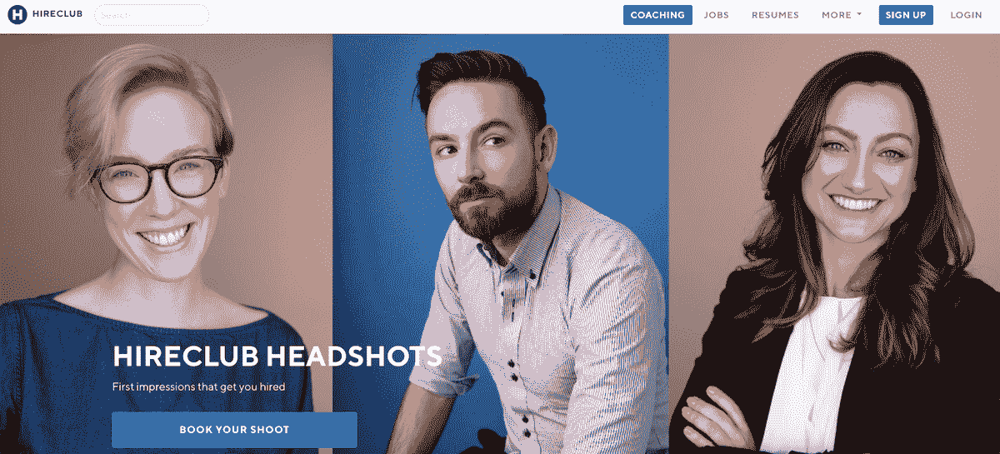
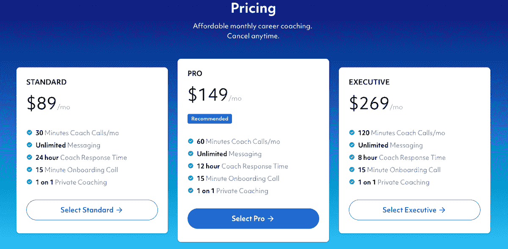

# 我如何克服拒绝，并通过关注社区建立了自己的事业

> 原文：<https://www.indiehackers.com/interview/how-i-overcame-rejection-and-built-a-business-by-focusing-on-community-5ab4e4eeb0>

## 你好！你的背景是什么，你在做什么？

大家好，我是 Ketan Anjaria，我是来自孟买的移民，也是 HireClub 的创始人。HireClub 通过职业指导帮助你找到理想的工作。

我很小的时候就开始编码和设计，有一张我为我的第一个游戏编码的照片，因为我爸爸不让我买。在专业上，我在 1999 年作为一名 Flash 开发人员加入了第一个 dot.com。但是和许多人一样，我被解雇了，失业了六个月。那段时间真的很痛苦，最终导致了我的离婚和严重的抑郁症。找工作真的很糟糕。

时间快进到 2011 年，我搬到了旧金山，拥有了一家成功的设计公司 [kidBombay](https://kidbombay.com/) 。我们总是需要优秀的人才，我知道我的朋友们可以让我接触到优秀的人才，所以在 2011 年 3 月 28 日(我的生日！)我在脸书成立了一个名为 HireClub 的组织。

我们已经从一个脸书集团发展到非常非常多，并在 2018 年 6 月开始订阅教练服务。我们目前正在做 11k MRR，价格从 89 美元/月开始，我们的脸书小组有超过 27，000 名成员。

 

## 是什么促使你开始使用 HireClub？

起初，HireClub 只是寻找优秀的员工。昨天我需要人，我想快点行动。我们用我们的脸书小组来测试我们所有的功能。通过让事情社会化，我们很快得到了反馈，我们是第一批这样的脸书团体之一，这真的帮助我们感受到了联系。

先建立一个社区。稍后产品。

TweetShare

从第一天开始，HireClub 就有六条简单的社区规则。它们从未改变，并且为我们提供了很好的服务:

1.  谈谈 hire club——我们相信推荐是被雇佣的最好方式。
2.  首先帮助别人——在你问之前，你能提供什么？
3.  发布你能接触到的职位——你要么是招聘经理，要么有内部权限。动作要快。
4.  为你的朋友担保——给你的朋友贴上标签，看看谁最适合工作。让世界知道他们有多牛逼。
5.  善待他人——互联网可能是一个可怕的地方。HireClub 欢迎所有善良的人。
6.  没有第三方招聘人员——hire club 旨在提供直接的、人对人的推荐。如果你是为客户招聘，请张贴在别处。内部招聘人员(你在 Acme Inc .工作，正在为 Acme Inc .招聘)总是受欢迎的。

我最初对 HireClub 的愿景是，永远不要在产品上花钱，只是努力改进它。

与此同时，我在 2011 年创办了另一家名为 CardFlick 的初创公司，赢得了 TechCrunch 观众的选择，我们最终为此筹集了资金(30 万美元)。我认为这将是下一个大事件，我花了超过 150，000 美元自己的钱(来自咨询)来构建 CardFlick。但是我们从来没有一个好的商业模式。当时，社交和增长是一切，我犯了很多错误，包括:

*   利用招聘人员招聘
*   重建版本 2，而不是迭代版本 1
*   从一开始就没有一个好的商业模式

最终，CardFlick 在 2013 年关闭了，又是痛苦的六个月找工作。

与此同时，HireClub 集团也在不断壮大。我做的不多，但是公司一直在发布工作。我们在旧金山举办了一些面对面的活动，总体上保持了小型的、真正个人化的感觉。我们当时甚至申请了 Y Combinator 但是没有进去。我们打算从招聘中赚钱，但直到后来我才意识到我其实讨厌招聘，所以我们成功了。

HireClub 在 2017 年 3 月达到了 10，000 名成员，在这一点上，我认为我们可以开始尝试收入。我们的第一个实验是 [HireClub 头像](https://hireclub.com/headshots)，并且非常成功！我们从第一次治疗中赚了 5000 美元，并且拍了我们社区的所有这些漂亮的照片。每个购买照片的人都把它作为他们的个人资料照片，他们的 HireClub 头像总是他们最喜欢的照片。顾客喜欢它，这是伟大的营销。

 

我们还看到了非常独特的东西。我们的许多成员没有工作，但想拍大头照，所以小组中有超过 15 个人捐了钱，这样那些失业或经济稍微紧张的人就可以购买大头照。这是一个很好的例子，说明向前支付一直是我们精神的一部分。

2017 年夏天，[共和国](https://republic.co/)找到我们，让我们参加这个名为《遇见德雷珀》的新电视节目。这将是一个类似鲨鱼池的节目，初创公司将在 Republic 上筹集资金。我们甚至还没有加入 HireClub，所以我们很快就做好了准备。一周后，我的第一部电视真人秀就要开拍了！

我认为我在节目中失败了，我从来没有真正推销过 HireClub，我们当时的推销是我们将成为像 UpWork 这样的演出平台。我们甚至没有产品，真的。但是我们拥有的是我们的社区。我们继续拍摄头像来赚钱，并开始建立我们的网站。为了加入这个小组，我要求所有的脸书成员都要创建一个关于 hireclub.com 的个人资料。

在脸书处理所有选举问题和负面影响的那一年，我们出色的社区帮助我们筹集了 4.7 万美元的众筹资金。它支付了我大约六个月的工资。

## 构建最初的产品需要什么？

2017 年 8 月，我们开始做单次职业辅导。会员可以购买 30 分钟或 60 分钟的课程，与职业教练讨论简历评论、薪资谈判等内容。我们增加了，但慢慢地开始每月赚取约 1-2，000 美元的收入。不是很多，但人们真的很喜欢它，我们的结果令人惊讶。我们给人们找工作，给他们加薪，让他们在找工作的过程中感到更加自信和支持。

我们赚了 30%的利润，剩下的由我们的教练保管。把这个平台想象成优步或 Lyft，但它不是拼车，而是一个职业服务市场。除了我们付给教练很高的薪水。他们的平均工资是每小时 100 美元。

2018 年 6 月，我们发布了订阅辅导。它有许多相同的功能，但价格简单:89 美元/月，与你的教练一起 30 分钟。它起飞了！单次会话不鼓励重复使用，而且很难在一次会话中做出大的改变。但是现在你有一个职业教练在你身边，你可以随时发信息或打电话。因为是订阅，我们不必担心向用户收费或获得更多用户。

在最初的几个月里，我们发展得非常快，从 30 天内投资 1，000 美元的 MRR 到 150 天内投资 1，000 美元的 10K·MRR。

对于筹资和成长来说，关键在于谁信任你。

TweetShare

我们最大的增长可能是通过 ProductHunt。我们等了好几个月才发布我们的产品，并努力确保我们的产品搜索图片和页面非常漂亮。我们修改了我们的入职培训，使其更快、更容易。用户甚至不需要注册，我们会在入职时自动创建一个帐户。我让克里斯·梅西纳帮我们发帖子，并利用我们的社区来传播消息。我们排在当天的前五名！它使我们的收入在一个月内增加了两倍。

2018 年 10 月，随着$10K MRR，我认为是时候尝试从投资者那里筹集一些资金了。伙计，我错了。我被拒绝了，当我们再次申请 Y Combinator(第四次)时，我们被拒绝了。我们在这里，一个创业公司，有 10 万美元的 ARR，2.7 万活跃会员，一个从第一天就开始盈利的产品。但我很快了解到，风投其实并不在乎你的数字。事实上，拥有数字对你来说可能更糟，因为这给了他们一些可以衡量的东西。有人告诉我，这永远不会成为大生意，否则我们不会扩大规模。

当我们没有进入 Y Combinator 时，我崩溃了。我希望建立一个团队，并准备雇人，我想我们肯定会获得 10 万美元的 ARR。

现在我完全改变了态度。我把 100%的注意力放在客户和改进产品上。我们仍在不断发展和改进产品，每天通过与重要的人交谈来吸取经验教训:我们的客户，而不是风投。

我最终从一位天使投资人那里筹到了 2.5 万美元，他是我 10 年前的老板。他太棒了，因为我们的收入，我们甚至还没有接触到钱。对于筹资和成长来说，关键在于谁信任你。

## 你们是如何吸引用户并壮大 HireClub 的？

主要是我们的脸书小组和现场活动。我们现在不做任何广告，尽管我们可能应该做。我真的很爱口碑。

如果有人投资你，那是因为他们相信你，最好的投资者是客户。

TweetShare

虽然产品搜索对我们来说很重要，但我们需要真正考虑增长，并在这方面投入更多。但我们发展得如此之快，以至于我们发现了用户的一些痛点，在我们再次关注增长之前，我想解决这些问题。没有一种产品是完美的，但我真的相信，在尝试发展之前，应该先生产出高质量的产品。人们应该想推荐他们的朋友，我们总是看到这一点。

| 月 | 收入 |
| --- | --- |
| 九月 | 930 |
| 十一月 | 1338 |
| 2018 年 2 月 | 720 |
| 三月 | 4895 |
| 四月 | 2230 |
| 五月 | 2012 |
| 六月 | 2662 |
| 七月 | 3330 |
| 八月 | 3817 |
| 九月 | 8002 |
| 十月 | 12298 |
| 十一月 | 13332 |
| 十二月 | 10285 |
| 19 年 1 月 | 11044 |
| 二月（February 的缩写） | 12302 |

## 你的商业模式是什么，你是如何增加收入的？

我们是职业服务的订阅市场。我们有自己的教练，他们做了工作，拿了 70%的工资。客户通过 Stripe(我们喜欢的)每月收费，我们从那支付给我们的教练。

我们几乎所有的增长都来自脸书集团。面对面的活动，如简历审查和在当地共同工作空间的薪资谈判研讨会也很有帮助。

 

## 你未来的目标是什么？

我想让 HireClub 自己成功。我受够了硅谷那种先做后做的生活方式。我们都见过那些筹集了数百万美元的初创公司，它们毫无意义，最终一无所获，我也了解到风投告诉你的大部分东西都没有用。如果有人投资你，那是因为他们相信你，最好的投资者是客户。

一旦我们达到 2 万美元的 MRR，我将不需要任何外部资金，我们离那不远了。

## 你面临的最大挑战和克服的障碍是什么？如果你必须重新开始，你会做什么不同的事？

我们最大的挑战是增长，因为我们没有在这方面投资。当你投资于产品时，你就会成长。

如果我们重新开始，我可能会犯同样的错误。我认为，作为一个创始人，最重要的是善待自己。我们不需要都在 VC 燃料的火箭船上，那会让你精疲力尽。事实上，我自己也订阅了 HireClub，我爱我的教练。他让我脚踏实地，负责任。

## 有没有发现什么特别有帮助或者有优势的？

最重要的事情是建造人们想要的价值指数级的东西。例如，如果用户每月支付 10 美元，他们是否会获得 20 美元或更多的价值？如果没有，你就没有造出真正吸引人的东西。我们的订阅费用是每月 89 美元，但我们的平均工资是 1 万美元！你还能在哪里花 89 美元赚 1 万美元？我们的结果是如此惊人。在美国，自己找工作可能需要长达六个月的时间；HireClub 客户两个月就搞定了。

我的观点是，这不是关于功能或部件，而是关于改变生活的行动。你的产品能对某人的生活有什么帮助？

## 对于刚刚起步的独立黑客，你有什么建议？

先建立一个社区。稍后产品。

每天与用户交流。使用短信，而不是电子邮件，与付费客户合作。文字摇滚。

每天迭代一次。

改善小事情，而不是试图做出大的改变。

提高你的价格。我们三次提价，赚了更多的钱。

如果你不是程序员，那就学习编码。说真的，我见过很多创始人花了一年时间试图找到一位 CTO，而在那一年里，他们实际上已经学会了编码。如果你有钱，找一个你信任的人来写代码，但不要试图和一个 CTO 结婚。这太疯狂了。雇个好开发商就行了。此外，使用轨道。这是最简单的方法。代码不能制造产品，倾听用户的声音才能制造产品。不要担心让事情变得完美，而是构建一些你可以迭代的东西。

尽早进行业务建模。你会收多少钱？那是多少钱？利润多少？你的成本是多少？人们喜欢认为如果你建造了它，他们就会来。没有什么比这更偏离事实了。

永远不要拿自己和别人比较。相信我，这会让你沮丧的。戴上竞争的眼罩，专注于你的客户。

最后，照顾好你自己，我真的相信我工作是为了活着，而不是活着为了工作。你的创业不是你的生活。

## 我们可以去哪里了解更多？

你可以去我们的网站，[https://hireclub.com](https://hireclub.com)，我们的[脸书集团](https://www.facebook.com/groups/hireclub)，或者我们的[推特](https://www.twitter.com/hireclub)。也可以发邮件给我 [【邮箱保护】](/cdn-cgi/l/email-protection#e2898796838ca28a8b9087818e9780cc818d8f) 。

我随时可以和你聊天，如果你想在事业上得到帮助，去 https://hireclub.com/intro[开始吧，这是免费的！](https://hireclub.com/intro)

——[<picture id="ember5314327" class="user-avatar ember-view user-link__avatar"></picture>凯坦·安贾里亚](/kidbombay?id=GLVHE5UuX1g5yneNRJi6mX3esZp1)，HireClub 创始人

## 想像 HireClub 一样建立自己的事业？

你应该加入[独立黑客社区](/)！🤗

我们是几千名创始人，互相帮助建立有利可图的业务和副业。来分享你正在做的事情，并从你的同事那里获得反馈。

还没准备好开始使用你的产品吗？没问题。这个社区是一个认识人、学习和实践的好地方。随意[随便浏览](/)！

——[<picture id="ember5314332" class="user-avatar ember-view user-link__avatar"></picture>考特兰艾伦](/csallen?id=ibTLPyjwVebnZjMGKvz6ztarnuV2)，独立黑客创始人

45votes