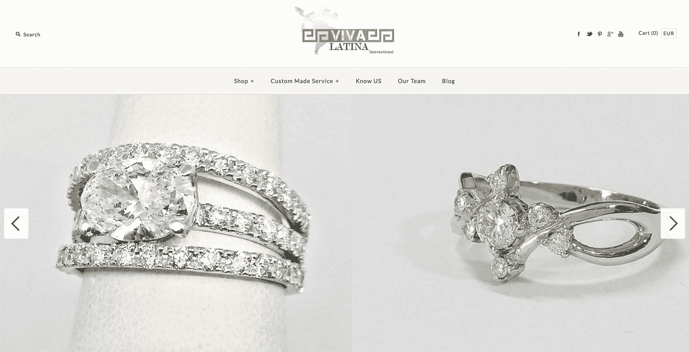
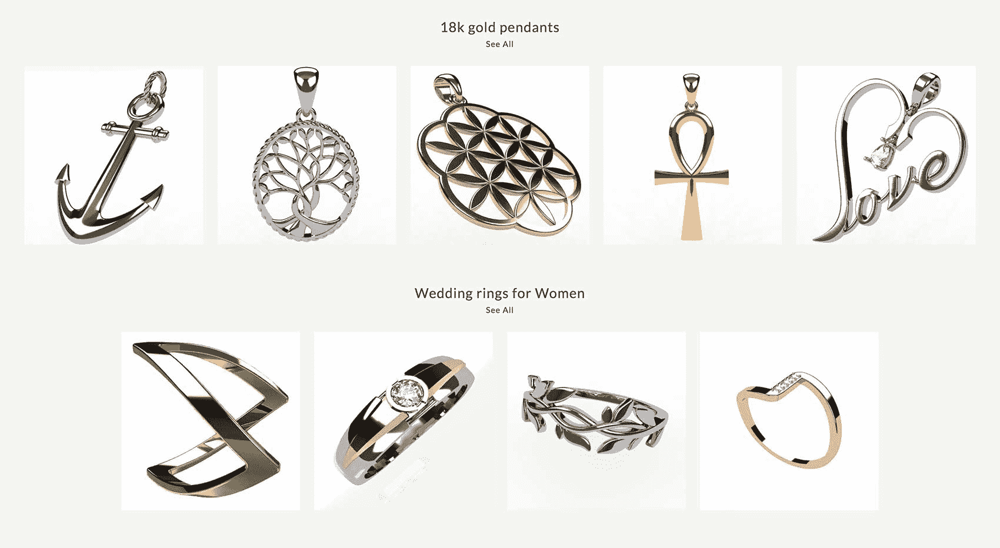
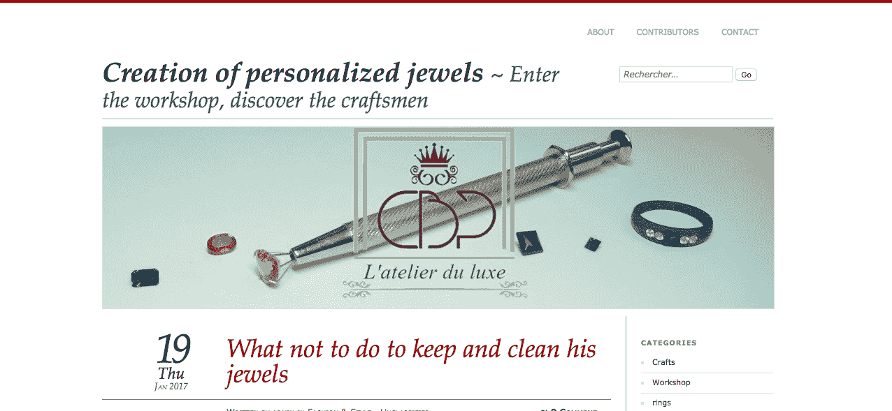
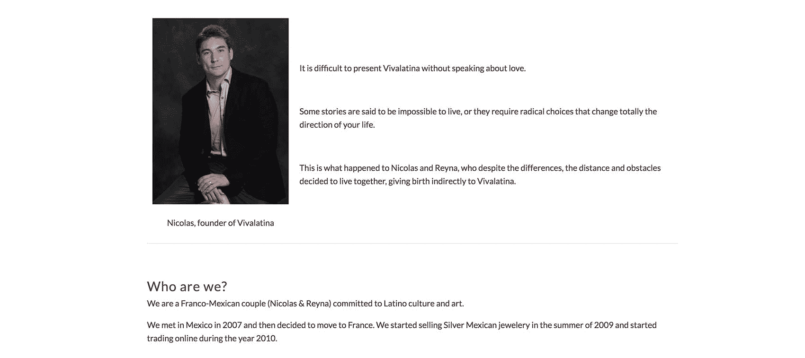

# 我如何转向并找到适合销售在线珠宝的产品市场

> 原文：<https://www.indiehackers.com/interview/how-i-pivoted-and-found-product-market-fit-selling-online-jewelry-ed65efb07a>

## 你好！你的背景是什么，你在做什么？

大家好。我是尼古拉斯·特兰钱特，37 岁的法国人。我有机械工程学位，我在法国航空工业做了四年的工业化工程师，为新飞机生产产品。

Vivalatina 是一家位于墨西哥的珠宝工作室。这是一家纯粹的 T2 企业，在网上为客户生产定制珠宝。我们从 2012 年开始，直到现在，只在法国市场运营，向八个不同国家的法语消费者发货:法国、瑞士、比利时、加拿大、荷兰、德国、法属圭亚那和越南。

我们的客户希望在珠宝店的个性化支持下购买珠宝，但不要受到价格冲击。这就是他们在我们身上发现的。除此之外，我们还借助墨西哥相对较低的劳动力成本，帮助他们节省时间和金钱。

在过去的三个月里，我们每月挣 9000 美元。过去两年，我们的业务增长率超过 100%，今年应该会保持这一水平。我们在 2017 年 12 月拥有 52，000 名独立访客，全年独立访客超过 413，000 名，2016 年至 2017 年间流量增长 94%。

 

## 是什么促使你开始使用 Vivalatina？

当我在 2010 年第一次构思这项业务时，我对网络营销或博客一无所知。当时我和我的墨西哥妻子在法国，我们想出了进口墨西哥纯银珠宝在法国网上销售的主意。我在 Taxco 有一些墨西哥朋友，我可以从他们那里购买和进口珠宝。

当时，我有一份全职的工程师工作，而我的妻子在法国失业。所以我们最初的想法是让我妻子来经营。

最后，我们决定在 2012 年搬到墨西哥。我的妻子是一名医生，她选择了自己的事业，而我则决定推进我们在法国生活期间未能启动的商业理念。我不得不从头开始寻找当地供应商，建立[网站](https://www.vivalatina.fr/)，并管理网络营销工作。(网络营销后来被证明是拼图游戏中最大的一块。)

到 2012 年 11 月，我们的预算很紧张。我们刚带着 10，000 美元的存款在巴亚尔塔港安顿下来。我们要支付搬家费，要买一辆车和一台笔记本电脑，还有一个即将出生的婴儿。

考虑到在最初的 30 个月里维持生计的挑战，我开始在咖啡店卖蛋糕，并在语言学校教法语。

## 构建最初的产品需要什么？

我的第一次尝试失败了。

我试图使用 Shopify 商店在网上销售墨西哥珠宝。我仍在使用 Shopify，因为我对自己经营业务、发表博客文章和发布新产品的便捷感到非常满意，但我很难快速提高网站的知名度以实现盈利。好的一面是，我确实获得了一点知名度，这让我能够与客户互动，他们中的一些人告诉我他们对定制设计的兴趣。

我们的预算很紧张。我们刚带着 10，000 美元的存款在巴亚尔塔港安顿下来。我们要支付搬家费，要买一辆车和一台笔记本电脑，还有一个即将出生的婴儿。

TweetShare

所以我开始与当地的珠宝作坊合作，生产我的客户需要的设计。在我发展业务的同时，定制珠宝开始成为我收入的大头，所以我决定将所有精力放在这项服务上。

我开始加大网上营销力度，同时将我的分包商网络扩大到四家当地珠宝商，每家都为我制作不同种类的珠宝。我还开始使用珠宝 CAD 软件，这样我就可以帮助我的客户设计他们的珠宝项目。

不久之后，在 2015 年初，我决定向前迈出一大步，购买一台 3D 珠宝打印机(5000 美元)，这样我就可以在分包商的车间里通过铸造工艺生产自己的设计。在这一点上，我可以保证珠宝的设计将与 CAD 设计 100%相同。

本着透明的精神，我要指出，我自己没有足够的钱来购买 3D 打印机，所以我得到了父母的一些帮助来支付它。

总之，在完全转向定制设计珠宝之前，我花了两年半的时间尝试销售珠宝。

 

## 你是如何吸引用户并发展 Vivalatina 的？

当我决定全职做这个项目时，我是一个 100%的网络营销新手。我没有社区，没有发布就开始了。

我决定自学 SEO，并把它作为我唯一的关注点，通过试错来学习。我知道这可能是一条漫长的道路，但我也清楚地知道 SEO 知识有多么强大——无论是对这个行业还是对我将来可能想到的任何其他商业想法。

我在 2012 年的第一个 SEO 任务是页面优化和目录提交。他们两个我都没做好。我已经将我的流量增长到每月 3000 个用户，但他们中很少有人是[合格的](https://en.wikipedia.org/wiki/Qualified_prospect)，所以我没有收到很多订单。然后，在 2013 年 5 月，我的网站被一个[谷歌熊猫](https://en.wikipedia.org/wiki/Google_Panda)过滤器处罚了。

当我决定全职做这个项目时，我是一个 100%的网络营销新手。我没有社区，没有发布就开始了。

TweetShare

所以我决定通过书籍和网络研讨会来学习 SEO。我买了几本解释搜索引擎和 SEO 如何工作的书。我在 2013 年夏天参加了 Garret French 和 Mac Gaffin 的网络研讨会，然后在 2014 年参加了[另一个网络研讨会](https://backlinkspyapp.com/backlink-strategy/)(我推荐)，参加的是 [Backlinko](https://backlinko.com/) 的创始人 Brian Dean。这些经验帮助我改变了网络营销工作，从 2013 年 5 月的 3000 名用户增长到 2014 年 5 月的 8000 名用户。到 2015 年 5 月，我接触到了超过 11，000 名用户。

为了实现这种增长，我遵循了以下步骤:

*   我一直在学习 SEO(我将永远是这个领域的学生)
*   我从 2016 年 10 月开始使用一个工具来更好地进行关键词研究: [Secockpit](https://secockpit.com/)
*   我在我的博客和其他网站的客座博文中写了很多有据可查的文章
*   我主要关注客座博文，以提高我的知名度，并获得一些反向链接
*   我已经与小珠宝企业主建立了网络合作关系，其流量比我的低，但仍然可以从非常相关的网站获取链接，因为谷歌非常重视链接的相关性。
*   我为小型珠宝商创建了一个[博客来展示他们的作品，这让我更容易向他们提出建议，而不是要求什么。](http://creation-bijoux-personnalises.fr/)
*   我发布了信息图，并与一些比我大的网站分享
*   我总是在我的内容中包含链接，链接到我的网站或其他网站上的补充资源。这看起来微不足道，但对于谷歌来说，这是决定你的内容是一流还是又一篇博文的一个非常重要的因素。
*   当我链接到一个不同的网站时，我会让他们知道，这样我就可以最终安排一个回到我的网站的对等链接。
*   我已经问过我使用的服务提供商，他们是否对我的客户证明感兴趣。接受推荐的人会将推荐放在他们的登录页面或推荐页面上。这工作得很好。这些提供商的链接通常与我的定位非常相关，通常在[领域权威](https://en.wikipedia.org/wiki/Domain_Authority)中排名很高。
*   我还组织了一个珠宝设计比赛，以获得牵引力和赚取链接。然而，虽然我获得了几十个稍微相关的链接，但对于结果来说，这似乎是太多的工作了。

 

## 你的商业模式是什么，你是如何增加收入的？

通过内容写作和搜索引擎优化产生的流量，我收到了人们要求珠宝项目报价的电子邮件。这些是我的线索。除了内容写作和 SEO 之外，我没有其他策略来产生销售线索。我把报价发给他们，并在必要时与他们讨论项目。当我们就设计和条款达成一致时，我收到了启动项目的首付款(总额的 50%)。然后，一旦我向他们展示珠宝成品的照片，他们就会支付最后一笔款项。

付款是通过贝宝，这是相当昂贵的在我的情况下，但我没有其他选择在墨西哥这里。这里的支付门户服务不像美国那样发达。

一开始，我对这项服务的最低收费是 100 美元。10 个月后，这个下限增长到 200 美元，现在是 350 美元。这种演变是可能的，通过流量增长和选择我要发布的内容。例如，我已经开始吸引对金首饰而不是银首饰感兴趣的客户。换句话说，客户的期望和预算更大。

这也让我可以过滤掉预算非常低的客户。这对我的底线有很大的影响，因为我每个月只花 15 个小时在报价上。(我现在每个月收到 45 条以上的报价，每条只花 20 分钟。)

所以我需要把我的时间和服务留给更重要的客户。许多人关注的是网上的大量廉价产品，而我关注的是高价产品和个性化服务。我们管理的珠宝项目平均价值约为 650 美元。因为我对我的搜索引擎优化和内容创作拥有完全的权力，我可以推动增长率，并充分了解业务在未来 12 个月将如何发展。

## 你未来的目标是什么？

2018 年，我计划通过我的法语网站达到 75 万独立访客，并在 12 月前每月为英语网站创造约 1 万独立访客。年收入应该超过 140，000 美元，这将允许我雇用第四名员工，他们可以协助我处理日常的小任务，我目前在这些任务上花费了太多的时间。

到 2020 年，我应该能够通过讲英语的客户创造足够的收入，扩大规模，提供西班牙语服务，最终提供其他语言的服务。

## 你面临的最大挑战和克服的障碍是什么？如果你必须重新开始，你会做什么不同的事？

我最大的错误是从一开始就没有关注 SEO 知识，对我的市场了解不够。

在我经营这家企业的五年里，我经历了许多黑暗的时刻，尽管我尽了最大努力，事情还是朝着错误的方向发展。但我总能从那些糟糕的经历中抓住机会。

让我解释一下。当我没能在网上卖出足够多的银饰品时，我设法抓住机会开始为我的客户制作首饰。我没有坚持我最初的商业想法；我倾听客户的意见，适应他们的需求。

2014 年 2 月，我遇到了更大的麻烦，当时我网络中的一家珠宝商没有生产出完全符合我需求的珠宝。更糟糕的是，墨西哥邮局通常需要八周时间(而不是我的客户预期的两周时间)来交付我的产品。我需要一个更好的运输解决方案(UPS ),但我实际销售的珠宝付不起这个费用。

每个问题都可以被看做是一个机会，就看你怎么看待了。

TweetShare

因此，我决定制造价格更高的珠宝，因为高交货率不会成为问题。对于这种珠宝，3D 打印机将是必要的，也将解决我在与我的网络珠宝商面临的设计问题。

快进到 2016 年初。我的主要珠宝工作室开始非常挑剔，并勒索我的质量细节。他们抓住了我的要害，我感觉很糟糕。所以我很快决定，我应该独立，经营自己的珠宝工作室。我就是这么做的。5 个月后，2016 年 8 月，我和第一个全职员工开了自己的车间。

每个问题都可以被看做是一个机会，就看你怎么看待了。回到 2013 年，我可以花几周时间思考如何解决一个问题，而现在我只会花几天时间。

## 有没有发现什么特别有帮助或者有优势的？

我做过的最好的决定是阅读和投资我的教育。我试着每两个月读一本关于营销或商业的书。我将它视为帮助我规划未来业务的重要资源。我接受过的最好的教育是布莱恩·迪恩提供的在线搜索引擎优化课程。它改变了我理解和追求 SEO 的方式。

考虑到我的业务的特殊性，我作为机械工程师的一些技能对我帮助很大:

*   我很容易就学会了使用 CAD 软件
*   我自学了 3D 打印(并制作了最后一个作为 DIY 工具包)
*   我的旅行和工作经历帮助我管理一个法语、英语和西班牙语的供应商网络

 

## 对于刚刚起步的独立黑客，你有什么建议？

我能给出的最好的建议(以问题的形式)是:

*   你准备好失败并继续前进了吗？(对每一个成功的企业家来说，答案都是肯定的。)
*   你对你的市场足够了解吗？
*   你有没有人可以对你的项目提供诚实和批判性的反馈，向你展示它的缺陷？
*   你有没有一群企业家可以与你分享他们的经验，并在你有疑问或面临新的困难时帮助你？

关于你的开支的经验法则:20%必须用于你的项目本身，80%用于营销。这对你的金钱和时间来说都是真的。事实是，如果你有一个糟糕的网站仍然在做销售，那么改善网站就很容易。相反，没有客户的好网站数不胜数，而这些企业几乎总是失败。

重要提示:每年都要举行一次规划会议，在会上你可以列出你的目标，以及每个月你需要做些什么来实现它们。这看起来非常简单，但它帮助我一整年都保持专注，并允许我检查我的结果，并在必要时纠正我的行为。

蒂姆·费里斯的《每周 4 小时工作制》对我产生了巨大的影响。它向我展示了什么是可以实现的，并帮助我专注于一个目标。(就网上交易而言，这可能有点过时了。)

希望我能在一年内让你了解我的英语商店的进展和成长。s

——[<picture id="ember5279770" class="user-avatar ember-view user-link__avatar"></picture>尼古拉斯·特朗钱特](/NicolasTranchant?id=Re4PEI1Uj4fHAGiPmKaCmU3Z0RB3)，Vivalatina 创始人

## 想像 Vivalatina 一样建立自己的事业？

你应该加入[独立黑客社区](/)！🤗

我们是几千名创始人，互相帮助建立有利可图的业务和副业。来分享你正在做的事情，并从你的同事那里获得反馈。

还没准备好开始使用你的产品吗？没问题。这个社区是一个认识人、学习和实践的好地方。随意[随便浏览](/)！

—[<picture id="ember5279775" class="user-avatar ember-view user-link__avatar"></picture>考特兰艾伦](/csallen?id=ibTLPyjwVebnZjMGKvz6ztarnuV2)，独立黑客创始人

30votes