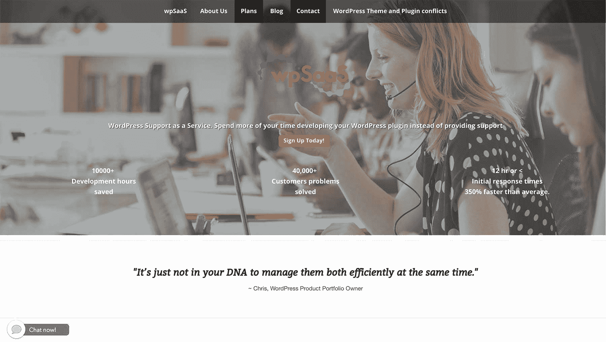
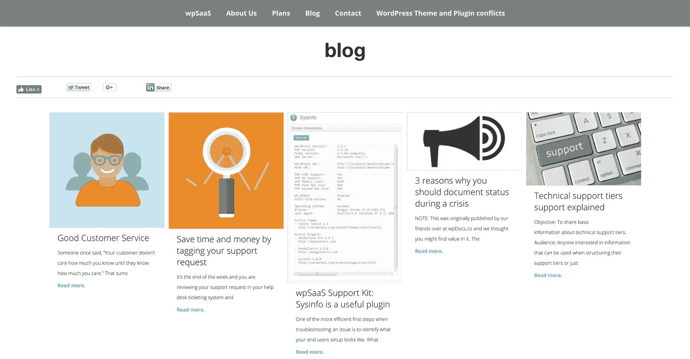

# 我如何将一项别人愿意花钱购买的技能产品化

> 原文：<https://www.indiehackers.com/interview/how-i-productized-a-skill-that-others-were-willing-to-pay-for-7e1f0eee4a>

## 你好！你的背景是什么，你在做什么？

我叫凯尔·m·布朗，我热衷于用技术解决问题。在过去的二十年里，我以这样或那样的身份在技术行业工作过——电信、顾问和业余爱好者。我在提高企业运营效率方面有十多年的经验。

我意识到网上有许多技术上可靠、设计良好的软件产品，但是当涉及到支持时，它们很少或者在某些情况下根本没有。因此，我创立了 wpSaaS，帮助科技公司的创始人将更多的时间花在发展上，专注于发展业务的战略，或者只是坐在沙滩上，减少处理产品支持的时间。

我们通过为 WordPress 插件和 SaaS/软件产品提供一级支持服务来做到这一点。在我们兼职创业的头 30 天，我们的月收入是 1000 美元，如今已经翻了好几倍。

 

## 是什么促使你开始使用 wpSaaS？

我在在线软件领域寻找一个机会，在那里我可以利用我的经验和背景帮助其他人，这使我产生了这个想法。我通过构建一个概述价值主张的登录页面来验证它。这就像是，“通过让我们处理您的支持，花更多的时间来开发。”然后，我用类似的信息联系 WordPress 开发者和产品所有者，并把他们引向这个页面。

感兴趣的程度和反馈的类型帮助我们验证了这个想法。我认为一个文件 SaaS 惨败。我认为这主要是因为我在制造产品之前没有确认市场的存在。还有其他错误，但我认为这是最大的错误。

我专攻企业运营效率多年。我已经能够利用这种专业知识，并做出一些调整，以便它能很好地为 SaaS 公司服务。此时，我正在做 [wpSaaS](http://wpsaas.net/) 和咨询。

## 构建最初的产品需要什么？

作为一项服务，与产品相比，启动时间是最短的。我在第一天就独自处理了所有的支持请求。我们开门营业。如果你包括建立一个网页和主机，并找到一个好名字，它可能需要四天的时间来开始。我决定，虽然它将是一个服务，但它需要是一个有边界的产品化服务。由于我们的观众大多是喜欢参与编码的独立创始人，我决定第一层支持将是我们的方法。

起初，我把太多的重点放在技术和工具上，而没有足够的重视寻找产品市场的契合度。

TweetShare

那时，我在一家公司做全职工作。我知道我每天的工作时间是有限的，所以我考虑到这一点来设置和组织业务。我通过利用原本用于娱乐和储蓄的资金，自筹了所有的前期成本。不管怎样，作为一家服务企业，大部分前期投资是时间而不是金钱。

很多事情都有帮助。家人的支持，以及我长期阅读的大量科技和商业资料。我尝试了很多想法。可能最重要的是，我利用了智囊团和其他志同道合的企业家聚集的网络社区。

## 你们是如何吸引用户，壮大 wpSaaS 的？

我们悄悄地推出了一个客户。没什么特别的。我会给我认为可能对这种服务感兴趣的人打电话。在很多公共场合，我可以很容易地认出 WordPress 的开发者，比如 wordpress.org/plugins。也有其他市场出售 WordPress 插件。我们就是这样找到第一个顾客的。我们通过口碑发展了两年。作为一家产品化服务公司，我们的网络流量并不是我们获取客户的主要因素。

我对任何试图建立产品化服务或产品业务的人的建议是，通过最少的会议和积极的说服，找到愿意为你的服务或产品付费的人。这应该在编写一行代码之前发生。

 

## 你的商业模式是什么，你是如何增加收入的？

我们主要通过每月订阅产生收入。我们还通过提供其他服务来创收，例如最终用户和内部文档以及发布测试。我们建立了 [Stripe](https://stripe.com/) ，因为我们使用计量计费方法，我们使用该方法和 PayPal 订阅进行计费。Zapier 有时会在收据和发票上派上用场。

虽然我想给出细节，因为它们很重要，但我现在不能说得太深。我可以说，如今该公司每月收入超过 10，000 美元。我们的增长是有机的，并基于与我们的客户合作，提供其他运营服务，如文件和流程开发。

我们的利润率在 50-70%之间，从第一天开始就是如此。通常，谈到运营，创始人认为这是他们以后可以做的事情。因此，没有过程、方法或系统在早期到位。虽然收入很重要，但不幸的是，这不是我推荐的方法，因为一切都落在创始人身上，而且在业务启动后调整运营战略要困难得多，因为你的重点会在许多其他地方。

## 你未来的目标是什么，你打算如何实现它们？

我们今天的目标是有机地扩展业务，同时帮助尽可能多的创始人通过利用企业技术专注于建立他们的业务。有时，让创始人了解高效运营的价值可能是一个漫长的过程，但我们希望我们以前客户的结果会缩短周期。

我们计划通过识别并与了解价值或运营效率的客户群体合作来实现我们的目标。

## 你面临的最大挑战和克服的障碍是什么？如果你必须重新开始，你会做什么不同的事？

根据我的操作经验，我们在 wpSaaS 上的错误很少，但是我们确实犯了一些错误。我得说，在创办这家公司之前，我在之前的投资中犯了很多错误。

但是，有一点确实想到了，而且和专业知识无关:心态。我们低估了一些创始人对自己做所有事情(包括支持)的执着程度。永远不要认为你可以在你的日程表上改变某人的心态。人们的态度是很难改变的，他们按照自己的时间表改变，如果有的话。

## 你最大的优势是什么？有什么特别有用的吗？

对我来说，有太多的问题无法做到 100%准确，但我可以告诉你一些最重要的问题:

书籍:

1.  [开始小，保持小](http://www.startupbook.net/)
2.  [牵引](https://www.amazon.com/Traction-Startup-Achieve-Explosive-Customer/dp/B01705KMG4/ref=sr_1_2?ie=UTF8&qid=1519861116&sr=8-2&keywords=traction+book)
3.  [Systematizebook.com](http://systematizebook.com/)

人员:

不胜枚举。我的家人和创业社区的朋友提供了永无止境的支持，这在创业的磨砺中非常宝贵。

资源:

*   [https://www.foundercafe.com/](https://www.foundercafe.com/)
*   [http://www.startupsfortherestofus.com/](http://www.startupsfortherestofus.com/)
*   [http://thisweekinstartups.com/](http://thisweekinstartups.com/)
*   [https://steveblank.com/](https://steveblank.com/)
*   [http://discuss.joelonsoftware.com/](http://discuss.joelonsoftware.com/)(关闭，但我相信这是一个伟大的替代:[http://discuss.bootstrapped.fm/](http://discuss.bootstrapped.fm/))

我很擅长通过建立流程和系统来识别和执行运营效率。

我还认为，就需要运营帮助的单个或小型团队创建的在线产品的增长而言，这个时机很好。

## 对于刚刚起步的独立黑客，你有什么建议？

我和其他人犯的一个错误是，我过于强调技术和工具，而没有足够重视首先找到适合市场的产品。

在我明白这一点之前，我花了几年时间纠结于许多其他想法，这些想法很少或根本没有机会实现我想要的结果。

## 我们可以去哪里了解更多？

你可以在推特( [@kylmbrown](https://twitter.com/kylmbrown) 、 [@wpSaaS](https://twitter.com/wpSaaS) )或者在 www.kylembrown.com、[www.wpsaas.net](http://wpsaas.net/)的网站上找到我。

我一直在和人聊天。我喜欢回答关于技术、商业，当然还有运营方面的问题。

—[<picture id="ember8169206" class="user-avatar ember-view user-link__avatar"></picture>凯尔·布朗](/wpsaas?id=MvE2YhytCQQXQRT2PMYh2Bb2tFU2)，wpSaaS 联合创始人

## 想像 wpSaaS 一样建立自己的事业？

你应该加入独立黑客社区！🤗

我们是几千名创始人，互相帮助建立有利可图的业务和副业。来分享你正在做的事情，并从你的同事那里获得反馈。

还没准备好开始使用你的产品吗？没问题。这个社区是一个认识人、学习和实践的好地方。随意[随便浏览](/)！

—[<picture id="ember8169211" class="user-avatar ember-view user-link__avatar"></picture>考特兰艾伦](/csallen?id=ibTLPyjwVebnZjMGKvz6ztarnuV2)，独立黑客创始人

34votes