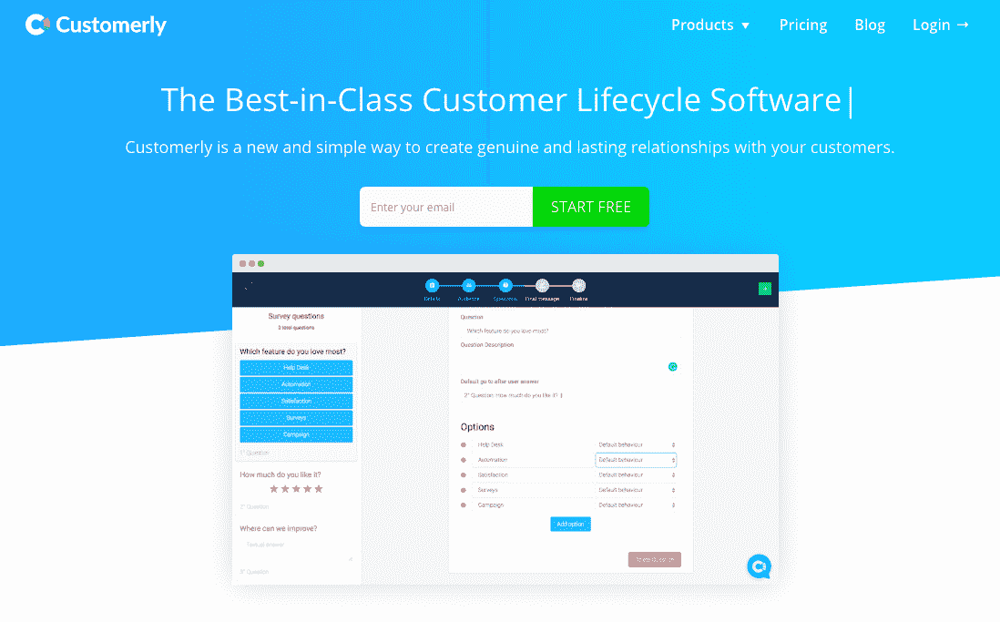
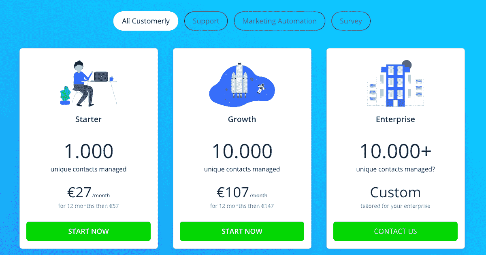
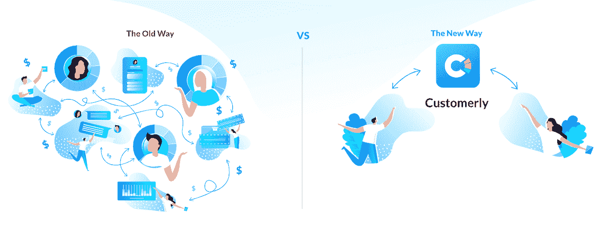

# 我是如何退学并学会推出一个成功的产品的

> 原文：<https://www.indiehackers.com/interview/how-i-quit-school-and-learned-to-launch-a-successful-product-83ee0e0cbb>

## 你好！你的背景是什么，你在做什么？

嗨，独立黑客们，我叫卢卡·米凯利，我来自意大利，但最近搬到了爱尔兰，因为我建立了一个名为[customery](https://www.customerly.io/en)的 SaaS，这是一个客户生命周期软件解决方案，可以提高您的客户参与度。我从大学退学，开始开发我的第一个应用程序 QuizPatente，我完全是自学的。七年前，当我推出 QuizPatente 时，它的下载量达到了 700 万次，并为如何运行 SaaS 创造了一个相当陡峭的学习曲线。我从那个应用程序中学到的经验和它的成功带来的需求启发我在 2016 年创建了 Customerly。这两款应用都是完全自举的。

自从积极参与 Customerly 以来，我一直致力于帮助和激励至少 10 亿人，你可以在我的[个人通讯](https://www.lucamicheli.com)中读到这些。

我们最近推出了一项与 Pitchground 的[终身交易，帮助我们在不到一个月的时间里赚了 65K](https://www.indiehackers.com/@customerly/how-we-launched-our-saas-without-investors-by-raising-65k-in-less-than-a-month-27f3c05824) 美元。Customerly 拥有来自世界各地的用户，目前每月收入为 4k 美元。

 

## 是什么促使你开始定制的？

当我和我以前的 SaaS 一起工作时，我有三个需求:

1.  从我的客户那里收集反馈
2.  自动化一些通信
3.  将客户支持集中在一个平台上

因此，我们的想法是创建一个单一的平台，可以在一个地方处理所有这些功能。在早期阶段，就在测试阶段之后，我们召集了一群有相同需求的朋友，让他们做一些测试并提供一些反馈来验证这个想法。

在这一点上，我仍然致力于我的前一个项目，并有一个良好的收入流(36K€/年)来支持我，同时在 Customerly 工作。

## 构建最初的产品需要什么？

最初，我们三个创始人——Matteo、Daniele 和我——在晚上和周末的每一个可能的时间里挤出时间为 Customerly 工作，而白天则从事其他项目。从晚上 9 点到凌晨 3 点，我们花了整整一年的时间来交付实时聊天和仪表盘的第一个版本。

我不得不学习如何用普通的 Javascript 开发一个可以安装在每个网站上的小部件，这既有挑战性又很有趣。我的合作伙伴是工程师，他们必须解决很多技术瓶颈才能创造出这个工具。我们在 35 多台服务器上使用 30 多个存储库。

如果你失败了，那就重新开始，一遍又一遍，直到你成功。

TweetShare

我们总共投资了 4，500€来建立公司，我本人也搬到都柏林来开店。我们加入了 FbStart 计划，该计划附带 AWS 服务器和其他非常有用的惊人好处。

发布后，又有两个了不起的人加入了我们的冒险:保罗和詹尼。我们真的不能期待更多了。他们都对 customery 的工作充满热情，并且正在学习许多新技能，以帮助 customery 成长。

## 你是如何吸引用户并实现定制增长的？

我们通过要求我们的朋友在他们的项目中采用 Customerly 来“发布”我们的测试版。像这样的试运行帮助我们在将产品发布到野外之前，根据与我们有私人关系的人的反馈不断改进我们的软件。我们从来没有一个合适的发布，相反，由于实时聊天工具上的“powered by”标签，我们开始获得用户。在两年的时间里，我们的用户从零增长到了 2，500，而没有做太多其他的事情。

我们尝试了 Capterra CPC 活动，但最终，这是一个昂贵的流量来源，并没有转化得很好。我们还试图赞助一个被前端开发者广泛使用的框架(materializecss)——它产生了很多访问，但很少转化。我们花了大约 5000€去参加各种活动，像 SaaStock 和 WebSummit，也没有出现多少。

另一方面，回答 Quora 和其他博客上的所有问题，人们在那里寻找我们竞争对手的替代品，产生了相当好的结果。11 月，我们[推出了我们的终身交易](https://www.indiehackers.com/@customerly/how-we-launched-our-saas-without-investors-by-raising-65k-in-less-than-a-month-27f3c05824),现在我们正在投资为我们的目标市场创造各种内容，并通过脸书广告投放。

| 月 | 访问者 |
| --- | --- |
| 2018 年 1 月 | 89 |
| 2018 年 5 月 | 212 |
| 2018 年 7 月 | 382 |
| 18 年 9 月 | 247 |
| 18 年 11 月 | 8800 |
| 2018 年 12 月 | 8300 |
| 19 年 1 月 | 9300 |

## 你的商业模式是什么，你是如何增加收入的？

在客户那里，我们有三个不同的定价层级，每个层级都有相同的三个模块。定价等级基于您的联系人数量，分为初级、增长和企业。我们提供的模块有:

1.  实时聊天和帮助台
2.  自动化电子邮件营销
3.  反馈

启动计划中的所有模块都是每月€9。我们发现这对于我们的目标人群来说是一个很好的起始价格，因为这似乎是他们愿意尝试的价格。

当您的联系人增长到 1000 个以上时，您将获得一个增长计划，该计划可以管理 10k 个联系人，并且成本远低于市场上的其他工具。根据增长计划，我们的电子邮件模块每月仅花费 49€。实时聊天和帮助台模块和反馈模块都只有€每月 29。

2018 年 9 月底开始对第一个客户收费。我们已经与 Stripe 整合，开发了自己的支付系统，但当我们开始获得全球客户时，却陷入了支付问题。目前，我们正在考虑引入外部合作伙伴来处理支付和订阅事宜。

我们每月赚取 4k€，当我们将定价从基于联系人的定价改为基于三个定义的层级(入门级、成长型、企业级)的定价时，我们看到了更多的兴趣。为了更好地了解我们的定价，请查看我们的[定价页面](https://www.customerly.io/en/pricing)。

目前，我们的支出是每月 1k€的 AWS 和每月花费不到 500€的一些服务订阅。

 

## 你未来的目标是什么？

我们的主要目标是成为企业和客户之间沟通的第一人。我们需要努力寻找一个战略角度，在利基市场进行定制销售，这将为我们在更大的市场中开辟新的机会。我们的使命是帮助和激励至少 10 亿人，我们相信这是完全可能的，因为我们正在支持企业制定他们的战略并接触他们的客户。

我们今年的产品目标是整合知识库，引入新的沟通渠道，并通过反馈系统改进我们迄今所做的工作。在获取客户方面，我们希望在年底前每月至少吸引 200 名新客户。

由于我们从与 Pitchground 的终身交易中获得了 65，000 美元，我们有一个强大的投资计划，这将帮助我们开发优秀的内容以及新产品和新功能。我们也刚刚开启了一个[加盟计划](https://customerly.tapfiliate.com/programs/customerly-affiliate-program/signup/)，因为我们已经收到了大量的客户转售请求。

## 你面临的最大挑战和克服的障碍是什么？如果你必须重新开始，你会做什么不同的事？

我们现在最大的挑战是找出正确的销售和营销角度，在我们的利基市场中定位自己。问题是，我们将三种产品打包在一个产品包中，如果你知道该工具以及如何应用它，这是非常酷的，但销售起来很困难，因为你需要一个单一的、有针对性的推销来提供给潜在客户。

我们犯的一个错误是发布新工具，而不是专注于我们已有的好工具。我们需要更加关注那些有助于我们进一步开发产品市场契合度的东西。

你需要软技能来更好地与你的团队沟通并达成良好的合作关系。

TweetShare

## 有没有发现什么特别有帮助或者有优势的？

我看了很多书，建议你也这样。我每天早上去办公室的时候都会听有声读物，每天冥想来保持头脑平衡，做我个人的肯定来让我专注于我想要实现的目标。

我推荐的书是西蒙·西内克的《从为什么开始》和埃里克·里斯的《T2》和《精益创业》。

我也追随那些激励我的人，比如企业家、营销人员和其他成功人士，收集他们可能会给出的任何见解。你需要软技能来更好地与你的团队沟通并达成良好的合作关系。我参加了一个类似托尼·罗宾斯领导学院的课程，这个课程改变了我的生活，我从一个安静的书呆子变成了一个在数千人面前演讲的企业家。

## 对于刚刚起步的独立黑客，你有什么建议？

相信自己。找到你的激情，专注于一件事，直到你成功或失败。如果你失败了，那就重新开始，一遍又一遍，直到你成功。没有幕后的奋斗和激情，就没有成功。记住，有时候不是努力工作的问题，而是聪明工作的问题。聪明工作比努力工作能取得更好的结果。

每天做些事情来测试你的恐惧。

TweetShare

恐惧是阻碍我们成功的东西。每天做一些事情来测试你的恐惧或对抗它们，一年后你会不认识你自己。在都柏林的“百万富翁思维”课程中，我不得不用身体去抵挡一支指向我喉咙的箭。这是我经历过的最有启发性和最激动人心的经历之一。我也是一名火行者，但是克服我的恐惧(在这种情况下，是对死亡的恐惧),并通过向前迈出第一步来打破恐惧的经历给了我很大的力量。

 

## 我们可以去哪里了解更多？

因为我的人生使命是帮助和激励他人，所以我每周发一份[个人时事通讯](https://www.lucamicheli.com)，里面满是关于我如何改善生活和生意的工具和建议。

我还让独立黑客有机会以折扣价尝试 Customerly 的所有功能。您可以利用我们的实时聊天，为期六个月，每月仅在€3，以及我们完整的电子邮件营销工具，为您的活动在€3 月。当然，你可以试用 14 天，不需要任何信用卡。加入全球 3000 多名用户的行列，参加[独立黑客活动](https://promo.customerly.io/indiehackers)！

—[<picture id="ember8119362" class="user-avatar ember-view user-link__avatar"></picture>Luca Micheli](/customerly?id=SI2vzTy6YbYJo27vGOBKx48C3cA3)【customery】创始人

## 想像 Customerly 一样建立自己的事业吗？

你应该加入独立黑客社区！🤗

我们是几千名创始人，互相帮助建立有利可图的业务和副业。来分享你正在做的事情，并从你的同事那里获得反馈。

还没准备好开始使用你的产品吗？没问题。这个社区是一个认识人、学习和实践的好地方。随意[随便浏览](/)！

——[<picture id="ember8119367" class="user-avatar ember-view user-link__avatar"></picture>柯特兰艾伦](/csallen?id=ibTLPyjwVebnZjMGKvz6ztarnuV2)，独立黑客创始人

25votes