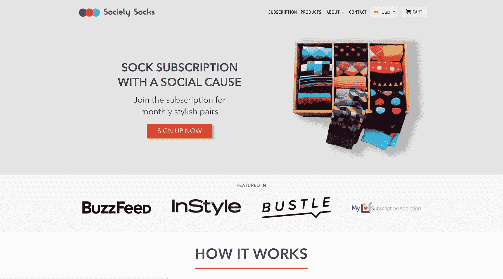
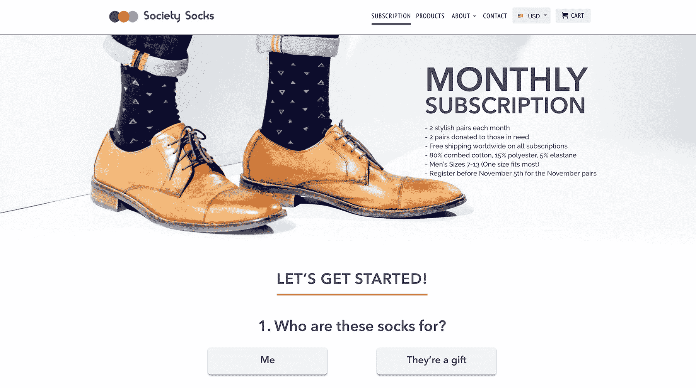

# 在发布后流量下降后，我如何重新获得动力

> 原文：<https://www.indiehackers.com/interview/how-i-regained-momentum-after-a-post-launch-traffic-slowdown-4428264e3c>

## 你好！你的背景是什么，你在做什么？

我叫菲利普，我是 Society Socks 的联合创始人之一。我目前住在加拿大的多伦多，我在那里生活了一辈子。我最近从多伦多大学的罗特曼商业项目毕业，获得了金融和经济的商业管理硕士学位。在学校期间，我在管理这家企业的同时，在各种暑期实习、学生俱乐部和兼职工作中担任角色。

Society Socks 是一个有社会意义的男士时尚袜子订阅网站。我们每个月都会发布两款新的袜子设计，并将它们发送给我们的订户。我们的袜子柔软有弹性，设计独特，适合搭配正式和休闲服装。我们每卖出一双袜子，就会向青少年无家可归者收容所捐赠另一双袜子。也就是说，每订阅一双鞋，我们会再捐赠两双给慈善机构。

我们的客户主要分为两类，一类是为自己购买袜子的订户，另一类是想为生命中某个特别的人购买一份经常性礼物的礼物购买者。不想按月订购的顾客可以选择购买我们商店前一个月的袜子设计。

为了让您了解我们的规模和增长，我们的业务目前在非冬季假期的几个月中每月赚 5000 美元，去年增长了大约 4 倍。

 

## 是什么促使你开始接触 Society Socks？

当我开始读商学院时，我接触了广泛的商业领域，包括营销、金融、会计和战略。虽然我有机会在暑期实习，但我觉得我没有完全利用我在课堂上吸收的所有信息。我把创业看作是我商业知识的一个出口，一种创造我个人感到自豪的东西的方式。

在创业之前，我对创业公司的经验非常有限，我的联合创始人正在关闭他的第一个电子商务网站。我们都是大学时代的朋友，当时碰巧住在一起。

幸运的是，我们的实习和兼职工作帮助我们攒了足够的钱来支持我们的生活成本和我们企业的前期投资。通过学习我们从学校、互联网学到的知识，以及我的联合创始人过去做生意的经验，我们决定启动。虽然我们绝不是专家，但我们有强烈的愿望去创建一家公司，并学习新的方法来使它变得更好。

我们在 2015 年年中成立了 [Society Socks](https://mysocietysocks.com/) ，当时我们正在准备第二年的期末考试。我们从对日益流行的时髦袜子潮流的共同兴趣中得到了这个想法。起初我们只是想卖一系列时髦的袜子，但我们发现一篇文章说袜子是捐赠最少但最需要的衣物。因此，我们看到了一个机会，不仅可以用我们喜欢制作的产品创业，还可以在创业的同时对世界产生有意义的影响。

在从阿里巴巴采购了最初的一小批袜子后，我们考虑了不同的方式来推出我们的网站，并通过复制[哈利的流程](https://kickofflabs.com/blog/how-to-setup-a-social-referral-rewards-campaign-like-harrys-launch-with-kickofflabs/)来产生一些关于我们产品的宣传。我们的产品发布并不像他们那样成功，但我们生成了一个大约 500 名订户的电子邮件列表，其中有几个在产品发布时购买了我们的产品。

虽然我们最初认为 T4 验证了我们的想法，但接下来的几个月进展缓慢。那时，我们还没有运行订阅模式，正在努力把用户带到我们的网站。我们最终转向了订阅模式。在此之后，我们觉得我们的业务真正开始增长。

## 构建最初的产品需要什么？

最初的产品需要与海外供应商进行相当多的谈判才能运到加拿大。我们向制造商订购了少量(10 双 x 10 款)袜子，每双的最小起订量为 1000 双。

经过大量的反复对话，我们最终说服了一家供应商在我们的袜子上冒一次险。除了我们的实体产品，我们在没有编码知识的情况下努力创建我们的网站和发布页面。在发布之前，我们利用 Shopify 和 KickOffLabs 将所有东西拼凑在一起。

通过与正在运输的设计和我们必须建立在线存在的资源合作，我们能够开始制作 [Society Socks](https://mysocietysocks.com/) 品牌。

经过一个半月的工作(同时等待我们的袜子到达)，我们推出了我们的推荐计划，两周后推出了我们的网站。在三个月内，我们将转变为我前面提到的订阅模式，我们将真正开始发展我们的业务。这一过程的前期成本总计约为 2000 美元。

有了另一位创始人，发布会变得更容易管理，因为在营销、销售、网站开发和产品设计方面，我们可以互相交流想法，分担任务。

事实证明，学习如何实际应用我们在学校和网上读到的概念是很困难的。感觉就像我们知道我们做事情的方式不对，在做对之前必须先失败。我觉得，在为袜子选择材料、管理电子邮件简讯以及征求客户反馈等问题上，早期犯下的许多错误帮助我们学到了许多关于经营企业的宝贵经验。

确保提供更高层次的选项。你可能会从中赚到大部分的钱。

TweetShare

从收入角度来看，第一年非常缓慢，但这可能是我们学到最多东西的一年，因为我们基本上是从零开始。

除了来自企业内部的挑战，还有许多外部因素增加了管理我们增长的复杂性。在我们创业的第一年，我们都参加了一个富有挑战性的商业项目，做兼职，参加学生俱乐部和体育活动，并寻求暑期实习来建立我们的简历。

考虑到我们学生时间表的可变性，我们不得不一有机会就挤出时间。管理这一切并不容易，但我们有一个由朋友、家人、教师和互联网组成的强大支持网络来帮助我们成长。像/r/entrepreneur 这样的社区论坛和像 Indie Hackers 这样的播客给了我在困难时期坚持下去的动力。

## 你们是如何吸引用户，壮大社会袜子的？

在我们最初的电子邮件发布后，我们只有少量的一次性购买成功了。我们当时的主要营销策略是直接接触 Twitter 和 Instagram 用户，试图找到一群对我们的袜子感兴趣的早期用户。

这种策略的成功率非常低，我们意识到我们的业务需要改变。这就是我们切换到订阅模式的原因。我们仍然有一个糟糕的获取策略，但我们推断，在订阅模式下，我们获得的少数客户至少会停留几个月，并产生更多的美元。

利用来自这些初始用户的收入，我们能够为我们业务的其他方面提供资金。我们的策略有不完美的地方——它非常垃圾且耗时，但在一定程度上最终还是奏效了。

与社交媒体外展方法并行的是，我们开始执行我们逐渐发现的以下一些策略。(如果我重新开始的话，我会按照我想做的顺序来排列这些，并给出了如何去做的指导。)

*   **SEO 优化**:计划哪些关键词值得锁定(这里有[一个很棒的工具](https://keywordseverywhere.com)，并把它们放在你的网站上。此外，开始写与你的业务相关的话题，并在你的博客文章中锁定关键词。
*   新网站发布:我们可能已经彻底改变了我们的网站大约三次，我们一直在做一些小的调整。在基本的 Shopify 模板满足不了我们的需求后，我们将网站编码外包到了海外。
*   **社交媒体规划**:在你的专用平台上，弄清楚你想如何与客户互动，他们在哪里，你发布帖子的频率(为此我们使用 [Recurpost](https://recurpost.com) ，以及你想与谁合作以更快地增加你的粉丝。永远记住，黑帽和灰帽搜索引擎优化策略是有风险的。请听 MeetEdgar Indie Hackers 的采访，了解这方面的想法。
*   令人惊叹的客户服务:总是尽可能快地回复你的客户，并提供最好的服务。确保你有一个容易访问的 FAQ，你可以在其中加入经常出现在你邮件中的问题。这将为你节省大量的销售损失，因为困惑的客户没有时间通过电子邮件向你提问。请收听关于 Zappos 创始人谢家华的电子商务播客，了解为什么你的企业需要出色的客户服务。
*   **加盟计划**:与你所在领域的高度相关用户合作，以此扩大你的影响力。这可能很难掌握，因为大多数代销商不会为你赚钱，除非你的产品正是他们的客户想要的，或者他们有足够大的用户群，他们可以把你的链接放进去，然后忘记它。例如，订阅盒上市公司为订阅盒公司提供了很多机会，因为用户浏览他们的网站寻找完美的盒子。
*   **公关推广**:无论你走的是付费推广路线还是冷冰冰的推广路线，一旦你对自己的网站和产品非常有信心，这都是值得探索的事情。公关能在短期内提升你的流量，所以你需要找到一种方法让公关被反复提及，这是一种可持续的策略。这在列表中排名靠后，因为如果您手动执行，这可能是非常高的工作量。(外面有公关公司。)
*   **与慈善机构合作**:虽然这是我们业务的一部分，但你可能会发现为其他业务、会议、学校、慈善机构或其他相关组织提供价值是一种帮助你走出困境的方法。这些类型的活动是结识新朋友和达成大宗交易的好方法。就我们而言，我们喜欢参加慈善活动，以此作为参与社区的一种方式，并通过袜子捐赠产生比我们承诺的更大的影响。
*   **付费广告和付费促销**:掌握这一点的最好方法是阅读一些*最近的*在线指南，打开一本告诉你如何制作引人注目的广告的书，打开谷歌或脸书，看看别人在做什么。(如果你经常看到广告，那很可能是因为它有效。)提前确定你的 LTV、点击率和点击费目标。(小提示:视频广告现在很流行。)
*   **在亚马逊、谷歌、脸书上列出产品**:我们在亚马逊网站上没有取得什么成功，但很快就会转移到 Amazon.ca。很大一部分网上购物发生在亚马逊上。值得尝试在那里列出你的产品，并在亚马逊搜索引擎优化和付费广告上投入时间。(只要避开伴随这种策略而来的超级噱头的脸书集团就行了。)
*   像这样在论坛上发帖并接受采访！:虽然这不是获取新用户的方法，但我喜欢接受采访，在论坛上分享我的网站，因为*反馈*总是非常有价值。我总是希望得到顾客和企业家的反馈。我建议不要把这作为一种成长方法，因为这是一种比公关更糟糕的选择，而且对许多只想学习或给别人建议的其他创始人来说，这是一种错误的方式。为了让这一策略发挥作用，你还需要向他人提供反馈，并参与社区活动。没有人创造和参与内容，一个社区就不可能繁荣。

综上所述，如果我能给那些已经验证了你的产品但不知道从哪里开始的人一个建议，我会强烈推荐以下几点:确保你的网站看起来令人惊叹，你的产品易于理解，并且购买非常容易。

如果你能掌握这些东西，来到你网站的新用户会认为你是一家成熟的公司，不会觉得他们在冒险购买你的产品。在这一点上，你应该回去开始调整你的产品设计/质量，改善你的客户服务，联系公关，或者任何你认为是你下一个大的增长战略。

随着我们的业务开始寻找获取越来越多用户的新方法，我们很快从手动获取用户转变为依靠我们的有机渠道，包括在线渠道和我们所在的各种社区的口碑传播。

随着时间的推移，我们对我们的产品和服务越来越有信心，我们的销售额也同步增长。为了让您更好地了解我们的业务实际上是如何运作的，我根据我们年初至今的表现列出了以下几个指标:

**月访问量** : 5k，同比增长 500%

**谷歌分析收购细分**

*   有机搜索:50%
*   直接链接:22%
*   推荐链接:21%
*   社交:5%
*   电子邮件:2%

**访问者的地理位置(对于转换者大致相同)**

*   美国:47%
*   加拿大:24%
*   英国:7%
*   澳大利亚:5%

**使用的设备**

*   台式机:49%
*   手机:45%

**性别人口统计**

*   男性:57%
*   女性:43%

## 你的商业模式是什么，你是如何增加收入的？

我们的收入来自三个不同的渠道(按规模排序):

*   订阅收入
*   批发收入
*   上月袜子购买量

我们的[订阅服务](https://mysocietysocks.com/pages/subscription)分为两部分。我们为每月订阅提供按月、三个月、六个月和一年的付款选项。此外，我们根据购买者提供“送给我”或“礼物”选项。如果是礼品，我们允许客户要求在第一个月交付一张手写的便条。

除了订阅和一次性购买收入，我们还通过为会议、公司活动和公司礼品提供大量定制袜子订单，获得了一些批发安排。

我们注意到，在推出 6 个月和 12 个月的订阅选项后，我们的业务有了大幅增长，同时重新推出了我们的网站，并简化了客户选择订阅的方法。客户更容易找到他们的订阅，并获得了非常明确的折扣激励的长期订阅。

 

无论你是 SaaS 企业还是电子商务订阅企业，我相信很多相同的规则适用于创建你的特色页面。为您的客户提供易于区分的多种选择非常重要。一定要尝试不同的价格和功能，看看什么是最好的。

最后，一定要提供更高级别的选项(在我们的例子中，是 12 个月的订阅)。你可能会从中赚到大部分的钱。只要看看你所在行业的公司是如何做的，你总能学到很多东西。

就我们的付款处理而言，我们接受以下条件:

*   通过利用[充值订阅](https://rechargepayments.com/)进行月订阅来实现条带化
*   Paypal 和 Shopify 根据客户偏好接受批发和一次性购买
*   如果你住在加拿大，加拿大皇家银行有[最佳银行选项](http://www.rbcroyalbank.com/business/accounts/sb-eaccount.html)(它基本上是一个在线业务的免费银行账户)

一些收入指标:

*   年同比增长率:400%
*   每月用户增长率:5%
*   利润增长:同比增长 10%

## 你未来的目标是什么？

从慈善的角度来说，我们想为北美无家可归的人提供袜子。随着我们业务的增长，我们希望发展新的慈善机构，为他们提供持续的免费袜子。

就 [Society Socks](https://mysocietysocks.com/) 本身而言，我们的目标是继续增加我们的批发订单，增加我们的有机网站流量，并学会更有效地使用营销资金。

我们计划在新的一年里，通过更多地参与社区活动，并与非常重视企业社会责任的公司合作，来增加我们的批发订单。我们计划通过多种方法增加我们的有机流量，包括但不限于 SEO、博客和在线合作。

最后，我们计划通过不断重复广告测试和探索新的付费合作机会来提高我们的营销投资回报率。

我们现在的下一个大障碍是假期。进入我们的第三个寒假季节，我们比以往任何时候都准备好为我们的网站访问者提供一个不断赠送礼物的机会。

## 如果你必须重新开始，你会做什么不同的事？

从根本上不知道如何经营公司开始，我犯了一大堆错误。

从收入角度来看，第一年非常缓慢，但这可能是我们学到最多东西的一年。

TweetShare

以下是我所面临的一些重大挑战，以及我避免这些挑战的建议。

**与供应商协商的不良条款** *总成本(时间和金钱):在两年的时间内，数月的等待，以及更早的现金流出。*

由于语言障碍，与海外供应商沟通是一件非常头疼的事情。不要让这阻止你得到你想要的。

用最简单的语言向你的供应商解释你到底需要什么，并且尽可能的具体。解释你想要的条款类型，并做好被拒绝的准备。虽然对于你应该对你的供应商多积极(因为他们控制质量)没有精确的平衡，但是你应该能够根据你的业务规模协商定金和生产时间。

此外，试着计划好未来六个月的产品发布，并尽早与供应商合作准备样品。最糟糕的感觉莫过于在重复收费日期前两天等待货物到达。

**不良广告宣传** *总成本:1000 美元*

不要只做一个广告，然后把它扔给一个随机的受众目标，并希望它能让你赚到数百万。每个导游都会告诉你要确保“测试一切”，这有点让人不知所措。我的建议是:

*   制作一个你认为你的客户会点击的广告
*   在广告中选择一个变量，并做 5-10 个变化(你的变量可以是观众)
*   无论哪个变量的变化效果最好，都应该是你新的基础广告。用一个新变量重复这个过程。
*   冲洗和重复，直到你觉得你的广告获得足够高的点击率和投资回报率
*   从新广告开始

**促销活动支出不足** *总成本:2000 美元*

我已经在一些免费产品赠品、网站提及、博客提及等方面花了钱。有很多这样的机会，其中大多数会给你一个负的投资回报率。

虽然可能有一些 SEO 的好处，但我会把重点放在我上面关于附属链接的建议上——这都是为了锁定正确的用户。

**计划你的一周** *总花费:2-3 个月的时间*

当我刚开始的时候，我做了很多工作，因为它来到我的大脑，并没有真正的优先意识。当我没有太多想法的时候，这种方法开始奏效，一旦我开始寻找大量的新项目来花时间，合理规划我的日子就变得很重要。

我不记得确切的独立黑客播客，但一位创始人有一个很好的方法，根据三个指标对项目优先级进行排序，这很有帮助(你分配的权重由你决定):

*   影响:项目成功后，项目会产生多大的影响？
*   复杂性:有多困难和/或需要多长时间？
*   风险:项目成功的可能性有多大？

## 有没有发现什么特别有帮助或者有优势的？

我发现，乐于接受新想法，总是阅读新观点，关注新公司，从新的地方寻找灵感，这极大地帮助了我们公司的发展。我发现，不断地回到某个论坛，阅读某套特定的书籍，或与某一套特定的人交谈，会变得枯燥，限制我的创造力。

相反，当我处于创业停工期时(阅读关于创业的书籍，而不是从事一个项目)，我总是在寻找我从未见过的新信息。

我发现对 [Society Socks](https://mysocietysocks.com/) 来说另一件特别重要的事情是弄清楚什么工作我应该分配给自己，什么工作我应该外包给别人。例如，如果我们不将编码过程外包给技术机构，在我们的网站上实现我们的网站理念将是非常困难的。这种方法可以扩展到你生意中的几乎任何事情，代价是失去某些方面的控制。

确保你的网站看起来令人惊叹，你的产品容易理解，购买非常容易。

TweetShare

## 对于刚刚起步的独立黑客，你有什么建议？

如果你牢记以下步骤，计划你的发布过程会更容易:验证你的产品，将其改进到你不再为此感到尴尬的程度，最后计划如何让尽可能多的人关注它(不包括你的个人价值或你的业务价值)。

不要只是复制另一个网站。虽然这在短期内可能会奏效，但当你用尽了所有的想法去建立别人的想法时，你最终会筋疲力尽。相反，从不同的地方获取灵感，并使之成为你自己的。这可能适用于业务流程、设计、功能等。

几乎在每个阶段都有大量的资源和工具可以帮助你的企业。访问一个像 Baremetrics 这样的网站(很多 SaaS 企业都为 SEO 制作这种风格的博客文章)，通读你看到的工具，挑选几个对你目前的业务有帮助的。尽量避免使用占用您大量时间或需要比您的业务实际拥有的数据点更多的工具。

对如何管理会计早有打算。这经常被许多人遗忘，如果你忽视它足够长的时间，*将会回来困扰你。*

**创业资源:**

书籍(你可以在几天内读完这三本书)

*   [杰森·弗里德返工](https://www.amazon.com/Rework-Jason-Fried/dp/0307463745)
*   [阿尔赖兹的 22 条不变的营销法则](https://www.amazon.ca/22-Immutable-Laws-Marketing-Violate/dp/0887306667)
*   [原则](https://www.principles.com/)雷伊·达里奥
*   最近有没有让你感兴趣的数字营销书籍

*社区*(当心自我推销——试着创建你自己的紧密团结的小社区)

*   独立黑客论坛
*   [/r/企业家](https://www.reddit.com/r/Entrepreneur/)
*   [浪子论坛](https://www.thefastlaneforum.com/community/)

播客

*   [通过精确媒介的连接](https://www.exactconnections.com/podcast/)
*   独立黑客播客
*   [电子商务燃料](http://www.ecommercefuel.com/)

## 我们可以去哪里了解更多？

您可以访问我们的[网站](https://mysocietysocks.com/)、 [Instagram](https://www.instagram.com/societysockss/) 、[脸书](https://www.facebook.com/SocietySocks/)和[推特](https://twitter.com/societysocks)来了解我们业务的更多新发展。

请随时给我发一封[电子邮件](/cdn-cgi/l/email-protection#bfdcd0d1cbdedccbffd2c6ccd0dcd6dacbc6ccd0dcd4cc91dcd0d2)，问我任何关于 Society Socks 的具体问题。

我也很想听听你对我们公司的看法，对我的学习/建议的问题，或者你在下面的评论中可能有的任何其他问题。为了鼓励更多的讨论，我将向提出最佳问题的用户赠送为期三个月的订阅服务。

感谢阅读！

—[<picture id="ember5235993" class="user-avatar ember-view user-link__avatar"></picture>ball infil](/ballinfil?id=vBr6mlRgyPSUt0FpaAqc1UgdDYA2)【社会袜子的创造者

## 想像 Society Socks 一样建立自己的事业？

你应该加入独立黑客社区！🤗

我们是几千名创始人，互相帮助建立有利可图的业务和副业。来分享你正在做的事情，并从你的同事那里获得反馈。

还没准备好开始使用你的产品吗？没问题。这个社区是一个认识人、学习和实践的好地方。随意[随便浏览](/)！

——[<picture id="ember5235998" class="user-avatar ember-view user-link__avatar"></picture>柯特兰艾伦](/csallen?id=ibTLPyjwVebnZjMGKvz6ztarnuV2)，独立黑客创始人

11votes