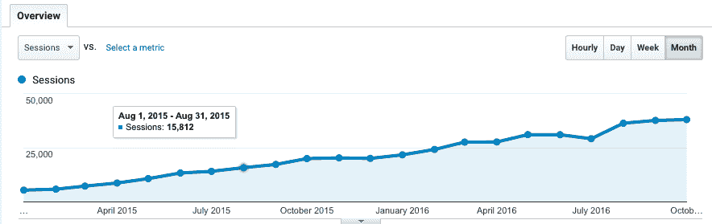

# 我如何从数据管理工具中可靠地获得每月 150 美元的收入

> 原文：<https://www.indiehackers.com/interview/how-i-reliably-generate-150-mo-from-a-data-management-tool-a8045a45ee>

## 告诉我们关于你自己和你正在做的事情。

我叫[亚当·迪姆](https://twitter.com/atdiehm)，我是一名网络开发人员、搜索引擎优化专家和企业家。我拥有多个企业以及一些网络项目。

我的项目【Delim.co 被 SEO 专家、开发人员和其他许多希望在列和逗号分隔列表之间转换数据的人使用。

## 你是怎么和 Delim.co 开始的？

我最初是为自己开发这个产品的，因为我有很多客户通过电子邮件向我发送数据电子表格，并希望从他们的 web 应用程序中获得报告。当时我在我的公司做开发，我自己开发了主要的功能，我的员工也在布局和功能添加方面提供了帮助。

我想其他人也可以使用我工具的功能，所以我把它放到了 Delim.co[的网上。我最初的目标是，它可能会赚一些钱，并获得数百名用户。然而，今天我们的使用率和收入都比我最初的预期高出 10 倍。](http://delim.co/)

## 你花了多长时间建造它？

最初的版本投入了大约 20 个小时，至少有 50 个小时的持续开发——添加高级功能和调整各种东西。

## 随着时间的推移，你是如何扩大你的用户群和收入的？

我在 2014 年年中开始这个项目，我们从第一天开始就通过 Google AdSense 赚钱。

每天都有新用户通过 SEO 找到我们，因为我们是大多数相关网络搜索的顶级排名工具。我们每天总使用量的大约 80%来自回头客。因此，随着新用户找到产品，我们的总体使用量也在增长。我们持续看到每月 10%的使用量增长。

我还在 Twitter 上获得了重要的反馈和分享/提及，这总是令人高兴的。

## 如果你必须重新开始，你会做什么不同的事？

没什么。这个项目确实和我想象的一样。这是一个有用的工具，由于其简单性和处理单一目的的能力而广受欢迎。

我正计划推出一个宽屏设计调整，并将在 2017 年进行全面的重新设计。

## 我们可以去哪里了解更多？

你可以在推特( [@atdiehm](https://twitter.com/atdiehm) )和[脸书](https://www.facebook.com/atdiehm)上找到我。我喜欢为在线企业/初创公司提供用户获取和盈利方面的咨询，并为其做 MVP 工作。我也在 Instagram 上分享好喝的啤酒[的照片。](https://www.instagram.com/atdiehm/)

你也可以在下面留言，我会尽量回复你的！

——[<picture id="ember8003221" class="user-avatar ember-view user-link__avatar"></picture>阿特迪耶姆](/atdiehm?id=m9Ygcb0Ub4TQlT4USn3TSNiwE5y1)【Delim.co 的创造者

## 想像 Delim.co 一样建立自己的事业吗？

你应该加入独立黑客社区！🤗

我们是几千名创始人，互相帮助建立有利可图的业务和副业。来分享你正在做的事情，并从你的同事那里获得反馈。

还没准备好开始使用你的产品吗？没问题。这个社区是一个认识人、学习和实践的好地方。随意[随便浏览](/)！

——[<picture id="ember8003226" class="user-avatar ember-view user-link__avatar"></picture>柯特兰艾伦](/csallen?id=ibTLPyjwVebnZjMGKvz6ztarnuV2)，独立黑客创始人

7votes