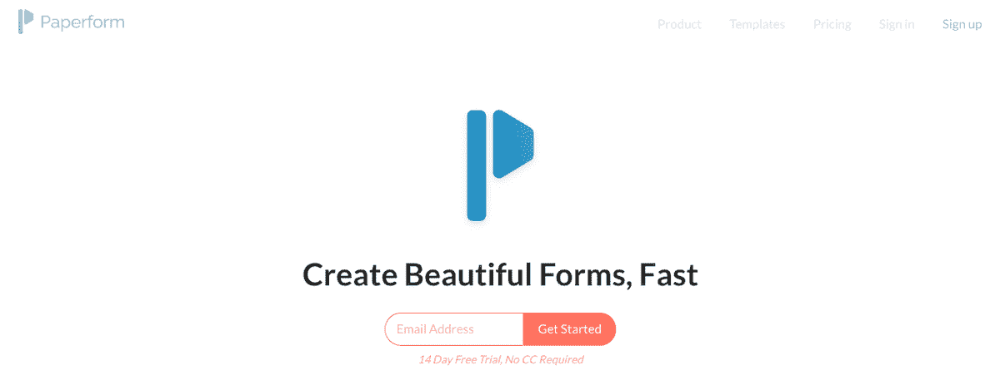
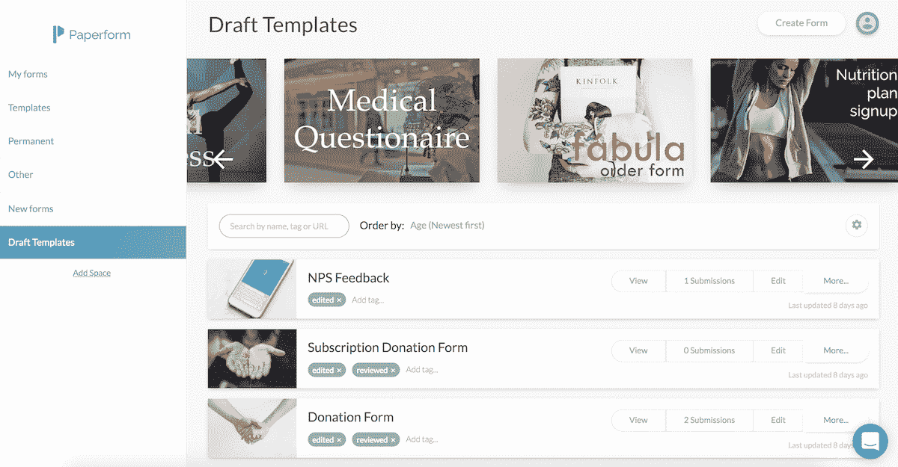
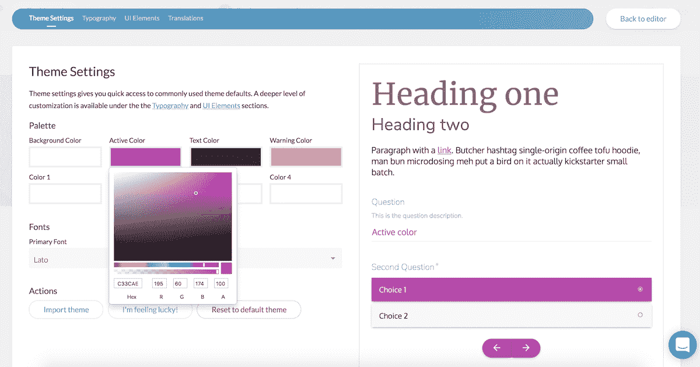

# 我如何冒着风险和我的配偶一起建立了一个每月 24，000 美元的生意

> 原文：<https://www.indiehackers.com/interview/how-i-risked-it-all-by-building-a-24k-mo-business-with-my-spouse-69c977f314>

## 你好！你的背景是什么，你在做什么？

嘿！我是 Diony McPherson， [Paperform](http://paperform.co) 的联合创始人。Paperform 是一个在线表单创建工具。我们直观的表单生成器帮助非技术人员快速创建他们自己的表单，这些表单看起来很棒，并根据他们的确切需求量身定制-无论是产品支付、活动注册、新客户入职还是呼啦圈课程！与其他工具不同，使用 Paperform 制作的表单可以根据您的品牌风格进行设计，并完全控制字体、颜色和图像。我们致力于让人们在不成为开发者的情况下，在网上创造不可思议的东西。

我负责运营和支持，并喜欢管理业务的财务和法律方面。我的背景是策展工作(博物馆和画廊)，由于对技术的热爱，我发现自己是澳大利亚谷歌艺术和文化的负责人。

迪恩是我的联合创始人，也是一名出色的网络开发人员。他拥有音乐和哲学学位，但自学了编程，大学毕业后开始在科技领域工作。

我们结婚了(总是忘记提到这一点！).我们在澳大利亚悉尼生活和工作，有一个可爱的九个月大的小宝宝，她也让我们很忙。迪恩和我总是详细地谈论我们的工作，甚至在我们开始创业之前。我们都有创新和完成工作的热情和动力，但在这个过程中有不同的优势，所以创业是显而易见的。它的成功有两个主要原因:1)巨大的相互尊重。我们寻求对方的建议并(通常)采纳。2)我们独立工作，但相互协作。例如，我们将密切配合一个项目，但不要干涉其他人的任务，除非他们要求我们这样做。

Paperform 目前的 MMR 为 24k 美元/月，月增长率为 10-15%。我们有超过 6000 名付费用户，总用户数超过 2 万。

 

## 是什么促使你开始使用 Paperform？

迪安有许多朋友和同事要求他为可以接受付款的活动和产品创建定制表单。我们意识到，市场上没有什么东西可以推荐给我们的朋友来满足他们的需求——易于使用、可以支付、美观、可定制。因此，对解决方案的需求是显而易见的。

接近我们的朋友已经有了很强的本地品牌，他们想要一些能让他们的品牌闪耀的东西。他们想控制局面，但需要帮助。因此，我们开始思考如何制作一个“为每个人定制”的表单生成器，于是 Paperform 诞生了。

规划和做正确的事情意味着你不需要花费大量的时间去创造一个惊人的产品。

TweetShare

在 Paperform 出现之前，我们总是在讨论技术产品，交换想法，并试图找出最佳解决方案来解决那个星期工作中遇到的任何问题。这种动力一直是电动的，所以每天都这样做并以此为生的想法是不可抗拒的。我们仍然会花一天中的很大一部分时间，对如何推动业务和产品向前发展感到兴奋。我认为这永远不会改变。

拥有一个技术上的联合创始人是无价的，尤其是像迪安这样有能力和创造力的人。Dean 在之前的工作中也有构建公司表单的经验。幸运的是，我的技能非常值得称赞。我在支持、合作、财务和法律方面有丰富的经验。所以在我们两个人之间，我们已经涵盖了业务的核心部分。

最具挑战性的方面是在我们的日常工作中找到时间来实现这一点，但我们是非常有雄心的人，团队合作得很好，所以我们只是在工作时间之外埋头苦干。我们还确保我们的工作方式是明智的。规划和做正确的事情意味着你不需要花费大量的时间去创造一个惊人的产品。

## 构建最初的产品需要什么？

迪安于 2016 年 5 月开始构建解决方案。他会在早上 5 点左右起床，在去上班前构思和制作。到 8 月份，他已经有了一个很棒的 MVP，我们在 BetaList 上发布了这个 MVP。我们有大约 300 名测试人员注册，并收到了压倒性的积极回应，以及一些重要的反馈。

通过 BetaList，我们引起了 AppSumo 的注意，他们问我们是否愿意向他们的客户提供交易。我们想，这是一个多么伟大的方式来推出这个东西，并获得一些严重的资本。因此，我们将 2016 年 12 月定为正式推出 Paperform 和 AppSumo 交易的日子。交易进行得非常顺利，我们筹集到了足够的资金，可以进行六个月的试运行。这也给了我们第一批 3K 付费用户，他们帮助我们进一步完善产品。

营销是我们的弱点之一，但推出 AppSumo 减轻了很多压力。他们在收入上有很大的提成，但就市场营销而言，这是绝对值得的。我们的其他成本主要是办公设备、建立业务和商标的法律成本，以及建立我们的技术堆栈(Intercom、Profitwell、Buffer 等等)。

做出辞去朝九晚五工作的决定是艰难的；在某一点上，我们必须做出跳跃。从 2016 年 12 月到 2017 年 2 月，我们看到了持续的增长，但还不足以支付我们的工资(从可持续性和验证业务的可行性以及饮食等方面来看，这对我们很重要)。但以我们的增长速度和资金，我们都在 2017 年 3 月辞去了日常工作，全职从事纸质表单工作，再也没有回头！这是一个有分寸的风险，最终是值得的。

从构思到推出，该产品耗时约五个月。我们专注于交付仍然非常有价值的高质量产品。这使得我们能够在接下来的 12 个月里，与付费客户一起继续完善和全面构建产品(我们在接下来的 12 个月里发布了 100 多个新功能)。这对我们来说非常有效。付费用户在反馈方面比测试者更有帮助，因为他们投入更多。

[https://www.youtube.com/embed/pkZE0M-fr4o](https://www.youtube.com/embed/pkZE0M-fr4o)

## 你是如何吸引用户和发展 Paperform 的？

我们通过建立许多更小的渠道赢得了用户并实现了增长。BetaList 和 AppSumo 是吸引用户的关键，为我们带来了第一批 3K 用户。在那之后，我们受到了当地媒体的关注，这有助于我们作为一家合法公司建立信任。产品发布后不久，我们就在产品搜索中被搜索，并成为当天的第二个产品，这仍然让我们领先。

发布后，我们很幸运地通过口碑和合作关系实现了约 20%的月环比增长。承认我们没有真正的营销策略有点尴尬。我们的冠军用户令人惊叹，因此我们很快启动并运行了一个推荐计划(您和您的朋友可以享受累计 10%的折扣，因此推荐 10 个客户是一个免费帐户),以继续鼓励口碑相传。我们即将推出一个联盟计划，它有巨大的利益，所以应该是一个很好的渠道！

我们的使命是使技术大众化。这一切都是为了赋予人们权力，让他们不受阻碍地做自己的事情。

TweetShare

伙伴关系过去和现在都很重要。Zapier 在推出几个月后联系了我们，我们赞助了纽约大学的创新竞赛，这两项活动都为我们带来了大量新用户。后来，我们与 eCoach 合作，这是一个优秀的本地合作伙伴，帮助我们在澳大利亚获得了更多的关注。尽管是一家澳大利亚公司，我们的大多数用户来自美国或欧盟。与 Stripe、PayPal 和 Braintree 的整合也有助于让我们出名。对于新企业来说，合作伙伴关系是绝佳的商机，因为它们让你接触到大量相关商机，而所有这些商机都有一家老牌公司的支持。

我们的每周简讯在与我们的用户和潜在客户沟通以及让他们对我们的路线图感到兴奋方面非常重要。有时候，领导会静静地等待，直到他们真正想要的东西变得可用。不要因为线索沉寂了一段时间就一笔勾销。我们最初也在博客上发布了一些具有杀手级 SEO 排名的帖子，这给我们的网站带来了一些流量。最近，我们加大了集客营销的力度。

简而言之，我们偶然发现了这个计划，这个计划对我们很有效:

1.  将产品放在测试列表中，以获得我们的第一批用户
2.  与一笔交易合作推出，该交易曝光率很高，并筹集了资金
3.  抓住公关机会
4.  抓住合作机会并交叉推广
5.  创建了一个推荐项目
6.  处理入站内容
7.  大约一百万条其他的途径加在一起！

目前，我们有:

*   2 万多用户
*   6K+付费客户
*   2K+活跃用户/月

## 你的商业模式是什么，你是如何增加收入的？

Paperform 是一项相当直截了当的 SaaS 订阅业务。我们有 14 天的免费试用期，然后按月收费提供我们的产品，分为三个等级:

定价:

*   15 美元/月:必需品
*   39 美元/月:专业
*   99 美元/月:代理(5 个以上用户需额外付费)
*   NPO/慈善机构:专业的“量力而行”(最低 1 美元/月)和 50%的代理折扣

所有计划都有两个月的免费年费。我们有一个推荐计划，每推荐一次，你可以获得 10%的累计折扣(所以 10 次推荐给你一个免费账户)。

AppSumo 的促销活动是终身访问 Paperform，一次性固定费用为 39 美元。后来，我们推出了促销活动，以折扣价升级终身用户，以增加财务上处于休眠状态的用户的经常性收入。

我们通过 Stripe 进行所有支付。我们在年度代理开始时尝试手动开票，但用这种方法催款是一场噩梦。我们现在使用 ProfitWell 来跟踪我们的财务状况。他们有一个叫“保留”的功能，这在催款时是不可思议的。自举和可持续发展是我们的目标，因为我们认为这是对业务可行性的验证。如果可以的话，我们建议自举和筹集你自己的资本——这给你在决策上极大的自由，并消除利益相关者带来的压力。

对你产品的价值有信心，人们就会对它的价值有信心。

TweetShare

我们在推出的第一年就已经盈利了。软件公司的优势是没有其他企业必须考虑的大量费用，所以利润率对我们来说相当高。一开始我们不需要办公室(前六个月我们在厨房的桌子上工作)。我们也不需要很多设备或商店空间。话虽如此，我们的目标是暂时花掉收入，把利润降到最低。我们希望对企业进行再投资(这样做是有意义的——我们从不建议仅仅因为“兄弟”而花钱)。因此，我们将继续为自己的增长提供资金。

收入方面最有趣的变化之一是，我们在推出的前六个月内提高了价格。我们在飞机上聊天的营销人员一直说我们对纸质表格的定价太低了。我们的主机和技术成本越来越高，所以我们咬紧牙关，将价格提高了大约 30-40%。我确信销售会停止，但是相反，我们一提高价格，销售额就显著增加了。如果你有一个高质量的产品，不要妄自菲薄，否则人们不会重视你的产品。对你产品的价值有信心，人们就会对它的价值有信心。这也意味着我们已经吸引了很棒的客户，他们非常喜欢与我们互动。原来，小气的人会抱怨很多无关紧要的事情。

 

## 你未来的目标是什么？

我们未来的目标是继续改进产品，并在我们认为需求高的领域加倍努力。例如，我们有很多用户和我们一起创建电子商务页面。由于我们是登录页面/表单的混合体，我们可以获取大量有价值的数据，同时销售产品、服务或订阅。因此，我们计划通过引入一系列基于电子商务的功能和更新来支持我们现有的产品，从而更好地支持这些用户。我们将继续审查这样的用例，并完善产品。我们相信产品就是一切。我们不会交付任何我们引以为豪的东西。

纸质表单本应是一种生活方式的业务。但它显示出如此不可思议的潜力和增长，对于任何有雄心的人来说，这是一个不可能拒绝的诱惑。为了实现这一潜力，我们已经开始建立一个令人难以置信的内部团队。我们一直依靠代理和自动化来发展我们的组织结构，但我们将在 2019 年开始招募第一名团队成员，并将继续从那里招聘。

我们还设定了营销目标——加盟计划、直接整合、更多合作伙伴关系。我们对 Paperform 的总体目标是将它构建成一个不仅仅包含表单和页面的东西。我们希望它成为一系列服务的首选工具。对我们来说，这就是赋予人们权力，让他们不受阻碍地做自己的事情。我们公司的使命是使技术民主化，这将支配我们推出的每一个产品的战略。

## 你面临的最大挑战和克服的障碍是什么？如果你必须重新开始，你会做什么不同的事？

我认为我们可以更早培养现有的冠军和粉丝。推荐计划很棒，但是我们错过了销售机会，因为我们没有启动在线社区进行讨论，也没有提前发布我们的加盟计划。

我们也认为早点雇用是明智的。我们推迟了，但是真的在第一年就开始发展团队会更好。现在，我们已经为一个非常小的内部团队制定了流程，让员工参与进来将意味着一场重大的动态剧变。这将是一件好事和必要的事情，但也不容易。

有些挑战是你无法预见的。GDPR 合规(一般数据保护法规，要求企业保护欧盟成员国境内交易的欧盟公民的个人数据和隐私)就是其中之一。如果可以的话，在你的预算中预留一些应急资金。我是一个保守的财务经理，我们有与 GDPR 相关的法律费用应急，但它并不便宜。它还花费了我们大量的时间来编写文档和实现技术更改。我们通过 GDPR 的一家专门的法律代理机构，该机构起初提供了一个包，但后来不得不由我们在美国的法律团队进行审查。我们应该直接去找我们在美国的法律团队，因为他们最终修改了很多工作。话虽如此，我们真的不可能知道这个机构是在浪费钱——GDPR 是一个未知的领域。

 

## 有没有发现什么特别有帮助或者有优势的？

我们发现一起工作很棒。与积极和友善的人一起工作，但也要尝试和挑战你、赞美你技能的人在一起。迪恩是那种一有想法就立刻付诸行动的人，而我会用电子表格计划一次野餐，如果有机会的话。一起工作意味着迪恩知道了很多事情至少需要基本的计划，我也知道了很多事情不需要文档。

我们出发时非常幸运。虽然事后来看，很容易清楚地描述 Paperform 是如何出现的，从灵感到实现，但在发布前的前六个月，实际情况远没有计划好或测试好。我们进入了一个竞争相当激烈的市场(有很多其他的模板建造商)，虽然我们有一种直觉，认为我们的产品有需求，但我们很可能错了。当我们的产品处于测试阶段时，让 AppSumo 联系我们确实点燃了我们的热情——我们有一个截止日期，并确认我们的产品在市场上有一定的吸引力。

## 对于刚刚起步的独立黑客，你有什么建议？

不要花那么多时间关注竞争对手。你只会阻碍你的创造力和创新能力。如果你擅长某事，如果你很有天赋，那就把注意力几乎完全放在你自己和你的客户身上，而只是扫一眼竞争对手。我们经常看到我们的竞争对手，其中许多是大公司，犯错误或变得停滞不前。如果我们从他们那里寻找下一步该做什么或者如何组建公司的灵感，我们会破产的。对你的市场有所了解，但要超越它。

不要向你的竞争对手寻求灵感。对你的市场有所了解，但要超越它。

TweetShare

我们看到我们的竞争对手做的最奇怪的事情之一是引入一个功能，这是对我们的自由文本编辑器的公然剽窃。这很奇怪，因为它根本不适合他们的产品。他们试图强加一个完全不符合他们用户界面的特性，并且对他们的易用性有最小的影响。看到这真的加强了我们以自我为中心的哲学。

实际上，如果你刚刚开始，并且在你的常规工作/承诺之上平衡一个新的副业项目，那么只需要安排常规时间来做它。迪安开始每天只工作一小时，在工作日上班之前。有些日子你什么也没做成，或者你没有灵感，但是仅仅出现就真的是 80%的战斗。

 

## 我们可以去哪里了解更多？

*   前往我们的网站[paperform.co](https://paperform.co/)，观看简短的演示
*   查看[示例模板](https://paperform.co/templates/)
*   [我们的博客](https://paperform.co/blog/)有很多有用的内容
*   在[脸书](https://www.facebook.com/paperform.co/)和 Twitter [@PaperformCo](https://twitter.com/paperformco?lang=en) 上关注我们

如果您有任何问题或想法，我们很乐意倾听！就在这里的评论里分享吧。我们总是对真正的聊天产品和增长持开放态度，我们不会有太多的保留。

——[<picture id="ember5237022" class="user-avatar ember-view user-link__avatar"></picture>戴奥尼·麦弗逊](/dionysiavb?id=JnVrgCndbUdlp7IVZjLMsaqno1Z2)，Paperform 联合创始人

## 想像 Paperform 一样建立自己的企业？

你应该加入[独立黑客社区](/)！🤗

我们是几千名创始人，互相帮助建立有利可图的业务和副业。来分享你正在做的事情，并从你的同事那里获得反馈。

还没准备好开始使用你的产品吗？没问题。这个社区是一个认识人、学习和实践的好地方。随便去[随便浏览](/)！

——[<picture id="ember5237027" class="user-avatar ember-view user-link__avatar"></picture>考特兰艾伦](/csallen?id=ibTLPyjwVebnZjMGKvz6ztarnuV2)，独立黑客创始人

87votes