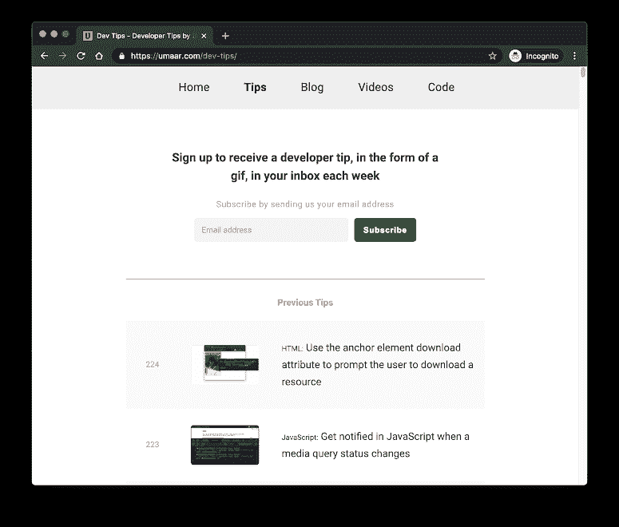
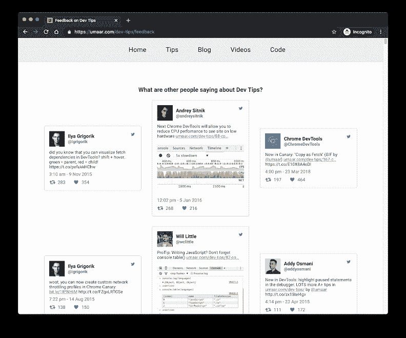

# 我如何经营一份创收的时事通讯而不至于筋疲力尽

> 原文：<https://www.indiehackers.com/interview/how-i-run-a-revenue-generating-newsletter-without-burning-out-f5a53d9cbc>

## 你好！你的背景是什么，你在做什么？

嗨，独立黑客们！我是 Umar Hansa，英国的一名网络开发人员。

我制作了 Dev Tips，一个开发者时事通讯，它以 gif 的形式展示了一个小的工作流程。我给它的口号是“开发者提示，以 gif 的形式，每周放在你的收件箱里。”目前大多数“提示”都是关于 Chrome DevTools 的。时事通讯通过赞助它的公司赚钱，这意味着我在邮件中包含了他们产品或服务的链接。

除了开发技巧，我还专注于为 web 开发人员创建教育内容。

## 是什么促使你开始使用开发技巧？

我制作教育内容已经超过十年了。我选择了我的第一批教程中的一个，一个关于 WebSockets 的教程，只是因为我想了解更多关于它的知识，其余的从那里开始。

【T2

在发布新闻稿之前，我在同一领域有几个其他项目。实际上，我在 2014 年制作了一个 DevTools 视频课程，最终成为了那一年 [Tuts+](https://tutsplus.com/) 上最受欢迎的代码课程。早在 2014 年，我还在 Twitter 上分享了一些基于截图的技巧，这些技巧似乎引起了一些关注。我甚至做了一些关于开发工具技巧的小范围会谈！

这个话题无关紧要。对我来说有价值的是:

1.  至少对一项技术有深入的了解
2.  为了理解开发人员如何学习

我开始制作 gif 来分享，并把它们发布在社交媒体平台上，人们似乎喜欢它们。一旦我做了一堆，我就把它们移植到我自己的网站上，然后粘在邮件列表的注册表单上。(那也是我开始在 Shazam 做前端 web 开发人员的时候。)

基于文本和视频的教程很棒，但我发现缺乏约束有时会妨碍我的创造力！有了 20 秒的 gif 或视频，我被迫跳出框框思考。

我考虑的一些事情是:

1.  如何用尽可能少的步骤展示这个复杂的工作流程？
2.  我怎样才能最大限度地减少视觉干扰？
3.  我怎样才能限制这段录像的视觉移动，使最终的 gif 文件不至于太大？
4.  考虑到我所展示内容的复杂性，我如何相应地调整节奏？

这些都是录制一个短片的因素！

## 构建最初的产品需要什么？

Dev Tips 由两部分组成，邮件列表和网站。

作为一名开发人员，我能够很快开始设置基础设施。搭建博客平台，创建 gif，配置邮件列表等。整个事情主要是基于内容的，没有评论，过滤，搜索，或任何类似的事情。只是一堆指向带有 gif 的网页的超链接。我估计我花了两天时间才开始(用已经存在的一组 gif 开始分享)。我的工作是制作内容，而不是任何基础设施。

基于内容的邮件列表的本质意味着我不需要太多就可以开始。所以在这个领域没有挑战。我心中的网络开发者一直在说，*会员怎么样，使用 CMS 怎么样，推送通知可能是个好主意*，等等。我把这样的想法保存在个人减价文件中，从那以后再也没有碰过它们。

## 你的技术是什么？

网站从降价文件开始，通过[大口](https://gulpjs.com/)变成一个静态生成的网站。然后，我部署到我自己的虚拟专用服务器上。这种方法的好处是，我可以在不到一分钟的时间内部署到生产环境中，即使要生成数百个页面。这是因为一切都是从头开始创建的，完全绕过了任何不必要的技术或框架。

这个堆栈已经保持了五年。它有效，不仅如此，它对我的用例也很有效！

我所面临的最大的技术挑战是 gif 本身。人们普遍认为 MP4 等视频文件更适合网络，而 gif 在网络和计算上都很繁重。

我最初使用 gif 是因为这对于邮件列表来说效果很好(我不知道在发送电子邮件时嵌入视频的另一种选择),所以总是优先输出 gif。我在网站上使用 MP4 视频而不是 gif 的方法仍有待决定，因为无论我采取什么方法，都必须为数百个现有的提示工作——这意味着这不是一个快速的工作。

对于邮件列表，这是一个标准的 [Mailchimp](https://mailchimp.com/) 设置。

## 你是如何吸引用户和开发技巧的？

你可能已经听过这种观点，但我相信我向人们传递价值，他们支持我的旅程，无论是公开分享反馈，还是注册邮件列表。

增长是自然的，因为我没有从头开始一个“新”产品，例如，拥有自己的 Twitter 账号和专用域名等，而是继续使用我的个人 Twitter 账户和现有网站，这些网站已经有了一些粉丝和流量。我对我在网上所做的一切的心态是，它只是我自己的延伸，是我喜欢做的事情。我想人们会注意到这种激情，他们会感激我发出的建议中有一种人格力量。

我对我在网上所做的一切的心态是，它只是我自己的延伸，是我喜欢做的事情。

TweetShare

我月经来了很长时间(几个月！)不创建任何内容，也不发送任何电子邮件，所以考虑到我的不一致性，我觉得流量一直相当稳定是很幸运的！

我觉得我没有在市场营销上投入太多精力，但是在会议上谈论 DevTools 确实有所不同，帮助我建立了信誉。偶尔，一个拥有大量关注者的社交账户会分享我的一个小技巧，这对曝光绝对有帮助。

## 你的商业模式是什么，你是如何增加收入的？

赚钱一般归结为两件事。要么一家公司会付钱让我把他们的链接放在一封 Dev Tips 时事通讯的电子邮件中，要么一家公司会付钱让我写一篇他们服务的赞助评论，这篇评论会在 Dev Tips 网站上发表。

对于后者(赞助商评论)，我在 90%的情况下都会拒绝。这是因为他们几乎总是更希望我发送一封专门的评论邮件，但是我认为这对我的邮件列表订阅者来说太打扰了，所以才会被拒绝。

我的第一个“客户”是谷歌——确切地说，是谷歌开发者。但是，考虑到我对 Chrome DevTools 所做的大量提示，这可能并不令人惊讶！让他们赞助我给了我动力，这促使我与其他公司讨论赞助事宜。

肯定有所帮助的是，个人订户会偶尔伸出手来，说他们多么喜欢这份时事通讯...碰巧的是，这些订阅者是他们各自公司决定时事通讯赞助的人，所以这很有帮助。

我的主要目标从来不是最大化收入，而是分享知识和传递价值。也就是说，Dev Tips 项目已经帮助我发展了许多独立的项目，比如我的 Chrome DevTools:ModernDevTools.com 视频课程。

## 你未来的目标是什么？

我肯定会开始在一般的 web 开发主题上做更多的提示(我已经开始做了)。

我的另一个主要目标是找到能够真正帮助维持这个项目的持续赞助商，这对它的长期存在是有好处的。

## 如果你必须重新开始，你会做什么不同的事？

在营销方面，我可以做得更好。例如，Dev Tips 可能拥有世界上最大的 Chrome DevTools 动画提示库*！我没怎么提到这个事实，也许现在我会提到。*

 *考虑到我的邮件列表的大小，和其他有相似大小的邮件列表的人交谈，我肯定在赞助方面少收了钱。我试着不去过多地关注金钱，但是在某些方面，更多的钱可能意味着润色时事通讯，改进设计，增加人们要求的功能等等。

## 有没有发现什么特别有帮助或者有优势的？

当我在 DevTools 上分享技巧时，我会仔细检查代码库的提交日志，以确保我分享的内容是准确的，同时也确保我了解该特性应该如何工作，这样我就可以回答人们的问题。浏览你制作内容的软件的原始源代码并不总是必要的，但对我来说，这很有帮助。

时机也在这里发挥了作用。如果某样东西刚刚登陆 Canary(Chrome 的夜间版本)，假设它是有用的，我还是会分享它。我相信我的观众很高兴得到这些“摘要”,了解他们每天使用的工具是如何发展的。

我将在下一个问题的回答中对此进行更多的解释，但简单地说，我能够获得 200 多个技巧并投入数百个小时的一个原因是，我并没有因为这个项目而筋疲力尽。而倦怠不足的原因呢？有时候我会几个月不发任何东西！没有主要的利益相关者，这是一个完全免费的资源，所以在这种情况下，我很幸运，我的观众不介意沉默！

一件有助于赞助的小事是有效地拥有一堆证明。如果有赞助商想知道更多关于人们对我的项目的看法，我可以让他们去 Dev Tips 反馈页面，那里目前有数百条关于我所做内容的推文。

## 对于刚刚起步的独立黑客，你有什么建议？

我不想听起来像一张破唱片，但在我看来，有经验的人分享的智慧仍然适用:

1.  做你喜欢的事情
2.  不断学习
3.  要耐心

我也认为你会得到你所投入的。例如，相对于我花在创造内容上的时间，我的营销努力是微不足道的。因此，我没有实现收入最大化。

现在，我没有积极的赞助，但这也是因为我在过去的几个月里没有要求公司。就我个人而言，这对我来说很有效，因为我全年都可以浏览时事通讯，只有当我有真正有用的东西可以分享时，我才会去写。我也认为这是为什么我没有被开发技巧项目搞得精疲力尽。

想想你希望得到什么。你想建立你的品牌，最大化收入，增加你的技能，创造被动收入，获得大量的追随者，无私地分享吗？

TweetShare

接下来，我可以分享的一个经验是思考你希望得到什么。你想建立你的品牌，最大化收入，增加你的技能，创造被动收入，获得大量的追随者，无私地分享吗？所有这些目标都可以用稍微不同的方法实现，经过几年，这些方法真的可以改变你的轨迹。所以仔细想想你想要什么！

## 我们可以去哪里了解更多？

我在开发技巧上投入了数百个小时，它仍将是一个免费资源。如果你有兴趣支持它，请去看看！

你可以在这里注册 Dev Tips 邮件列表[。](https://umaar.com/dev-tips/)

我在 [Twitter](https://twitter.com/umaar) 上分享了大量的网络开发技巧。

我在这里写关于技术概念和职业相关的东西。

我还在 DevTools 上制作了[视频课程。](https://moderndevtools.com/)

如果你对此感兴趣，我很乐意讨论更多！请在评论中告诉我👇️

——[<picture id="ember8121229" class="user-avatar ember-view user-link__avatar"></picture>欧麦尔·汉萨](/umar?id=WfbOecIxtXWkOHBjO5vMdi9knIp1)【德夫秘笈】创始人

## 想像 Dev Tips 一样建立自己的事业？

你应该加入独立黑客社区！🤗

我们是几千名创始人，互相帮助建立有利可图的业务和副业。来分享你正在做的事情，并从你的同事那里获得反馈。

还没准备好开始使用你的产品吗？没问题。这个社区是一个认识人、学习和实践的好地方。随意[随便浏览](/)！

—[<picture id="ember8121234" class="user-avatar ember-view user-link__avatar"></picture>考特兰艾伦](/csallen?id=ibTLPyjwVebnZjMGKvz6ztarnuV2)，独立黑客创始人

22votes*