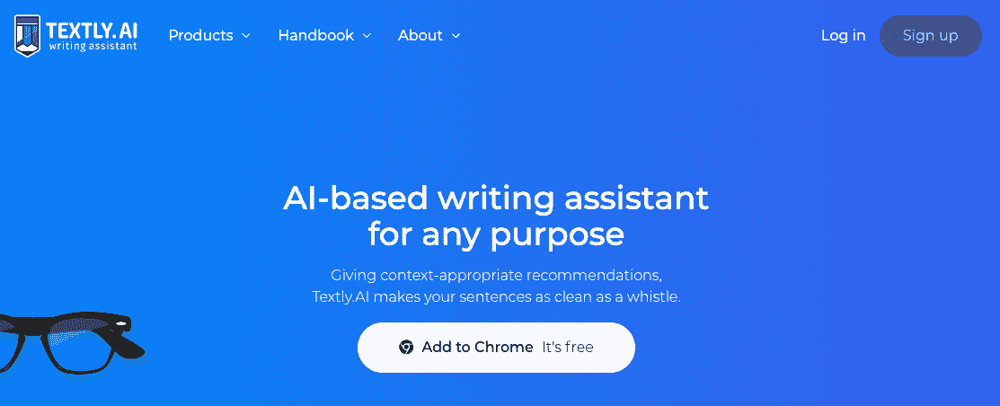
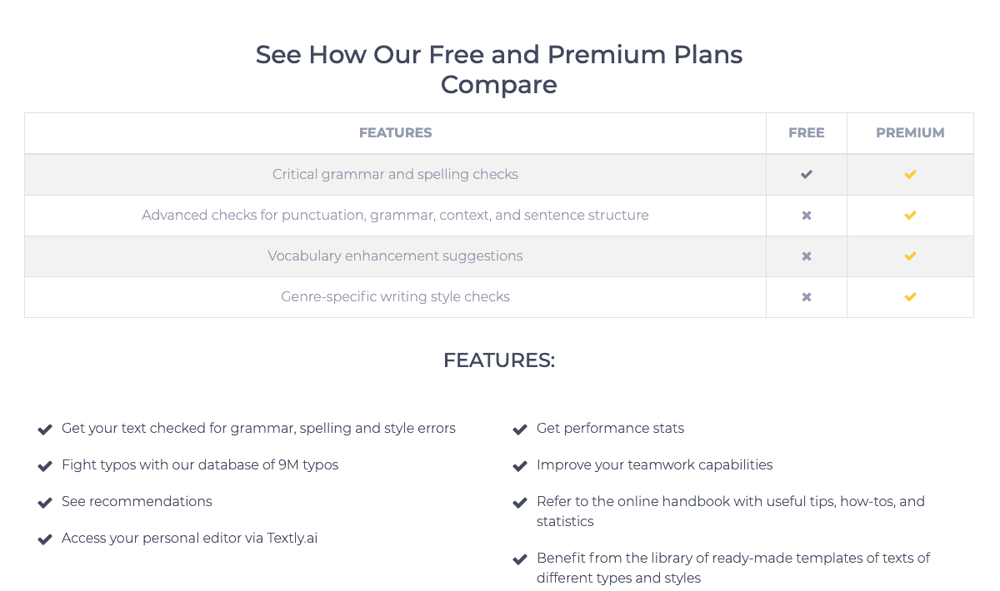
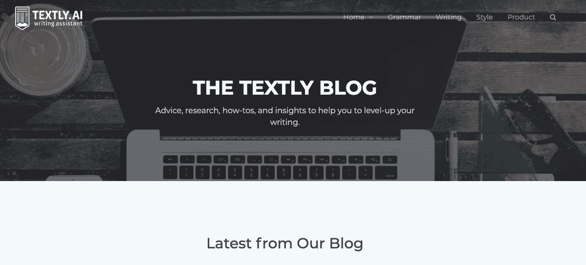

# 我如何搔搔自己的痒处，发现了一个未开发的市场

> 原文：<https://www.indiehackers.com/interview/how-i-scratched-my-own-itch-and-discovered-an-untapped-market-d9fe88d6df>

## 你好！你的背景是什么，你在做什么？

我叫亚历山大·拉什科夫，是一名专业的内容营销人员和记者，有大约九年的从业经验。我在佛罗里达州的迈阿密经营着一家名为 [Smile Bright Media](https://smilebright.media/) 的公司，现在我与人合伙创办了 [Linguix](http://linguix.com) 。这是一个语法检查软件，对任何为了工作、娱乐或教育而在网上用英语写作的人都很有用。

到目前为止，我们拥有大约 4，700 名用户，每月销售的第一批订阅总收入约为 1，000-1，200 美元。

 

## 是什么促使你开始使用 Linguix？

我的母语不是英语，但我的主要工作是写作——作为一名内容营销人员，我写了很多内容，英语是我所在机构的客户最常用的语言之一。此外，我还必须管理一个由本地和非本地内容创建者组成的团队，因此我需要一个工具来发现和修复错误和打字错误，并提供关于风格增强的建议。

而我发现了这样一个产品:Grammarly。然而，随着时间的推移，我意识到它不是创建和修改内容的理想工具。因此，我决定开发一个新工具，它只具备必要的功能，轻便快捷，对用户隐私提供更多的控制，并在内容创作和语言学习方面提供帮助。一旦我下定决心，我就去我的家乡会见我的联合创始人维塔利，他现在是我们的首席技术官，负责监督开发过程。

## 构建最初的产品需要什么？

我花了很长时间才到达林贵斯。我之前已经有了自己的公司——一家网络内容营销代理公司——但我一直想投身于技术领域，致力于产品而不是服务。但是我知道我的技术能力不足以构建一个最基本的 MVP，也许更重要的是，我不知道我会做什么。

在建立我的机构时，我使用了许多不同的软件工具，其中最有用的是语法工具。我做了快一年的付费用户。然而，这个工具缺少一些我需要的功能，反而有很多对我没用的无用的东西。例如，你可以订购人工校对服务(我已经为语法检查付费了！)或者检查你的文章是否抄袭(如果你在制作自己的电子邮件，这并不重要)。我既不需要也不想要这些功能。我想要的是对隐私的更多控制和一些内容创建帮助，比如帮助启动写作过程的内容模板(有时很难克服作家的瓶颈)。最后，太贵了。所以我认为拥有一个轻量级的、面向隐私的、更便宜的工具会很酷。

挠挠自己的痒。它将帮助你了解如何使现有的解决方案更好或提供新的东西。

TweetShare

这是主要的想法，但我需要有人可以编码。幸运的是，我刚好联系到了我们现任的首席技术官维塔利，我们在 Telegram 上的普通“你好吗”对话变成了一次线下会议，我们在会上讨论了这个想法，并决定建造它。从那时起，我们花了几个月的时间进行市场调查，完善这个概念。到夏天结束时，我们开始编码，获得了一个域名，并雇佣了一名 web 开发人员来构建 web 应用程序本身。

到 2018 年 12 月，我们已经有了一个工作中的[网络应用](https://app.linguix.com)，但主要产品——针对 [Chrome](https://chrome.google.com/webstore/detail/textlyai/ndgklmlnheedegipcohgcbjhhgddendc/) 和 [Firefox](https://addons.mozilla.org/en-US/firefox/addon/linguix/) 的浏览器扩展——仍在开发中。我们又花了几个月的时间编码，在 2019 年 3 月初全面上线。

以下是我们正在使用的一些技术:

*   RxJS
*   SCSS
*   Socket.io
*   网络包
*   消息包
*   一种数据库系统
*   自举 4
*   拉勒韦尔

我们花了大约 30，000 美元来建造最初的产品，因为我已经从我的其他业务中获得了收入来源，所以我提供了初始资金。

## 你是如何吸引用户并发展 Linguix 的？

在我们的扩展就绪后，我们积极地开始推广。尽管我有办法提供一些初始资金，但我们仍然是一家初创公司，所以预算很紧张，我们必须在营销方法上有点创意和创新。

我们的战略是不仅在英语国家，而且在人们也积极学习英语的地区，如拉丁美洲、东欧、亚洲等，努力发展业务。

为此，我们已经本地化了一些营销材料，并找到了用户生成的内容社区来分享这些翻译的作品——西班牙语的 [Taringa](https://www.taringa.net/) 和 [Meneame](https://www.meneame.net/) ，俄语的 [Habr](https://habr.com/en/) 等。此外，事实证明，您可以找到合适的子编辑(如西班牙语的 r/aprendeingles)，效果非常好。我们甚至被西班牙语、俄语和阿拉伯语的记者和博客作者发现了，他们写了一些关于 Linguix 的评论，给了我们很好的初步推动。

我们还试验了 [BetaPage](https://betapage.co/) 和 [BetaList](https://betalist.com/) ，BetaList 实际上给了我们几百个用户。我们发起了[产品搜索](https://producthunt.com/posts/textly-ai)，但那天没有进入前五名。尽管如此，社区还是喜欢这个产品，我们得到了一些积极的反馈和新用户，我们卖出了一些首批订阅。

现在，我们正在尝试不同语言的内容营销:博客、游击营销和社交媒体营销。在这篇[帖子](https://smilebright.media/blog/thousands-of-users-for-200-bucks)中，我已经谈到了我们迄今为止用于内容推广的每一个网站和工具。

国际营销的最大问题是你不知道不同国家的网络上流行什么。例如，西班牙的 Reddit 和 Quora 是什么？土耳其或中国人在哪里发表博客？我以为我擅长谷歌搜索，但是这个难倒了我。我找到了一些或多或少有用的 Quora 线程，仅此而已。

我们决定，如果我们不知道答案，我们应该找一个知道答案的人。因此，我在 Upwork 上发布了一个将英语内容翻译成西班牙语的任务，收到了 10 多个母语为英语的人的申请。这些人住在从阿根廷到西班牙的任何地方，他们很乐意向我展示最好的分享内容的网站。其中一个人给出了一条建议，在 Reddit 上搜索特定国家的 sub。我们为中国市场做了同样的事情。

如果可能的话，询问母语人士在哪里张贴你的内容。如果你没有任何国际团队成员，那么在 Upwork 或任何其他自由职业者平台上支付 10-20 美元进行咨询。

## 你的商业模式是什么，你是如何增加收入的？

我们使用免费增值模式。Linguix 有一个免费版本，提供基本的书写更正，还有一个高级版本，显著扩展了系统的功能。今天，我们有三种付款计划:每月 18.95 美元，每季度 12 美元，每年 8 美元。我们使用布伦特里作为我们的支付系统。

在我们发布浏览器扩展后，我们的收入开始增长。如果用户拥有基本订阅，他们不仅会看到基本错误，还会看到高级算法发现的错误数量，因此用户希望更正更多错误并进行升级。

当我们在 2018 年 12 月推出 web 应用程序时，我们有一个付费客户。在扩展发布后，我们获得了一些用户，每月收入约为 450 美元。然后是产品搜索发布和更积极的内容营销。目前，我们已经积极推动这个项目两个多月了，月收入已经达到 1000-1200 美元。

 

## 你未来的目标是什么？

我们的开发时间表非常紧凑，包括:

*   iOS 应用(键盘)发布
*   英语语言学习知识库的发布
*   语言学习游戏的实现

我们计划在一年内将用户数量从目前的 5000 人增加到至少 50000 人。为此，我们将增加英语学习功能和教育材料，并尝试用其他语言进行营销。

## 你面临的最大挑战和克服的障碍是什么？如果你必须重新开始，你会做什么不同的事？

最大的挑战是组建团队，并为每个成员找到正确的动机，以确保快速的产品开发。一开始，我们只是在金钱上补偿我们的程序员，但事实证明，当人们拥有公司的股份时，他们往往会工作得更好。

对于程序员来说，钱不是唯一的动力。一个有经验的工程师可以在几秒钟内找到 Upwork 或 Toptal 的远程工作，每小时 30-50 美元。除了钱之外，还需要一些东西来留住优秀的人才，并激励他们尽最大努力工作。

当每个人都与结果有真正的利害关系时，事情往往会完成，而且做得很好。

TweetShare

当我们第一次开始构建时，我并不理解这一点，每当我们错过特定功能发布的截止日期时，我都感到非常惊讶。我们能够在三月份发布我们的浏览器扩展，但是我们计划最迟在二月初发布。

我们花了几个月的时间与我们的首席工程师交谈，以弄清楚发生了什么——这家伙想要做一些有趣的事情，完成具有挑战性的任务，并感觉与结果有关联。虽然这项工作很有挑战性，也很有趣，但他并没有感觉到与这个项目有任何真正的情感联系。所以我们给了他公司的股份，这也成了他的创业公司。从那以后，事情开始变得更快了。

后知之明总是 20/20，但如果我必须重新开始，这是我会改变的事情。当每个人都与结果有真正的利害关系时，事情往往会完成，而且做得很好。

## 有没有发现什么特别有帮助或者有优势的？

竞争分析真的很方便。当我们分析我们的顶级竞争对手时，我们了解到他们 90%的观众来自英语国家。然而，在其他国家也有数以亿计的英语用户，在这些地区推广产品更便宜。

我们已经尝试了多语言内容营销，效果相当不错。它使我们能够获得一个立足点，完善产品，然后扩展到针对英国本地人的营销(例如，通过产品搜索)。

 

## 对于刚刚起步的独立黑客，你有什么建议？

我的经验告诉我，你不应该仅仅因为有冲动就去创业。你应该有一个基于你个人经历的问题需要解决。挠挠自己的痒。它将帮助你更好地理解如何使现有的解决方案更好或提供新的东西。

第二，尽量快。规划出产品开发中所有潜在的延迟，以及如何应对或应对它们。花大量时间进行竞争分析，从竞争对手的经验中获得有价值的见解。

第三，试着跳出框框思考。作为一家初创公司，你没有钱进行任何实质性的营销，所以你必须有创意才能获得最初的吸引力。对我们有用的是瞄准较小的市场和我们的产品可能有潜在受众的国家，在那里获得一些用户，然后将获得成本与我们的本土市场进行比较，并制定如何转向的战略。尽管这有点非正统，可能超出了你的舒适区，但事实可能会证明，开始你的国际推广会更便宜。这种后门策略为我们节省了大量资金，并为我们提供了拓展更大市场所需的动力。

最后，不要害怕分享股权。放弃 1，000，000 美元的一小部分，胜过拥有一家零收入公司的 100%股份。你会失去一些股份，但这将有助于你组建一个团队，能够提供出色的结果，并随时支持你。在我看来，光靠工资是无法建立这个的。

## 我们可以去哪里了解更多？

你可以在[https://linguix.com](https://linguix.com)给 Linguix 试试。点击这里了解更多关于 T2 的优惠计划，或者直接安装我们对 [Chrome](https://chrome.google.com/webstore/detail/textlyai/ndgklmlnheedegipcohgcbjhhgddendc/) 和 [Firefox](https://addons.mozilla.org/en-US/firefox/addon/linguix/) 的扩展。此外，在[脸书](https://www.facebook.com/linguix/)和[推特](https://twitter.com/LinguixAI)上关注我们，并订阅我们的[博客](https://linguix.com/blog/)，在那里我们发布了许多提高你书面交流的生活窍门。

如果有人对我们有任何问题，请不要犹豫，在评论中提问。我们会尽量详细回答。谢谢你让我们上独立黑客！

——[<picture id="ember5277476" class="user-avatar ember-view user-link__avatar"></picture>拉什科夫](/alexlash?id=GEZJOkvWwxQMoGMselAGL48Zr0q2)，Linguix.com 创始人

## 想像 Linguix.com 一样建立自己的事业吗？

你应该加入[独立黑客社区](/)！🤗

我们是几千名创始人，互相帮助建立有利可图的业务和副业。来分享你正在做的事情，并从你的同事那里获得反馈。

还没准备好开始使用你的产品吗？没问题。这个社区是一个认识人、学习和实践的好地方。随便去[随便浏览](/)！

——[<picture id="ember5277481" class="user-avatar ember-view user-link__avatar"></picture>考特兰艾伦](/csallen?id=ibTLPyjwVebnZjMGKvz6ztarnuV2)，独立黑客创始人

12votes