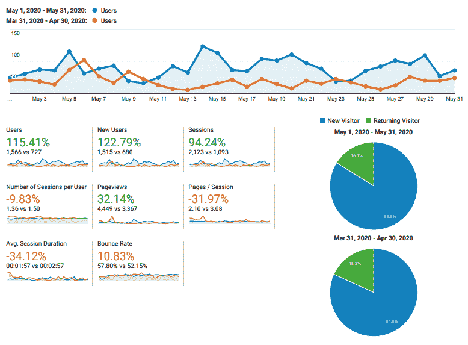
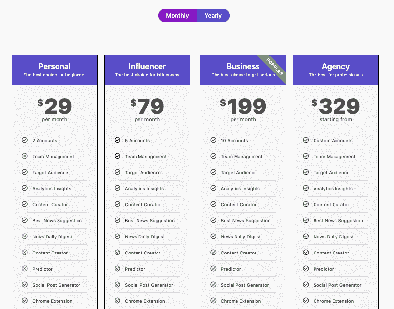
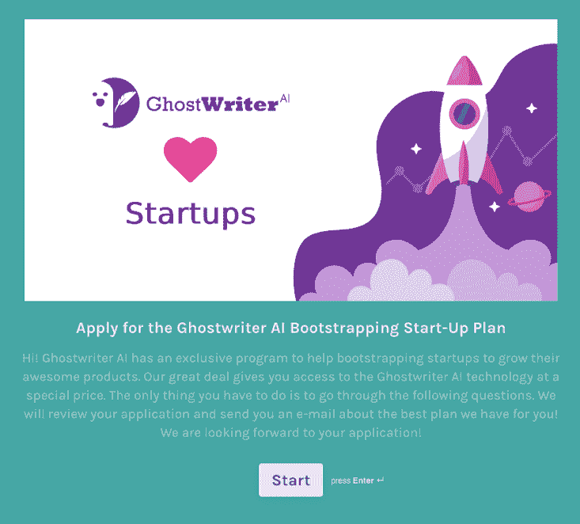

# 我是如何在组建新家庭的同时创业的

> 原文：<https://www.indiehackers.com/interview/how-i-started-a-business-while-starting-a-new-family-14472961ef>

## 你好！你的背景是什么，你在做什么？

再见。我是 Ester Liquori，[代笔人 AI](https://jt.ghostwriter.ai/ydt9c3) 的联合创始人，这是一家位于意大利的人工智能营销公司。

GhostwriterAI 是一个基于人工智能的内容营销平台，旨在描述客户，并向公司展示如何和他们谈论什么，以增加销售、利润和参与度。

有影响力的人和品牌有一些共同点:他们努力接触他们的目标受众。人们从太多的地方获得了太多的信息，而且注意力过于分散，以至于没有注意到大多数营销活动。

在与初创公司和小公司的合作中，我们发现，即使是较大的数字机构在为客户管理内容和活动时也存在类似的问题。每个人都试图凭直觉猜测人们喜欢什么，他们在哪里。这就是我们的切入点。

到现在已经五年了，今天我们每个月大约赚 1000 美元。

【T2

## 是什么激励你开始代笔 AI？

我的联合创始人毛罗·本尼奇和我都是脚痒痒的人(而且我们结婚了)。

毛罗和我在不同的公司工作。我从营销和销售活动中走了很多路，也开发了一些 Mauro 参与的我自己的附带项目。Mauro 是欧洲足联和国际足联项目的软件架构师。但是变革之风即将来临。2013 年，我怀孕了，就职的公司陷入了财务困境。

我们开始研究旅游商业领域。人们喜欢旅游和分享他们喜欢/不喜欢的信息、事件、食物和活动。这就是为什么它是新人工智能算法研究人们行为和对话的最佳起点。

我喜欢营销，喜欢发现讨论观点和兴趣的新方法。Mauro 对算法和人的行为充满热情和兴奋。我负责市场营销，毛罗负责深度技术，我们决定一起发展我们的孩子和我们的创业公司；我们的儿子，以及我们的人工智能系统。

这是兼顾商业和私人生活的新冒险的开始。

## 构建最初的产品需要什么？

第一个挑战是缺乏资金。意大利不是获得资金的合适地方。我知道这总是很棘手，但在困难之上还有稀缺。

长话短说，2018 年，我们从旅游垂直领域转向了其他领域。该系统已经发展到可以为各种业务提供分析和建议的程度，而旅游业还停留在旧的营销技术上，所以我们能提供的服务有限。

于是代笔艾在 2018 年诞生了。有了新的 MVP，在我们转向之前创造的资产，以及我们的第一个重要客户，著名的 [Moleskine](moleskine.com/en/) ，我们开始了众筹活动。我们成功了，获得了 14.2 万美元的资助；一股发展和改进系统的新鲜空气。

有时候你真的很沮丧。你问自己，你的“为什么”，这个驱使你成为企业家的东西，是否仍然足够敏锐和坚韧。

TweetShare

我们过去是，现在仍然是[英特尔人工智能的一部分。构建程序](https://builders.intel.com/ai)，以及 [Nvidia Inception 程序](https://developer.nvidia.com/inception-program)。两者都帮助我们获得了重要的资源来发展我们的人工智能。像这样的项目确实帮助我们有了一个良好的开端。

## 你的技术是什么？

我们使用的编程语言是 C#(。Net 核心)、Python 和 Golang。一般来说，C#用于 API 和后端。用于人工智能模型的 Python。去需要它的地方。

对于前端，我们正在用 [VueJs](https://github.com/vuejs/vue) 做 SPA。人工智能研究在[英特尔 OneApi 云](https://devcloud.intel.com/oneapi/get-started/)和[AWS 上的 Nvidia GPU](https://aws.amazon.com/nvidia/)上进行。

大部分电力在 [Kubernetes](https://kubernetes.io/) 上 [DigitalOcean](https://www.digitalocean.com/) 和 AWS 上。对于关系数据，我们使用带有 [TimeScaleDB](https://www.timescale.com/) 的 [Postgresql](https://www.postgresql.org/) 。非关系数据库有 [Redis](https://redis.io/) 、 [Datastax](https://www.datastax.com/) 和 [Elastic](https://www.elastic.co/) 。

堆栈中的重大变化是从以 Windows 为中心的体系结构(Windows、SQL Server 和。Net Framework)升级到当前的版本。最近，我们有几个人工智能模型正在从 Tensorflow 迁移到 PyTorch。

随着大量数据的不断处理(包括实时查询)，需要不断进行优化和监控工作。一分钟的停机时间可能会导致客户警报和报告延迟几分钟。

不用说得太具体，我们的链包括吉拉，GitLab，Jenkins，MlFlow，AirFlow，SonarCloud，Rollbar，UptimeRobot，Slack 和 ELK with ElastAlert。身处自然语言处理这样一个竞争激烈的领域，一方面要做到又快又准，另一方面也要不断提升自己的技术。

在公司的两个灵魂之间找到正确的平衡是我们成功的关键。研究中的每一项进步都必须能够转化为我们客户的实际和当前的竞争优势。否则，它们在纸面上仍然是毫无价值的数字。

## 你们是如何吸引用户，让代笔 AI 成长起来的？

我们的增长始于今年的疫情·新冠肺炎时期。

我举办了一些关于营销问题的定期网络研讨会，使我们的意大利基地从 20 名意大利营销热情人士发展到 454 名。与此同时，我们理顺了漏斗，并开始使用 [ActiveCampaign](https://www.activecampaign.com/) 来管理营销自动化活动。

【T2

5 月，我们在一个热衷于营销的垂直社区 [Zest](https://zest.is/) 上开展了几次测试活动，我们开始在 Hacker News、独立黑客和脸书的一些垂直团体上发布我们的帖子。

这些行动在 45 天内让我们的试用用户增加了+254。我们的新联系人数从 2018 年的 320 人增长到 2019 年 6 个月的+708 人。此外，我们的流量也在增长，使我们的数量翻了一番。

为了在技术方面改进我们的博客内容(尤其是长篇博客)，我们从一个定制的 CMS 转移到了 WordPress。这使我们能够处理 SEO，甚至由于 Elementor 站点构建器而使网站更容易更改。

我们还在 Zest 上投放了一些 PPC 广告，这对营销专业人士来说是一个非常合理的渠道。

作为首席执行官和营销人员，我正在努力提高我们的域名权威(DA ),我正在寻找有价值的客座博文社区。

## 你的商业模式是什么，你是如何增加收入的？

我们是 SaaS，根据我们用户的需求有不同的计划。我们今年开始向客户收费，从我们的网络中寻找早期用户。你可以挑选适合自己的产品，然后在 14 天的免费期后使用 Stripe 在线支付。

我喜欢这个过程是因为我们的入职。您可以随时预订演示，并与我交流您的想法或期望。这样做真的很有帮助，因为我能够从客户的问题中学习。这让我们进步了很多。

我们赚了大约 1000 美元的 MRR，对于一家成立五年多的公司来说，这确实很低，但这是有原因的。

第一个原因是人工智能营销仍然是新生事物，人们带着怀疑的眼光看待它，尤其是在意大利，那里仍然缺乏真正的风险文化。这就是我们决定将市场转移到美国的原因。

另一个原因纯粹是技术性的。人工智能引人注目，令人着迷...但是*笨*。当你从零开始创造你的人工智能时，你需要让它成长，这是一个缓慢的过程。这是一个充满潜力的空盒子，就像一个正在成长的孩子。除此之外，任何类型的枢纽重置数字。你重启所有东西。

在这种情况下，我对其他人的建议是*不要固执*。热爱你的想法是可以的，但你需要明白它是否因为某种原因而成长受阻，为什么。那就另辟蹊径。

例如，我们知道意大利不是我们高科技系统的首选市场。这就是为什么我们希望将市场从意大利转移到美国，那里的人们更愿意接受新技术，也更愿意尝试。现在，我们推出了新的价目表，以公平的月价格帮助其他小型企业发展。我们的计划起价为 29 美元、79 美元、199 美元。

我们热爱创业公司，我们知道创业初期有多困难。这就是为什么我们也有一个独特的启动计划，任何人都可以在这里用简短的[申请](https://jt.ghostwriter.ai/fva3zy)。它可以为你的入职提供独家帮助，延长免费试用期，然后，如果你发现 Ghostwriter AI 符合你的需求，你还可以获得第一年的折扣。除此之外，代笔人工智能仍然是免费的，只有一个帐户使用和一些基本分析。

我们的主要成本是员工和会计服务(意大利的税收管理和法律是一个真正的痛苦)。其他成本显然与我们的核心业务相关:

*   数字海洋:400 美元/月
*   active campaign:129 美元/月
*   用户指南:99 美元/月

## 你未来的目标是什么？

未来几个月我们有很多目标！

在商业方面，我们将寻求新一轮投资。我们需要更多的资源来发展和做好营销。为此，我们需要面对新的收入和增长目标。

我们的 MRR 是稳定的，我们需要在几个月内至少增加 10%。随着流量的增加，转化率显示了市场的兴趣，我们必须抓住这个机会。

## 你面临的最大挑战和克服的障碍是什么？

最大的障碍确实是个人的。

作为一名创始人，我必须照顾好我的企业、利益相关者和员工。作为一个人，我要照顾好自己和家人。我的丈夫，如前所述，是我的联合创始人，太容易失去时间观念，花太多时间专注于我们的业务。我们必须平衡事业和生活。

我儿子现在才六岁。他跟着我参加会议，启动活动，博览会。抚养他是一个挑战。我们周围没有其他父母来帮助我们。我在游泳池外等他的时候远程开会。

有时候你真的很沮丧。你问自己，你的“为什么”，这个驱使你成为企业家的东西，是否仍然足够敏锐和坚韧。

更难的是，我是一个科技领域的女性创始人。人工智能似乎不适合女性。甚至创业看起来也不适合女性。作为一名女性，你可能很难筹集资金。

对所有想开始或已经开始但充满疑问的女孩:保持专注。不是因为你是女生。你是一名企业家，企业家精神对任何人都具有挑战性。

事情在发展，女性现在被认为是“好”的首席执行官，这是有可能的。

## 有没有发现什么特别有帮助或者有优势的？

打造自己的品牌。*你是你的创业公司*，你是你的企业。投资者为你买单。你的想法可以和别人一样，但你有自己的运作方式。

永远不要停止学习，永远不要停止好奇，还要花时间停顿一下。

我试着花时间做瑜伽或跑步。当我紧张的时候，我会画画。找一些能帮助你放松的东西。这对你来说极其重要。

学习是根本，但你不可能让所有人都开心。处理好这个。

TweetShare

强迫自己使用一个包含休息时间的时间表，但是也要检查你是否在做你计划好的事情。逃避你必须做的事情太容易了。

## 对于刚刚起步的独立黑客，你有什么建议？

你周围的人很挑剔。招聘时不要只相信简历。求证明。

永远不要推迟决定，这可能会让你付出很大代价。

成为你的第一个销售冠军，你会从你的潜在客户身上学到很多。

也要能够优先考虑你从客户那里学到的东西。学习是根本，但你不可能让所有人都开心。处理好这个。

我最近收到一个很棒的建议:做一些特别的东西，让人们觉得自己很特别。(这对你的客户和你的爱人都有效。<3) For my followers, I try to put something handy in my monthly newsletter. It's not a repurpose of the articles that we published, it's something new that I've discovered in the month, a test, experiments, a book, a course.

## Where can we go to learn more?

You can give Ghostwriter AI a try at [代笔艾](https://jt.ghostwriter.ai/ydt9c3)。

当我们认为我们在构建内容和监管方面有令人兴奋的事情要说，或者我们有一些实验要分享时，我们会将它们发布在我们的[博客](https://ghostwriter.ai/blog/)上。您也可以通过 [Twitter](https://twitter.com/AiGhostwriter) 和 [Linkedin](https://www.linkedin.com/showcase/ghostwriterai/) 与我们取得联系。

另外，你可以在这里注册以人为中心的时事通讯[。](https://jt.ghostwriter.ai/u3plgp)

如果有人对我们有任何问题，请不要犹豫，在评论中提问。我们会尽力回答任何问题。谢谢你让我们上独立黑客！

——[<picture id="ember8036542" class="user-avatar ember-view user-link__avatar"></picture>酯利科里](/esterliquori?id=CSkrJs5VxLXNtxUVXFIKJYXRfop2)，代笔人艾的创始人

## 想像代笔 AI 一样建立自己的事业？

你应该加入独立黑客社区！🤗

我们是几千名创始人，互相帮助建立有利可图的业务和副业。来分享你正在做的事情，并从你的同事那里获得反馈。

还没准备好开始使用你的产品吗？没问题。这个社区是一个认识人、学习和实践的好地方。随意[随便浏览](/)！

——[<picture id="ember8036547" class="user-avatar ember-view user-link__avatar"></picture>柯特兰艾伦](/csallen?id=ibTLPyjwVebnZjMGKvz6ztarnuV2)，独立黑客创始人

11votes