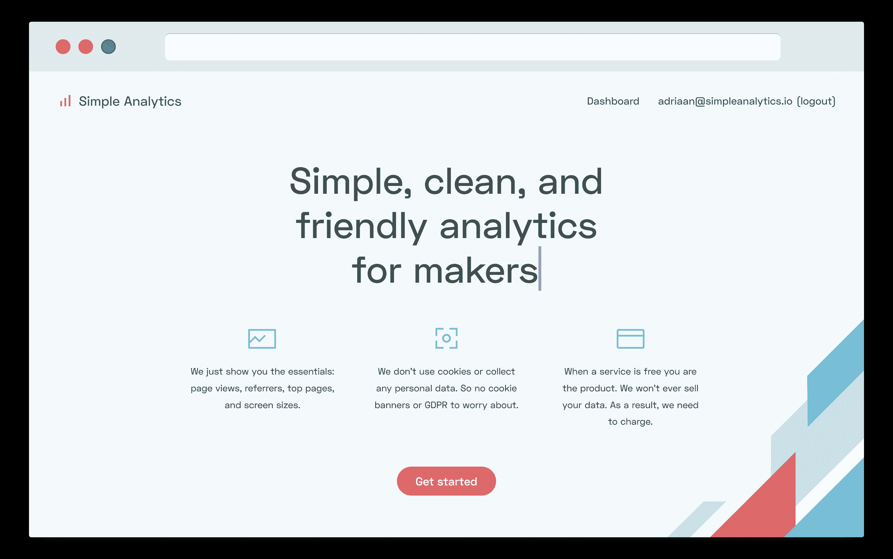
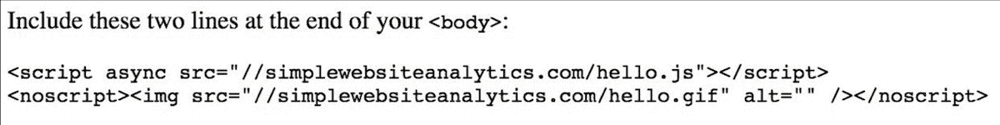
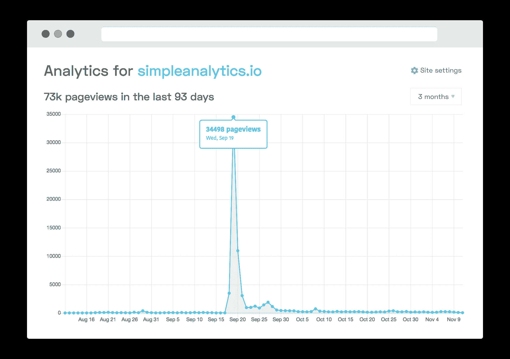
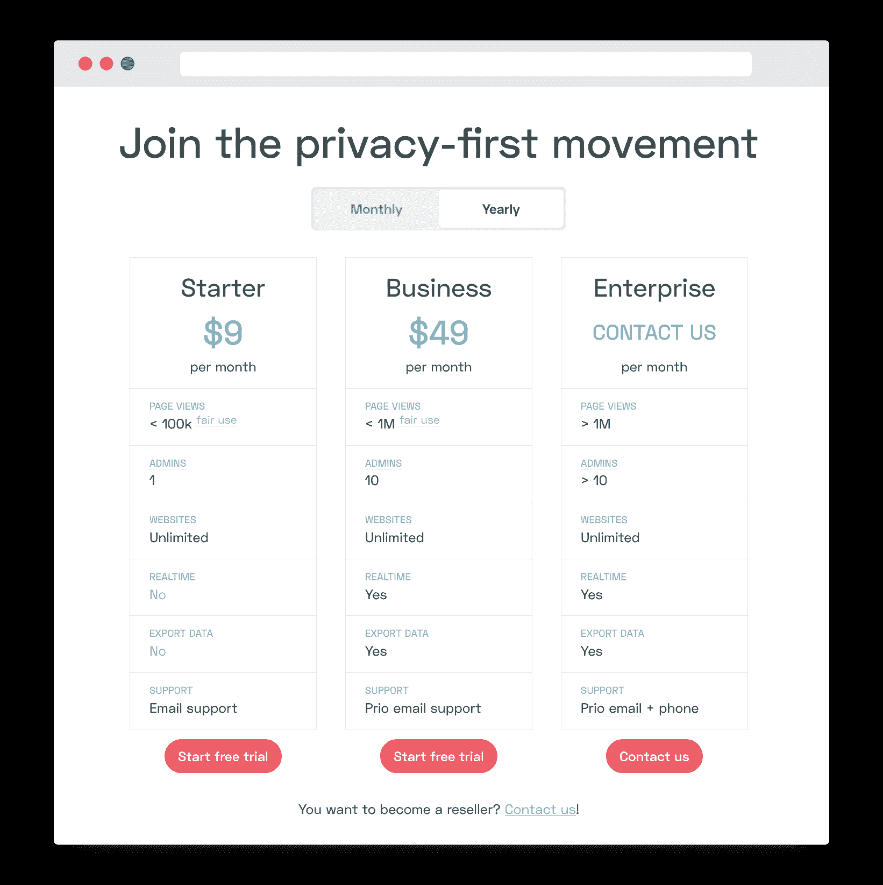

# 我如何用两行代码创业

> 原文：<https://www.indiehackers.com/interview/how-i-started-a-business-with-two-lines-of-code-37f3d5348e>

## 你好！你的背景是什么，你在做什么？

大家好！我是阿德里安·范·罗森，来自荷兰的独立黑客。我一直梦想经营自己的盈利企业，但最近事情变得现实了。

在过去的三个月里，我建立并发布了[简单分析](https://simpleanalytics.io/)。这是谷歌分析的简化版，不会侵犯用户隐私。有很多分析工具，但很少有解决访问者隐私的。

在推出的几周内，简单分析已经引起了人们的极大兴趣，包括黑客新闻上的[排名第一，产品搜索](https://news.ycombinator.com/item?id=18024277)上的[排名第三，获得了 40 多个付费客户，MRR 超过 400 美元。对于我实现年收入 100 万美元的最终目标来说，这是一个意想不到但很棒的开始。](https://www.producthunt.com/posts/simple-analytics)

 

## 是什么促使你开始使用简单分析？

我一直对隐私问题非常感兴趣，尤其是网络隐私。作为一名开发人员，我已经准确地意识到侵犯隐私的可能性，以及在隐私领域建立合乎道德的业务的机会。我的女朋友会证明，我过去一直在抱怨谷歌在跟踪我们，他们在几乎每个网站上安装的脚本让他们可以对我们进行描述，最终，所有这些都需要改变。

 

我开始用一个小的 MVP(是的，非常小)来验证这个想法，用来自 Telegram group“Work in Progress”的测试用户进行测试。我能够收集他们对产品的反馈，但他们免费使用的事实让我无法洞察人们是否真的会为此付费。

分析领域对我来说并不陌生。我之前开发了一个[网站，上面有电台播放列表](http://watiseropderadio.nl/)，供艺术家跟踪他们的歌曲在电台播放了多少次。此外，在之前的工作中，我还负责将事件从我们的应用程序发送到我们的分析管道。这种网络和分析经验为我提供了继续开发这种产品的知识。

与维护现有产品相比，我通常从开发新产品中获得更多的乐趣，但是有一些独特的项目并非如此。音乐平台就是一个例子，而[简单分析](https://simpleanalytics.io/)也有类似的感觉。我已经通过[设置通知](https://medium.com/@sinequanonh/how-do-i-stay-motivated-when-i-feel-days-are-off-94a8fcb72cb0)让维护方面的事情变得更加令人兴奋，比如成功的客户付款，以查看平台何时被使用，并提醒我业务是一个动态的、活生生的、有呼吸的东西。

当我开始构建简单分析时，我作为前端开发人员每周工作两天，其余时间则从事自由职业。自由职业给我的日程安排提供了更多的自由，所以我辞掉了白天的工作。现在，我完全专注于自由职业，以建立现金储备，但目标是从简单的分析中获得收入，以取代任何对自由职业者的需求。

## 构建最初的产品需要什么？

制造一个伟大的产品不仅仅是关于实际的建筑，还包括你周围的环境和人。我注册了 TQ，这是一个阿姆斯特丹的合作空间，来自 Next Web 背后的人。我停止了日常工作中的加班，加入了一个名为 Work in Progress 的创客社区，更新了我的旧 Twitter 账户，并在需要的时候寻求帮助。通过这样做，我能够为我的网站找到一个伟大的设计师，并呼吁一些朋友谁是惊人的专业电影制作人来帮助我的宣传视频。

制造一个伟大的产品不仅仅是关于实际的建筑，还包括你周围的环境和人。

TweetShare

当你有关于定价、商业模式或最佳设计的问题时，有一群人可以获得反馈是非常有用的，特别是如果这些人在同一种业务中工作，并且有相似的思维模式。当然，你不应该只是盲目地跟随别人告诉你去做，但是如果他们所说的对你和你的企业有意义，那么就去尝试。

作为一名开发人员，为了开始一个项目，很容易陷入学习一些全新技术的陷阱。如果目标是提高技能，这是好的，但如果目的是出货，这就不是一个好主意了。我们都做过，包括我自己。你最终在项目进行到一半时意识到你在技术上做了一个错误的决定，然后要么不得不重新开始，要么(更有可能)完全放弃这个项目。如果你想了解更多关于这个和其他开发者可能遇到的常见陷阱，我已经写了一篇更深入的文章。

我认为这个项目是我构建和发布的最快的项目。从开始到结束花了我两个月的时间，每周花两到三天。我的最终目标很简单。

应该有一个统计页面，您可以看到:

*   上个月的页面浏览量
*   表现最佳的页面
*   热门推荐人
*   屏幕尺寸

营销页面应该是一页纸，人们可以:

*   查看宣传视频
*   阅读特写
*   创建一个帐户
*   为一项计划付钱

最后，人们可以登录一些页面，添加网站，编辑设置。虽然这听起来并不太复杂，但我并不总是很有动力去做这件事。为了让自己专注于某个特定的功能，我会设定一个不可能的期限。对于认证，我想使用神奇链接(通过电子邮件获得的链接，只需点击一下就可以登录网站)，并设置 60 分钟的期限来实现它。当然没做成，但是 90 分钟就有了工作版。我尽全力工作，很快就完成了。在那之后，我仍然需要微调，修复错误，并添加一些样式，但对我来说，将一切都设置为挑战有助于我更有效地工作。

## 你是如何吸引用户并发展简单分析的？

我从简单分析中学到的另一件事是营销比产品更重要。我总是听人说，产品需要非常好，才能自我销售。是的，我认为一个产品需要非常好，但是如果没有人知道你伟大的产品，那怎么办？考虑到这一点，我将大量时间投入到我认为非常重要的事情上:发布。

我开始相信发布本身对你产品的整体成功至关重要，因为这是一个你可以获得大量曝光的时刻。正因为如此，我在两个平台上推出:产品猎奇和黑客新闻。两个平台完全不同，都有自己独特的用户类型。产品搜索用户更有可能购买你的产品，黑客新闻用户更有可能给你反馈([这可能很关键，但我对人们的积极和总体建设性感到非常惊讶](https://news.ycombinator.com/item?id=18024277))。关于产品搜索的帖子非常简单。在你发布之前，确保你已经准备好了你的图片(在我的例子中还有视频)，有一个漂亮的 GIF，写一个好的描述，准备一个有趣的第一条评论。

[https://www.youtube.com/embed/4LOkhOWNb5w](https://www.youtube.com/embed/4LOkhOWNb5w)

围绕谁应该猎取你的产品有很多争论。我只是自己猎取了产品，我个人不认为这有什么区别。[如果你需要一些建议和观点，请阅读关于如何发布的产品搜索帖子](https://blog.producthunt.com/how-to-launch-on-product-hunt-7c1843e06399)。

在我想发布的前一天晚上，有人问我在苹果发布会的同一天发布是否明智。我没有任何经验，所以我把发布会推迟到了下周二(大多数公司似乎都在周一推出他们的产品)。我不确定我是否还会那样做。如果你想成为一天中的第一名，我可能会在太平洋标准时间凌晨 1 点查看比赛，看看你是否能击败他们。如果是这样，发表你的文章，否则也许要等一天。那天苹果没有进前三。

当我发布黑客新闻的时候，我正和我的朋友在阿姆斯特丹的一个广场上喝几杯。太平洋标准时间早上 7 点，我拿起笔记本电脑，发布了我准备好的帖子。我原以为我的帖子会在淹没在一堆 HN 秀之前引起一点关注。但这并没有发生。在我发帖后的两三分钟，我查看了主页，发现我在第一的位置。我很兴奋，但我认为这可能是因为有些人投票速度非常快，我的帖子可能很快就会消失。

我在黑客新闻上排名第一 9 个小时，在主页上排名第一 24 个小时，在 HN 秀页面上排名第一 3 天！太疯狂了，完全出乎意料。简单分析从那篇文章中获得了疯狂的流量。

 

因为对《黑客新闻》没抱太大期望，我的笔记本电脑里就剩了半截电池，肚子里就剩了几瓶啤酒。幸运的是，广场离我的工作空间很近，所以我和我的朋友去那里买了些电池。我回复了很多黑客新闻评论，检查了我的服务器是否能支持，几次修改了价格，增加了功能，阻止了垃圾邮件发送者——所有这些都取得了巨大的成功。那天晚上晚些时候，我和我的朋友用一些食物和更多的啤酒来庆祝。真是疯狂的一天，约书亚！

## 你如何准备简单分析的发布？

大多数人都是在最后一刻才做准备。包括我自己。这次我做的事情有点不同。在发布的前一天，我在 [Preview Hunt](https://previewhunt.com/) 上准备了我的产品搜索帖子，看看我的帖子会是什么样子。也向身边的人请教。

我真正需要别人帮忙的一件事是校对。我不太擅长写文字。了解了这一点后，我会让别人为我写作或至少校对。如果你周围有一个社区，他们可以帮助你巩固通常对你来说是一个挑战的领域。

## 你的商业模式是什么，你是如何增加收入的？

简单分析的商业模式非常简单。它是基于订阅的，所以人们每月支付一定的费用来使用该产品。数量取决于功能和他们网站的流量。我刚刚开始，所以在这一点上，我的大多数客户来自产品搜索和黑客新闻。正如你在[我的统计数据](https://simpleanalytics.io/simpleanalytics.io)中看到的，谷歌、产品搜索、黑客新闻和推特产生的页面浏览量大致相同。在发布一个月后，我仍然从产品搜索[获得了相当多的流量。我认为产品搜索可以成为一个非常好的平台，我感觉产品搜索用户比黑客新闻用户更有可能为一项服务付费。我不知道这是事实，因为我目前没有保存我的客户注册时来自哪里(我知道我应该！).](https://twitter.com/adriaanvrossum/status/1059825106048958465?s=12)

当我向我的朋友解释我的想法时，我有了每月要求 5 美元的想法。对我来说，这对于一个分析工具来说似乎是合理的。我的一个朋友(谢谢，迈克)问我，“为什么不收 12 美元？”，我也没有很好的回答。我不知道这个产品的价格。老实说，我仍然不确定，但我知道我目前处于低端。我害怕收取更多的费用，因为这可能会导致新客户减少。我很可能会在不久的将来提高我的价格，但目前是这样。我认为测试定价是运行 SaaS 的一个重要方面。也有很多关于这个主题的信息(我喜欢这本电子书)，所以我不必重新发明轮子。

| 周 | 收入 |
| --- | --- |
| 第 39 周 | 27 |
| 第 40 周 | 304 |
| 第 41 周 | 369 |
| 第 42 周 | 418 |
| 第 43 周 | 408 |
| 第 44 周 | 383 |

我收到了很多降低价格或在层级中包含免费计划的建议，但我对此犹豫不决，因为我认为将免费计划的客户转化为付费客户极其困难。当我热衷于 Hacker News 时，我确实提供了一个免费计划，最终在一个小时内为我带来了 47 个新客户，但想到他们永远不会转变为付费客户，我吓坏了，于是取消了免费计划。最初的免费计划只包括一个网站的分析，所以它确实有一些限制，但总的来说，我很高兴我很快结束了免费计划。

 

## 你未来的目标是什么？

分析只是我愿景的开始。我想制造更多隐私第一的产品，激励人们关心自己的隐私。但首先我想让简单分析获得巨大成功。目前，我将三分之二的精力放在市场营销上(建立像 [Privacy First Products](https://privacyfirstproducts.com/) 这样的网站，并撰写类似的博客文章和采访，以产生流量)，剩下的三分之一放在开发新功能上，比如实时数据。

我对简单分析的长期目标是年收入 100 万美元。这在分析领域是完全可能的。我还有一个短期目标，那就是到达一个可以放弃自由职业的地方。支付房租、旅费、食品费等。无忧无虑地生活(关于钱)我需要每月赚 2250 美元左右，作为一名自由职业者，这需要每月工作一周左右。为了放弃自由职业，我需要达到每月 4500 美元的经常性收入(荷兰税在 50%左右)。

努力让人们认同你的愿景、想法和品牌——让你的客户成为大使。

TweetShare

为了达到这个目标，我需要专注于更大的业务，所以计划是增加更多的功能([随时给我留下建议！](https://simpleanalytics.io/feedback))并为企业多做营销。独立黑客和制作人是很好的早期采纳者，我确实从他们那里得到了很多反馈。将来，我可能会让早期用户转向更专业的商业计划，但保持价格不变。每当我提高价格时，我认为向现有顾客收取更多的费用是不公平的。

为了实现这个长期目标，我需要大致了解:

*   1000 名客户每月向我支付 85 美元(100 万/12/1000)
*   1700 名客户每月支付我 50 美元(100 万/12/50)
*   4200 名客户每月向我支付 20 美元(100 万/12/20)

我还有很长的路要走，但这绝对是可行的。隐私问题越来越受到媒体的关注，人们越来越意识到需要更好的隐私和安全。因此，肯定存在创新和增长的市场机会和空间。我确实认为我需要调整我的平台，以更好地满足客户的需求。我现在所做的只是开始，当我得到更多的反馈时，我会继续适应和迭代。重要的是人们已经愿意为它买单了。

## 有没有发现什么特别有帮助或者有优势的？

剑桥分析公司实施的大规模脸书数据泄露事件将数据隐私问题推向了热门领域。这对于简单分析来说绝对是一个优势，也是为什么我相信我可以达到 100 万美元的年收入。

我最近读了詹姆斯·瓦特的《朋克的 T2:打破所有规则——啤酒狗之路》。他是 BrewDog 的创始人之一，brew dog 是一家以朋克 IPA(一种可爱美味的啤酒)闻名的啤酒厂。他在书中谈到的一件事真正引起了我的共鸣，那就是创建一个十字军东征的概念，而不仅仅是应用营销。这是试图赢得人们对你的愿景、想法、品牌的认同，并让你的客户成为大使的想法。这就是为什么我觉得简单分析只是我在隐私领域的开始。我希望每个人都能分享我的目标，即在不侵犯个人隐私的情况下，创造伟大的产品和有用的工具。没有必要不断地侵犯人们的隐私，那么为什么不共同努力，用健全的隐私伦理来构建令人敬畏的产品呢？

## 对于刚刚起步的独立黑客，你有什么建议？

网上的建议层出不穷，很难知道哪些值得遵循，哪些是垃圾。我给你的建议是:不要把你在网上找到的每一条建议都当成福音。把它当作做事的一种方式，挑选最适合你的。

说到这里，我认为让自己尽可能保持动力是很重要的。计划很重要，但动力是让你坚持下去的动力。我加入正在进行的工作，以获得反馈，同时也是为了让自己周围的人能够激励我。[设置一个通知](https://medium.com/@sinequanonh/how-do-i-stay-motivated-when-i-feel-days-are-off-94a8fcb72cb0)当用户注册或在你的网站上做一些重要的事情时(对我来说是当他们添加一个网站、改变设置或查看他们的统计数据时)，提醒你一整天你的工作很重要，你的客户正指望你。

另一件对我很有效的事情是学习如何最大化我的生产力。这往往是一个个人的过程——让你分心或帮助你集中注意力的东西可能与我认为最让你分心或最有帮助的东西不同——所以找出最适合你的东西。我最喜欢在一个合作空间工作( [TQ](https://tq.co/) )，戴着噪音消除耳机听 [Cercle](https://soundcloud.com/cerclelive) 。我用 [Focus](https://heyfocus.com/) 屏蔽让我分心的应用，结合 [SelfControl](https://selfcontrolapp.com/) 在系统层面屏蔽网站。

知道你在一天中的什么时候最有效率也是很好的。我通常在早上效率不高，所以不管我怎么努力，总感觉是在浪费时间。我不再徒劳地转动轮子，而是在我工作最好的时候，在两个半小时的时间段内工作([谢谢，Ivan](https://qotoqot.com/blog/improving-focus/) )，身边没有电话，注意力和自制力都处于开启状态。我每天做三次，中间有 30 或 60 分钟的休息时间。让其他人知道发生了什么很重要，这样你就不会收到焦虑或愤怒的短信，询问你是否还好，或者为什么没有回复。例如，我经常被我女朋友的电报弄得心烦意乱。并不是她要求我立即回复，而是我有一个根深蒂固的习惯，一收到回复就回复。现在，当我开始一个会话时，我会告诉她，这样她就知道我会在接下来的几个小时里保持无线电静默，这让我可以集中精力工作。

把注意力放在对推进你的项目有最大影响的事情上，而不是花里胡哨的事情上。

TweetShare

我以前说过，但我认为值得重申:不要试图在一个项目中学习太多的新技能！你一定会失败。优先考虑对前进最重要的事情。你想学习一个新的框架，而且还需要学习如何营销你的项目吗？放下新框架，专注营销。您是否希望添加一项额外功能，但也需要*了解客户需求？去掉多余的新功能，专注于你的(非常必要的)客户。*

专注于对推动你的项目前进有最大影响的东西，而不是花里胡哨的东西。把重点放在项目营销上，而不是产品本身。例如，对我来说，花时间为独立黑客社区做贡献和开发新功能一样重要。

## 我们可以去哪里了解更多？

我活跃在 Twitter 上 [@AdriaanvRossum](https://twitter.com/adriaanvrossum) ，如果你想与[简单分析](https://simpleanalytics.io/)保持联系，请订阅[我们的博客](https://blog.simpleanalytics.io/)。

我只是一个喜欢创造伟大产品的人，你也可以这样做。干杯！

—[<picture id="ember8040914" class="user-avatar ember-view user-link__avatar"></picture>范罗森](/adriaanvanrossum?id=rvqfP9lVtzQ99JkwqlQRAaaZ8Tf1)，简单分析学的创始人

## 想像简单分析一样建立自己的企业吗？

你应该加入[独立黑客社区](/)！🤗

我们是几千名创始人，互相帮助建立有利可图的业务和副业。来分享你正在做的事情，并从你的同事那里获得反馈。

还没准备好开始使用你的产品吗？没问题。这个社区是一个认识人、学习和实践的好地方。随意[随便浏览](/)！

—[<picture id="ember8040919" class="user-avatar ember-view user-link__avatar"></picture>考特兰艾伦](/csallen?id=ibTLPyjwVebnZjMGKvz6ztarnuV2)，独立黑客创始人

87votes