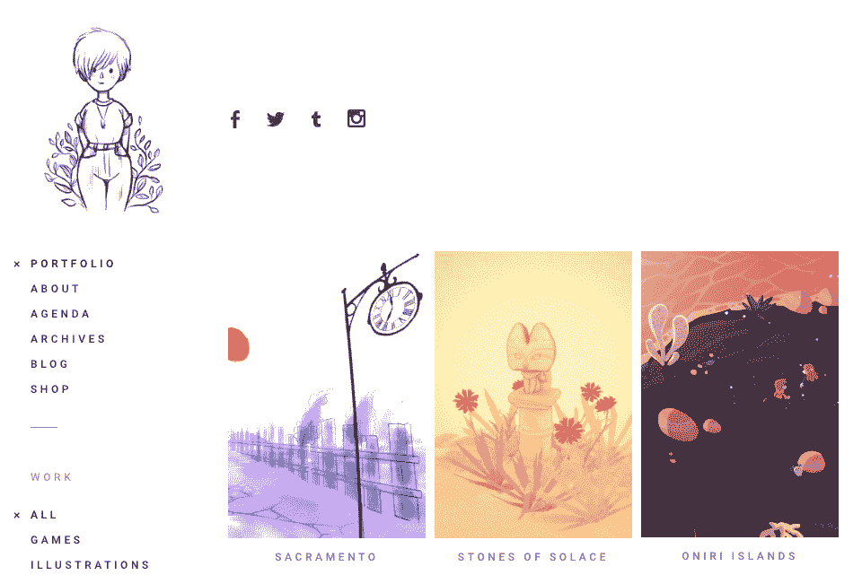
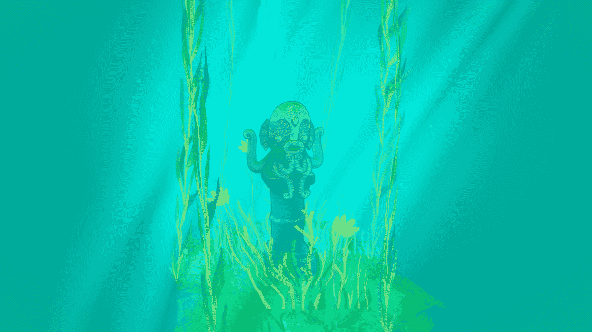
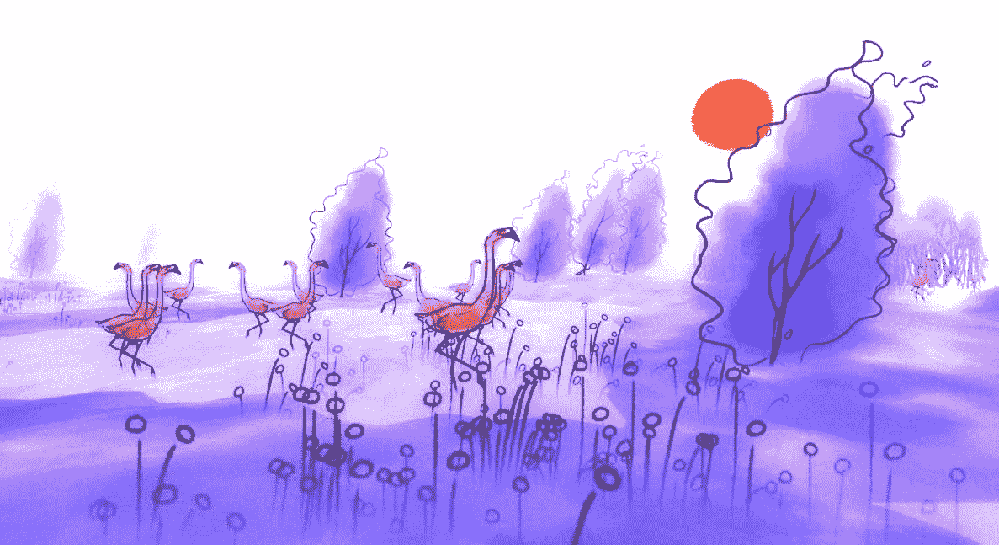

# 我如何热爱我的副业

> 原文：<https://www.indiehackers.com/interview/how-i-stay-in-love-with-my-side-project-21cbd6b6be>

## 你好！你的背景是什么，你在做什么？

嗨，我是戴尔芬，又名迪夫！

我是一名法国游戏艺术家和插图画家，我住在加拿大蒙特利尔。

我从事电子游戏工作大约十年了，我也是[克朗代克集体](http://klondike.fr/)的一员。我是一个独立的人，我把我的时间划分在艺术总监和游戏艺术家的委托项目和我自己的个人游戏项目之间。

我的游戏一般都是小实验体验，气氛平静轻松。

回到 2016 年，我制作了一款名为[萨克拉曼多](https://www.dziff.com/?portfolio=sacramento)的游戏，去年我们发布了[安慰之石](https://www.dziff.com/?portfolio=stones-of-solace)。

这两者都可以在 itch.io 网站上的按需付费系统下获得，我与我的团队分享这些捐款。

虽然我的大部分收入确实来自游戏制作，但这些大多是合同作品！

## 是什么激励你开始游戏开发？

我有几个艺术研究的学位(文学学士，然后是数字艺术硕士)，重点是绘画和艺术理论。所以和电子游戏联系不是很紧密，最后实习的时候才发现游戏开发。

在我工作的第一个工作室，我们主要是做教育游戏，所以我们有很多限制。这是我的第一次经历，也是我开始接触牙齿的地方。

但我真的很喜欢在那里学习如何制作游戏，我喜欢从事各种艺术风格的工作。我在那里呆了快六年了！

关于制造安慰石，我有一个重要的规则，那就是只有当我高兴的时候，我才会去做。

TweetShare

在某个时候，我发现了视频游戏独立场景，实验游戏和游戏堵塞，它真的打开了新的视野！

回到 2013 年，除了日常工作，我开始做更多的个人和实验项目。我想那时我已经取得了很大的进步，并开始坚持自己的风格。2013 年也是我们的艺术集体克朗代克诞生的一年。被才华横溢的人包围无疑是一种激励。

四年前，我决定自立，开始做一名自由职业者。

## 你的流程是什么样的？

如果我以制作*安慰之石*为例，它开始于一次度假/游戏开发旅行，然后我在一年中的小会议中继续工作，当我在合同工作之间暂停时，有时也在周末，但不会太长。通常我的个人项目有松散的结构，允许这种不连续的工作方式。

2019 年初，我决定我想完成并最终发布这款游戏，当我开始与 [Ice Water Games](http://www.icewatergames.com/) 谈判时，我的决定得到了证实，他们提出帮助游戏发布，并使其成为他们标签的一部分。

【T2

我从 6 月到 8 月把更多的时间和精力放在了游戏开发上，直到发布。这是可能的，因为我的合作设计师和程序员，Armel，和我只是在这段时间兼职忙碌，所以我们可以花一些时间来完成游戏。

然后我们干脆把游戏放到 Steam 和 itch.io 上，在各种社交媒体平台上做一些公告，给出版社发邮件，借助冰水游戏。

我在制作*安慰之石*时有一条重要的规则，那就是只在我高兴的时候去做。起初，建造这些小场景也是我放松的一种方式，当它开始看起来像是我可以释放的东西时，给自己施加压力就感觉不对了。

当涉及到个人项目时，我不是很有耐心，通常需要很快有结果，以避免厌倦或气馁。所以我通常很快开始在 Unity 中进行实验，从第一个概念艺术开始，然后逐步迭代和添加内容！

## 是什么激发了你的游戏？

我的游戏经常受到地方记忆的启发。我喜欢探索风景给你讲故事的想法。

萨克拉门托*和*安慰之石*都是在一次大型旅行期间或之后开始的。萨克拉门托是在一次穿越美国的火车旅行后拍摄的，在那里我用水彩收集了不同的风景。在另一个游戏工作室 Free Lives 组织的游戏 Jam Island 2 的印度尼西亚之旅中，我开始制作《安慰之石》。我很少去欧洲以外的地方旅行，所以这两次都是非常难忘的经历。*

我喜欢风景的另一个原因可能是我不太擅长写故事或对话，所以通常我会想办法让我的游戏尽可能安静。风景可以在不需要文字的情况下讲述故事。

我还在 Twitter、Instagram 和 Tumblr 上关注了很多艺术家，他们来自视频游戏、动画、插图、平面设计等各个领域...等等。

我最喜欢的是[埃兰·希勒尔](https://eranhilleli.com/)、[希瑟·佩恩](http://penn.pithytwigs.com/)和[马鲁蒂·比塔明](https://www.koyamori.ca/)但是还有很多！

关于电子游戏，我喜欢短小精悍的游戏。当然[旅程](https://thatgamecompany.com/journey/)和 [Abzu](https://abzugame.com/) 对我来说是非常棒的经历，但我也非常喜欢[光之子](https://www.ubisoft.com/en-gb/game/child-of-light/)、[老人之旅](http://oldmansjourney.com/)和[剑与剑](http://www.swordandsworcery.com/)。

## 对于刚刚起步的独立黑客，你有什么建议？

这几年我学到了一些东西:

*   完全自由并不总是发挥创造力的最佳方式。有时你需要创建你自己的约束来真正开始一件事！从小处着手通常更有效。
*   做自己喜欢的事情会累垮自己。当你对工作充满热情时，这也很容易导致你加班加点，损害你的健康和自我保健。慢点！
*   创造力和支付能力之间的平衡显然很重要。

做自己喜欢的事情会累垮自己。

TweetShare

我呢，在一家电子游戏公司工作了六年之后，选择了成为一名自由职业者，现在大部分收入来自于合同工。

从我自己的游戏中赚钱的问题很快就被搁置了，原因有几个。

首先，在我的游戏上养活自己需要商业和整体技能(经营一家公司？联系出版商？获得资助？营销？等等。)我觉得我不能或不想处理的事情。第二，我想在制作这些游戏时保持完全的创作自由。第三，我不想用玩家的期望给自己压力(如果他们买了我的游戏)

目前，这对我来说是有效的，但是有很多方法可以找到这种平衡！

## 我们可以去哪里了解更多？

在我的[网站](https://www.dziff.com/)或我的[推特](https://twitter.com/dzifyr) & [Instagram](https://www.instagram.com/dzifyr/)

感谢您的阅读，如果您有任何问题，请在评论中发表！

—[<picture id="ember8160734" class="user-avatar ember-view user-link__avatar"></picture>Dziff](/Dziff?id=xmLtXv39vxgoXLmSbxRp8nJl8eA2)，Dziff 游戏创始人

## 想像 Dziff Games 一样建立自己的事业？

你应该加入独立黑客社区！🤗

我们是几千名创始人，互相帮助建立有利可图的业务和副业。来分享你正在做的事情，并从你的同事那里获得反馈。

还没准备好开始使用你的产品吗？没问题。这个社区是一个认识人、学习和实践的好地方。随意[随便浏览](/)！

——[<picture id="ember8160739" class="user-avatar ember-view user-link__avatar"></picture>柯特兰艾伦](/csallen?id=ibTLPyjwVebnZjMGKvz6ztarnuV2)，独立黑客创始人

15votes