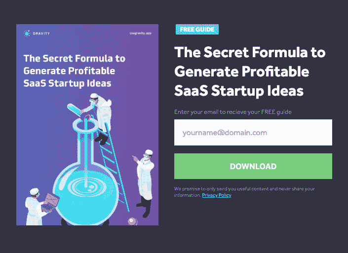
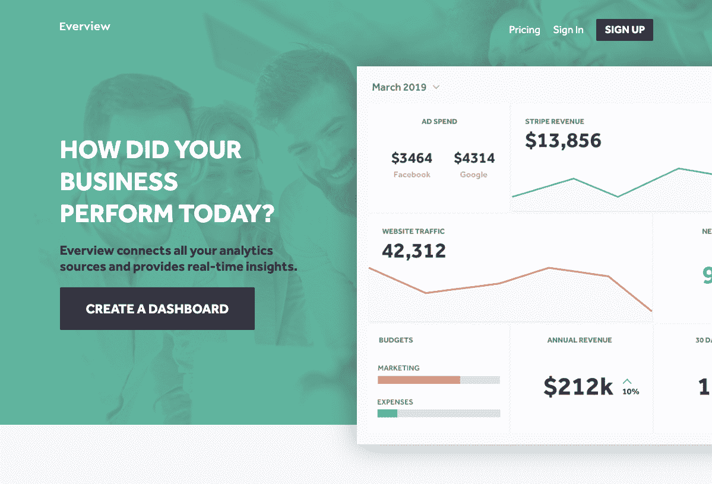
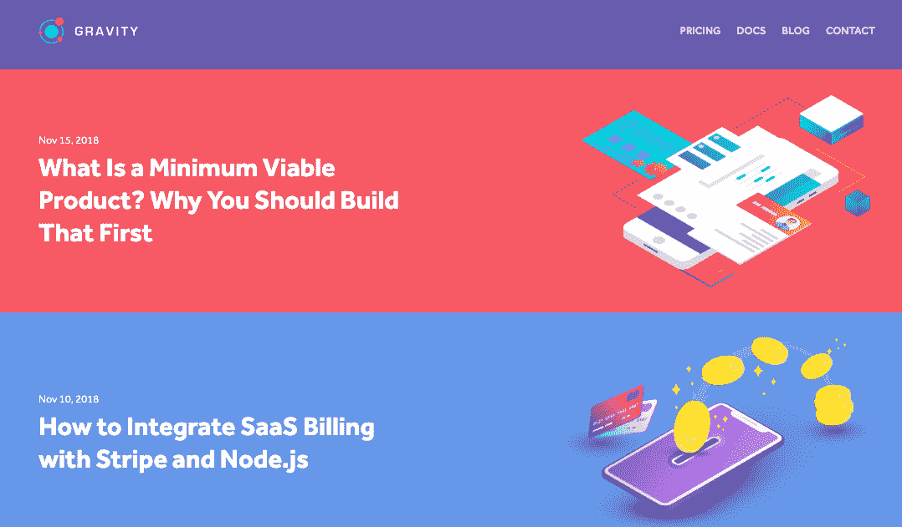

# 我如何停止定价过低并达到 90%的利润率

> 原文：<https://www.indiehackers.com/interview/how-i-stopped-underpricing-and-reached-a-90-profit-margin-e1a749ed8c>

## 你好！你的背景是什么，你在做什么？

嘿独立黑客！我是凯尔，一个来自北爱尔兰的独立制造者和数字流浪者，虽然我大部分时间都是作为一个数字流浪者在东南亚旅行。

我大半辈子都在做软件。2013 年，我联合创立了[Get invite](https://getinvited.to)并筹集了一些风险资本，但无尽的压力让我得出结论，典型的初创企业到风险资本的道路不适合我，所以我开始在周游世界和充分享受生活的同时打造利基产品。

其中一个产品是 [Gravity](https://usegravity.app) ，这是一个 SaaS 模板，让初创公司和开发者能够比以往任何时候都更快地构建网络应用。我从 2018 年 8 月开始自举 Gravity，目前有 128 个奇妙的客户(其中一些是独立黑客成员)。我平均每月挣 2000 美元，利润率为 90%。

 

## 是什么促使你开始研究重力？

重力是我在开发新产品时遇到的一个问题的副产品，老实说，我从未想过它会有任何商业可行性。我经历了一个测试和构建软件想法的阶段，意识到在建立一个新产品的过程中会有很多重复。我花了太多时间设计界面、构建登录表单和计费系统，而不是构建人们愿意付费的功能。我想简化这个过程，所以我创建了一个模板，可以用来快速部署新产品。

创业归根结底是拥有一种近乎妄想的过于乐观的心态。

TweetShare

我把它展示给了我在清迈的一个合作空间里遇到的另一个独立黑客成员，他让我相信我所做的事情绝对有市场，我应该把它打包卖掉(向马克·霍德致敬)。

我的验证主要来自于在独立黑客和 Reddit 上与开发者的交谈。我不太关心是否得到认可，因为我需要产品来解决我自己的问题，所以即使没有人买，我自己也会从中获得巨大的价值。

## 构建最初的产品需要什么？

我花了大约八个星期的晚上和周末来组装一个合适的 MVP——我自己编码和设计产品，所以除了我的时间，我的成本几乎不存在。除了白天的工作之外，我还做了很多艰苦的工作，但是从一开始就很有趣和令人兴奋。

一旦我创作了一些我不会不好意思要求别人付钱的东西，我就在独立黑客上发布了一个链接，售价 99 美元，不到两周，我的第一批客户就注册了。

我一直认为独立企业应该从第一天开始收费。

TweetShare

我可能让这听起来太简单了，但我从小就开始写代码。我学的是设计，我已经参加了 7 年的 Get Invited 活动，所以在研究重力之前我已经学到了很多东西。现在回过头来看，我发布的版本远非完美，我的客户已经大量参与提供反馈，并帮助改进产品和塑造未来的路线图。我不能强调投资建立良好的客户关系的重要性。

我最近发布了 v2.0，这是一个巨大的改进。现在我正在开发 3.0 版，它有一个用 React.js 构建的非常棒的新用户界面。

## 你是如何吸引用户和增长引力的？

我最初的客户都来自独立黑客——这是一个很好的测试和发布的地方，这些客户非常积极地参与和支持。就在本周，我的一个客户帮我修复了一个安全漏洞(感谢克里斯·聪格斯)。建立良好的人际关系在打造产品或业务时非常重要，因为这些人会成为你最大的传播者。

我已经尝试了一些付费营销策略，所有这些策略都有助于挖掘潜在客户，但转化效果不佳。一个非常成功的策略是写一份八页的简短指南，介绍如何产生有利可图的软件创业想法，然后通过脸书牵头的广告进行推广。我只花 0.35 美元就能得到相关线索。

[最近，我发起了产品搜索](https://producthunt.com/posts/gravity-8)，尽管得到了我的客户的积极支持和大力支持，我还是没能上头版(然而，我确实卖出了一件，耶！).

 

对我来说效果很好的是:

*   **搜索。**在短时间内吸引准备购买的客户仍然是王道。幸运的是，我处于一个竞争很少的利基市场，所以我能够在第一页的关键词中排名第一，比如“node.js saas”。我也有一个博客，但是我需要写一些新的内容！
*   **现场销售线索挖掘。从访问网站的人那里获取电子邮件已经变得非常强大。我在网站上有一个演示应用程序，人们可以注册使用。然后，我捕捉他们的电子邮件，并把它们放入一个漏斗。第二天，我会给他们发邮件，问他们对重力演示的看法。虽然不是每个人都提供了优秀的反馈或者根本没有任何反馈，但是即使计算出有多少人愿意提供反馈也是重要的反馈。**

有一段时间，我在测试免费版的 Gravity，它有 20%的转换率。我目前正在以 47 美元的价格测试这款付费精简版，但它并不畅销，所以我可能会转而将它用作免费的销售线索磁铁。此外，拥有一个页面聊天窗口(我用的是 [Freshchat](https://www.freshworks.com/live-chat-software/) )对我来说是一个产生新线索的不可思议的方式。

在这个问题上，我能给出的最好的建议是对不同的营销渠道保持不偏不倚的态度。跟上最新潮流很容易，但有时更传统的方法效果最好。尝试尽可能多的渠道，看看什么适合你的业务，然后在这些渠道上加倍下注。

| 月 | 独特的访问者 |
| --- | --- |
| 2019 年 2 月 | 571 |
| 19 年 3 月 | 646 |
| 2019 年 4 月 | 1253 |
| 19 年 5 月 | 1503 |

## 你的商业模式是什么，你是如何增加收入的？

我从第一天开始使用 [Stripe](https://stripe.com) 收费，并开始 99 美元的年度计划，但这给潜在客户造成了很多困惑，所以我转向 99 美元的一次性付款。我了解到(还不够快)我严重低估了 Gravity 的价格，最近将价格提高到了 397 美元。这是令人伤脑筋的几天，但最终最初的几笔销售以较高的价格成交，并带来了一些来自高兴的客户的积极信息(有些人说他们甚至愿意多付钱！).

我一直认为独立企业应该从第一天开始收费。我认为许多制造商对此感到担心，因为他们认为产品还没有准备好，但是免费赠送产品会导致一些问题:

*   它延迟了某人将付费的确认，直到将来的任意日期。你要知道自己能不能尽快赚钱。
*   它降低了产品的价值。人们不喜欢免费得到的东西，而更喜欢用自己辛辛苦苦挣来的钱买的东西。这就是拥有一件圣诞爆竹上的珠宝和从商店里买东西的区别。

我的收入有点不稳定，因为我仍在解决许多问题，但它正朝着正确的方向发展。从 2018 年 8 月到 2019 年 2 月，我每个月的收入不到 200 美元。现在我的底线是每月 2000 美元以上。很明显，我正朝着更高的目标努力，但 2，000 美元感觉像是一个重要的里程碑，90%的利润率足以支付我的房租和每天在泰国吃饭！

| 月 | 收入 |
| --- | --- |
| 2019 年 2 月 | 180 |
| 19 年 3 月 | 1914 |
| 2019 年 4 月 | 1120 |
| 19 年 5 月 | 2235 |

## 你未来的目标是什么？

我在 Gravity 的下一个里程碑是达到每月 5000 美元。我并不想接管世界，成为下一个独角兽——我的个人目标是拥有一套我喜欢开发的小型、可持续、盈利的软件产品。

重力一直是这一愿景的快乐副产品，目前我还在开发另一款 SaaS 产品，名为 [Everview](https://everview.app) ，这是一款面向初创公司的整体仪表板，将不同来源的分析数据之间的点连接起来。当然，重力将成为这一过程的基础。

 

对我来说，最大的挑战是找到时间做所有的工作。一天中的大部分时间，我仍在制作《T2》的《获得邀请》和《T4》的《重力》和《全景》的《T7》。我投入了很多时间，但我很享受，我很幸运，我可以在生活在一些美丽的热带地区的同时从事这些业务。

## 你面临的最大挑战和克服的障碍是什么？如果你必须重新开始，你会做什么不同的事？

最大的挑战发生在《地心引力》之前，它激发了我现在的独立之旅。没有一本商业或创业书籍让我对发生的事情有所准备，我认为这仍然是创业社区中经常被掩盖的话题。

几年前，我躺在医院里吐血，以为自己要死了。在此之前，我已经掉了四颗牙齿，因为我每天都呕吐，有严重的胃病，牙齿也脱落了。当时我的创业压力很大，而且我并不喜欢它，所以我认为是生活给了我一个巨大的推动来改变我的道路。

从那以后，我开始专注于更有意义的工作(还有我的健康！)而不是追逐金钱和投资。我现在创造能让我快乐的产品，并为我提供我最喜欢的生活方式，包括大量的旅行和体验新的文化。

我认为我们大多数人都陷入了创业的兔子洞，以至于我们从来没有停下来问*为什么*？我为什么要这么做？这让我快乐和满足吗？我相信创业媒体在给创始人洗脑，让他们相信只有一条真正的成功之路方面有很大的责任，这包括巨额风险投资、无尽的压力和大规模退出，但这根本不是真的。我亲身经历了那段几乎要了我的命的旅程，还有另一条前进的道路。

我给每位创始人的建议是，总是从他们自己的个人角度质疑一切，并理解他们为什么做他们正在做的事情。筹集大量风险投资资金并做大没有错，只要这是你想做的事情，因为是你而不是别人。

去年发现独立黑客的时候好开心。我觉得自己在某些方面很失败，因为我不想建立一个大型的独角兽创业公司，但我最终找到了和我有相同世界观的企业家部落。

## 有没有发现什么特别有帮助或者有优势的？

投资我自己和投资我的事业一样重要。我总是为个人发展分配时间，多年来，这在我的事业中得到了回报，尤其是在我的健康方面。在医院的经历之后，我认真地彻底检查了我的整个生活方式和饮食，它对我的工作产生了令人难以置信的影响，使我精力充沛，思维清晰。

创业归根结底是拥有一种近乎妄想的过于乐观的心态。企业家相信他们可以实现别人认为不可能的事情。我相信这是那些做和不做的人之间的关键区别。开发你的思维，建立情绪弹性，强化你的注意力，学习如何管理自我怀疑和消极情绪，这些对成功来说可能比像编码这样的实用技能更重要(在我看来)。

 

## 对于刚刚起步的独立黑客，你有什么建议？

我能给的最好的建议是尝试一些想法，不要在早期就太依赖它们。我看到很多人爱上了他们的想法，花了数年时间去实现它，如果失败了，他们会彻底崩溃(或者更糟，失去他们一生的积蓄)。我认为最好花些时间列出一些想法，然后对它们进行测试。你不需要把它们都建立起来，你只需要创建一个登陆页面，给它带来一些流量来衡量兴趣就可以了。

据统计，10 个创业公司中有 9 个会失败——所以如果你有 10 个想法，你成功的几率会高得多。

TweetShare

把东西放在那里，看看人们怎么想；一旦想法得到验证，你会爱上它们。另一方面，不要害怕把你自己和你的想法展现给世界。有很多想法的好处是，如果一个失败了，你可以继续下一个想法。

据统计，10 个创业公司中有 9 个会失败——所以如果你有 10 个想法，你成功的几率会高得多。

## 我们可以去哪里了解更多？

我偶尔(好吧，很少)[在我的个人博客](http://blog.kylegawley.com)上写关于创业的博客，并且定期[发微博](https://twitter.com/kylegawley)。我还写了一本关于自举软件公司的书，名为《生活方式创业公司 T4》。

我喜欢与其他创客和企业家交流！如果有什么我能帮到你的，请在评论中告诉我:-)。

—[<picture id="ember5222555" class="user-avatar ember-view user-link__avatar"></picture>凯尔](/kylegawley?id=lHxR4v7u3WdtEJi9b9U77YdJdZg2)【万有引力创始人

## 想像地心引力一样建立自己的事业？

你应该加入独立黑客社区！🤗

我们是几千名创始人，互相帮助建立有利可图的业务和副业。来分享你正在做的事情，并从你的同事那里获得反馈。

还没准备好开始使用你的产品吗？没问题。这个社区是一个认识人、学习和实践的好地方。随意[随便浏览](/)！

——[<picture id="ember5222560" class="user-avatar ember-view user-link__avatar"></picture>柯特兰艾伦](/csallen?id=ibTLPyjwVebnZjMGKvz6ztarnuV2)，独立黑客创始人

38votes