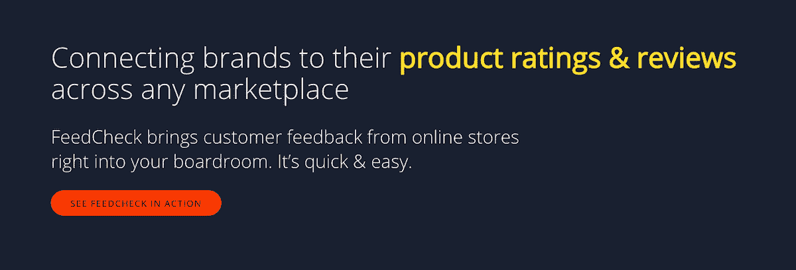
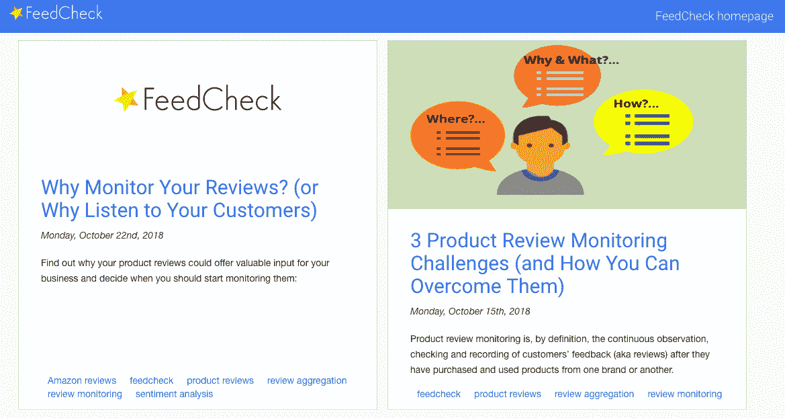
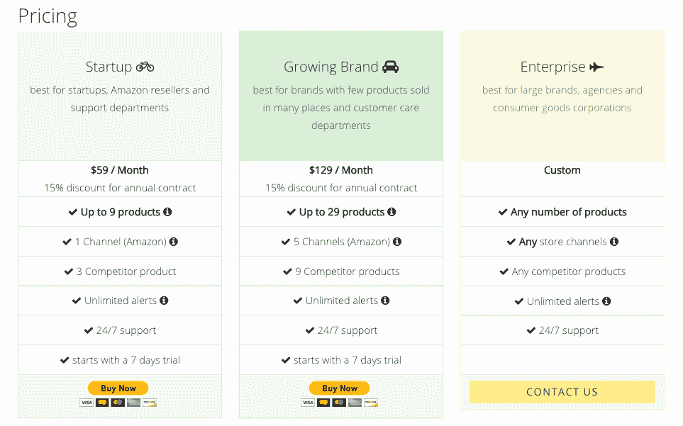

# 我如何冒险去实现我建立产品业务的梦想

> 原文：<https://www.indiehackers.com/interview/how-i-took-a-risk-to-achieve-my-dream-of-building-a-product-business-e661f9f140>

## 你好！你的背景是什么，你在做什么？

你好，我是 Adrian， [FeedCheck](https://feedcheck.co) 的创始人。我从小就对科技和创业感兴趣，并且知道这是我想结束的地方。我在整个大学期间积累了我的网络开发技能，并有幸获得了一个在大型电子商务公司工作的机会，与他们的营销部门合作，指导他们营销战略的技术实施(例如 A/B 测试、活动等)。).这是一次难以置信的第一手经验，获得了网络开发和在线营销方面的专业知识，推动我不断朝着科技创业的目标前进。

2014 年毕业后不久，我创办了一家名为[的公司，为企业提供数据采集，用于从内容、线索到分析的各种用途。我的梦想是建立一个产品业务，所以我总是在寻找一个线索或一个机会。](https://thewebminer.com)

2016 年，我开始了 FeedCheck，这是一个针对在多个在线商店销售的消费品牌的评论管理解决方案。该产品是在与当地初创公司 [Vector Watch](http://vectorwatch.com/) 合作后推出的，后者后来被 Fitbit 收购。

FeedCheck 目前的月收入约为 5000 美元。

 

## 你开始使用 FeedCheck 的动机是什么？

在我们与 Vector Watch 合作期间，他们在收集和跟踪销售手表的各种在线商店的评论方面遇到了问题。虽然表面上看起来很简单，但这是影响他们推动业务发展的主要问题。对我们来说幸运的是，他们问我们是否能帮助找到解决办法。这是一个真正的“啊哈！”瞬间。当时，我们正在积极寻找制造产品的理由或机会，但还没有完全确定产品应该是什么。

我们确实知道的一件事是，我们希望我们构建的任何东西都针对可伸缩性进行优化。我们前一家公司的商业模式要求我们为每一笔销售进行定制，而销售每月都有变化。显然不具备可扩展性。因此，我们希望转向一个可以作为持续服务交付的应用，并随后带来可预测的收入。

创业是一个非常个人化的旅程，你走的路总是在某种程度上与你是谁联系在一起。

TweetShare

我们已经拥有了 Vector Watch 似乎正在寻找的产品所需的网络挖掘专业知识，我们开始与各种企业进行客户访谈，以更好地了解客户的需求。作为一个由个人组成的团队，更倾向于技术方面而不是人的方面，这个过程是一场斗争，但我们完成了。

当时，我们是一个三人团队，从投标人那里赚了大约 1500 美元。还有一些其他的商业想法——包括为婚礼和私人活动做活动策划——但随着第一个客户的适时出现，FeedCheck 的各个部分都到位了，我们决定采用它。

## 构建最初的产品需要什么？

跳到 FeedCheck 是有风险的，但也是有意义的。我们的另一个主要努力，提交者，当时活动相当少，我们知道我们有技术专长把一个好的产品放在一起。实际上，我们的其他服务没有带来足够的资金，这似乎是我们成功的唯一可行的选择。正因为如此，我们决定拒绝所有的服务请求，转而专注于 FeedCheck。

## 你是如何吸引用户和发展 FeedCheck 的？

2016 年 2 月开始头脑风暴，2016 年 5 月上线。当时，我们只有一个客户，他们没有向我们付款，因为他们正在进行收购过程。为了获得一些关注，我们在各种启动目录中发布了 FeedCheck，并开始了博客，以提高我们的 SEO。

我们通过比较 iPhones 等热门产品的评论，战略性地利用了我们的博客帖子，这增加了整体流量，但最终没有吸引我们的目标客户。我们还开发了一些嵌入式部件，希望出版物在编辑他们自己的流行产品评论时会使用它们，但这也没有成功。

我们在 LinkedIn、脸书和 AdWords 上发起了活动。LinkedIn 和脸书失败了，尽管我们在开发产品的同时继续在 LinkedIn 上联系人们。为了专注于 FeedCheck，我们关闭了所有其他服务，收入停滞不前，因此财务和士气都处于绝对的崩溃点。最终，在发布六个月后，我们获得了第一个客户。更多的客户很快跟进，我们的收入稳步增长到 5000 美元。

 

## 你的商业模式是什么，你是如何增加收入的？

我们有一个基于订阅的商业模式，并专注于消费品牌的销售。这为我们带来了我们所追求的可预测的稳定收入，以及持续开发应用程序的资源。尽管每次订阅都会带来更多的收入，但每次销售都会耗费大量的时间，尤其是对大品牌而言。

我们还有一个自助管道，我们希望进一步发展。

 

## 你未来的目标是什么？

就产品而言，我们希望添加更多的报告和分析功能。与任何业务一样，我们也希望继续扩大我们的客户群，以及随之而来的每月收入。

## 你面临的最大挑战和克服的障碍是什么？如果你必须重新开始，你会做什么不同的事？

为了专注于 FeedCheck 而关闭我们的网络挖掘活动是一个巨大的挑战，因为这切断了我们当时的主要收入来源。最终，这是一个正确的决定，但要忍受这一决定令人紧张。我们还在开发过程中就有一个团队成员离开了，这几乎迫使我们放弃。幸运的是，我们决定向前推进，一切都解决了。

如果我能重新开始，我什么都不会改变。我认为创业是一个非常个人化的旅程，你走的路总是在某种程度上与你是谁联系在一起。所以事后说你会改变一些事情可能有点不真诚。我现在还是两年前开始这个过程时的我，所以我不能回头说我会或应该做些不同的事情。

## 我们可以去哪里了解更多？

你可以在[feedcheck.co](https://feedcheck.co)访问我们的网站，看看 [FeedCheck 博客](https://feedcheck.co/blog)。

——[<picture id="ember8173023" class="user-avatar ember-view user-link__avatar"></picture>阿德里安](/adibalcan?id=CjmAUSrdm5QViYajyImxuVS2fcX2)，FeedCheck 创始人

## 想像 FeedCheck 一样建立自己的事业？

你应该加入[独立黑客社区](/)！🤗

我们是几千名创始人，互相帮助建立有利可图的业务和副业。来分享你正在做的事情，并从你的同事那里获得反馈。

还没准备好开始使用你的产品吗？没问题。这个社区是一个认识人、学习和实践的好地方。随意[随便浏览](/)！

—[<picture id="ember8173028" class="user-avatar ember-view user-link__avatar"></picture>考特兰艾伦](/csallen?id=ibTLPyjwVebnZjMGKvz6ztarnuV2)，独立黑客创始人

24votes