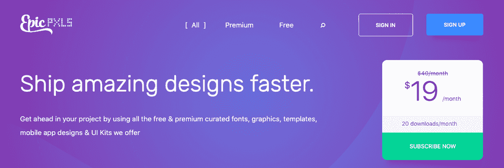
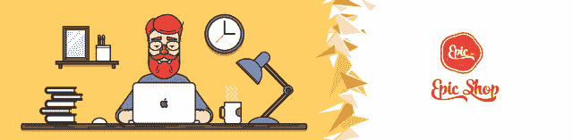
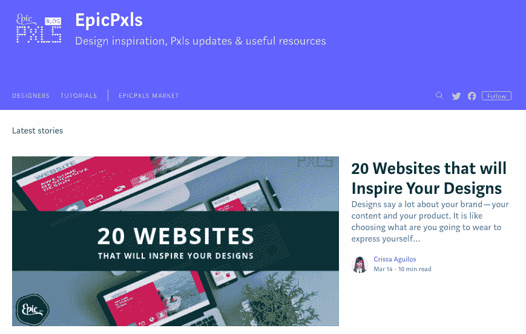

# 我如何将设计废弃物转变成一个有利可图的社区市场

> 原文：<https://www.indiehackers.com/interview/how-i-turned-design-castoffs-into-a-profitable-community-marketplace-741caf8330>

## 你好！你的背景是什么，你在做什么？

我叫 Razvan Ciocanel，是一名开发人员。我一直以自由职业者的身份工作，并维持着某种做网页开发的代理机构。我们制作了 [EpicPxls](https://www.epicpxls.com/) ，这是我们在 [EpicCoders](http://epiccoders.co/) 的一个附带项目，为设计师和开发者提供一个简单的社区来推广他们的工作。

现在，EpicPxls 一个月能赚 400 美元左右。我们提供订阅服务和各种点菜菜单，人们可以一次性付款购买他们想要的东西。我们通过销售数量和获得的用户数量来衡量我们的进展，自推出以来，每天的销售数量从未低于 50。

 

## 是什么促使你开始使用 EpicPxls？

我们最初制作 EpicPxls 是为了分享我们为最终不想使用它们的客户所做的所有设计资产。我们认为，既然它们已经制作好了，我们就把它们免费放在那里，以防其他人想要它们。尽管我们没有做任何营销或推广，但我们看到了用户的稳定涌入，所以我们决定发布一些在其他平台上销售的优质商品。

为了增加交易的甜头，我们在捆绑交易中打包了优质商品，这带来了不错的销售额和品牌认知度，最终为网站带来了更多的流量。因为我们已经在为付费客户做这类工作，这并没有让我们的工作量增加太多，而且我们能够用从客户工作中获得的收入来养活自己。

## 构建最初的产品需要什么？

我们花了大约一个月的时间制作该产品的第一个版本。我们使用 Ruby on Rails 开始，这非常容易。我们最初的设计非常简单，我们使用 Bootstrap 3 来帮助我们加快发布速度，并使用 PostgreSQL、jQuery、Braintree 进行支付，以及 MailerLite 发送时事通讯。在等待新任务或新客户的时候，我们在工作间隙处理它，这是相当容易管理的。

先试着做些简单的东西。我知道每个人都这么说，但他们这么说是因为这是事实。

TweetShare

一旦我们勾勒出产品轮廓，我们就必须决定采用哪种订阅模式。我们决定采用我们认为对订阅者和创建者都公平的方法，基于订阅者从给定的创建者那里获得的下载量。

## 你们是如何吸引用户，壮大 EpicPxls 的？

对我们来说，吸引用户的最佳方式是在产品搜索上推广我们的网站和产品。我们于 2016 年 3 月 6 日推出，最终以 650 次投票和 5，799 名新用户排名第二，但我们的流量在此后不久就降至正常水平。

由于我们在产品搜索上的初步成功，我们继续发布和推广我们自己制作的新 UI 套件，并取得了良好的回报。我们为每个促销活动制作了一个专门的页面，并使用我们的 Epicpxls 支付系统来销售每个产品。

赞助博客帖子对我们来说不是特别好，所以我建议不要走这条路。我们也尝试了脸书的广告，同样不成功。

 

## 你的商业模式是什么，你是如何增加收入的？

我们的产品最初是免费的，直到我们在网站上添加了 premium 部分，我们才开始要钱。在开始收费之前，我们甚至都懒得去获取用户从网站下载产品的邮件。这根本没有帮助我们成长，但我们确实因此获得了一些巨大的增长。

有一件事确实提高了我们的销售额，那就是增加了重复发送的电子邮件，让人们再次关注最近添加的产品。我们在第 3 天、第 7 天、第 14 天和第 30 天发送电子邮件来促销我们添加的商品。时事通讯也影响交通。我们有大约两个星期没有把它发出去，并且看到了访问的大幅下降。

目前，我们只对在我们网站上销售的我们实际生产的产品收费。我们网站上提供的一些产品是由其他作者制作的，我们不分享这些销售，也不收取发布费用。我们计划在不久的将来改变这一点，但还没有决定会是什么样子。

| 月 | 收入 |
| --- | --- |
| 18 年 9 月 | 506 |
| 18 年 10 月 | 561 |
| 18 年 11 月 | 687 |
| 2018 年 12 月 | 383 |

布伦特里是我们主要的支付处理器。我们会使用条纹，但他们没有在罗马尼亚。Braintree 非常具有可比性，它提供了现成的 PayPal 集成，这是一个优势。我们在服务器、服务和订阅(如 MailerLite 和 Buffer)上的开支每月约为 150 美元，目前已经完全覆盖。

## 你未来的目标是什么？

我们的目标是创建一个更加系统化的方法来在网站上推出新产品，这将使我们能够促进最近的增加和宣传即将到来的东西——特别是我们 UI 套件的编码版本，这是我们最赚钱的产品之一。现在，我们没有做任何推广，这对我们的流量和销售有明显的影响。

因为我们已经看到了编写 UI 工具包的成功，我们要求其他在我们市场上推广产品的设计师将设计编码到主题中。这似乎给网站带来了很多快乐的顾客，所以我们希望继续这种做法。

## 你面临的最大挑战和克服的障碍是什么？如果你必须重新开始，你会做什么不同的事？

我真的希望在我们开始更有意识地收费和跟踪客户之前，我们已经向所有下载免费软件的用户索要了电子邮件。我们的下载量超过了 10 万次，但基本上没有什么可展示的，因为我们没有电子邮件，也没有办法联系到这些人。糟糕的决定。

我们也意识到我们把订阅系统的某些方面做得太复杂了。我们正试图找出简化事情的最佳方式，但这需要对一些核心流程做出改变，而这在目前是不可能的。

## 有没有发现什么特别有帮助或者有优势的？

有一件事非常有帮助，那就是雇人来为我们处理产品创作。这让我们有更多的时间进行营销和推广，同时也改善了员工的体验。我们也从未停止接受客户的工作，这有助于减轻一些财务压力。

## 对于刚刚起步的独立黑客，你有什么建议？

先试着做些简单的东西。我知道每个人都这么说，但他们这么说是因为这是事实。而且，不像我们，总是向下载你的东西的人要一封电子邮件，这样你就可以建立你的观众群，以后再联系他们。

 

## 我们可以去哪里了解更多？

*   我们的市场是 www.epicpxls.com
*   你可以在推特上找到我们 [@epicpxls](https://twitter.com/epicpxls)
*   我们还有一个[博客](https://blog.epicpxls.com)，在那里我们尝试并推广令人惊叹的设计
*   你可以在我们的 [YouTube 频道](https://www.youtube.com/channel/UC6YPU4drwLOtB2MLNLNbPHA?view_as=subscriber)上找到一些教程
*   访问我们的 [dribbble 页面](https://dribbble.com/epiccoders)
*   并在 Instagram [@epicpxls](https://www.instagram.com/epicpxls/) 上查看我们

——[<picture id="ember5276116" class="user-avatar ember-view user-link__avatar"></picture>EpicPxls](/EpicCoders?id=EzcFkMLzmbOmWLza7otWxVc8zcn1)，EpicPxls 创始人

## 想像 EpicPxls 一样建立自己的事业？

你应该加入[独立黑客社区](/)！🤗

我们是几千名创始人，互相帮助建立有利可图的业务和副业。来分享你正在做的事情，并从你的同事那里获得反馈。

还没准备好开始使用你的产品吗？没问题。这个社区是一个认识人、学习和实践的好地方。随意[随便浏览](/)！

——[<picture id="ember5276121" class="user-avatar ember-view user-link__avatar"></picture>考特兰艾伦](/csallen?id=ibTLPyjwVebnZjMGKvz6ztarnuV2)，独立黑客创始人

24votes