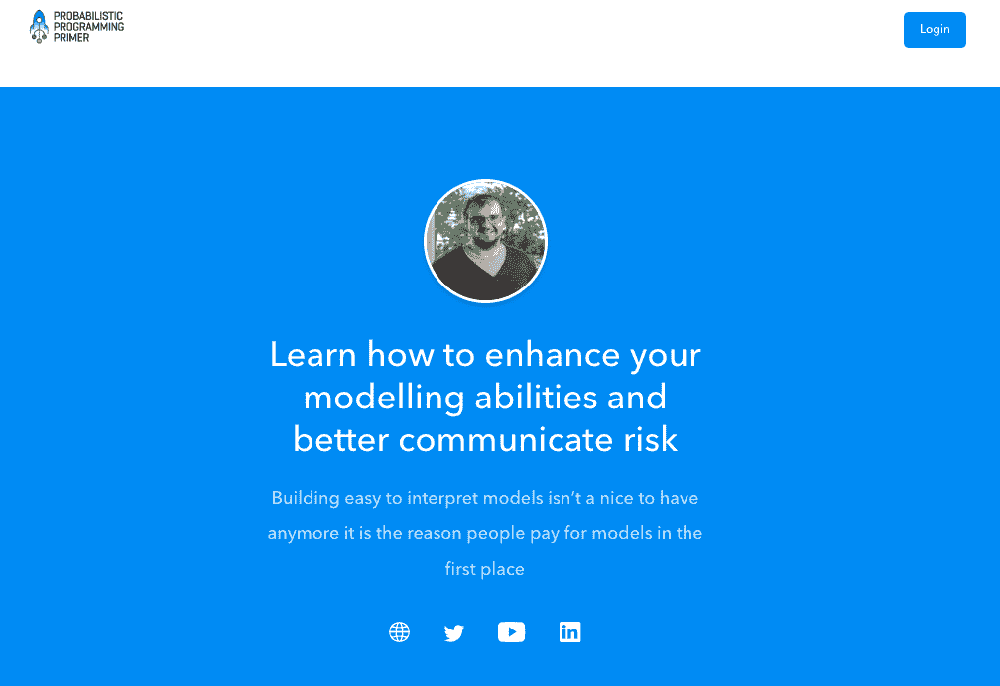
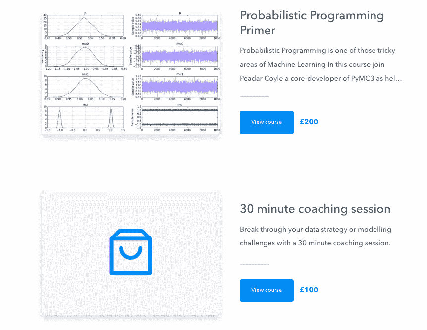
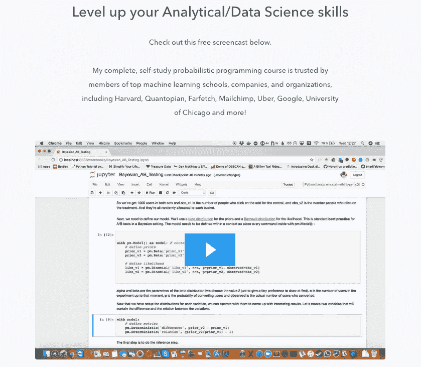

# 我如何将知识(和失业)转化为有利可图的产品

> 原文：<https://www.indiehackers.com/interview/how-i-turned-knowledge-and-joblessness-into-a-profitable-product-e9beed1695>

## 你好！你的背景是什么，你在做什么？

我是皮达尔·科伊尔，是一名驻伦敦的机器学习工程师。我因我的一些 OSS 作品而出名，尤其是 [PyMC3](https://en.wikipedia.org/wiki/PyMC3) 。在会议上反复被问及是否会考虑学习一门课程后，我建立了[概率编程入门](https://www.probabilisticprogrammingprimer.com/)，我选择了在线内容，特别是考虑到可扩展性。

到目前为止一切顺利——从 8 月份开始，我已经赚了大约 7k 英镑，所以我已经不亏不赚了。

 

## 是什么促使你开始学习概率编程初级读本？

当我开始建立课程时，我刚刚离职，对自己是否应该进入个体经营的咨询公司或找到另一份工作感到不确定。我有一些时间来思考这个问题，所以我决定看看这些课程的发展方向。我通过使用 [podia](https://www.podia.com/) 收集带有反馈的电子邮件来验证这个想法。大约一个月后，我收到了 100 封表达兴趣的电子邮件，我知道我有足够的客户需求来继续前进。

我是 PyMC3 的核心贡献者，并在世界各地的主要会议上发表过关于贝叶斯统计的演讲，所以我有可信度和专业知识。我考虑过做一个会员制网站，但是我不确定我能给多少承诺。

## 构建最初的产品需要什么？

一开始，我非常专注于验证我的想法和理解产品与市场的契合度。总的来说，我花了大约两到三周的时间全职制作原创内容，这些内容是基于我以前上过的一些课程。在整个过程中，我向朋友们寻求反馈和建议，并尽可能有意识地决定包括什么和不包括什么。例如，我有意识地选择不深入非常高级的话题。

我看到一些企业家犯的一个大错误是低估努力工作的重要性，过分强调伟大想法的重要性。你必须走出去，让它发生。

TweetShare

虽然我会编码，但我不想在开发上投入太多时间。我认为验证产品和确保内容真正到位更重要，我也觉得工程师过早地投入开发过程往往会过度设计。我使用 podia、 [MailChimp](https://mailchimp.com/) 、 [Zapier](https://zapier.com/) 以及脸书和谷歌广告来推广课程，让事情顺利进行。我对我用来构建初始产品的所有工具都很满意。

有一件事我希望能早点做，那就是建立一个邮件列表，我已经雇了一个自由职业者来帮我扩大这个列表。

我几乎是从零开始做起，没有在财务上投入大量资金。我用自己的积蓄资助一切。

## 你是如何吸引用户和发展概率编程入门的？

我最初用预发布来验证我的想法，几个月后，越来越多的用户加入了我的想法。我肯定想努力吸引更多的网站流量。我目前每月大约有 800 次访问，这很令人失望。肯定太低了。我目前有大约 65 个付费客户。10 月份我有 12 个客户，对我来说这是一个好月份，11 月份我获得了 23 个新客户。其中一部分是我的广告宣传的力量，但我也从我在黑色星期五提供的折扣中得到推动。

我综合运用了市场营销和广告技术，包括发布免费在线课程的登录页面，作为获取电子邮件地址的线索来源。我也做了一些广告，并使用在线论坛和时事通讯来推广课程。具体来说，我专注于编程和数据科学时事通讯。到目前为止，我在 LinkedIn 广告或黑客新闻方面还没有任何进展。

一些学生开始有机地推广这门课程，这是一个很好的认可信号，我直接给朋友和前同事发了电子邮件，征求他们的反馈，并鼓励他们也推广这门课程。联盟营销已经彻底失败，使用他人的电子邮件列表也被证明是相当无益的。我真的很有兴趣谈论这些策略以及如何最好地利用它们，所以如果你有任何见解，请联系我们！

如果你想成功，阐明你的价值主张是你需要做的事情，尤其是在利基市场。

TweetShare

我试着系统化我的方法，所以我写下我的目标，设定目标，并且对我的预算毫不留情。这帮助我在几个月内就在邮件列表上增加到了 500 多个。我做的另一件事是提高我的形象，让世界了解我，那就是在会议上发言。[随后发布到 YouTube 上的一个视频](https://www.youtube.com/watch?v=7QlKZKbQa6M)至少有 7000 次观看，并帮助我不费吹灰之力就获得了电子邮件注册。

在创业之前，我没有真正的文案或电子邮件营销经验，所以我不得不求助于书籍和其他资源，包括独立黑客，来帮助我学习和磨练这门手艺。展望未来，我会在搜索引擎优化和博客内容上投入更多的时间，我也非常有兴趣做更多的播客。我做的少数几件事帮助很大。

我犯的一个错误是，我试验了很多杠杆，但不是以严格的方式。我正在努力改变这种状况。

## 你的商业模式是什么，你是如何增加收入的？

我这次面试时的总成交量是 7217.02，大部分是盈利。因为它是内容，而 podia 是固定价格，所以利润很高。我的支出主要是广告、SaaS(比如 MailChimp)和人工成本，比如支付设计师或自由职业者的管理支持。我每个月的开销一般是每月 200-400 英镑。我努力保持低成本，但是我把 11 月份的收入投资到了更好的流程和广告上。

| 月 | 收入 |
| --- | --- |
| 2018 年 8 月 | 783 |
| 18 年 9 月 | 763 |
| 18 年 10 月 | 895 |
| 18 年 11 月 | 3115 |
| 2018 年 12 月 | 1132 |

最初我只提供条纹，现在我也提供贝宝。我希望我早点提供贝宝，它肯定会让我损失销售额。我从在线教练课程中赚钱——通过视频聊天和我的在线课程。绝大多数是来自固定价格的课程。

为了支持我的社区，我运营了一个 Slack 频道，最近这个频道越来越受关注。我认为培训是人们在一年的不同时间投资的事情，所以这个行业有一点季节性。这个月我预计能挣 1000-2000 英镑。折扣和截止日期似乎促使人们为课程付费，价格变化无疑有助于我的收入。我认为我一开始定价过低，我仍在尝试增加内容。

我一直打算让这成为一门付费课程，所以从我的电子邮件列表上得到一些约定的那一刻起，我就开始收费了。随着时间的推移，我的定价结构已经发生了变化，我认为它会继续发展，特别是当我添加更多内容的时候。我还认为我在解释课程的价值主张方面有所提高，这在最初是一个挑战。

 

## 你未来的目标是什么？

我想大幅提高我的流量——漏斗顶端对我来说是一个大问题——并希望在这方面得到一些帮助。我有一些内容在管道中，并将重点放在搜索引擎优化和做播客来提高我的数字。

我希望最终能从中获得 20-40k 的收入，并可能创建后续课程来帮助我实现这一目标。我意识到我的产品肯定有点小众，所以我可能会遇到市场饱和。

就我个人而言，我学到了很多关于产品与市场的契合度，以及如何推动企业的各种杠杆。我想继续学习和个人成长，以及发展我的业务。

## 你面临的最大挑战和克服的障碍是什么？如果你必须重新开始，你会做什么不同的事？

对我来说，学会对波动的现金流的情绪方面做出反应很难。

我一直在努力为我的博客和网站增加流量，这是一个错过的机会。我不认为我做了任何严重的技术决策。我一直在投资自由职业者对我不擅长的事情的帮助和支持，比如帮助我改进电子邮件营销。我在早期犯了一些错误，一次发送了太多的电子邮件，我应该早点标记我的电子邮件并将其分段。我希望我在早期投入了更多的时间来建立我的电子邮件列表，我被所有进入产品发布的工作弄得有点措手不及。

与客户的交谈教会了我很多，尤其是阐明您的价值主张的重要性。如果你想成功，这是你需要做的事情，尤其是在利基市场。

## 有没有发现什么特别有帮助或者有优势的？

艾米·霍伊(Amy Hoy)和帕特里克·麦肯齐(Patrick MacKenzie)([@ patio 11](https://twitter.com/patio11))的观点都很有见地。

在技术方面，我认为我使用 podia 是一个好的决定，他们的支持令人惊叹。

我很善于自我激励，我喜欢坚持工作。我的妻子总是对我的工作能力感到惊讶，即使很无聊。

我认为科学和 OSS 工作的背景培养了我的很多精神气质。我一直对增长黑客和营销感兴趣，比大多数工程师更感兴趣。我认为总的来说，越来越多的开发人员正在投资于他们的技能，Coursera 和其他平台的兴起有助于激发人们对在线课程的兴趣。我认为这和开源软件的兴起是两大趋势，帮助我从中赚了一些钱。

 

## 对于刚刚起步的独立黑客，你有什么建议？

我认为我们经常害怕开始，害怕与客户交谈。我花了几年时间和人们谈论他们是如何学习现代机器学习技术的。这一点，加上在图书馆的工作，教会了我很多关于什么是容易的，什么是困难的。

我看到一些企业家犯的一个大错误是低估努力工作的重要性，过分强调伟大想法的重要性。你必须走出去，让它发生。这意味着给人们发邮件，打电话，熬夜——做任何你需要做的事情。

## 我们可以去哪里了解更多？

关于我在这次采访中所说的任何事情，请随意提问。我是推特上的 [@springcoil](https://twitter.com/springcoil) ，我负责[peadarcoyle.com](https://peadarcoyle.com/)。如果你在会议上看到我，过来和我聊天，我喜欢谈论技术和商业。我们生活在真正激动人心的时代。

—[<picture id="ember8115683" class="user-avatar ember-view user-link__avatar"></picture>皮达尔·科伊尔](/springcoil?id=Vz4sZGQCP0bsH0AveS0QTGsMlTc2)【概率编程初级读本】创始人

## 想像《概率编程初级读本》一样自己创业？

你应该加入独立黑客社区！🤗

我们是几千名创始人，互相帮助建立有利可图的业务和副业。来分享你正在做的事情，并从你的同事那里获得反馈。

还没准备好开始使用你的产品吗？没问题。这个社区是一个认识人、学习和实践的好地方。随意[随便浏览](/)！

——[<picture id="ember8115688" class="user-avatar ember-view user-link__avatar"></picture>柯特兰艾伦](/csallen?id=ibTLPyjwVebnZjMGKvz6ztarnuV2)，独立黑客创始人

31votes