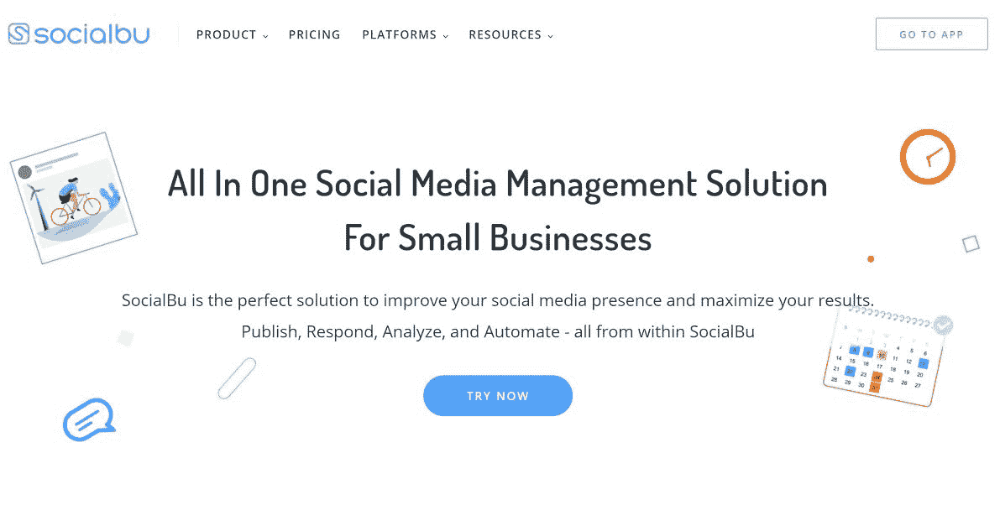
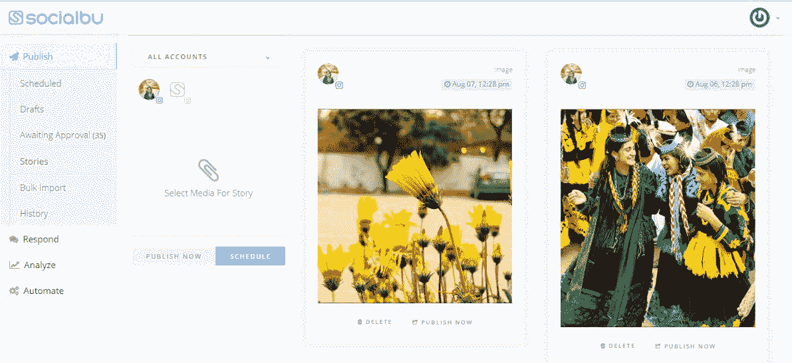

# 我如何把我自由职业的挫折变成一个 4k 美元的 MRR 应用程序

> 原文：<https://www.indiehackers.com/interview/how-i-turned-my-freelance-frustrations-into-a-4k-mrr-app-2f14778400>

## 你好！你的背景是什么，你在做什么？

大家好，我叫 Usama Ejaz，是一名全栈软件工程师。在创办 SocialBu 之前，我作为软件开发人员在不同的公司工作了大约四年。我也喜欢营销，并在我的一些项目中学习了数字营销。

大约两年前，我决定将我对社交媒体营销和开发的热情和经验变成一个全职项目。于是，我创办了 SocialBu。

SocialBu 是一个一体化的社交媒体管理和自动化解决方案。它帮助小企业和品牌从一个地方管理他们所有的社交媒体账户。它可以帮助安排内容、管理对话、团队合作等等。SocialBu 还具有完全动态的自动化功能，使任何人都可以自动化任何场景，比如从 RSS 订阅源发帖、自动评论和回复、web-hook 集成等等。

100%自举的创业公司已经能够达到 5，000 个用户。我们在大约 4000 美元 MRR。我们的客户通常是小企业主、博客作者、有影响力的人、社交媒体营销人员和数字机构。

## 有人应该从这次面试中学到什么？

当你行走时，路径出现。

我们从零开始，我们甚至必须学习很多东西才能开始，并且仍然在努力达到我们的目的地。事情开始时看起来非常模糊和混乱，但随着我们的进展，它变得越来越清晰和更好。

坚持和不放弃真的很重要。坚持、适应市场、合适的团队和良好的愿景至关重要。

## 是什么促使你开始使用 SocialBu？

我和其他几个朋友作为自由职业者为不同的企业管理社交媒体。我们使用多种工具来管理社交媒体账户，但使用各种工具非常昂贵，而且仍然感觉受到限制。我四处打听，意识到我不是一个人，很多其他人都觉得这太过分了。所以我们决定建立我们想要的解决方案。

一个更早的灵感是我很久以前制作的一个工具，用于张贴到脸书小组，因为这给了我一个关于这种工具的潜力的想法。最初，我开始每天写两个小时的代码，同时继续我的商业研究学位。那时候我也在做自由职业者。这非常累人，因为我一天要工作 16 个小时，即使是在周末。但让我坚持下来的是我对工作的热爱。我也不断地与目标人群讨论想法和 MVP 来塑造产品。

## 构建最初的产品需要什么？

我开始独自构建产品。那时我是一名自由职业者，在不同的软件公司工作，我兼职做产品。在真正进入开发阶段之前，我花了大约四到六个月的时间做研究，询问人们他们在寻找什么样的功能，当前工具的痛点，产品可能如何工作，等等。我在这个阶段学到的东西帮助我塑造了产品。在我完成这些事情和商业模式后，我开始实际构建产品。

一旦我得到了验证，其他三位联合创始人就加入了这个团队。我们注册了公司，正式开始营业。当我们被当地一家名为 PlanX 的孵化器选中时，我们受到了极大的鼓舞，该孵化器提供指导和支持，但不提供资金。这为我们节省了大量的租金和办公成本。

关于资金，我们的计划从一开始就是建立和发展我们自己的产品，我们从 bootstrapping 收集初始启动成本。我们逐渐有机增长，然后雇佣更多的人，慢慢扩大规模。

## 你的技术是什么？

我们使用多种编程语言和框架。对于前端，我们大量使用 [VueJS](https://vuejs.org/) 和 [Bootstrap](https://getbootstrap.com/) 。我们还为我们的移动应用程序使用 [NativeScript](https://nativescript.org/) 。

对于后端，我们使用 PHP，Laravel。我们后来为我们的一些后端服务添加了 [NodeJS](https://nodejs.org/en/) 。

设计我们的自动化特性是一项具有挑战性的任务，因为特性的本质和它的“灵活性”。

## 你是如何吸引用户和发展 SocialBu 的？

初始版本在 [BetaList](https://betalist.com/) 上发布。它带来了一些流量，帮助我们获得了初始用户。

我们没有发布[产品搜索](https://www.producthunt.com/)(我们想为“发布”做好准备)，所以我们将在不久的将来发布。我们还在各种列表网站(启动列表、产品列表网站等)上提交了我们的产品。

我开始接触那些在 Reddit 和脸书等在线社区寻找解决方案的人。我不断收集反馈，并在此过程中获得了一些用户。之后，当其他团队成员加入我的团队时，我们加大了最初的营销力度。由于缺乏财政资源，我们的主要重点是通过有机渠道锁定我们的客户。我们瞄准了在线社区，如独立黑客、创业和商业相关的子网站，以及一些脸书团体，以不断学习和改进我们的产品和业务。我们还使用了 Quora，在那里我们回答了与我们领域相关的问题。虽然我们短暂地尝试了付费广告，但最终对我们不起作用，所以我们停止了。

你的用户是你最大的资产，如果他们喜欢你的产品，他们会很乐意推荐给别人。

TweetShare

然后就是冷冰冰的邮件。我们手动锁定了一些营销机构和有影响力的人，并联系了他们，但我们认为这是一次失败，因为回复率太低，无法继续在这上面花费时间。然后，我们计划通过内容营销和搜索引擎优化带来大量客户。我们有专人负责，但内容不会立即产生结果，所以我们不会让它成为我们唯一的关注点，尽管我们确实做了一些客座博文，为我们带来了一些流量。

最近，我们尝试提供终身交易，这在 SaaS 世界非常受欢迎，我们决定将交易提供给一个小型有限公司集团。它帮助我们获得了一些我们需要的资金，也帮助我们塑造了我们的产品。它给了我们足够多的用户来正确地测试产品，并获得我们需要的初始提升。此外，我们不想在 AppSumo 这样一个非常受欢迎的平台上提供交易。我们想做一个小测试。

我们了解到不断从用户那里获得反馈，了解他们如何使用你的产品，以及不断改进产品是非常重要的。你的用户是你最大的资产，如果他们喜欢你的产品，他们会很乐意推荐给别人。

我认为推荐营销真的被低估了。与客户建立联系，并在他们需要时为他们提供帮助和支持，这对我们的发展至关重要。同样非常重要的是，监控你的指标，了解你的位置，这样你就可以改进它。

## 你的商业模式是什么，你是如何增加收入的？

我们提供每月和每年的订阅。我们的客户来自不同的背景和地区，为了满足他们不同的需求，我们有多种定价方案。它从每月 8 美元开始，到每月 199 美元，有 14 天的免费试用期。我们还提供仅限个人使用的免费计划。有几次我们甚至制定了定制计划！

除了这些定期订阅，我们过去还进行了一项交易，帮助我们解决了最初的现金需求。不用说，钱不花光真的很重要！当我们在美国成立公司时，我们决定使用 Stripe(而不是 Braintree ),因为它感觉更好。

我们最初的定价非常低，大约三个月后我们改变了定价。虽然我们为价格合理而自豪，但我们需要为自己的价值充电。第一个月，我们的 MRR 只有 22 美元。然后第二个月 50 美元。大约六个月后，我们的价格是 500 美元。增长缓慢，但一直在改善。现在我们每月收入 4000 美元。

## 你的赌注是什么？失败是什么样子的，你是如何激励自己避免失败的？

我们这些创始人，也都是学生。我们推迟了一部分教育去做社会福利。我们冒着受教育的风险，放弃工作，与任何挡在我们面前的事情做斗争。

我们已经付出了所有的努力，失败意味着我们所有的时间、努力和牺牲都化为乌有。失败将是一个不可挽回的、致命的打击。

我们绝不会让这种事情发生。我们已经准备好尽一切努力。失败对我们每个人来说都是不同的，但我们的关注点和愿景是一致的，我们走在同一条路上。

## 新冠肺炎对你有影响吗？为什么

的确如此。我们的净收入肯定增加了，但我们作为一个团队受到了影响。

我们几乎进展顺利，然后 COVID 发生了，它扰乱了我们的生产力。调整花了很多时间。

现在一切都恢复正常了...但是我们损失了很多时间。

## 你未来的目标是什么？

我们的主要目标是为用户提供社交媒体管理和自动化的完整解决方案。我们一直在增加新功能，不断改进我们的产品。我们正在努力完善现有功能，从报告到缩放，并按照相同的方向添加新功能。

随着我们的发展，我们还打算增加像 Pinterest、Reddit、抖音这样的整合渠道的数量，这样客户就可以在*所有*社交平台上管理*所有*他们的社交媒体账户，而不必在多种服务之间切换。

就我们的财务状况而言，我们希望保持增长。我们的目标是在接下来的六个月内达到至少 2 万美元的 MRR。

我们从来没有全职专注于营销和销售...这不是一件好事，如果我们早点这么做，我们现在会好得多！因此，我们计划在不久的将来将全部时间放在营销和销售工作上。

## 你面临的最大挑战和克服的障碍是什么？

即使我们很早就建立了我们的网站，我们也没有通过网站跟踪客户的旅程，也没有收集任何反馈。因此，我们失去了很多改善用户体验的机会。后来，当我们决定更新网站时，我们没有足够的用户生成数据来真正知道需要改变什么。我们甚至不知道用户取消订阅的原因！显然那是*极其*重要的数据。我们缓慢地改进，现在我们几乎可以跟踪所有的事情，并且可以根据数据和用户反馈做出更好的决策。

产品发布应该频繁；没有必要等待“完美的产品”

TweetShare

招聘也比我想象的复杂得多。组建一个有着共同愿景并且运作良好的团队是非常棘手的。招聘消耗了我们大量的精力，回报却很少。那时我们没有多少经验，但现在我们学到了。我们从中得到的一个重要启示是，拥有一个优秀的员工比拥有两个平庸的员工要好。

## 你认为你可以做些什么来更快地达到你的收入目标吗？为什么？

当然了。我们开始时资源匮乏，不得不专注于业务开发、产品更新和其他非营销事务。我们无法将全部时间放在营销上。

如果我再来一次，我会有至少一个全职营销的创始人！

## 有没有发现什么特别有帮助或者有优势的？

我们有很多人帮助和指导我们。我们当地的导师和老师在整个旅程中给了我们很多帮助。

在线社区过去(现在仍然)对我们帮助很大。我们曾经读到过其他人如何在独立黑客之类的社区和各种子社区中做事。和志趣相投的人、创始人和目标客户在一起很重要，也很有帮助。

我的技术技能对构建产品非常有帮助，我的人际交往技能对构建我们的团队也非常有帮助。不要小看自己的技术！

## 对于刚刚起步的独立黑客，你有什么建议？

创业之旅并不容易...但是值得。以下是我学到的一些东西:

*   一致性非常重要
*   知道何时放弃或何时转向也很重要
*   在你开始研究产品/想法之前，应该确保市场适合度。
*   产品发布应该频繁；没有必要等待“完美的产品”
*   绝不错过任何一个潜在客户或感兴趣的客户；即使你还没有准备好产品，至少也要创建一个电子邮件列表
*   阅读 *lot* (其他创始人的书籍和经历)
*   建立正确的团队，并确保角色和工作被非常清晰地定义

## 我们可以去哪里了解更多？

您可以在我们的[网站](https://socialbu.com/)了解更多关于 SocialBu 的信息。

我们也很乐意为独立黑客提供 25%的折扣！要获得它，只需联系我们的支持，并在注册时提到独立黑客。

如果你想更多地了解我，或者认为我可以帮助你，请与我联系。如果你有任何想法或问题，请在下面的评论中告诉我。

——[<picture id="ember5298590" class="user-avatar ember-view user-link__avatar"></picture>乌萨马·埃贾兹](/usamaejaz?id=U0iFFz2V4ibRiHsYUYFNitSK6yx2)，SocialBu 创始人

## 想像 SocialBu 一样建立自己的事业？

你应该加入独立黑客社区！🤗

我们是几千名创始人，互相帮助建立有利可图的业务和副业。来分享你正在做的事情，并从你的同事那里获得反馈。

还没准备好开始使用你的产品吗？没问题。这个社区是一个认识人、学习和实践的好地方。随意[随便浏览](/)！

——[<picture id="ember5298595" class="user-avatar ember-view user-link__avatar"></picture>柯特兰艾伦](/csallen?id=ibTLPyjwVebnZjMGKvz6ztarnuV2)，独立黑客创始人

30votes