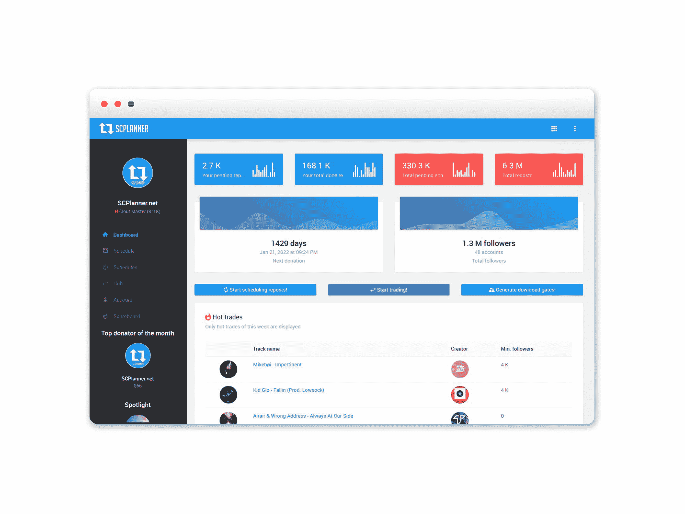
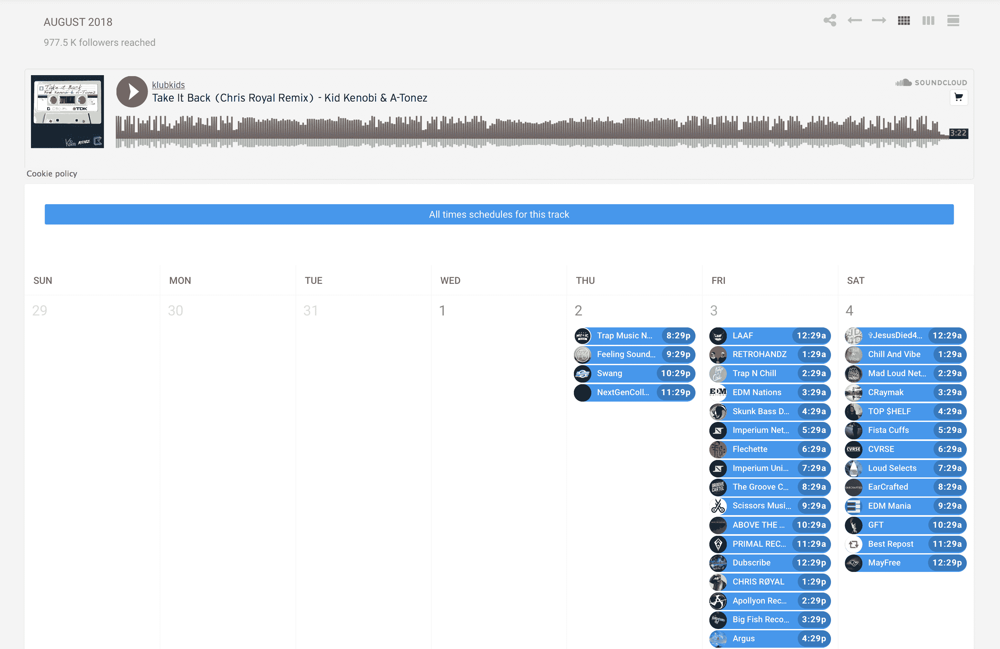
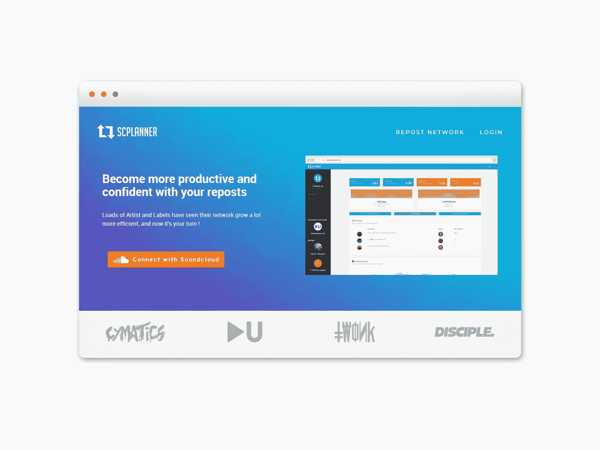
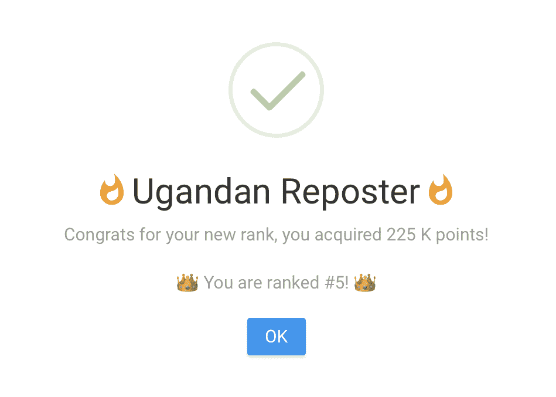

# 我如何把我的副业变成一个值得收购的产品

> 原文：<https://www.indiehackers.com/interview/how-i-turned-my-side-hustle-into-a-product-worthy-of-acquisition-eda6679953>

## 你好！你的背景是什么，你在做什么？

你好！我叫吉尔·伯恩哈德，来自法国。两年多前，我和一个老朋友共同创立了 SCPlanner.net，现在这是我的全职工作！

在创办 SCPlanner 之前，我在巴黎学习音响工程。我在广播电台工作，制作音乐，为艺术家和唱片公司做 SoundCloud 推广，以此来赚点外快。

这是我开发 SCPlanner 的原因。它帮助我规划了我的 SoundCloud 频道上的所有转发(转发，类似于转发，允许你与你自己的粉丝分享你订阅的艺术家的歌曲)，让我的活动取得更好的结果，并与更多的客户合作。

在开发 SCPlanner 的时候，我在法国斯特拉斯堡的一家广播电台做全职广告策划。发布 9 个月后，我辞去了工作，专注于推广 SCPlanner 和制作音乐。如今，SCPlanner 已经从一个副业发展成为各种艺术家、唱片公司和博客在 SoundCloud 或 Spotify 上管理音乐的工具。一些最大的艺术家和标签，如弟子，每天都在使用这个工具。

推出两年后，SCPlanner 每月赚 3500 美元，并被[转帖网](https://www.indiehackers.com/product/repost-network)收购，以努力为其艺术家提供更多工具来推广他们的音乐并创造收入。

## 是什么促使你开始使用 SCPlanner？

我曾经为自己、其他艺术家和我管理的唱片公司做 SoundCloud 推广。额外的收入很不错，但是这个过程非常耗时，而且除了全职工作之外很难管理。我意识到我需要自动化一些工作流程，因为必须在 SoundCloud 上登录和退出我的所有频道，并为每个频道输入验证码是不可行的，也是不可持续的。

另一个问题是所谓的*转发爆炸*。SoundCloud 上的推广是一个“转贴换转贴”系统，有影响力的人和较小的渠道相互交换转贴。通常，转发会持续 24 小时，然后被手动删除。如果每个人都在同一时间坐下来做他们的推广和转发(例如，下班后)，那么他们就是离散的时间块，转发会在 SoundCloud 上炸开，淹没每个人的反馈。如果你陷入了转发的浪潮中，你的转发很容易迷失在转发的海洋中，用户也很容易产生转发疲劳。你的 SoundCloud reach 受到了影响，因为它淹没在用户反馈中，没有太多的用户参与你转发的内容，因为他们已经被转发淹没了，你的歌曲最终没有获得你期望的浏览量。如果你不能在一天中不同的时间间隔登录和退出，你就有点麻烦了。

不要为一个不存在的问题想出解决方案！

TweetShare

我做了一些快速研究，发现没有工具可以满足我的需求。因为我喜欢想出新的系统来节省时间，让生活变得更轻松——即使这意味着一开始要做更多的工作——我开始考虑构建自己的工具。我希望它易于使用，并具有专注于转发时间安排、提高转发范围和节省时间的关键功能。

这不是我们第一次使用 SoundCloud API，所以我们很快就知道这个想法从技术角度来看是可行的。考虑到这一点，我们决定建造它。

## 构建最初的产品需要什么？

由于我本人不是开发人员，所有的编码都是由联合创始人 Jean 完成的。我向他发送了确保该工具符合我的需求所需的基本指南:

1.  使用一个 SoundCloud 帐户登录
2.  将多个 SoundCloud 通道添加到您的 SCPlanner
3.  粘贴一个或多个 SoundCloud 轨道 URL
4.  选择转发日期
5.  选择何时取消转发、点赞和评论曲目
6.  显示所有即将到来的和过去的时间表列表

传播转发而不是做爆炸，规划转发，并能够看到你的渠道上安排什么是最基本的功能，需要有效地解决登录/注销验证码问题，以及适当地安排推广。

我们已经完成了大部分的 SoundCloud API 编码，这些编码已经在之前的项目[ArtistEngine.net](https://artistengine.net)中完成了。这帮助我们在很短的时间内完成了这个工具。我们在不到几个晚上的时间里完成了第一个产品，同时全职做其他工作。

尽管这个设计是一个简单的*引导 CSS* 管理面板模板，功能也是最少的，但几周后我就用它来推广我自己的 SoundCloud。我把这归功于尽最大努力使这个系统尽可能容易使用。

 

我清楚地记得第一次测试时的匆忙，发现一切都(几乎)完美地工作着！很明显，这将节省大量时间，并让我获得更多的客户！这是一个非常强大的工具。

因为 Jean 和我自己设计并创建了 SCPlanner，我们当时唯一的费用是服务器和域名每月 10 美元。我们不需要任何资金或员工/承包商，所以我们在获得第一批用户后就盈利了，就在发布后几天。大约 10 个月后，我们雇佣了第一批兼职承包商来帮助我们开发新功能和更新。有些人最终没有成功，所以我们用一个更小的团队来管理。

随着 SCPlanner 的成长，我们转向了更好的服务器。一旦我们被收购，我们转向亚马逊网络服务。

## 你是如何吸引用户并发展 SCPlanner 的？

这是 SCPlanner 最有趣的部分，至少对我来说是这样。它基本上是有机生长的！

在我开发 SCPlanner 的时候，每个人都在使用 Facebook Messenger 进行转发和 SoundCloud 推广。有专门为 SoundCloud 推广而成立的大型脸书团体，这使得寻找新的合作伙伴变得很容易。因为这个系统和目标用户是在一个非常小众的行业，我认识(几乎)每天都在做这种类型的 SoundCloud 推广的每个人。因为我是社区的一部分，所以没有必要做付费广告！

 

在实际发布之前，我基本上为潜在用户演示了产品。每次我为别人计划转发推广时，我都会使用 SCPlanner，并给他发一张我的设置和时间表的截图。这样，他就知道我已经完成了这项工作，并且可以很容易地追踪到转发的时间。人们很快开始问我正在使用什么工具，以及他们如何获得它。那时我们决定推出。

它迅速成长！我们在 10 天内就有了 20 个付费用户。从那以后，我们主要靠口口相传来获得新用户。在没有任何广告的情况下，我们在一个月内成功吸引了 500 个新的 SoundCloud 频道。

然后，我们建立了一个推荐计划:邀请三个朋友免费参加一个月。效果还不错，但没有我希望的那么好。我们可能会在某个时候回到推荐计划，但我们必须调整一些东西，使它更有吸引力。我们也非常重视支持。我们确保回答每个问题，听取反馈，并不断迭代和改进以保持相关性。

SCPlanner 很快成为最知名的安排转发的工具。

 

很久以后，我们引入了可共享的跟踪链接。

每当有人计划转发时，它现在会给出一个自定义的 URL，列出某个特定曲目的所有转发、喜欢、评论和取消转发。任何人都可以在任何地方分享这个网址，这是我们目前获得新用户的最有效的方法！不熟悉该工具的人可以通过其中一个可共享的链接来发现它。

每个新用户都可以获得 *7 天的免费试用*。我们发现这是非常宝贵的。人们总是喜欢在使用新系统之前尝试所有的功能。

SCPlanner 并不便宜，但我认为这实际上有助于品牌的合法化。免费服务的质量通常不是最好的，或者功能有限。所以我们很早就决定 SCPlanner 不会便宜，因为我们觉得它提供了真正的价值，并希望向我们的潜在客户展示这一点。那时候，我们是唯一的计划工具。

阅读乔纳·伯杰的《T2:传染的 T3》帮助我产生了创建一个 T4 排名系统 T5 的想法。很多人喜欢炫耀他们使用 SCPlanner 或拥有巨大的网络，所以让我们给他们展示给所有人的能力吧！我们创建了一个基于活跃度的公式，并根据活跃度的多少添加了一些搞笑的排名名。然后，当获得一个新的等级时，我们在登录时以一个漂亮的弹出窗口显示它。

 

排名系统在第一周非常非常有效！然后慢慢就淡了，不出所料。

不管怎样，我仍然对它提供的结果非常满意。脸书的每个人都分享了他们新获得的排名的截图。他们不知道积分是如何获得的，他们会得到什么额外津贴，他们只是喜欢给每个人看。即使它没有带来大量的新用户，但它让这个品牌留在了每个人的脑海中，让他们互相评论对方的帖子，让他们想爬到前 100 名用户！

## 你的商业模式是什么，你是如何增加收入的？

起初，SCPlanner 并不适合每一位 SoundCloud 艺术家。我想用它来满足我的需求。但随着兴趣的增长，我需要找到一种创收的方式。

因为我负责 SoundCloud 的活动，我知道一定数量的追随者能带来多少钱。我就是在那里产生了按月收费的想法，并根据一个用户的关注者总数来收费。如果你在你的 SCPlanner 中增加了多个 SoundCloud 频道，随着你的观众数量的增加，你需要支付更多的费用。我们还将您网络中最多 20，000 名粉丝的最低费用设定为每月 2 美元。这样，较小的艺术家和唱片公司可以以合理的价格使用 SCPlanner。

我们从来没有改变这个公式，直到今天，我们设法保持每月收入的增长，即使我们向每个转帖网络艺术家赠送免费计划。

| 月 | 收入 |
| --- | --- |
| 2016 年 2 月 | 163 |
| 16 年 3 月 | 223 |
| 2016 年 4 月 | 329 |
| 2016 年 5 月 | 567 |
| 2016 年 6 月 | 827 |
| 2016 年 7 月 | 825 |
| 2016 年 8 月 | 1102 |
| 2016 年 9 月 | 1422 |
| 16 年 10 月 | 1472 |
| 2016 年 11 月 | 1667 |
| 2016 年 12 月 | 1876 |
| 2017 年 1 月 | 1991 |
| 2017 年 2 月 | 1981 |
| 17 年 3 月 | 2635 |
| 2017 年 4 月 | 2509 |
| 2017 年 5 月 | 2944 |
| 2017 年 6 月 | 3237 |

每笔付款都是用贝宝支付的。我们增加了一个滑块，这样人们可以支付比他们设定的更多的钱。他们为什么要这么做？我们在每个页面上都添加了“本月最佳捐赠者”的特色简介。一些用户故意支付比顶级捐助者更多的钱，以便在那里被展示。我们也给顶级捐赠者一个月的免费时间，如果他们能连续超过 30 天的话！我们对此并不抱太大期望，但最终，它产生了一些有趣的结果。

收购后，收入保持稳定，但已停止增长。这样做的原因是因为我们现在给每个转帖网络渠道提供折扣。如果你拥有一个或两个在 Repost Network 注册的频道，你不必在 SCPlanner 上为它们付费，但你仍然需要为你拥有的不属于 Repost Network 的所有其他 SoundCloud 频道付费。

从今天起，SCPlanner 不再是正现金流，但它是收购战略/更大图景的一部分:艺术家和唱片公司被邀请注册转贴网络，通过版税在这个平台上而不是 SCPlanner 上产生收入(你可以在转贴网络的采访中了解更多信息)。

## 你最终卖掉了 SCPlanner。这个过程是怎样的，你未来的目标是什么？

当我们达到每月 3000 美元的收入时，我决定是时候寻找一家更大的公司来帮助我们扩大规模了。拥有大量数据(用户统计数据、收入统计数据、平均会话时间、每月访客数等)非常重要，这样才能为收购建立一个强有力的案例。

保持坚定并相信你的愿景是很重要的，因为最终你不可能让每个人都满意！

TweetShare

几个月后，SCPlanner 被一家著名的分销公司 Repost Network 收购。他们的快速增长和对音乐产业的新观点让我相信我们做了正确的决定。总的来说，律师之间来回奔波，但他们的建议对成功和满意地完成这笔交易非常有价值。

我们的目标是继续增加收入，不断增加功能。由于行业正在转向 Spotify，我们所有的注意力现在也转向了 Spotify。每次收购后，团队都有所扩大，因此下一个重大步骤是让每个新开发人员加入进来，提高生产率，并加快更新和支持。

## 你面临的最大挑战和克服的障碍是什么？如果你必须重新开始，你会做什么不同的事？

我们很快意识到 SoundCloud API 不是最容易使用的。因为他们经常不回应请求，我们最终决定建立自己的库，并使用非官方的 SoundCloud API v2。

在某些时候，我们有太多的时间表要处理，我们最终将 MySQL 数据库改为 Postgresql 来提高性能。

我们拥有的服务器也不是最佳选择。由于服务器问题，我们停机了 5 个多小时。如果我不得不重新开始，我会选择另一种服务。

时区最初是一个巨大的挑战，因为我们所做的一切都是基于计划事件。正确掌握 SCPlanner 的这一方面需要一段时间。我们现在有了 UTC 格式的所有日期，浏览器为用户设置了时区。

听取超级用户的意见是让产品朝着正确方向发展的关键。

TweetShare

在某些时候，我们不得不聘请承包商来帮助我们发展 SCPlanner，因为我们有太多的需求——新工具、新功能、更新等——但几个月后，我们发现代码变得太乱了。每个人都按照他们喜欢的方式工作，彼此之间或者与我们之间没有交流，最终我们仍然在努力修复所有混乱带来的一些小问题。最好是少雇几个人，他们能更好地遵循指导方针，并作为团队的一部分富有成效地工作。

这项业务的另一个非常重要的方面是，SCPlanner 完全依赖于 SoundCloud 和 Spotify。只要他们还有客户，SCPlanner 应该没问题，但如果他们以某种方式失败或消失，我们将不得不迅速转移到新的平台。

我们现在面临的一个主要问题是脸书封锁了我们所有的共享链接。我们想尽一切办法来解决这个问题，但不幸的是，什么都没用。我们的用户一直在寻找创造性的方法，但理想情况下，我们希望在 Facebook Messenger 上恢复可共享的链接！

## 有没有发现什么特别有帮助或者有优势的？

主要优势之一是当时没有竞争对手。我们想出了一个解决促销市场问题的必要方案。由此，我们关注反馈。听取超级用户的意见是让产品朝着正确方向发展的关键。当我们第一次发布新功能时，我们也收到了很多负面反馈。在这种时候，保持坚定并相信你对产品的愿景是很重要的，因为最终它也改变了我们大多数用户的愿景，并创造了一个更好的社区。你不可能让每个人都满意！

约拿·伯杰的 [*传染性*](http://a.co/0XlnLgi) 对 SCPlanner 的营销和病毒传播方面有很大帮助。尽管到目前为止我们只使用了其中的一两个想法，但这本书还有很多我们可以也应该应用的东西。

我还读了彼得·泰尔的《从零到一》( T7 ),这给了我一些基本的概念，告诉我在出售一家小公司时应该做些什么和期待些什么。这不是一本很长的书，所以我并不期待深入的“如何做”，但我仍然喜欢它。

另一本帮助我对自己创建系统的能力充满信心的好书是苏珊·凯恩写的*。这本书与科技或创业公司毫无关系，但却是一本关于利用内向者力量的好书。*

 *最后，我读了几年前艾米·威尔金森的 [*《创造者的密码*](http://a.co/9nQ55Is) 》。每当我要做决定、形成一个新想法，或者只是问自己“SCP 一切都好吗？”时，我都会记住一些“基本技能”

## 对于刚刚起步的独立黑客，你有什么建议？

找出一个问题并想出解决方案。不要为一个不存在的问题想出解决方案！这听起来可能不是革命性的，但记住这一点非常重要。

如果你正在创业，我认为大量阅读书籍是非常重要的。但更重要的是，并不是所有的都与创业直接相关！你应该从不同的领域阅读，并融合这些知识来创造你自己的愿景。

## 我们可以去哪里了解更多？

你可以通过[电子邮件](/cdn-cgi/l/email-protection#6d0a040101081e430f081f03050c1f092d1e0e1d010c0303081f43030819)或我们官方[不和谐频道](https://discord.gg/BPWn88Y)与我保持联系！

如果你想了解更多关于 SCPlanner 的收购，你可以查看这篇[博文](https://edm.com/news/repost-network-acquisition)。

—[<picture id="ember8091569" class="user-avatar ember-view user-link__avatar"></picture>吉勒·伯恩哈德](/GillesBernhard?id=SyK0OdIho0WXrzgITrfD6nuasj23)，SCPlanner 创始人

## 想像 SCPlanner 一样建立自己的事业？

你应该加入独立黑客社区！🤗

我们是几千名创始人，互相帮助建立有利可图的业务和副业。来分享你正在做的事情，并从你的同事那里获得反馈。

还没准备好开始使用你的产品吗？没问题。这个社区是一个认识人、学习和实践的好地方。随意[随便浏览](/)！

——[<picture id="ember8091574" class="user-avatar ember-view user-link__avatar"></picture>柯特兰艾伦](/csallen?id=ibTLPyjwVebnZjMGKvz6ztarnuV2)，独立黑客创始人

25votes*