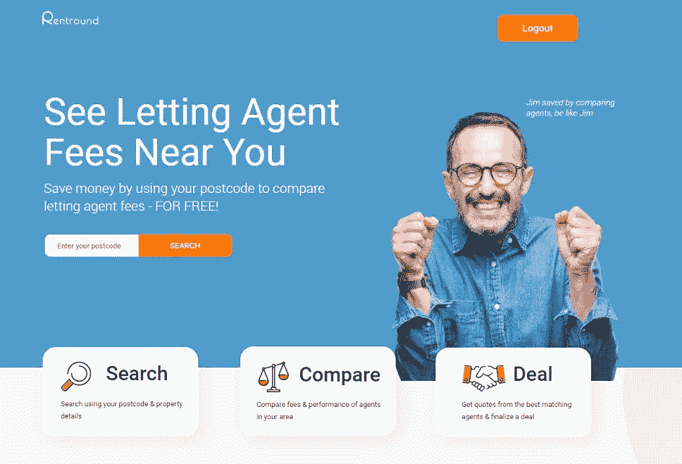
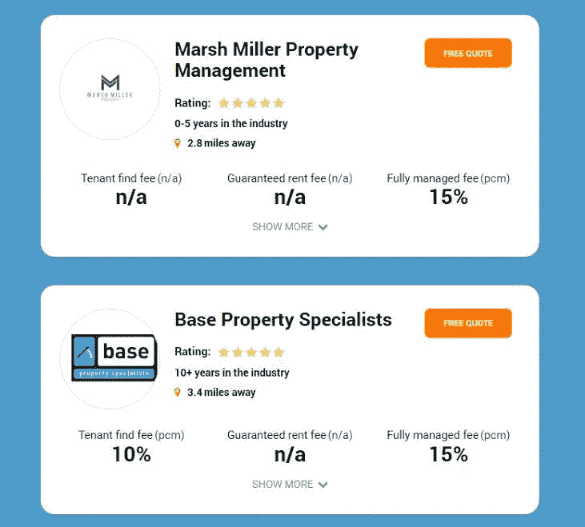
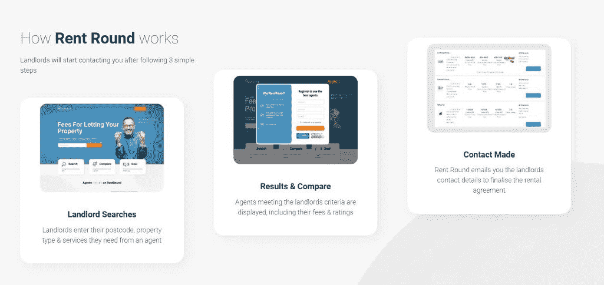

# 我如何用我的小成功来启动我最大的项目

> 原文：<https://www.indiehackers.com/interview/how-i-used-my-small-successes-to-bootstrap-my-biggest-project-yet-405c265b34>

我是 Raj Dosanjh， [Rent Round](https://rentround.com) 的创始人。在获得计算机科学和商业学位后，我开始了在投资银行工作了 12 年的职业生涯。

我一直对商业世界和创建自己的创业公司有着浓厚的兴趣。一家化妆品肥皂公司和一个学生指导平台是我的两个失败案例。积极的一面是，我开办了一家银行咨询公司，一家成功的[武术俱乐部](https://ruislipbjj.com)，我也在那里教书。我最近的成功是租房。

Rent Round 是一个出租代理比较网站，允许房东比较租赁市场。这为他们每年节省了 1，000 英镑，并且免费供他们使用。

自 2019 年推出以来，该平台的增长一直非常出色。我设法在八个月内收回了我的初始投资。

我所有业务的年收入加起来刚刚超过 15 万英镑。租金回合目前占该数字的 20%左右。然而，该业务每个季度的收入增长在 20-30%之间，因此未来是有希望的。

## 是什么促使你开始租 Round？

我开始做生意是因为我自己的经验，与我自己的出租物业代理交易。在花了几个小时比较价格后，我很困惑，为什么我不能输入我的详细信息，然后比较我所在地区的费用和评级，就像我买保险一样。那是我需要的种子！

我经营自己物业的经验，以及我在创业和与技术打交道时的舒适程度，给了我创建 Rent Round 所需的信心。

验证这个想法是困难的，因为目前没有主要的竞争对手进行基准测试。然而，当我开始分析谷歌关键词搜索时，我很快看到了大量的短语搜索，如“让代理收费多少？”以及“谁是最好的出租代理？”和“物业管理费”这让我看到了房东和业主的需求。

我确实想过将模型扩展到购买/销售市场，而不是租赁市场。然而，我的分析表明，买卖市场竞争更加激烈，因此进入壁垒也更高。

我很幸运，我能够用自己的资金开始创业，因此能够快速起步。

## 构建最初的产品需要什么？

我决定我要创建一个快速和肮脏的系统原型来测试市场。在确认需求之前，我不想大规模投资。我决定将平台的开发保持在 20，000 英镑以下，一旦这个想法得到进一步验证，我将投入更多资金。

经过两个月的漫长日子和多次迭代，原型已经完成。它是基于我喜欢的其他平台设计的。我选择的模式是一种基于订阅的模式，代理人每月支付一笔费用，就可以参与房东进行的比较。这是因为我希望代理商有支付的灵活性。支付大量的前期费用可能会成为一种威慑，所以我想确保我没有推迟代理人的注册。

和我创办的大多数企业一样，企业最耗时的部分是初始设置。我熬了无数个通宵，以确保我能掌控一切。

我也很幸运有一位导师，Sandip Sekhon，他创建了其他成功的企业，包括 [Go Get Funding](https://gogetfunding.com/) 。他的见解为定价、技术和营销方面的关键决策提供了极好的指导。尽管他的企业与房地产无关，但创业的原则可以应用于各行各业。

## 你的技术是什么？

就技术决策而言，我受制于我的开发团队。我没有足够的时间去钻研代码决策、服务器、安全证书、数据库等等。

我给了开发团队关于功能的具体时间要求，以及该功能需要运行多长时间。只要达到了目标，我不在乎他们用什么方法。我宁愿靠边站，让他们成为专家。

一路上出现了一些小问题。我们加快了系统升级，主要是为了保持我们正在经历的快速增长。这导致了关键时段的停机时间和偶尔的页面速度变慢。

我现在不情愿地强迫自己和团队在测试系统增强上花更多的时间。这当然会减慢上市时间，但最终对我们的用户更好。

## 你是如何吸引用户和扩大租金的？

当我们开始的时候，我们没有搜索引擎或者域名权威。必须通过付费的谷歌广告，以相当昂贵的价格吸引房东。我们花了几个小时来分析每次点击成本、转化率和点击率指标

最初，吸引代理商极其麻烦。该战略主要基于三点:

1.  打了很多陌生电话，试图与代理商的决策者取得联系
2.  使用电子邮件列表发送有关我们的工作以及我们如何帮助代理的信息
3.  各大房产举报平台付费功能

可以想象，企业会收到大量关于注册新服务的电话和电子邮件。我向代理商提供免费试用，并承诺获得 X 数量的线索，直到他们需要支付订阅费。这对我来说是一个风险，因为我不确定潜在客户的数量。

预付款意味着我们有可以立即利用的现金流入。然而，从长期来看，这确实意味着收入减少。

TweetShare

从长远来看，我正在努力创建我的网站的内容和入站链接，以帮助增加谷歌的存在。内容包括撰写 2000+字的房产指南和新闻更新，以及为房东创建免费工具，如租金和抵押计算器。这已经被证明是成功的，我们的许多目标关键词在谷歌的第一页都有排名。这有助于减少我们在谷歌广告上的支出，这些支出已经被重新投资于其他营销机会。

此外，房地产新闻媒体的口碑和关注也有助于在代理人之间传播业务知识。这有助于订阅数量逐月增加。

## 你的商业模式是什么，你是如何增加收入的？

这项业务基于订阅模式。代理商每月支付 29.99 英镑的费用，就可以被纳入房东搜索。如果他们设法从我们这里转换一个线索，我们不接受任何额外的佣金。

我们增加了一个套餐，代理可以提前支付一年的所有月付款，以换取 50%的折扣。折扣当然吸引了一些想了解价格的代理商。而一些代理商认为预付是一种风险，因为他们还没有看到我们的结果。

在包月套餐上，一个代理一年要交 360。仅仅一次成功的转换，一个伦敦的代理人平均可以赚大约 1800 英镑。这甚至不是一次性的。如果房东继续与该代理合作，收入将逐年增加。

对于租金回合，预付款意味着我们有可以立即利用的现金流入。然而，从长期来看，这确实意味着收入减少。

就哪些工作做得好并帮助我增加收入而言，写得好、有见地的内容是最有成效的。这有助于提高你在搜索引擎中的地位。因此，该网站获得更多的流量，从而转化。然而，这一点也不容易！创建内容需要几个小时，而让其他网站托管你的内容可能很难管理。

随着品牌对代理商越来越熟悉，我投资进行了重新设计，以改善系统的外观，业务收入大幅飙升。我们看到收入每季度增长约 20%-30%。虽然我们还没有达到数百万英镑，但我在头六个月内就收回了我的初始投资。

## 你未来的目标是什么？

英国有 16000 家租房中介，所以增长空间很大。不幸的是，新冠肺炎影响了房地产市场和我们的增长计划。我们暂停了功能发布和营销活动，因为许多代理都在努力维持运营。

我设定的基准是，到 2020 年底，网站 50%的流量将来自有机来源。实现这一点将大大减轻付费广告的财务负担。目前，大约 80%的流量是通过付费广告获得的，正如你所料，这将大大侵蚀我们的收入。

我们只能通过制作伟大的内容和鼓励代理商和房东之间的更多口碑来实现我们的目标。希望这能产生连锁效应，让物业公司谈论我们，从而进一步增加我们的未付费流量。

租赁市场是我认为 Rent Round 在征服方面做得很好的唯一一个领域。房地产代理市场是一个更大但竞争更激烈的市场。但是我相信租金回合模式也适合在这个领域工作。

向全球扩张是另一种增长方式。我们目前主要在英国，但也需要我们的海外服务。

## 如果你必须重新开始，你会做什么不同的事？

在我们成长的早期阶段，我非常兴奋，并试图在很短的时间内塞进许多变化和倡议。我计划了一场大型广告活动，并且在 2019 年底之前，我还进行了一些技术升级。

一个大规模的升级被安排在一个周末，然后一个相对昂贵的营销活动将在下周一发布。最终，升级出现了问题，当营销发送给成千上万的潜在客户时，网站无法运行。

回想起来，我应该把营销和升级安排得更好！

我已经学会了变得更加冷静，从兴奋中后退一步。动力是生意的关键，当你看到它增加时，很难表现出克制。然而，在需要的时候，放慢速度，评估形势，是一项需要学习的关键技能。

## 有没有发现什么特别有帮助或者有优势的？

对于搜索引擎优化和数字营销来说，[尼尔帕特尔的](https://neilpatel.com/)网站非常有用。它帮助我掌握了基本的数字营销概念，现在随着我更有经验，它也帮助我理解了复杂的方面。

对于动力和灵感来说，海军 Ravikant 讲座是必不可少的。我在乔·罗根的播客[上了解了他，每当我需要一些东西来指引我正确的方向时，他的见解都是金玉良言。](https://www.youtube.com/watch?v=3qHkcs3kG44)

就我的优势而言，我认为最大的优势是跟随直觉做出正确决定的能力。例如，如果我想雇佣一个我立刻就有好感的自由职业者，我会当场雇佣他们。

这也是史蒂夫·乔布斯谈论的事情，关于跟随他的直觉如何帮助他成功！顺便说一句，这绝不意味着我在和他比较我的能力...嗯，还没有:-)

## 对于刚刚起步的独立黑客，你有什么建议？

我发现最有用的特征是一致性。没有一个企业是一夜成功的，也不常见看到立竿见影的效果。我发现经常做一点点工作比短时间内做很多要好得多。最重要的是，这可以避免精疲力尽，但是，除此之外，一个持续的方法通常会在你慢慢清除障碍时显示出更多的结果。我认为在当今世界，许多人都在寻求快速获利和捷径。短期方法只能产生短期效果。

此外，我建议不要让挫折战胜你。有时候事情并不顺利。转换率可能没有你预期的高，博客可能拒绝写你的业务，或者你的网站可能没有按照你想要的方式运行。

如果你能抑制你的挫折感，它会解放你的思想，让你专注于解决问题。

互联网上有关于如何修复一切的信息。关于如何提高转化率，如何创建反向链接，以及如何解决技术问题的细节都在你的指尖。把挫败感推到一边，专注于需要做的事情。

短期方法只能产生短期效果。

TweetShare

根据我所学到的，我对有抱负的企业家的建议是，要很好地了解数字营销。创业时当然需要支付广告和营销活动的费用。然而，它们会很快耗尽你的预算，许多企业无法长期维持下去。YouTube 上有很多指导视频，我建议了解以下基本知识:

1.  编写搜索引擎友好的内容
2.  创建反向链接的最佳方法
3.  确保你的网站没有任何影响搜索引擎优化的因素
4.  知道如何使用 Adwords 并使你的花费更有效率(在没有 Adwords 经理的情况下)
5.  关键词分析，这样你就不会把时间浪费在不能转化为销售额的关键词上

## 我们可以去哪里了解更多？

我在[租房屋博客](https://rentround.com/comparing-letting-agent-fees-performance/)上写了很多内容。如果你对我假装了解柔术感兴趣，我的[武术俱乐部页面](https://ruislipbjj.com/)上有几个视频。

我非常乐意与商界的任何人交谈，无论你是刚刚起步还是已经站稳脚跟。可以通过[【电子邮件保护】](/cdn-cgi/l/email-protection)联系我

不言而喻，任何关于[租轮](https://rentround.com/)的反馈总是受欢迎的！

——[<picture id="ember5218636" class="user-avatar ember-view user-link__avatar"></picture>租轮](/RentRound?id=uBdNFHF2iWZOLqGt36VBQIp4Apo2)，租轮创始人

## 想像租轮一样自己创业？

你应该加入独立黑客社区！🤗

我们是几千名创始人，互相帮助建立有利可图的业务和副业。来分享你正在做的事情，并从你的同事那里获得反馈。

还没准备好开始使用你的产品吗？没问题。这个社区是一个认识人、学习和实践的好地方。随意[随便浏览](/)！

——[<picture id="ember5218641" class="user-avatar ember-view user-link__avatar"></picture>柯特兰艾伦](/csallen?id=ibTLPyjwVebnZjMGKvz6ztarnuV2)，独立黑客创始人

20votes