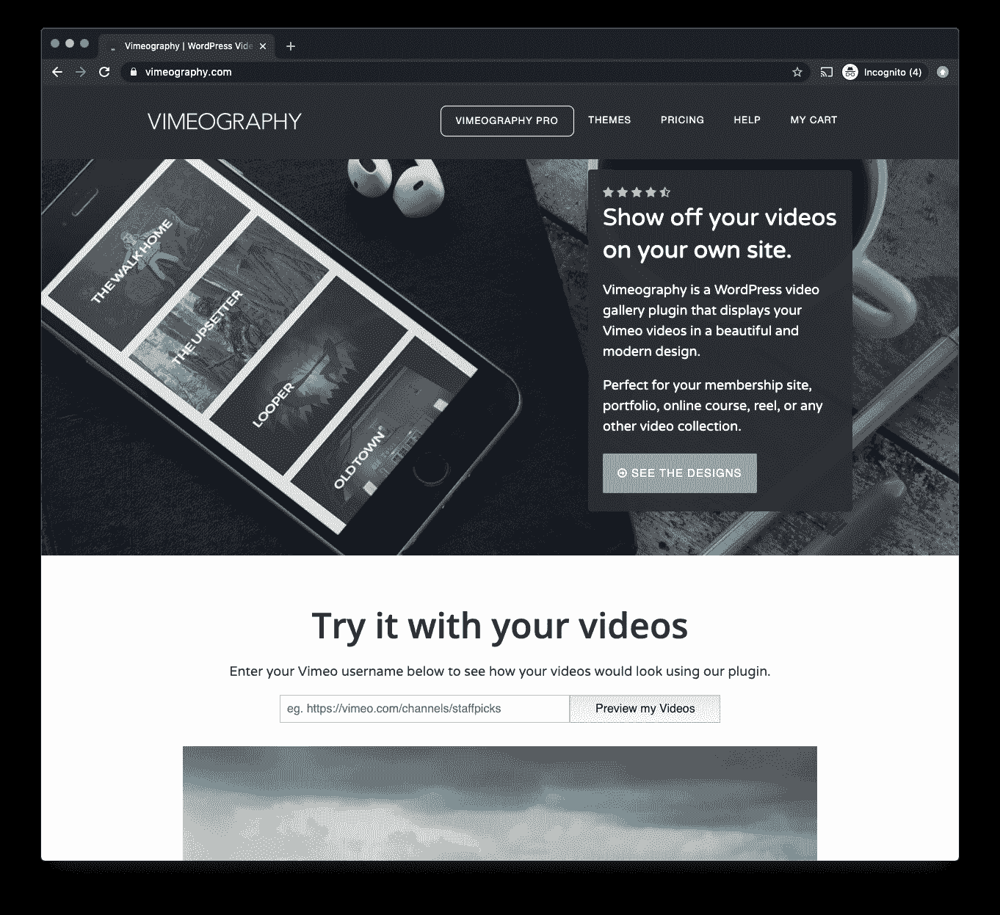
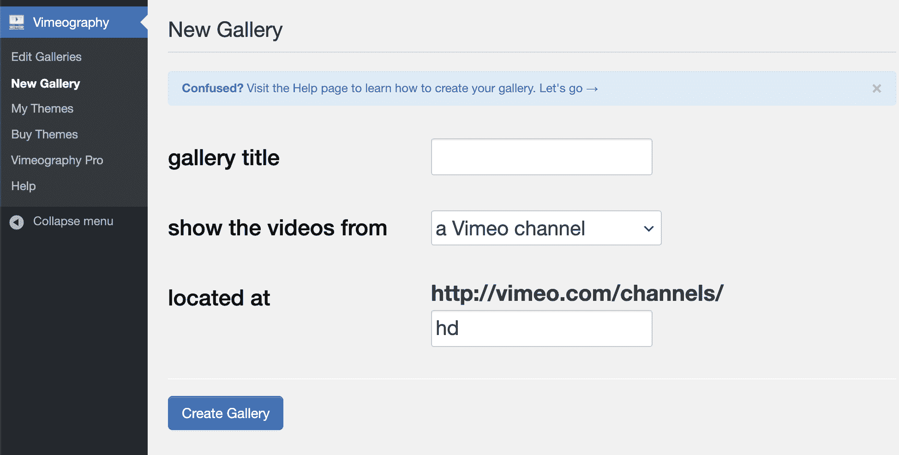
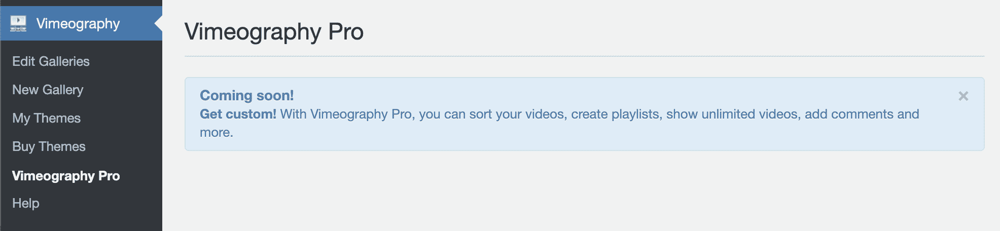
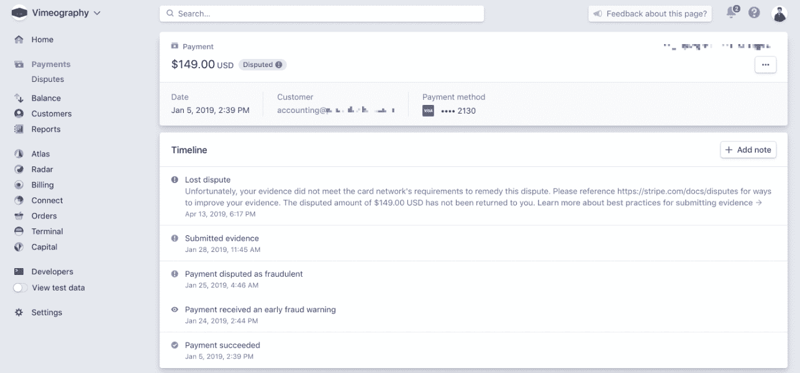
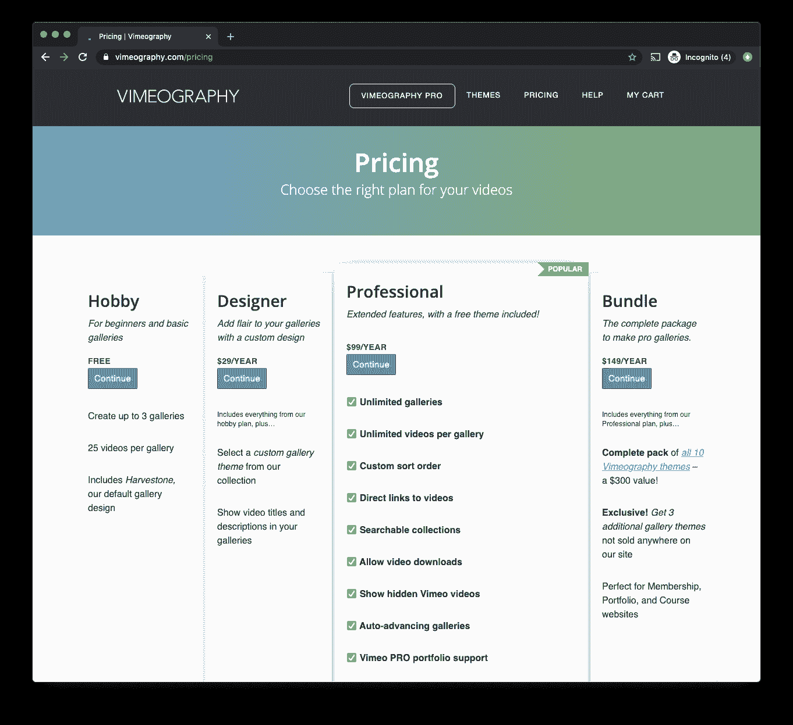
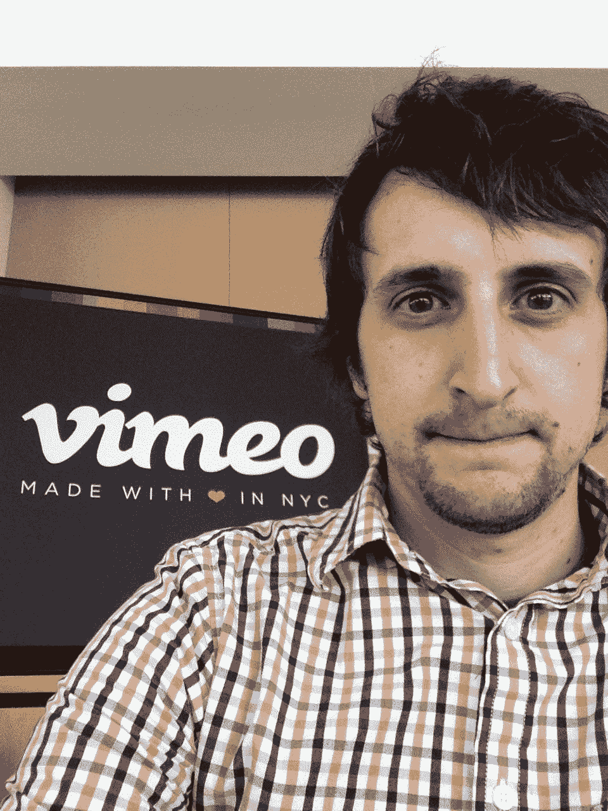
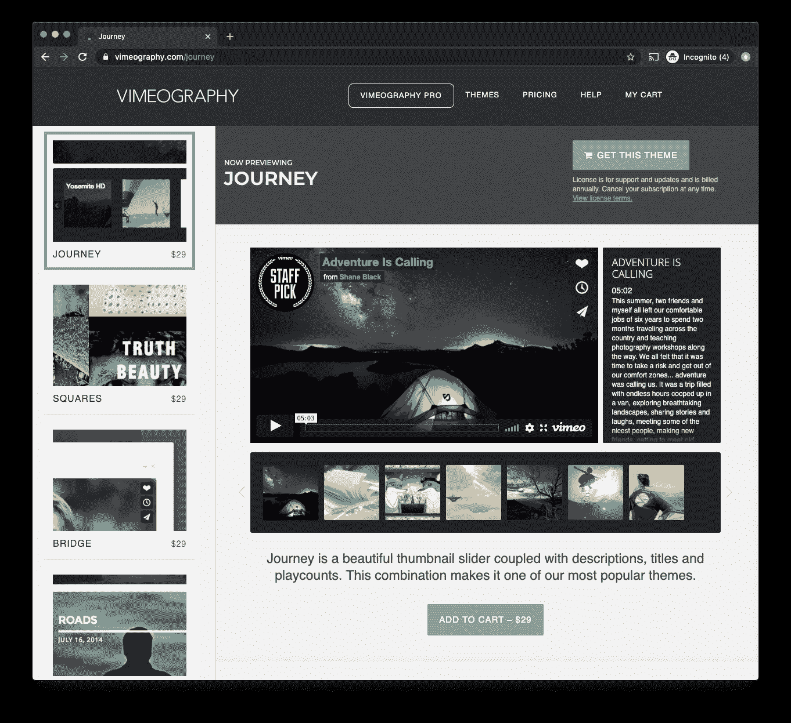

# 我如何使用 Wordpress 和在线视频提高到 11k 美元/月

> 原文：<https://www.indiehackers.com/interview/how-i-used-wordpress-and-online-video-to-bootstrap-to-11k-mo-6b4835072d>

## 你好！你的背景是什么，你在做什么？

👋你好。我是戴夫·基斯(Dave Kiss)，一个自学成才的全栈网站管理员和独立创业者，构建视频网络应用程序，在俄亥俄州克利夫兰的阳光海岸骑自行车。

自 2012 年以来，我一直在网上开发和销售软件产品。我的旗舰产品是 [Vimeography](https://vimeography.com?utm_source=indiehackers.com&utm_medium=interview-feb-2020) ，这是一个 WordPress 插件，帮助在 WordPress 网站上以功能性的、用户友好的图库布局显示 Vimeo 视频。它被积极用于支持 10，000 多个视频课程、作品集和会员网站，平均评分为 4.7/5，终身下载次数超过 210，000 次。

【T2

Vimeography 进入了第八个年头，目前每月的经常性收入为 11，250 美元。这项业务依靠年度订阅来运作，并正在接近滚雪球式续订的第五个年头。

## 是什么促使你开始使用视频摄影术？

我一直是个视频迷，甚至去匹兹堡的大学学习如何专业制作视频。在整个学校期间，我需要一种方式来展示我正在制作的一些视频，所以我连续几个晚上谷歌，直到谷歌几乎破产，并最终找到了如何建立一个蹩脚的 WordPress 网站，我可以在那里发布我的 YouTube 视频。

如果没人抱怨你的价格，那就是太低了。

TweetShare

该网站运行良好，但它真正教会我的是，我更喜欢建立网站的过程，而不是每天 18 个小时的视频制作和携带所有昂贵而笨重的视频设备。我开始接越来越多的网络项目来贴补收入，随着时间的推移，我建立的网站变得越来越不蹩脚。

我搬到了芝加哥，偷偷在 Greyscalegorilla 公司找了份工作，这是一家动画培训公司，制作了许多教学视频。我们需要一种方式来展示我们在公司网站上制作的视频，而现有的选择并不太好。所以，我想我应该建立我们自己的版本，符合我们的品牌和标准，并且，在公司的许可下，我开源了这个项目，这样其他人也可以贡献自己的力量。

## 构建最初的产品需要什么？

一开始，Vimeography 对我来说是一个边学边做的项目。我对 WordPress 只知道一点点，绝对不是世界上最伟大的 PHP 程序员。我也没钱雇一个知道自己在做什么的人，但我不会让这阻止我。

这是 MVP，放我一马吧！力量...

在第一个版本中，肯定有很多更长的夜晚和一大堆杂乱无章的程序。这有助于该项目将在我的雇主的网站上使用；我也能够在白天为这个项目贡献一些时间。这被模糊地称为*内部创业*，这是一种推出产品的可行方法，我绝对认为这种方法今天没有得到充分利用。

Vimeography 的第一个版本花了大约一个月的时间来创建，但要按摩成一个可行的产品需要更长的时间；插件的 Pro 版本[差不多 15 个月后](https://twitter.com/vimeography/status/392726762775257088)才出来。WordPress 保留了所有的旧版本，如果你想看看我当时自豪地发布的糟糕的版本，你可以回去下载 0.5.1 版本。

登陆页面，对吗？

回想起来，我有点惊讶地回忆起花了这么长时间。当我开始做 Vimeography 的时候，我完全没有打算把它变成一个真正的生意。我想只有当我意识到有机会赚点外快时，我才会认真考虑专业版的规划和开发。我经常称 Vimeography 是一个偶然的业务，而我自己是一个偶然的业务所有者。

我的产品开发方法很简单:按照客户的要求构建功能。我没有太多的路线图，所以我依靠自己的用例以及来自其他用户的反馈来帮助推动产品决策。

## 你是如何吸引用户并发展 Vimeography 的？

Vimeography 的第一个版本在 2012 年 6 月 16 日悄悄地发布到免费的 [WordPress](http://wordpress.org) 仓库。没有大张旗鼓，没有发布定价，没有产品搜索，没有 IndieHackers，事实上，除了我的朋友 Shannon 好心分享的这条微不足道的推文之外，什么都没有。

最初的用户是自己发现这个插件的。免费的 WordPress 插件库确实收到了相当多的流量，仍然涉及到大约一半的新(免费)用户。由于 Vimeography 是一种免费的增值模式，这些用户对该软件感到满意，看到了它的价值，当他们需要增强的功能或定制的画廊设计时，就会转向我的付费版本。

对于那些在托管库上有自己的 WordPress 插件的人，这里有一个专业建议:在你的自述文件中嵌入一个 Vimeo 视频。它不仅是展示你的插件所做的一切和它所解决的问题的一个很好的媒介，而且你现在可以访问 WordPress 没有在你的知识库登陆页面公开的页面视图统计。

我把另一半用户归功于有效的 SEO 和内容营销。人们似乎很熟悉 Vimeo，知道 WordPress，最后会搜索“Vimeo WordPress 插件”，所以我花了很多时间优化那些结果。我花额外的时间，非常仔细地制作我所有的标题、元标签和[schema.org](http://schema.org)标记，用尽每一个字符，就像它是一条微调过的推文。

广告、联盟计划和社交媒体对这类业务从来都不太管用。我在内容营销和教育方面取得了更大的成功。写有帮助的文章和创建提供信息和回答问题的 YouTube 视频不仅超级有效，而且感觉比广告更个性化和真实。我发现写博客和文章是附加的，只要是原创内容，永远不会对你不利。

我认为插件的评级会给任何潜在用户带来信心，所以我会积极地保持高评级。每当你与客户进行积极的互动时，都要主动询问他们的评论或评价。这是一个从你最忠实的粉丝那里收集正面反馈的好方法。

当现实生活中的华尔街之狼[购买了我的产品并开始申请退款时，我知道我成功了(我尽了最大努力去争取，但唉，在互联网上赢得争论总是很困难的。)](https://en.wikipedia.org/wiki/Jordan_Belfort)

## 你的商业模式是什么，你是如何增加收入的？

| 月 | 收入 |
| --- | --- |
| 19 年 10 月 | 11870 |
| 2019 年 11 月 | 11155 |
| 2019 年 12 月 | 9665 |
| 1 月 20 日 | 12367 |

像许多其他 WordPress 插件一样，Vimeography 遵循免费增值模式。用户可以从 [WordPress](http://wordpress.org) 库中安装一个免费的限量版插件，感受一下产品的样子。如果他们决定喜欢他们所看到的，并希望访问一些高级功能，他们可以选择升级到我们的专业版，每年 99 美元。我还出售可以在任何画廊上实现的高级画廊主题，免费或专业，每年 29 美元。我使用 Stripe 和 PayPal 来处理所有支付，大部分都是通过 Stripe 进行的。

尽管我仍然觉得由于人们在 WordPress 领域习惯的价格，我的收费严重偏低，但我比开始时做得更好了。我做的第一笔交易是永久许可证，价格在 4 美元到 12 美元之间。

这 4 美元的购买最终影响了我，我花在支持客户上的时间比花在改进产品和业务上的时间要多得多。我问自己，“你会收到什么样的礼物，让这个客户支持案例变得有价值？”并决定一个大披萨和六罐啤酒就足够了，所以这就是 29 美元的价格来源。

不久后，我了解到我无法在永久许可的基础上维持业务，并决定在 2014 年走订阅路线。所有在切换之前购买的客户都获得了现有许可证的免费五年延期(注意:*这太长了*)。)订阅是我能为公司做出的最好的决定，它彻底改变了多年来的收入流。

WordPress 订阅不像你可能熟悉的大多数 SaaS 产品那样。由于大多数 WordPress 网站都是自托管的，客户可以购买你的插件，下载并安装到他们的网站上，取消他们的订阅，然后离开。(是的，这确实比我希望的更经常发生。是的，你可能自己做过。)我通过订阅提供的是无限制的客户支持，如果您遇到困难，可以提供帮助，并提供无忧更新以引入新功能，并确保与任何 API 更改、JavaScript 更新、主题冲突等兼容。

Vimeography 目前每月收入约为 11，250 美元，但肯定有一些月份比其他月份好。夏天变得很奇怪，假期也是。作为一家个体企业，费用极低对我有利:我的会计师是最大的开支，其次是我的啤酒习惯。

## 多年来，微生物学已被证明是成功的。你怎么知道是时候做些新的事情了呢？

在我们的一生中，我们成长，我们成熟，我们寻找下一个挑战去征服。如果我在高中度过余生，每天和同样的班级和老师在一起，我想我会很痛苦。当我们踏上通往下一个目的地的道路时，我们必须吸取我们所学到的教训，并把重要的教训带在我们的背包里。

这些年来，我已经学会了很多，我很感激我在 WordPress 中得到的机会。但由于我所依赖的平台，我想不再局限于我可以推出的产品创新，所以我正在接受新的挑战。我打算做大，为企业建立一个名为[和](https://andoto.com/blog/meet-andoto/)的视频营销平台。

【T2

自从创建 Vimeography 以来，我个人已经处理了超过 6500 份客户支持单，因此我注意到了一些趋势，希望通过我的新产品来应对和解决这些趋势。完全控制视频播放器，设计，后端，实施等。是一项艰巨的任务，但也有许多潜在的好处。

在过去的十年中，视频嵌入并没有发生很大的变化，我认为视频嵌入在帮助改善业务成果方面还有很多可以做的。应该可以期待高质量的视频传输和流式传输。

视频软件领域有许多竞争对手，包括“三巨头”，Vimeo、YouTube 和 Wistia。我认为它们在市场上都有自己的位置，视频市场对多个玩家来说足够大，所以我很高兴能尽我所能在这个领域进行创新。

## 你面临的最大挑战和克服的障碍是什么？

依靠其他服务来获得幸福可能是福也可能是祸。你可以搭顺风车，利用现有的流量，但你也会被你选择与之整合的公司所做的决定所挟持，包括对你的产品所解决的问题领域的潜在侵犯。

作为一个单枪匹马的创始人，雇佣开发人员非常困难。我还真不知道怎么做好。大多数开发人员要么缺乏在这样的项目上工作的必要经验，要么在其他地方赚了六位数。

与您的客户交谈。这是再怎么强调也不为过的建议。

TweetShare

在早期，我不得不学习很多关于代码的知识，但是我学会了不害怕杂乱无章的编程。我的一些代码解决方案在早期绝对是令人畏缩的。我可能仍然有一些非常尴尬的东西存在于代码库中，但是话说回来，哪个开发人员没有呢？任何能让你的产品进入现实世界的东西对我来说都是公平的。

另外，*充电更快*。如果没人抱怨你的价格，那就是太低了。

我在我的网站上谈论了这些课程中的一些以及更多。

## 有没有发现什么特别有帮助或者有优势的？

帮助视频成功的第一件事是一个有趣的故事。我住在芝加哥，身无分文，正在开发插件的免费版本。我在 Vimeo 开发者博客上看到一篇博文，提到他们将在几周内为当地社区举办一次黑客日，这本来是件好事，但当地社区是纽约市，不是芝加哥。

那不会阻止我。我请了一天病假，尽我所能积攒每一分钱，买了一张精神航空公司飞往纽约的早班机票，回程日期是...后来，同一天晚上。

我出现在位于切尔西的 Vimeo 总部，与与会者握手，与他们分享我的故事，喝了太多的咖啡。

有人告诉这家伙去理发。

我今天的新朋友！(嗨，亚伦！)

那次旅行的好处是无法估量的。那天，我与 Vimeo 的工作人员取得了联系，在他们上线之前提前获得了 beta API 功能，并在我返回拉瓜迪亚之前从最了解 Vimeo 产品的人那里获得了面对面的反馈，总共花了大约 18 个小时完成了这次旅行。

事实证明，正如谢恩·斯诺在《聪明绝招》中所说的那样，意外之喜确实可以被设计成给你带来最好的机会，让你得到一个好的结果。

除此之外，展示你如何为公司提供真正的价值。给他们测试和证明投资回报的能力，你将赢得终身客户。

我喜欢卡尔·纽波特在《深度工作》一书中给出的建议，一两天内读完。德里克·西弗斯和他的书[的忠实粉丝](https://sivers.org/a)，诺亚·卡根的[播客](https://podcasts.apple.com/us/podcast/id1187402810?ls=1&mt=2)，以及整个 MicroConf 帮。

## 对于刚刚起步的独立黑客，你有什么建议？

第一课:没有人能在一夜之间学会这些东西，它会很快变得令人沮丧和不知所措。坚持不懈，永远不要停止学习，引导你内心的勇气，知道你做这项工作的原因。

**第二课:**不要太关注你读过的关于成功的框架。适用于某些企业的建议可能根本不适用于你的企业，大多数生产力建议都是无用和不必要的。我认为你能做的最好的事情是练习自律，不断出现，测试新的想法、策略、流程，并且当某些事情不奏效时不要沮丧。

**第三课**如果你是一名开发人员，正在寻找一个想法，那么就去寻找发光的 API。老实说，你可以通过将其他产品连接在一起来谋生(这可能不是你的长期计划，但这是可以做到的。)我总是喜欢浏览 API 文档，寻找有趣的或未充分利用的端点。一些 API 会暴露一些未被利用的数据，如果部署正确，对于正确的想法来说，这些数据本身就是一个完整的业务。

第四课:保持你的动力，尽量让你的项目保持不相关。即使你在转换项目，把你学到的经验和建立的联系应用到下一个项目中也更容易。这比不得不一直改变你的上下文要好得多。

第五课:做真实的自己，关注自己的兴趣，用自己的声音。如果你真的找到了你的 [Ikigai](https://en.wikipedia.org/wiki/Ikigai) 而不是假装成你不是的东西，那么保持对你的产品工作的动力会容易得多。

第六课:从可实现的目标开始。选择一个你的月账单，尽一切努力用你的产品来支付。这是一个非常容易达到的里程碑，你可以称之为进步。一旦你完成了，选择你的下一个最大的法案。当你支付了最昂贵的账单时，你应该有足够的用户和经验来看看什么是有效的，什么是无效的，并能够相应地进行调整。

第七课:与你的客户交谈。这是再怎么强调也不为过的建议。

## 我们可以去哪里了解更多？

我的两个视频产品可以在[https://andoto.com](https://andoto.com)和[https://vimeography.com](https://vimeography.com)找到。我很乐意在任何时候帮助像你这样的独立爱好者为你的产品制定视频策略，只要联系我就行。

我在推特 [@davekiss](https://twitter.com/davekiss) 上，或者发邮件[【受邮件保护】](/cdn-cgi/l/email-protection)请也发给我你宠物的可爱照片

我偶尔会在我的网站上写一些关于个人创业的思考，比如这篇关于我在黑暗中建立自己的倾向的文章。

希望你能从这次采访中获得一些有用的信息！我很高兴成为这个社区的资源，并鼓励你给我发电子邮件或在下面发表任何评论/问题。干杯！

——[<picture id="ember7996134" class="user-avatar ember-view user-link__avatar"></picture>大卫之吻](/davekiss?id=nP57JxQXw7R84lROrg9K1OA7rty1)，Vimeography 创始人

## 想像 Vimeography 一样建立自己的事业？

你应该加入独立黑客社区！🤗

我们是几千名创始人，互相帮助建立有利可图的业务和副业。来分享你正在做的事情，并从你的同事那里获得反馈。

还没准备好开始使用你的产品吗？没问题。这个社区是一个认识人、学习和实践的好地方。随意[随便浏览](/)！

——[<picture id="ember7996139" class="user-avatar ember-view user-link__avatar"></picture>柯特兰艾伦](/csallen?id=ibTLPyjwVebnZjMGKvz6ztarnuV2)，独立黑客创始人

31votes