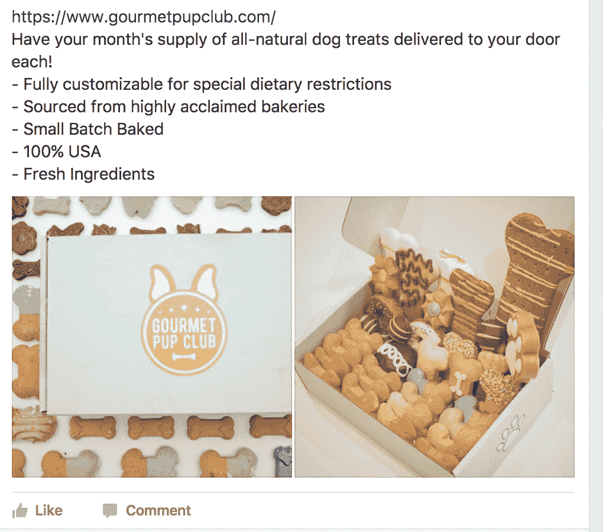
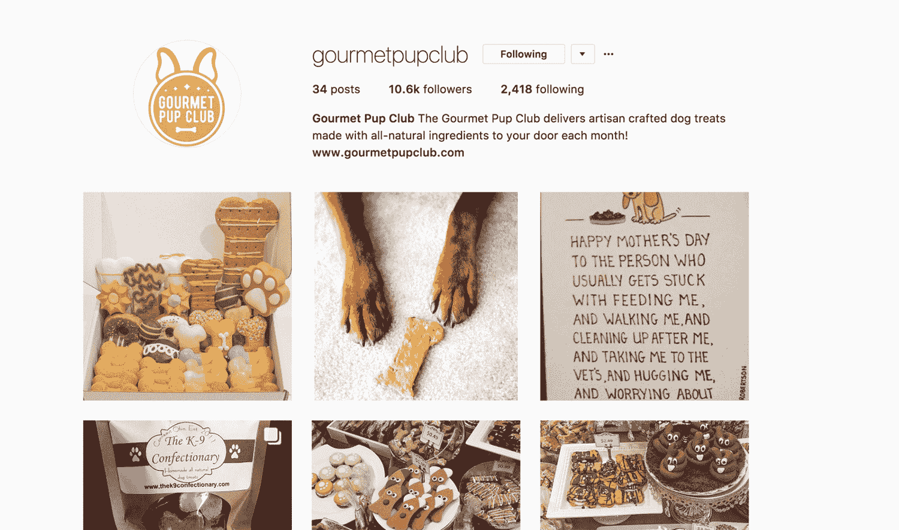
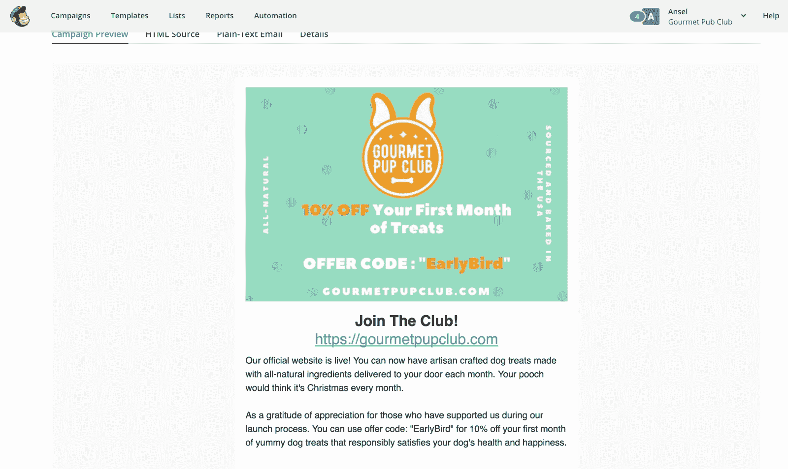
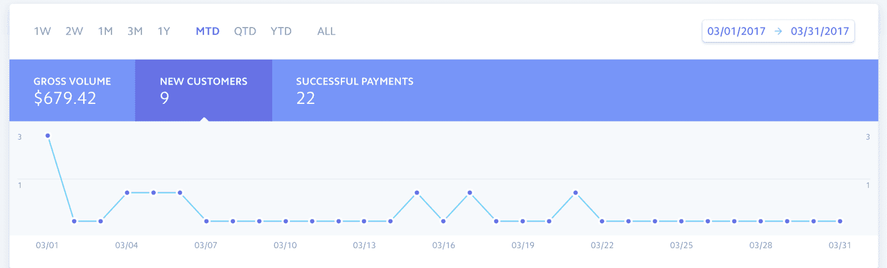
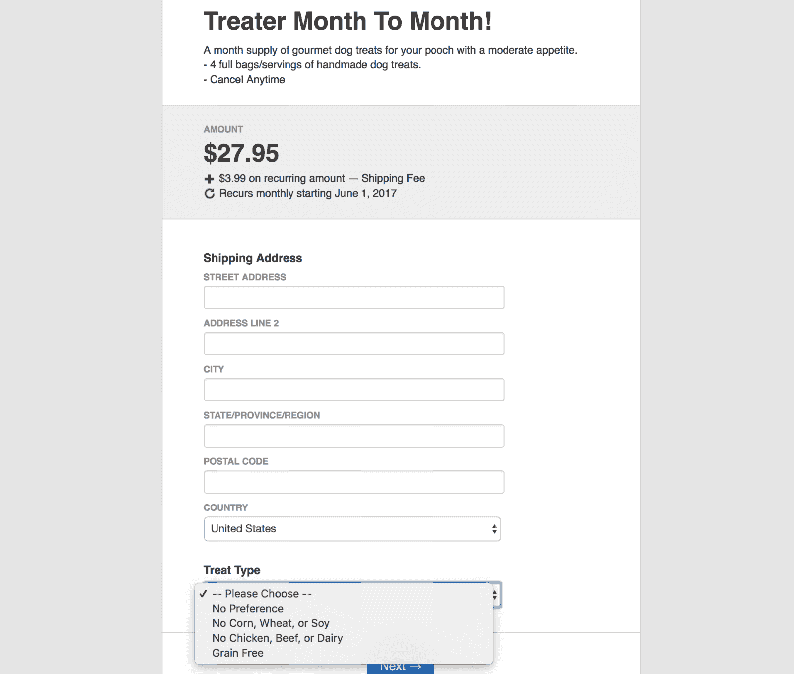
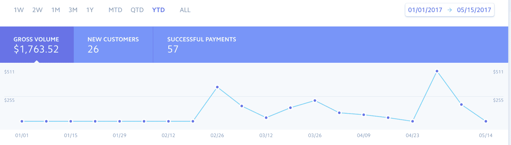
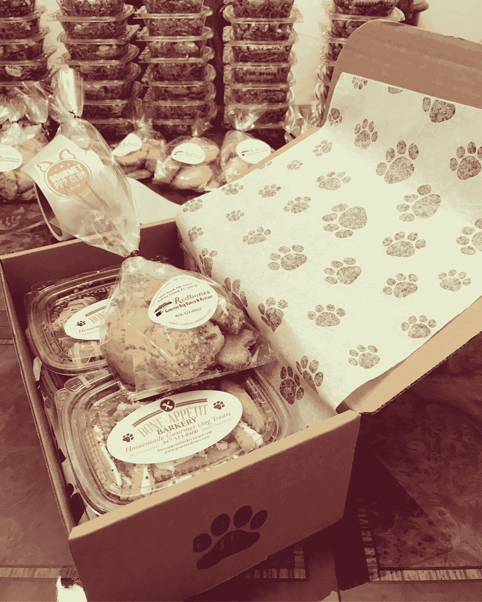

# 我是如何验证我的想法并在一个月内获得 1000 名电子邮件订户的

> 原文：<https://www.indiehackers.com/interview/how-i-validated-my-idea-and-got-1-000-email-subscribers-in-a-month-4b13f01b0d>

## 你好！你的背景是什么，你在做什么？

嘿独立黑客！我叫安塞尔·庞塞·迪亚马，是佛罗里达州立大学金融专业的学生。

我从小就有创业的动力。12 岁的时候，我曾经付给我的邻居朋友每人 10 美元，让他们和我一起排队购买畅销的运动鞋(Jordans，Lebrons，Nike SB)。我的朋友们一点也不知道我会在易趣上转售这些运动鞋来获利。如今，我经营着一个单边项目，这个项目让我提高了创业技能，同时帮助我还清了全日制学生的助学贷款。

[Gourmet Pup Club](https://www.gourmetpupclub.com) 是一项注重健康的月度订阅服务，提供来自 100%美国面包店的全天然狗粮。我们所有的盒子都可以根据您的狗狗的饮食限制进行完全定制，我们承诺只包含有益健康的全天然食物，不包括任何有害的副产品和您不会发音的成分。

每个月，我们都会与不同的面包店合作——实体面包店、家族面包店，甚至 Etsy 面包店——为 Gourmet Pup Club 提供个性化和令人惊讶的用户体验！我们的客户是关心宠物健康长寿的狗主人。

我花了两个月的时间来吸引订户，中间花了一个月的时间来改进我的商业模式。在这段时间里，我做到了以下几点:

*   Instagram 上有 10，600 名粉丝
*   推特上有 3000 名粉丝
*   1，000 多名邮件列表订户
*   销售额为 1，763.53 美元(每月 587.84 美元)
*   广告支出为 0 美元

## 是什么促使你加入美食小狗俱乐部的？

从小到大，父亲领养了一只比格犬，把养狗当成了我的全部责任。回想起来，那只狗带给我的比我带给它的更多:它教会了我许多宝贵的经验，比如责任感、耐心、爱、宽恕和友谊。我从来不想看到我最好的朋友离开我，所以我确保只喂他最好的狗粮和零食，以促进长寿。12 岁的他今天还和我在一起！

同时，我经常看到美国食品和药物管理局对导致我们的宠物生病甚至死亡的大盒零食进行召回。我无法想象我的狗会因为这样的事情而死去，所以我把防止这种事情发生作为我的个人使命。于是，配合我的创业动力，[美食小狗俱乐部](https://www.gourmetpupclub.com)诞生了！

我知道手工制作的狗零食属于一个非常利基的市场，在狗订阅业务中有许多竞争对手，如 BarkBox 和 PupJoy。有鉴于此，我试图在承诺实际销售之前，通过预发布活动来验证我的概念。

## 在你决定继续之前，是什么让你的想法变得有效？

预发布活动持续了 1 个月。我有一个登录页面，告知潜在客户我提供的服务，为什么它与我的竞争对手不同，装满零食的盒子的照片，最重要的是，一个选择加入的表格，以捕捉感兴趣的潜在客户的电子邮件。

我通过有机的方式引导这个过程，为我的网站创造了流量。我做过的最有效的营销来自脸书集团。我请我的两个朋友让我用他们的账户(除了我自己的)加入 40-50 个不同的利基相关的脸书团体。总的来说，我每天可以用这些账户向 150 个脸书群组发帖。

我不得不戴上营销人员、销售人员、程序员、物流主管甚至兽医的帽子

TweetShare

在每个小组中，我会张贴我的订阅箱的照片，并举办电子邮件生成竞赛，所有这些都包含一个行动号召，引导人们访问我的网站。这些团体的规模从 1000 人到 100000 人不等，所以我接触到了很多目标明确的潜在客户。

Instagram 还帮助我建立了电子邮件列表。我会在高峰时段每天发布 2-3 次引人入胜的内容，并在每个标题中加入行动号召。通过关注竞争对手 Instagram 账户中的活跃用户，我获得了近 11，000 名粉丝。我下载了“关注者”应用程序来取消关注那些没有关注我的人。每小时我会关注 50 个人，取消关注 60 个人，我的账户从未被封禁。

最后，每周我都用我的 MailChimp 邮件列表在当时的订户中制造轰动和期待。我可以通过发送促销信息、偷窥高峰和更多关于我的服务的信息来戏弄他们。一旦我在一个月内让 1000 多人订阅了我的时事通讯，我就觉得我的想法得到了验证。因此，我决定继续这个想法！

我考虑过从科技到食品等不同行业的许多“典型”商业概念，但最终选择了狗粮订阅盒模式，因为它的管理成本低，利润也很诱人。

作为一名受学生债务困扰的大学生，在一个商业想法上损失数千美元是不可想象的。订阅盒模式对我很有效，因为我用最初的订户产生的收入来支付我第一次运行盒子、贴纸、零食和运输的成本。考虑到订阅模式，我可以根据我的订户数量准确地知道应该购买多少，从而防止浪费产品。

## 你的第一批货是怎么运出去的？

我花了很多时间收集潜在面包师和面包店的信息，作为我每个盒子里的零食的供应商。我通过 Etsy、谷歌搜索和口碑找到了这些潜在的供应商，我花了额外的时间与他们谈判，以获得对我的商业模式有意义的价格。

在谈判过程中，我对供应商的优势是，“我有 X 数量的订户，我有 X 数量的社交媒体追随者，等等……”很快我们就达成了协议，今天我就在这里了！

通过这个行业，我学到的东西比我在大学的整整两年都多。

TweetShare

我还每天花很多时间在社交媒体上发帖，在网上展示自己。这一点，再加上我的电子邮件列表，让我获得了启动业务的最初动力。当我准备启动时，我给我名单上的每个人发了一封电子邮件，标题很简单，“我们已经启动了。”

在我发了那封邮件后，我看到订阅者猛增。我们第一个月的运营给了我们足够的资金来支付盒子、零食和运输的费用。

现在，是时候真正包装零食，打印运输标签(通过一种叫做海盗船的服务)，并把盒子拿起来交付(通过美国邮政)。

我总共花了一个半小时为我的第一批订户包装所有的盒子。根据选择的方案，每个盒子的初始利润率为 40-46%。鉴于这些利润，我不介意花时间。

## 推出后，你是如何继续寻找客户的？

我们运营的第一个月得到了正面和负面的反馈。人们很高兴收到美观的狗食，他们会立即在狗狗的 Instagram 页面上分享给全世界。

然而，有一个人取消了她的订阅，因为她有一只大丹狗，觉得盒子里没有足够的零食来满足她的大狗。我还必须给一个人退款，因为这些零食在运输过程中被压碎了。

根据我所在的一个合作空间的商业导师的建议，我决定停止销售，把重点放在现有的订户上。我觉得原来的商业模式没有竞争力，缺乏个性化和用户体验。

以下是我所做的更改:

*   我不再提供 1 个月、3 个月和 6 个月的不同利润率的订阅计划，而是转而提供可以随时取消的定期月度计划。这防止了我的利润到处都是。
*   我的旧商业模式有一个放之四海而皆准的公式。现在，我提供“处理器”和“吃”的计划。处理器计划是为中等食欲的狗准备的，并带有 4 袋零食。食者计划是为胃口大的狗设计的，有 5 个袋子。
*   有许多潜在客户有特殊饮食限制的宠物。在我运营的第一个月，我不得不告诉 10 多个潜在客户，我没有为他们的宠物需求提供特定的款待。从那以后，我做了一些改变，增加了专门为特殊饮食限制定制盒子的功能。
*   我最初的价格远高于竞争对手。我想获得尽可能多的市场份额，所以我决定将价格降低到接近 30 美元。

随着商业模式的改进，我必须吸引更多的顾客。我开始启动 2.0 的过程，通知我预先存在的电子邮件列表，这是我在预启动时生成的。然后，我在所有社交媒体上重塑了公司品牌，将我的营销信息集中在盒子的可定制性和有竞争力的价格上。事实证明，这是有益的，美食小俱乐部现在比开始时有了更多的订户。

## 你能更详细地解释一下你的商业模式，谈谈你是如何增加收入的吗？

解释 [Gourmet Pup Club 的](https://www.gourmetpupclub.com)商业模式的最简单方式是这样的:我从面包店批发零食，包装在我的品牌盒子里，然后以一定的利润运送给我的顾客。我目前通过两种方式创收:

*1。订阅箱*——处理器计划花费我 17 美元，我以 31.94 美元出售，包括 3.99 美元的运费，利润率为 47%。Eater 计划花费我 19 美元，我以 33.94 美元出售，包括 3.99 美元的运费，利润率为 44%。

*2。直运个性化狗蛋糕*——直运花费我 11.50 美元，我以 24.95 美元出售，利润率为 54%。

我在 Squarespace 上运行我的网站，使用 MoonClerk 进行经常性支付，使用 Stripe 进行信用卡处理。MoonClerk 直接连接到 Stripe，对我来说这是一个非常高效的过程。使用 Moonclerk 的另一个好处是，我可以创建一个包含可定制选项的结帐表单，这使我可以在我的营销中突出这一优势。

我们运营的第一个月就花在了销售上，从那时起我就开始盈利了。第二个月我改造了业务流程，第三个月我推广了更名后的美食家俱乐部。我们的销售只是这一旅程的回响:

## 你未来的目标是什么？

我很幸运地从学校的创业项目中获得了一大笔资助。目前，我已经计划了一个广泛的营销活动，从六月份开始:

*   YouTube 拆箱者/审核者
*   赞助博客帖子
*   利用 Instagram 影响者
*   有针对性的脸书广告
*   Google Adwords

我的目标是在今年夏末拥有 200 名订户。在这种情况下，我会将盒子的包装外包给一个履行中心，让他们来处理。履行中心每准备一盒收取一美元，我应该能够获得他们的折扣运费。

目前，这项业务有助于减轻学生贷款的负担，我希望在整个大学期间继续发展这项业务。激励我继续前进的首要目标是能够通过这项业务还清我所有的贷款！

## 你面临的最大挑战和障碍是什么？

最初，我怀着良好的愿望创办了[美食俱乐部](https://www.gourmetpupclub.com)。然而，我开始觉得我的主要动机是利润，而不是改善全国狗的健康。因此，消费者的联系和体验并不存在。决定停止销售，转而改进我的商业模式是我做过的最好的决定。

我们运营的第一个月就花在了销售上，从那时起我就开始盈利了。

TweetShare

在那段时间里，我通过脸书小组收集的数百份调查做了很多关于 R&D 的研究。我越来越意识到宠物父母希望他们的狗狗吃什么……什么成分会被亮绿灯或红灯，主人愿意花多少钱，以及多少钱被认为是一个月的食物供应。这些调查最终让我对我的产品更有热情，这种热情体现在我的社交媒体帖子、电子邮件和整个业务中。

如果我要重新开始，我会改变我开始时处理业务的方式。我看到了积极的反馈和销售额的增长，这是我改进后的商业模式的结果，我希望在第一个月的早些时候能够重新创造它。

## 你最大的优势是什么？有什么特别有用的吗？

帮助我的企业成功的最大优势是我身边的人。一旦我成立了公司，我就申请成为佛罗里达州立大学学生企业孵化器及其加速器项目的成员，该项目位于佛罗里达州塔拉哈西的一个合作设施，名为[多米站](http://www.domistation.com)。

作为学生企业孵化器的一员，我接触到了学校提供的法律和金融导师，以帮助那些拥有自己企业的学生。最有价值的方面是能够从其他学生创业者那里获得想法并接受建设性的批评。这让我能够发展我的业务，并在我作为企业家的弱势领域开展工作。

作为多米的[起步](http://www.domistation.com/getstarted)加速器项目的一部分也很有影响力。在那里，我学到了创业的核心基本概念:从了解谁是我的实际客户，到了解我的数字，到理解用户体验的重要性，到认识到创业的真实现实，我能够学习如何正确地创业和经营企业。

与 FSU 学生企业孵化器相比，多米站的合作工作方式让我有机会接触更多知名企业家和小企业。我已经能够和这些以他们的想法为生的人聊上几个小时了。

从那以后，我感到更有动力去发展[美食俱乐部](https://www.gourmetpupclub.com)，我也为自己大学毕业后制定了许多未来计划。

## 对于其他刚刚起步的独立黑客，你有什么建议？

为了做生意，你必须身兼数职。我不得不戴上营销人员、销售人员、程序员、物流主管，有时甚至是兽医的帽子。但作为一名有抱负的企业家，在商业中扮演许多角色让我成长得最大。公平地说，在过去的 4 个月里，我从这个行业中学到的东西比我在大学的整整两年都多。拥抱挑战，学习，留下影响！

这并不容易，但被迫学习是激励我继续前进的动力。当你通过你的生意了解到这个世界是如何运作的新东西时，那只会让你成为一个更好的自己。谁在乎你是否失败——至少你努力过了！据我所知，福布斯 30 位 30 岁以下富豪榜上没有一个人不采取主动。

美国成功的不成文公式是:上大学，在你的 LinkedIn 和 GPA 上打球，然后得到几份实习，只是为了得到一份工作，为别人的梦想而不是你自己的梦想工作固定的时间——同时获得低于标准的起薪。

“赢得”这场老鼠赛跑的问题是，你仍然是一只老鼠。呼吸新鲜空气意味着过一种不正常的生活，不满足于现状，将你最疯狂的梦想变成现实——创造你自己独特的生活。

创业不仅仅适用于商科专业。它适用于任何疯狂到认为自己可以改变世界的人。看到你的问题解决方案实际上对你的最终客户产生了影响，这种自我满足感是首屈一指的。如果你热爱你所做的事情，并且擅长于此，金钱就会随之而来。

## 我们可以去哪里了解更多？

*   Instagram.com/gourmetpupclub
*   【Facebook.com/GourmetPupclub 
*   [“gourmetpupclub”在推特上](https://twitter.com/search?q=gourmetpupclub)

如果你只是想和我聊聊，或者你需要帮助来创建自己的订阅箱，请随时联系我。此外，欢迎在下面的部分发表评论或发送电子邮件 [【受电子邮件保护】](/cdn-cgi/l/email-protection#641d1109091d24030b1116090110141114070811064a070b09) ，我会尽力回复您。

——[<picture id="ember5235770" class="user-avatar ember-view user-link__avatar"></picture>安塞尔·庞塞·迪亚马](/AnselPonceDiama?id=gourmet-pup-club-owner)，《美食小狗俱乐部》创始人

## 想像美食小狗俱乐部一样建立自己的事业吗？

你应该加入独立黑客社区！🤗

我们是几千名创始人，互相帮助建立有利可图的业务和副业。来分享你正在做的事情，并从你的同事那里获得反馈。

还没准备好开始使用你的产品吗？没问题。这个社区是一个认识人、学习和实践的好地方。随意[随便浏览](/)！

——[<picture id="ember5235775" class="user-avatar ember-view user-link__avatar"></picture>柯特兰艾伦](/csallen?id=ibTLPyjwVebnZjMGKvz6ztarnuV2)，独立黑客创始人

6votes