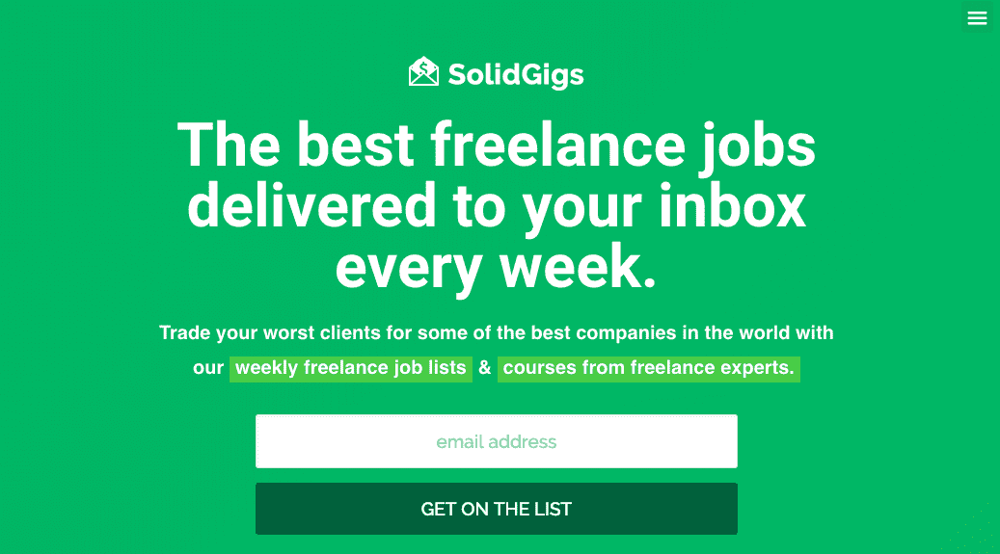
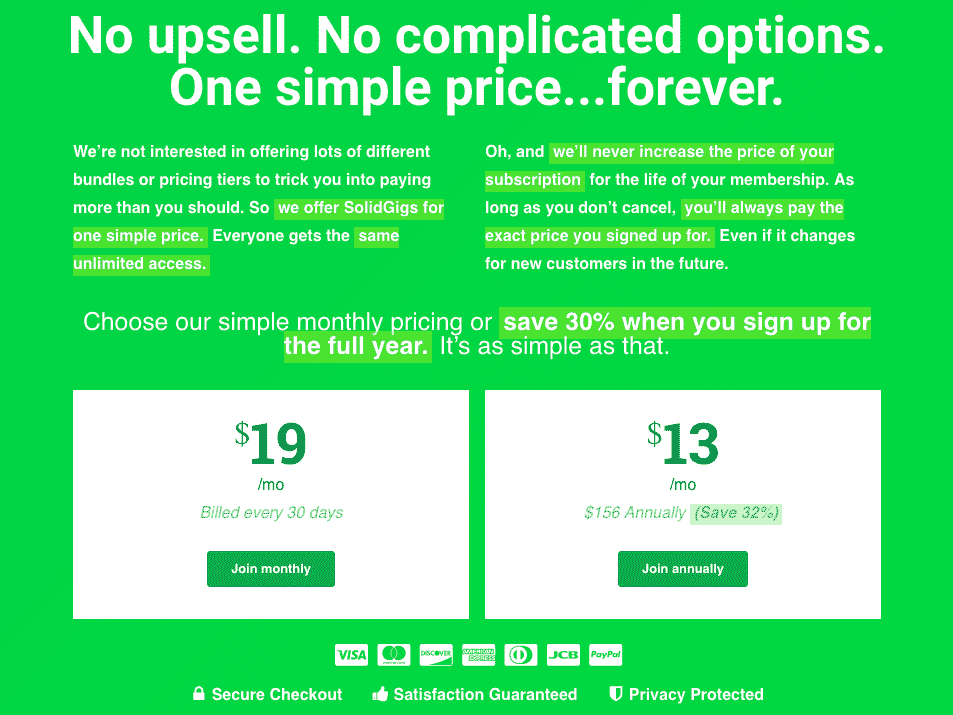

# 我如何将一项简单的服务发展到每月 4，000 美元的收入

> 原文：<https://www.indiehackers.com/interview/how-i-ve-grown-a-no-frills-service-to-4-000-mo-in-revenue-9069441940>

## 你好！你的背景是什么，你在做什么？

你好，我叫李安修，我为自由职业者运营一个名为 [SolidGigs](http://solidgigs.com) 的会员项目。

每周，我们在网上搜索数千份自由职业者的工作列表，根据质量筛选出 98%的自由职业者，并通过电子邮件将排名前 1-2%的自由职业者的工作发送给我们的会员。此外，我们有一个不断扩大的资源库，包括课程、面试、脚本和模板，帮助自由职业者提升他们的业务水平。

在过去的 15 个月里，我们的总收入超过了 50，000 美元，MRR 目前稳定在 4，000 美元左右。

 

## 是什么促使你开始使用 SolidGigs？

这一切都是从我上大学时开始的。作为一名平面设计师，我从事自由职业来帮助维持生计，作为一种尝试，我也开始写关于平面设计的博客。我的平面设计博客最终变成了面向各种自由职业者的博客——写作、营销、开发、设计、教练等等。今天，[叫米洛](https://millo.co)。

从那时起，我们开始为自由职业者建立许多不同的资源，包括播客、脸书小组、每周时事通讯、每周专家在我们博客上的博文等等。但是，即使在制作了许多非常棒的内容之后，每次我们发出读者调查，我们都会注意到 80%或更多的读者仍然在一个关键问题上挣扎:在哪里可以找到高质量的自由职业者工作。

我们发表了分享[最好的自由职业网站](https://millo.co/freelance-job-sites)的博客文章，并与专家深入探讨了[作为艺术家/创意者如何赚钱](https://millo.co/how-to-make-money-as-an-artist)。我们还发布了许多播客，包括一整年跟踪一个全新的自由职业者和他建立自由职业事业的旅程。

不幸的是，这些都不起作用。自由职业者仍然停滞不前，仍然沮丧。

因此，我们没有推出一门课程或创建更多显然对实际问题不够深入的免费内容，而是决定创建一个基本产品。我们推出了 SolidGigs 的 MVP。以下是 SolidGigs 的基本 MVP 发布时的样子:

 

我们向第一轮会员收取了今天的一小部分费用。想要获得我们每周自由职业者工作列表并节省每周寻找工作的时间的自由职业者可以成为会员，只需每月 8 美元。它是一次偷窃。这很有效——自由职业者开始注册。我们知道我们手上有好东西。

## 构建最初的产品需要什么？

最初的产品非常简陋。从开始到结束，花了大约一周的时间来建立登陆页面(目前用基本的 HTML 编码)，设置支付网关，并连接 Mailchimp。我们雇了一个 PSD-to-HTML 编辑器来快速创建我们的登录页面，这样我们就可以专注于其他任务。我想它花了我们 20 美元。然后，我们将 Stripe 连接到 Mailchimp，在那里我们可以向用户收取月费，并每周向他们发送一封电子邮件。

作为创造者，我们往往也是有远见的人，想象所有的可能性和机会。保持简单。

TweetShare

我们有一个宏伟的愿景，我们最终想要的是什么，但我们知道我们必须在投入更多资源之前证明这个模型，所以我们故意保持它非常小。一次只接纳 50 名成员(通常间隔一两个月)，只为设计师、开发人员、营销人员和作家服务，甚至没有一个用户可以登录的网站(除了我们的登录页面)。

为了得到我们每周交付的产品，我和我的小团队梳理了几十个自由职业者的工作网站，寻找最好的自由职业机会。然后，我们手动将它们放入 Mailchimp 电子邮件中，发送给我们所有的成员。

因为产品和生产方式都非常简单，所以很容易自筹资金进行这个小试点，在最初的几个客户之后，我们在域名注册/托管和将 Stripe 连接到 Mailchimp 所需的技术上实现了收支平衡。我们从第一天开始就基本上是盈利的。

## 你是如何吸引用户和发展 SolidGigs 的？

正如我提到的，在开始时，我们一次只让 50 个左右的用户进入。我们不想发展得太快，这样我们才能确保为我们的会员提供优质的体验。我们开始意识到这种限制对我们有利，因为它造成了一种稀缺，促使人们注册我们的等待链接，并在我们开放更多座位时立即注册。此外，因为我们在过去几年里一直在增加我们的博客读者，我们有足够多的自由职业者可以联系，以获得一个初步的成员基础。

所有这些加在一起意味着我们在几个月内达到了第一批 100 名用户(在两个月内每月向 50 名会员开放一次)。从那里，我们出发去比赛，了解我们的成员想要和需要我们做什么。

从那以后，我们继续向我们自己的名单进行营销，并挖掘附属合作伙伴的力量。我们的一些联盟合作伙伴拥有与我们的产品提供的解决方案相匹配的关键词的高排名文章，这为我们的合作伙伴带来了稳定的新成员流以及稳定的联盟收入流。我们还尝试了赞助(表现不太好)，我们计划今年通过谷歌广告和脸书广告增加付费收购。

## 你的商业模式是什么，你是如何增加收入的？

这种特定产品的商业模式非常简单:会员每月支付费用，就可以获得我们每周的自由职业者工作列表和其他优质内容，如课程和采访。

在我建立博客的经历之后，我准备开始另一项需要几年才能产生收入的服务，并假设事情会这样发展。但从第一天起，我们就通过 Stripe 获得了支付，尽管在过去 15 个月里收入有增无减，但总体而言，我们看到了健康、稳定的增长。

有趣的是，到目前为止，我们收入最高的月份是由即将到来的价格上涨造成的。我们宣布，我们将提高我们的每月会员费用，并在他们的原始费用的任何以前的成员祖父。这鼓励了观望者扣动扳机，在它还是 13 美元/月(很快将是 19 美元/月)的时候签约。

 

我们的流失率仍然比我希望的要高得多，但是自从我们引入资源库以来，我们已经看到流失率在下降。我们的目标已经从单纯吸引付费会员转变为努力延长他们作为会员的订阅时间。

本项目的费用包括:

*   我的个人时间，我不跟踪也不计算
*   一名兼职独立承包商，每月领取 500 美元津贴
*   托管和注册，总计不超过 10 美元/月
*   我的 Mailchimp 花费的一部分，大约是每月 55 美元
*   一些高级求职网站的会员资格，总计约 30 美元/月
*   我们的一些专家课程的许可费，大约每月 700-900 美元

总的来说，我们预计每月开支约为 1500 美元，健康的 MRR 约为 4000 美元。到目前为止，该项目已经为我们增加了超过 50，000 美元的收入。这个数字不会让我们中的任何人提前退休，但它肯定会在我们博客的总收入中占据很大一部分。

| 月 | 收入 |
| --- | --- |
| 2018 年 8 月 | 3167 |
| 18 年 9 月 | 3889 |
| 18 年 10 月 | 3720 |
| 18 年 11 月 | 5444 |
| 2018 年 12 月 | 3424 |
| 19 年 1 月 | 6026 |

## 你未来的目标是什么？

我们今年的目标是将目前的 400 名成员增加到 1000 名以上。在拥有 1，000 名会员的情况下，我们觉得我们将在服务质量方面达到一个临界点，进而达到我们能够为会员提供的价值。我们的计划是继续利用我们目前的受众来建立关系网和增加会员，同时我们今年将重点关注一些积极的 SEO 和付费获取策略。

最大的障碍是减员。我们的服务中有一个自然的问题:如果我们的成员因为我们联系到他们的所有工作而变得非常成功，我们就会让自己变得有些过时。当一个自由职业者不再需要更多的线索或更多的客户时，他们就会退订我们的服务。我们今年的目标是增加价值，鼓励我们的会员即使在找到新的优质客户后也能留下来。

## 你面临的最大挑战和克服的障碍是什么？

伴随着我们在 MVP 中变得非常简单的决定而来的是一个糟糕的技术决定。我们使用了一个软件将我们的 Stripe 账户与 Mailchimp 账户连接起来，不幸的是，这给我们的客户带来了很多问题。它还缺乏我们需要的基本定制功能(例如，能够从我们的电子邮件地址而不是他们的电子邮件地址发送确认电子邮件)，这导致了我们的第一批成员的品牌混淆和 UX 问题。所有这些，再加上缺乏高质量的客户服务，意味着仅仅几个月后，我们就不得不转向别的地方。

除此之外，一切都很顺利。它并不完美，但它工作稳定，到目前为止我们对它很满意。

## 有没有发现什么特别有帮助或者有优势的？

我已经尽我个人所能关注于学习由我钦佩的人经营的成功的会员网站。从那里，我试图找到共同点，并将其应用到我们的会员社区。

## 对于刚刚起步的独立黑客，你有什么建议？

我的建议是从小处着手。不断问自己，没有它我们能发射吗？机会是，超过 80%的时候你的答案会是“是”

虽然乐观和不懈的努力可以成为你最大的盟友，但它们也会让你过早地给产品添加过多的花哨功能。作为创造者，我们往往也是有远见的人，想象所有的可能性和机会。保持简单。在你感觉良好之前释放它。如果人们愿意使用它，就从那里改进它。

## 我们可以去哪里了解更多？

你可以在 SolidGigs.com 了解更多关于 SolidGigs 的信息。至于我们为自由职业者做的其他工作，你可以在 Millo.co 的[了解更多。](https://millo.co/)

我也很乐意回答你关于产品或自由职业者业务发展的任何问题。你可以在推特上通过 [@prestondlee](https://twitter.com/prestondlee) 找到我，或者在这个帖子上留下评论，让我们聊聊！

——[<picture id="ember8118024" class="user-avatar ember-view user-link__avatar"></picture>【李安修】](/prestondlee?id=Uoxi5ajBwkXjBrjVqo2GrSLs1293)，SolidGigs 创始人

## 想像 SolidGigs 一样建立自己的事业？

你应该加入独立黑客社区！🤗

我们是几千名创始人，互相帮助建立有利可图的业务和副业。来分享你正在做的事情，并从你的同事那里获得反馈。

还没准备好开始使用你的产品吗？没问题。这个社区是一个认识人、学习和实践的好地方。随意[随便浏览](/)！

——[<picture id="ember8118029" class="user-avatar ember-view user-link__avatar"></picture>柯特兰艾伦](/csallen?id=ibTLPyjwVebnZjMGKvz6ztarnuV2)，独立黑客创始人

34votes