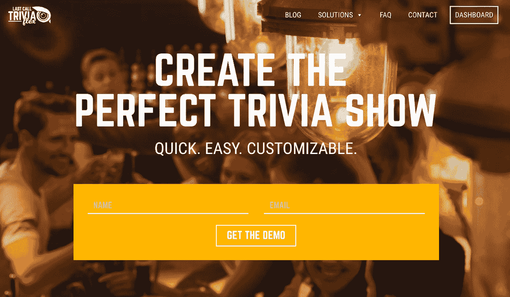
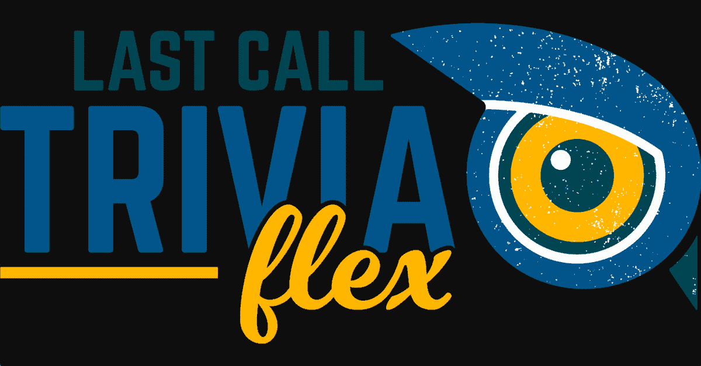
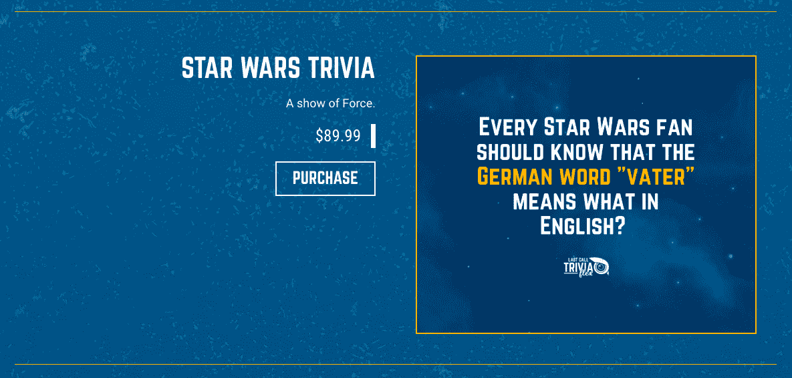
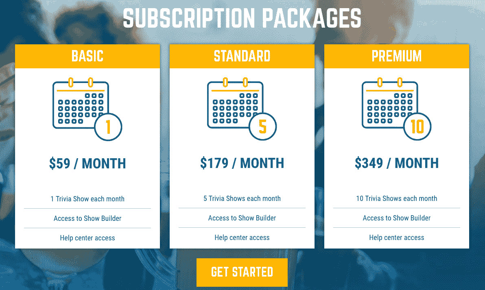
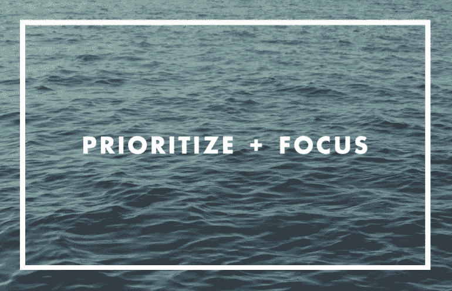

# 我是如何通过做自己喜欢的事情，从酒保到助理骗子再到首席执行官的

> 原文：<https://www.indiehackers.com/interview/how-i-went-from-bartender-to-side-hustler-to-ceo-by-doing-what-i-love-9cc3f61592>

## 你好！你的背景是什么，你在做什么？

大家好，我叫亚当·约翰斯顿，我是[最后一次通话琐事](https://www.lastcalltrivia.com/)的首席执行官和联合创始人。我目前的项目是[Last Call Trivia Flex](https://flex.lastcalltrivia.com/)——一个 DIY 的琐事夜服务，允许用户生成他们自己定制的琐事节目。

早在 2007 年，我就和我的好友德鲁·特纳一起创办了《最后一个电话琐事》。我们和朋友在当地的一家酒吧玩琐事，这时我们意识到我们可以创造一个比我们见过的其他公司更好的琐事展示体验。德鲁和我开始在辛辛那提地区举办智力竞赛之夜，我们很快扩大了业务规模，并增加了新的主持人。我们的知识之夜开始传播，我们很快就在从辛辛那提到安克雷奇的全国各地举办了节目。

随着我们的业务继续增长，Drew 和我考虑如何有效地将我们的琐事夜扩展到我们没有脚踏实地的城市，以及满足酒吧越来越多的需求，这些酒吧希望更多地控制他们表演期间使用的类别和问题。随之而来的是我们的 Flex 平台。Flex 让用户能够使用我们的专业编写、事实核查和观众认可的问题数据库来创建他们自己的自定义琐事节目。Flex 还包括访问游戏材料、宣传图片和培训资源，以消除 DIY 琐事之夜的所有猜测。Flex 是知识之夜的未来。

目前，我们的全服务收入约为每月 140，000 美元，灵活服务收入约为每月 2，000 美元。

 

## 是什么促使你开始使用 Last Call Trivia Flex？

**定制化—** 最棒的问答节目之夜会有针对酒吧人口统计量身定制的问题。一般来说，俄罗斯文学琐事不会在摩托车手酒吧受到欢迎。我们需要找到一种可扩展的方式，为全国各地的每个客户提供定制节目。因此，我们利用我们关于什么是好的琐事秀的知识，设计了我们的节目生成器，这样它可以自动生成不太容易也不太难的节目。每个新节目都有各种从未用过的类别和问题。这使用户能够通过点击一个按钮来创建一个小节目，或者使用节目生成器中的过滤器来设计一个接一个问题的节目。

**增加客户群—** 从后勤上来说，提供我们传统的全方位服务琐事之夜(我们提供主持人、音响设备、印刷游戏材料等)很有挑战性。)在我们没有立足之地的偏远城市。有了 DIY 模型，我们可以给酒吧老板或想举办自己的琐事之夜的副业人员提供一切他们需要的东西，让他们在我们不在场的情况下成功举办一场演出。

**未充分利用的资产—** 我们已经有了一批来自世界各地的专业作家，以及一个由现场观众审查过的原创、独特内容的图书馆。我们看到了一个循环利用我们倾注心血和精力创造的东西的机会。

**建立社区—** 看到围绕《最后一次通话》琐事发展起来的社区是一种不可思议的荣幸。有太多的友谊、婚姻和婴儿归功于我们的琐事之夜，多得数不清。其中一个最有影响力的故事来自我们的一名与多发性硬化症作斗争的球员，他的医生注意到定期玩琐事有显著的改善。Flex 允许我们将社区和大脑健康送到世界的每一个角落。

 

## 构建最初的产品需要什么？

我们对投资 Flex 感到紧张，因为没有其他人这样做，但我们相信这是正确的选择。我们在 2011 年提出了这个想法，但我们没有时间或资金立即实施。

我们在 2012 年底开始正式规划阶段，并在 2013 年开始建设第一阶段。我们的员工没有开发经验，所以我们从当时合作的一个开发人员那里得到了第一阶段的报价。我们当时在银行没有多余的钱来资助这项工作，所以我们在最初的 SOW(工作说明书)后安排了一个预算，这样一个月内费用就不会超过一定的数额。这极大地降低了生产速度，但同时也给了我们进行产品测试所需的时间。2014 年是第二阶段，增加了更强大的功能，如改进的 Show Builder 过滤器和自动生成公式。

我们参加了 2015 年 5 月在芝加哥举办的全国餐馆展，向世界介绍我们的产品。2015 年和 2016 年的剩余时间都在改进 Flex，并试图通过电话热线进行销售。我们利用 2017 年和 2018 年对 Flex 的功能进行了微调，并对外观进行了彻底改造，以更好地匹配我们的品牌。

## 你是如何吸引用户并发展 Last Call Trivia Flex 的？

通过创造更好的产品。最好的琐事问题会引发团队之间的争论。伟大的琐事之夜不是问那些答案可以被一口气说完的直白的问题，而是包括一些留有讨论空间的问题。例如，以这个问题为例，“说出以下所有电影中的男演员或女演员的名字:*【法戈】*，*《大勒保斯基》*，*《大决战》*”团队中的一些成员可能只看过一两部电影，但希望他们的综合知识能引导他们找到正确的答案:史蒂夫·巴斯米。

至于销售，我们依靠传统的方法，如打电话和给酒吧和餐馆发电子邮件，参加贸易展览，发送邮件来扩大我们的 Flex 客户群。我们最初的增长很慢，但在过去的一年中，我们看到了一个充满希望的趋势。

从 2018 年 1 月到 2019 年 1 月，我们的 Flex 用户数量翻了一番。自 2018 年下半年以来，Flex 网站的流量也在稳步增长。

| 月 | 页面视图 |
| --- | --- |
| 2018 年 8 月 | 1411 |
| 18 年 9 月 | 1529 |
| 18 年 10 月 | 1579 |
| 18 年 11 月 | 1690 |
| 十二月十八日 | 2271 |
| 1 月 19 日 | 2446 |

推动 2018 年 Flex 客户增长 100%的关键因素之一是我们对销售和营销工作的彻底改革。去年之前，我们的大部分外联活动都是以电话推销和电子邮件的形式进行的。对我们来说，这是一种特别艰难的方式来获得牵引力，因为酒吧和餐饮业的决策者几乎不可能找到，而且众所周知他们时间紧张。

我们没有继续尝试逆流而上，而是决定优化我们的努力，让合适的人更容易找到我们。我们聘请了一位 SEO 策略师，这对我们的团队是一个巨大的帮助，我们的团队以前在创建内容时依赖于个人研究和直觉的结合。我们的搜索引擎优化策略师已经承担了许多项目，包括改造我们的谷歌广告，优化登陆页面和博客帖子，以及提高页面加载速度。这有助于我们的团队利用有机搜索，并减少了我们在非相关关键词的点击付费广告上的支出。

不要为了完美而推迟产品发布；做对 80%的事情，制定衡量成功的标准，扣动扳机，学习，修改和成长。

TweetShare

我们还致力于通过公关和媒体机会提高我们的知名度。在 2019 年的前两个月，我出现在了 [Side Hustle School](https://sidehustleschool.com/episode/746/) 和 [Side Hustle Nation](https://www.sidehustlenation.com/hosting-trivia-nights/) 播客上。在播客采访中，我分享了我从一个兼职骗子转变为 CEO 的故事，并给那些想开始自己的兼职骗子的人一些建议。

在 Flex 的发展过程中，我们学到了一个宝贵的经验，那就是寻找产品吸引的所有潜在客户群的重要性。在最初的开发阶段，我们将 Flex 设计成一款面向酒吧老板的产品，但我们开始注意到各种各样的客户都对这项服务感兴趣。那时，我们决定在各种市场中重新构建 Flex。也就是说，市场有足够的带宽来制作他们自己的节目，并且更需要个性化。我们已经获得牵引力的两个细分市场的例子是 side hustlers 和 Lodges/private clubs(Moose Lodges，AmVets 等)，我们还有其他令人兴奋的细分市场正在开发中。

## 你的商业模式是什么，你是如何增加收入的？

我们 Flex 收入的主要来源是每月订阅费。根据用户每月计划主持的琐事节目的数量，有几种订阅选项可供用户选择。注册后，我们的客户按月付费，届时他们的演出次数会在当月“重置”。我们的支付通过 Stripe 处理。

我们还为一次性购买提供个人琐事展示。这些内容涵盖了各种流行主题(迪士尼、哈利波特、体育、常识等)，通常是为筹款、公司聚会和私人活动等场合购买的。

 

我们确实出售音响设备和预组装的答题卡，尽管我们为了方便客户而以成本价出售。

在确定灵活订阅的价格时，我们仔细考虑了服务提供的价值，并相应地进行了定价。我们在全方位服务中犯了一个错误，降低价格以获得客户，这往往导致我们获得了错误类型的客户。我们不仅赚了更少的钱，而且我们不得不在错误的客户身上花费更多的时间和精力。

目前，我们平均每月的灵活收入为 2，000 美元。2018 年，我们的订阅用户数量稳步增长，从年初到年底翻了一番。

| 四分之一 | 收入 |
| --- | --- |
| 2018 年 1 月 | 900 |
| 2018 年 4 月 | 1100 |
| 2018 年 7 月 | 1500 |
| 18 年 10 月 | 1550 |
| 19 年 1 月 | 1800 |

我们的社会通常认为成功的企业是通过抓住一个大突破而呈指数增长的，但我们认为企业最初是以一种更线性的方式增长的。找出你的客户获取成本，并投入尽可能多的资金。然后，当你有更多的钱进来时，你就有更多的钱投入到有效的投资中，你这样做了。我们的业务模式是将 100%的 Flex 收入再投资于营销。这很容易做到，因为我们的弹性利润率超过 90%。该网站是完全建成的，鉴于网站的直观性质，我们的客户很少需要帮助。新的琐事问题已经通过我们的全方位服务公司产生，因此与 Flex 相关的唯一持续成本是将问题上传到数据库并解决可能会发生变化的问题。

 

## 你未来的目标是什么？

我们的目标是获得 10，000 份 Last Call Trivia Flex 订阅。这将主要通过酒店业来实现，尽管我们很高兴看到我们可以在其他市场获得牵引力。我们最大的障碍是改变酒吧和餐馆经营者的心态；他们需要看到，他们可以自己举办一个更成功的每周琐事之夜，而不是外包给那些对他们的成功不感兴趣的人。

我们所做的一切都是为了成为琐事行业的名字。当人们想到琐事时，我们希望最后一个电话琐事与危险类似！和琐碎的追求。我们将通过继续推出一流产品、完善我们的 SEO 策略、理解我们所做决策背后的分析、制作内容、开始对话以及降低我们在所有市场的客户获取成本来实现这一目标。

我们还有另一个非常受欢迎的琐事游戏——[最后一次通话不和](https://www.lastcalltrivia.com/lastcallfeud/)——但我们决定专注于巩固我们的琐事之夜增长模式。世仇之夜是一个非常类似于琐事之夜的形式，但它要求玩家猜测最受欢迎的调查答案，而不是识别正确和错误的答案。这种类型的游戏将向那些不喜欢传统知识之夜的客户敞开大门。这也将使我们有机会每周向现有客户出售第二晚的娱乐节目。

## 你面临的最大挑战和克服的障碍是什么？如果你必须重新开始，你会做什么不同的事？

我们最大的挫折是没有资金和资源让 Flex 更快地运行起来。我们最大的障碍是开辟这条道路，做所有错误的事情，以便找到最好的工作。

如果我们有一个重来的机会，我们会更快地聘请一位数字战略家，将我们的 Flex 工作更多地集中在数字营销上，而不是打电话推销。我们得到的一个教训是:不要为了完美而推迟产品发布；做对 80%的事情，制定衡量成功的标准，扣动扳机，学习，修改和成长。

## 有没有发现什么特别有帮助或者有优势的？

作为一家公司，我们做的最好的投资是文化。我们的群体(我们这样称呼自己)培养了一种协作的、动态的工作环境，这种环境根植于沟通、期望管理和基于结果的决策。我们经常聚在一起吃水牛(有趣的聚会)，我们有辛辛那提红人队和辛辛那提足球俱乐部的季票套餐。这是我们对文化的关注的真实证明，我所收到的最大的赞美来自少数人，他们告诉我，他们想把自己的职业生涯花在最后一个电话琐事上。

作为一家公司，我们做的最好的投资是文化。

TweetShare

在过去的几年里，对我个人影响最大的事情是进入冥想。神经科学家[山姆·哈里斯](https://samharris.org/)——他是不可思议的，你应该尽可能从他身上吸取更多——有一个名为[醒来](https://wakingup.com/?_ga=2.158471354.1895731816.1552440758-1062383920.1552440758)的引导冥想应用程序。下载并从那里开始；他让事情变得超级简单。如果你一天中找不到 10 分钟，你有更大的问题要解决。

我读了很多书，也喜欢读简历，所以这里有一些我最喜欢的:

*   史蒂文·科特勒&杰米·韦勒偷火
*   斯科特·贝德伯里[一个全新的品牌世界](https://smile.amazon.com/dp/0142001902/ref=cm_sw_em_r_mt_dp_U_b5fICbD9WNQ9S)
*   吃那只青蛙！布莱恩·特雷西
*   [蓝海战略](https://smile.amazon.com/dp/1625274491/ref=cm_sw_em_r_mt_dp_U_z6fICb29RA8AD)作者 w . Chan Kim&Renee maoborgne
*   克里斯·沃斯[永不分裂](https://smile.amazon.com/dp/1847941494/ref=cm_sw_em_r_mt_dp_U_v7fICbD63ARPW)
*   维克多·e·弗兰克尔著[人类对意义的追寻](https://smile.amazon.com/dp/080701429X/ref=cm_sw_em_r_mt_dp_U_o8fICbYYJZN31)
*   加里·查普曼的五种爱情语言

## 对于刚刚起步的独立黑客，你有什么建议？

找到心流，尽可能地停留在其中。我做了这张海报，当我工作时，它就挂在我面前的墙上。它提醒我在噪音和不可预测性的海洋中集中精力，分清主次。

 

## 我们可以去哪里了解更多？

[最后调用 Trivia Flex](https://flex.lastcalltrivia.com/) 。观看视频，注册一个免费的演示，头脑风暴你可以使用这个产品为自己赚钱的所有方法。此外，请查看我们的博客，获取一些很棒的资源——关于酒吧行业趋势话题的文章、主持技巧、饮料配方以及我们的内容团队遇到的各种有趣的话题。

脸书:[@ trivialoves](https://www.facebook.com/TriviaLovers/)推特:[@ lastcalltrivia](https://twitter.com/lastcalltrivia)Instagram:[@ lastcalltrivia](https://www.instagram.com/lastcalltrivia/)

欢迎在下面的部分提出问题或评论。让我们知道您认为哪些其他细分市场将从可定制的琐事中受益，或者告诉我们您当地的琐事之夜。如果你有兴趣举办知识之夜，请联系我们。

去改变世界吧...这是很好的琐事。

——[<picture id="ember8169966" class="user-avatar ember-view user-link__avatar"></picture>亚当·约翰斯顿](/lastcalltriviaflex?id=JrStM5IXjLY5cOjMfPvlcHcDcN93)，最后一个叫琐事 Flex 的创始人

## 想像 Last Call Trivia Flex 一样建立自己的企业吗？

你应该加入[独立黑客社区](/)！🤗

我们是几千名创始人，互相帮助建立有利可图的业务和副业。来分享你正在做的事情，并从你的同事那里获得反馈。

还没准备好开始使用你的产品吗？没问题。这个社区是一个认识人、学习和实践的好地方。随意[随便浏览](/)！

——[<picture id="ember8169971" class="user-avatar ember-view user-link__avatar"></picture>考特兰艾伦](/csallen?id=ibTLPyjwVebnZjMGKvz6ztarnuV2)，独立黑客创始人

23votes