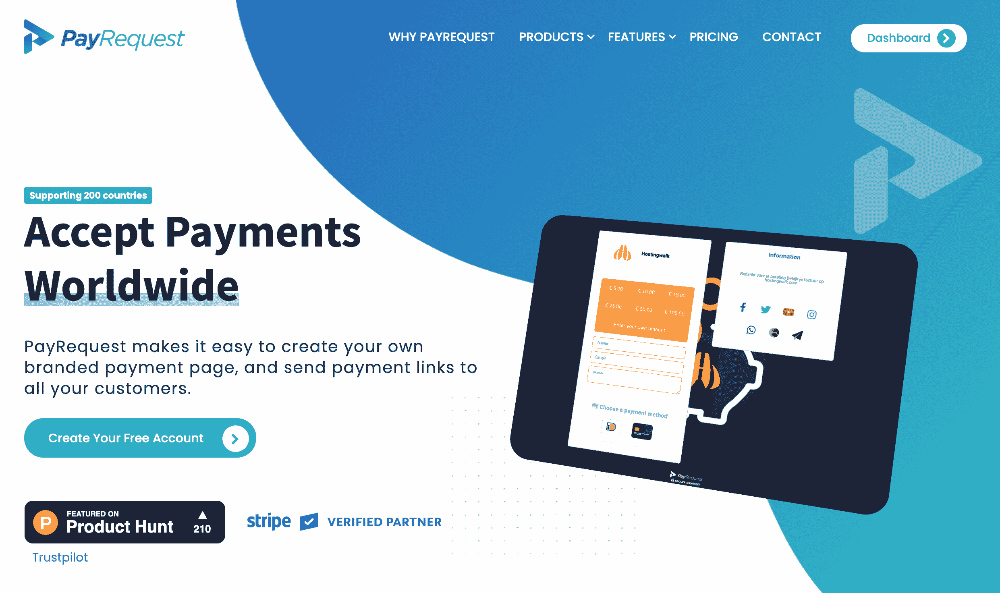
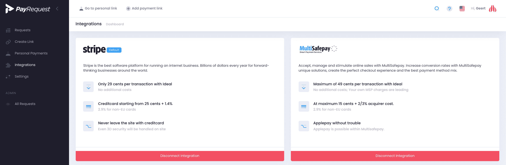

# 我是如何从制作网站取乐到拉面盈利的

> 原文：<https://www.indiehackers.com/interview/how-i-went-from-making-websites-for-fun-to-ramen-profitability-75b524b853>

## 你好！你的背景是什么，你在做什么？

我是 Geert Jan Sloos，PayRequest 的首席执行官兼联合创始人。我和我的联合创始人兼首席技术官 Bram 一起创建了一个无代码支付平台，在这个平台上，你可以轻松地创建支付请求，并创建自己的支付页面。

我 12 岁的时候就开始创建网站。当我 18 岁时，我创立了自己的虚拟主机公司，拥有 1000 多名客户，但只专注于荷兰客户。

## 一句话，为什么要有人看这个采访？

我们希望激励人们踏上发布自己产品的旅程，并相信自己的产品，即使这需要花费大量时间和精力。

## 你是如何想到 PayRequest 的，又是如何开始的？

我已经有了一家托管公司，但我在寻找一种可以发送支付链接和支付提醒的服务。

在与 Bram 交谈后，我们决定建立一个简单的服务来创建支付请求，但不知道它会发展成为一个服务于全球所有市场的无代码支付平台。

## 你是如何吸引用户和增加支付需求的？

这是创业最难的部分，你可以创造一个好的产品，但一切都取决于一个好的营销策略。

我在网络营销方面有足够的经验，但在全球范围内推广一家初创公司对我来说是一个巨大的挑战。当我们最终开始寻找产品时，我非常紧张。幸运的是，这是一个巨大的成功，我们得到了我们的第一批客户，并收到了更多的积极反馈。

你不应该等别人来做选择。

TweetShare

我们有一个很好的长期战略，从内容营销开始。我们在所有的支付链接和支付页面上都有一个醒目的“Powered by”徽章。

## 你的商业模式是什么，你是如何增加收入的？

我们的商业模式很简单。我们没有任何月费、追加销售或隐性成本。我们只对每笔成功的交易收取 1%的交易费，大批量用户有定制折扣。

这也是一种公平的商业模式，因为只有客户赚钱，我们才赚钱。这让我们有动力推出更多功能并改进我们的产品。

我们与 Stripe 等领先的支付提供商合作。客户连接他们的账户，我们不从中收取任何费用。相反，每笔交易都直接进入他们的 Stripe 账户。

在使用这种方法的头几个月，我们没有太多的增长，但在最后几个月，我们每个月的增长都超过了 100%。

## 你的技术是什么？

我们的网站本身是由 GitHub 页面构建的，这些页面与 Jekyll 和 Markdown 协同工作。管理我们的网站可以节省时间。我们还可以通过 GitHub 项目跟踪我们所有的提交。我们的编辑大部分是通过 GitHub 桌面和 sublime text 完成的。然而，作为我们的仪表板和支付页面的框架，我们使用了 [Symfony](https://symfony.com/) 。

这一切都运行在 LEMP 系统上(Linux、Apache + [Nginx](http://www.nginx.com/) 代理、 [Mariadb](https://mariadb.org/) 和 PHP)。我们的基础设施依赖于数字海洋的一滴水滴。

Symfony 是我们选择的框架，因为它有许多活跃的模块，而且维护成本很低。为了提供缩小的/组合的 css、javascript 和图像管理，我们使用了 [Webpack](https://webpack.js.org/) Encore。作为一项邮件服务，我们使用亚马逊 SES，这给了我们机会让用户用他们自己的域名或者仅仅通过我们自己的域名发送邮件。

现在，我们正在研究将我们的仪表板更改为 Vue.js 应用程序的可能性(PWA 的一个可能的想法)，并将我们的支付链接迁移到 Vue.js 设置。

我们最大的问题是决定下一步做什么。我们想为顾客想要和需要的东西提供一些直接的解决方案吗？如果是这样的话，这是我们前进道路上的一大步吗？这是我经常想的事情。

## 你未来的目标是什么？

我们希望通过更多的员工来扩大我们的团队，以更快地开发新功能，并扩展我们的营销策略。

在未来，我们希望提供更多的解决方案来帮助企业，如在线销售产品、税收遵从、客户管理、预授权等。

## 你面临的最大挑战和克服的障碍是什么？

我学到了一些东西。就像你不应该等待别人做出选择。继续改进你自己和你的产品。

如果你开始做副业，在你真正知道你的创业公司有足够的收入支付你自己的工资之前，千万不要辞职。

TweetShare

不要对一个承诺了很多山但只带来一小堆沙的客户失去警惕。这需要很多时间，但最重要的是浪费你的精力！

## 作为一名独立黑客，在你迄今为止的旅程中，什么时候你最需要勇气？

PayRequest 是我的第一个全球业务。对于一个来自英语不是第一语言的国家的独立黑客来说，这要困难得多。老实说，我不得不谷歌“勇气”是什么意思！:-)但是我为我们的网站写了很多博客来提高我的英语水平。

我希望我能激励其他独立黑客开始一项全球性的业务，即使他们的英语不是很好。

## 新冠肺炎对你或 PayRequest 有影响吗？

新冠肺炎启发我们为用户提供一些东西。

PayRequest 推出了捐赠页面，帮助世界各地的企业在新冠肺炎时期筹集资金。

目前，我们仍然对捐赠页面不收费。

## 有没有发现什么特别有帮助或者有优势的？

我们总是以批判的眼光看待我们的产品，但我们知道询问忠诚的客户如何更好地为他们服务是多么重要。他们总是知道改进你的产品的最好方法。

如果你开始做副业，在你真正知道你的创业公司有足够的收入支付你自己的工资之前，千万不要辞职。

## 对于刚刚起步的独立黑客，你有什么建议？

找个联合创始人！你可以*而不是*独自完成营销、支持和开发。

也从你的网络中获得反馈！反馈至关重要。

根据你的背景，投资自己总是一个好主意。这可以是学习编程语言等在线课程，或者购买关于创业的书籍。想办法投资自己的进步。

## 我们可以去哪里了解更多？

每个月我们都会在[媒体](https://medium.com/payrequest)上写一篇新文章，并定期在我们的[推特](https://twitter.com/payrequest_io)上发布新的更新。

欢迎在评论区留下一些问题。

—[<picture id="ember5286049" class="user-avatar ember-view user-link__avatar"></picture>吉尔特·扬·斯洛斯](/payrequest?id=YUq12CQJwMaX1oSiDMonwAt39lC2)【pay request】创始人

## 想像 PayRequest 一样建立自己的事业？

你应该加入[独立黑客社区](/)！🤗

我们是几千名创始人，互相帮助建立有利可图的业务和副业。来分享你正在做的事情，并从你的同事那里获得反馈。

还没准备好开始使用你的产品吗？没问题。这个社区是一个认识人、学习和实践的好地方。随意[随便浏览](/)！

—[<picture id="ember5286054" class="user-avatar ember-view user-link__avatar"></picture>考特兰艾伦](/csallen?id=ibTLPyjwVebnZjMGKvz6ztarnuV2)，独立黑客创始人

39votes