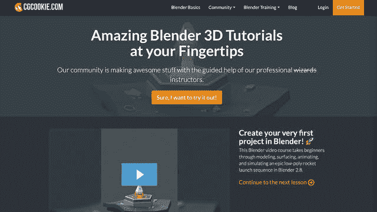
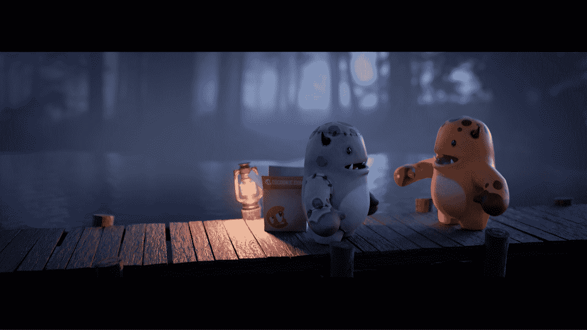
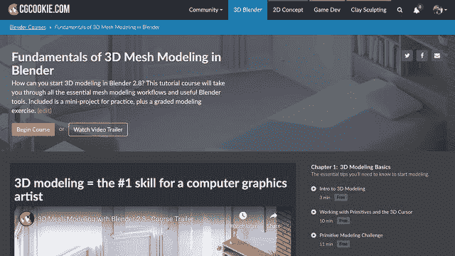

# 我是如何从濒临破产到经营一家 8.8 万美元的 MRR 企业的

> 原文：<https://www.indiehackers.com/interview/how-i-went-from-near-bankruptcy-to-running-an-88k-mrr-business-5a4f6c56fd>

## 你好！你的背景是什么，你在做什么？

嘿，👋我的名字是韦斯·伯克。在过去的 12 年里，我和我的联合创始人[乔纳森·威廉姆森](https://www.indiehackers.com/carter2422)一直致力于一个名字很有趣的项目，叫做 [CG Cookie](https://www.indiehackers.com/product/cg-cookie) 。CG Cookie 是一个付费会员网站，致力于为世界各地的人们创造美味的在线搅拌机教育和资源。

CG Cookie 主要是在往返芝加哥的一小时火车上制作的，我在那里做 3D 环境游戏艺术家。我会在早上 5:30 跳上早班火车，手里拿着热咖啡和耳机，走到后座，在那里我可以设置我的远程旅行办公室。

12 年后，我谦卑地告诉大家，我们仍然在这里，由 15 名工作人员组成的 100%远程团队跨越 9 个州、3 个国家和 6 个时区，试图解决所有问题，MRR 为 88k/mo。

## 一句话，为什么要有人看这个采访？

有兴趣建立一个超过 20 年的业务？这就是我们正在努力做的，建立一个我们都想为之工作的公司。

## 是什么促使你开始接触 CG Cookie？

他们说没有酸味你就不知道什么是甜。虽然我确信事情可能会比坐在破产律师的办公室里更糟，拖欠了三个月的抵押贷款，家里刚生了女儿，自由职业失败，但我感到有动力去做一些事情。😅

虽然养家糊口是一种驱动力，但从根本上说，我只是喜欢建造不存在的东西:挑战、潜在的回报，以及简单地享受它以积极的方式影响人们生活的想法。

鉴于我的 3D 游戏背景，我倾向于建立一个 CG 在线社区。有了 X4artists、CGMob 和 CG Underground 的失败经验，为什么不去吃饼干呢？🍪

CG Cookie 碰巧在正确的时间出现在正确的地方，原因有几个。2008 年，Blender 是一个不太知名的 3D 软件，尽管随着 Blender 2.5 的发布，这一浪潮已经开始增长。尽管如此，很少有人为 Blender 提供商业培训，更不用说商业插件了。就在那个时候，在 Vimeo 和 YouTube 分别于 2004 年和 2005 年开始的帮助下，在线视频流正在成为一件事情。

我从来没有申请过破产，尽管我认为要想幸运，你必须首先把自己放在那里。

## 你差一点就要申请破产了，而且你还要养家糊口。你能谈谈你在启动这个项目时所面临的风险吗？失败对你来说意味着什么？

当然，糟透了！

对我来说，这是一个自我反省的时刻，就像 Atreyu 面对魔镜门时一样。🤓我意识到是我，我把自己放在那个位置上，最终我有责任离开。

谢天谢地，我在芝加哥市中心找到了一份 3D 艺术家的工作，参与了一些非常有趣的项目。我不在乎两个小时的单程通勤，因为这是一条前进的道路。

所以实际上 CG Cookie 成功的风险并不可怕，我的家人会流落街头，尽管这灌输了一个非常真实的动机，以避免再次坐在那张椅子上。

## 构建最初的产品需要什么？

找到一种方法，用我所拥有的。

我用我有限的 HTML/CSS 知识和十几个插件创建了一个 WordPress 网站。在如今被普遍推崇为 MVP 的比赛中(*哈哈，也许我是比赛的负责人？*🤔)，它于 2008 年 9 月作为一个软件无关的计算机图形网站推出。

CG Cookie 最初专注于联播教育材料，这转变为雇佣承包商专门为 CG Cookie 创建培训，我以每个教程 4-8 美元的价格出售。

我清楚地记得我第一次在一天内实现 75 美元的销售额。这是一个如此难忘的时刻，意识到这可能是什么，也许。

我冒险用信用卡支付承包商的初始费用。我会花 125 美元委托一个教程，希望最终我能赚回这笔钱，再加上额外的钱来帮助委托下一个教程。冲洗，重复几年。

我做了很多没有规模的事情。如果你沉迷于一些商业书籍，你可能会听到这句话。我觉得我们是这方面的大师，几乎是个错误。

“建立一个我们都想为之工作的公司”是整个内部 CG Cookie 更新和对话中的一个常见短语。

TweetShare

特别是，我曾经手动编辑和显示教师在视频中喊出的关键点。这包括观看视频，仔细聆听“Ctrl-T”呼叫，然后手动将图形添加到视频的时间轴中。*这本身就需要花费数小时。*谢天谢地，现在有太多为 Blender 和其他录音软件打造的固体按键显示器。

说到底，启动这个项目需要把握好时机，坚持不懈地改进，当挑战摆在我们面前时，我们没有责怪他人，而是欣然接受。

在每一个关键的决定或发射时，我的肠子都打结了；我会觉得恶心，开始怀疑自己。不过，从历史上看，这被证明是处于正确位置的标志:走出我的舒适区，很多人不敢这样做。

## 你的技术是什么？

我非常感谢 WordPress 在 2008 年启动了这个项目，还有一大堆插件。😅

CG Cookie 历史上最令人难忘的一个转折点是决定脱离 WordPress，开始构建我们自己的定制 Ruby on Rails CMS。

我们的编码忍者尼克·哈斯金斯(Nick Haskins)，在接受挑战学习 Ruby on Rails 为 CG Cookie 打下基础之前，是一名配备 WordPress/PHP/MySql 的开发人员，他还参与了另外两个项目: [Mavenseed](https://www.indiehackers.com/product/mavenseed) 和 [Blender Market。](https://www.indiehackers.com/product/blender-market)

我们充分意识到做自己的事不是阳光和彩虹。当问题出现时，你将会 100%地陷入困境。

## 你们是如何吸引用户，让 CG Cookie 成长起来的？

出于需要，缓慢而稳定一直是座右铭。作为一个自举项目，我们的跑道是几个小时，而不是几年。

通过解决客户的问题来吸引他们，*“我如何使用 Blender？”*，马上就是第一要务。换句话说，我们想通过向一个人销售来快速测试我们的商业策略。如果成功了，再做一次，再做一次，专注于正确的事情。

虽然这个项目已经发展了很多年，但基本上这些都是我们今天以各种方式继续做的事情，以吸引新成员并发展我们的项目。

最初真正对我们有用的是采访著名艺术家。几乎每一个我发邮件给皮克斯或 ILM 的艺术家都会说，“当然。”这为我们的访问者提供了有趣的内容，同时在 CG 新闻网站上很容易分享，当然艺术家自己也会分享。

其他起作用的是真实的社交媒体帖子。善解人意的人不喜欢一直被人推销。相反，我们的社交帖子在刚开始时甚至现在都倾向于较少关注产品推广，而是关注我们社区的文化。*在你发帖之前，问问自己这是不是你想在你的订阅源中显示的内容。

接下来，积极发展简讯受众是关键。电子邮件仍然是接触客户的首选方式。至少那些已经对你的消息感兴趣的人。少关注“现在就买！”叙事。相反，你应该把目标放在信息丰富的电子邮件上，帮助客户认识到你是这方面的权威。

最后一件对我们有用的事情是做没有直接投资回报的事情。有时候做一个社区竞赛，去参加一个会议，或者主持一个有五个人观看的直播流，都不会对你的底线产生立竿见影的影响。他们*将*做的是投资于你的社区，长期收益，以及为那些支持你的人营造良好氛围。

如果我今天开始搅拌机培训业务，我要做的第一件事就是开始创造...现在。即使我觉得自己还没有完全准备好。最好的学习方法是教书。我还会有意识地使用我的社交渠道，尽早决定如何使用 Twitter 以及 Instagram 的主题。这一切都导致建立一个观众群，所以你被称为*你的小工具的*去处。这包括让 YouTube 频道第一天就有一个正常的发布时间表。没什么疯狂的，一周一次就够了。

除了社交媒体，我开始积极参与社区论坛并做出贡献。如果你在主题回复中提供了价值，把你的网站添加到你的签名中的技巧仍然有效。

最后，我开始了漫长的旅程。一夜之间的成功往往来自多年坚持不懈的努力。

## 你的商业模式是什么，你是如何增加收入的？

CG Cookie 项目以几种不同的方式产生收入。其中大部分来自订阅，其他收入来自附加开发和 YouTube 广告收入。

我先说订阅。每个月 29 美元，客户就可以即时访问我们整个 Blender 内容库。这包括数百个培训课程、资源、直播、练习和测验。近三分之一的收入来自 PayPal 用户，其余来自 Stripe。这一收入已被证明是相对稳定的，使我们能够为即将到来的项目进行规划和预算。

CG Cookie 主要依靠条带来处理我们所有的商户流程。Stripe 的开发令人惊叹，而且运行良好，而 PayPal 则是一种不可避免的邪恶。事实证明，PayPal 在努力创造良好的客户体验方面非常令人沮丧。虽然，在我们 MRR 的近三分之一，这是必需的。

下一个收入领域是 Blender 附加产品。抓着自己的痒处，我们创建了一个小的混合工具集来帮助艺术家加快他们的工作流程。其中最受欢迎的是 [Retopoflow](https://blendermarket.com/products/retopoflow) ，销量超过 5200 份。

最后，我们通过 YouTube 推荐和广告收入获得部分收入。我们收到的广告收入相对较少，尽管值得一提。真正的价值是从 [CG Cookie 的 Blender 频道](https://www.youtube.com/c/CGCookieBlender)到 CG Cookie 项目的活跃推荐，占所有新注册的近 20%。😳

我们的指路明灯是“80/20 法则”。这些年来，我已经非常熟悉帕累托法则，也就是 80/20 法则，即 80%的结果来自 20%的原因。在早期，我们的想法是创建 80%的免费内容，希望以此来鼓励客户转化。事实上，这让支付 20%的人感到厌倦。虽然看到这么多的浏览量感觉很好，但免费会员只是保持免费，因为我们一直在发布免费内容。

2012 年，我们将 80%的注意力从不付钱给我们的人身上转移到付钱给我们的人身上。成功了！

虽然随着谷歌分析数据的萎缩，我们的自尊心受到了打击，但我们看到了 MRR 的稳步增长，客户对我们新的关注和那些积极支持我们的人的支持感到高兴。真正重要的数字。

说到这里，我想谈谈数据。令人难以置信的是，在线企业可以访问大量的指标。人们很容易被日复一日，甚至周复一周的表现所吸引。记得缩小视野，从 30，000 英尺的高度思考你的起点和终点。

| 月 | 年终收入 |
| --- | --- |
| 2014 年 1 月 | 31246 |
| 2015 年 1 月 | 46348 |
| 2016 年 1 月 | 66256 |
| 2017 年 1 月 | 79129 |
| 2018 年 1 月 | 83977 |
| 19 年 1 月 | 80740 |
| 1 月 20 日 | 82225 |

## 你未来的目标是什么？

*建立一家我们都想为之工作的公司*是整个内部 CG Cookie 更新和对话中的一个常见短语。

共同的目标是建立一个可持续的、可盈利的企业，让所有参与者都能*享受现在的生活*:与家人共度时光，在你想去的地方工作，旅行，如果天气好的话，早点溜出去。同时一起解决有意义的挑战性问题。

我的 CG Cookie 的主要目标是维持它，同时在过程中有一点乐趣。😜我不希望它成为拥有 100 名员工、价值 1 亿美元的公司。

如今，维持一项有利可图的业务听起来可能很无聊，但对我来说绝非如此。这就是我们通过附加产品将我们的产品多样化并将 YouTube 视为一种产品的驱动力。如果事情发生变化，这一切都有助于增加项目的弹性。

我们不断努力成为更好的自己，为社区做正确的事情，在我们所做的事情上有创造性，并从中获得乐趣。

## 你面临的最大挑战和克服的障碍是什么？

有一些是从过去想到的，从没有足够的钱支付自己，到网站每周六定期关闭，到给成千上万的客户发电子邮件说我们误注销了他们的账户。😅

挑战在于当事情发生时如何反应。不要试图指责或放任情绪，尽你最大的努力保持冷静，解决你面前的问题，并在事后分析中找出发生了什么。

尤其是对我来说，我最大的挑战是担心我们的团队会失去文化意识，或者失去彼此之间的联系。我觉得如果一个团队开始分裂，这将会影响到我们的产品、客户和我们工作的日常乐趣。

在一个远程团队中，我们每个人都很容易感到孤立，尤其是在一个鼓励自治的团队中。为了帮助减轻这种情况，我们部署了一些东西。第一个是每周一次的“心跳检查”,让我们每个人都可以分享这一周打算做什么以及我们完成了什么。这不是关于责任，而是关于提高你在团队中的意识，看看其他人在做什么。通常情况下，我们还会每年举行一次面对面的务虚会，以建立社会货币，并就我们正在建立的东西达成一致。最后，我们主要依靠异步通信，尽管有一个通用规则，如果任何冲突开始出现，就切换媒介。如果有问题，切换到即时聊天，如果不起作用，切换到语音，这就解决了 99%的沟通挑战。

这仍然很难，我们意识到有些事情需要继续努力去保持。

尽快把你的东西卖给一个人。

TweetShare

## 新冠肺炎对你和 CG Cookie 有什么影响，如果有的话？

幸运的是，再次*CG Cookie 碰巧在新冠肺炎到达的正确地点和时间。作为传统学校的在线替代，我们的定位是为那些困在家里寻找事情做和学习的人服务。*

 *从 2020 年 1 月到 2020 年 5 月，我们的 MRR 增长了 12%，高于 2019 年 2%的增长率。这反映了《纽约时报》的一篇文章中提到的全球趋势，[该病毒改变了我们的互联网方式](https://www.nytimes.com/interactive/2020/04/07/technology/coronavirus-internet-use.html)，类似的服务经历了这种分析上升。

自 5 月以来，我们已经看到了稳定的自我修正趋势，尽管仍比 2020 年 1 月的表现要好。

奇怪的是，对于 100%的远程 Cookie 团队来说，大部分业务照常进行。我们对此无比感激！当我们都在这个疫情航行时，又少了一件需要担心的事情。

## 有没有发现什么特别有帮助或者有优势的？

使用技术来帮助你掌握事物的脉搏可能很有吸引力:要做的事情、长期目标、日常任务。对我来说，我发现在身边放一个记事本和一支笔特别有帮助。

每个星期天晚上，我都会花大约 20 分钟思考即将到来的一周，并写下所有我想完成的事情。奇怪的是，它能让我平静下来。

从个人任务管理软件到苹果笔记本上的数字待办事项清单，我几乎什么都试过了。对我来说，没有一样东西像古老的墨水和纸一样成功或令人满意。

另外，当你完成它们的时候，你可以用力划掉它们。:)

## 对于刚刚起步的独立黑客，你有什么建议？

思考这个想法并不难。

构建这个东西的第一个版本也不是太难。

坚持这个想法需要勇气，或者说真正的挑战。它有时会变得情绪化、有风险，甚至让人精疲力竭。

尽可能快地把你的东西卖给一个人，想想你的项目 5 年或 10 年后会是什么样子。发生了什么使这一愿景成为现实？你现在有了你的任务列表。

令我难忘的书籍:

*   [调转船头](https://www.amazon.com/Turn-Ship-Around-Turning-Followers/dp/1591846404/ref=sr_1_3?dchild=1&keywords=turn%20the%20ship%20around&qid=1603735675&s=books&sr=1-3)，
*   [数字管理](https://www.amazon.com/Managing-Numbers-Commonsense-Understanding-Financials/dp/0738202568/ref=sr_1_1?crid=QUH93UMPNXHE&dchild=1&keywords=managing%20by%20the%20numbers&qid=1603735655&s=books&sprefix=Managing%20by%20the%20num,stripbooks,186&sr=1-1)，
*   [工作中不一定要疯狂](https://www.amazon.com/Doesnt-Have-Be-Crazy-Work/dp/0062874780)。

## 如果创业真正困难的部分是保持动力和维持 ide，那么在困难的时候你如何激励自己呢？你有没有想过放弃，你是如何度过这种感觉的？

放弃的感觉确实时不时渗透到我的脑海里。这是非常真实的人类本能；也许我们正在评估我们的逃跑或战斗场景。

我真的不知道怎么回答这个问题。我打出了一些老生常谈的技巧和诀窍，但最终你必须有渴望。当别人止步不前的时候，让你继续前进的 bug 或内心的渴望，那种想要打造一个更好的自己的近乎无情的愤怒。

你怎么知道的？不知道，如果你能想出办法，你会比我更能帮助更多的人。

我知道很多美国独立制作人喜欢引用史蒂夫·乔布斯的一句名言，这句话每次都让我感到很受触动。

你周围的一切你称之为生活的东西都是由不比你聪明的人创造的。你可以改变它，你可以影响它……”-史蒂夫·乔布斯

## 我们可以去哪里了解更多？

前往 [CG Cookie](http://cgcookie.com) 学习 Blender，或我的 [Twitter](https://twitter.com/wesburke) 了解更多关于我的信息。

CG Cookie 的附加项目🍪分别是:[mavensed](http://mavenseed.com)和 [Blender Market](http://blendermarket.com) 。

感谢您的阅读，任何问题请在下面发表。祝您愉快！

——[<picture id="ember5263473" class="user-avatar ember-view user-link__avatar"></picture>韦斯伯克](/wesburke?id=rc7kUQIcwPTdSO6lPvQdZ8z6Iis2)，CG Cookie 的创始人

## 想像 CG Cookie 一样建立自己的事业？

你应该加入独立黑客社区！🤗

我们是几千名创始人，互相帮助建立有利可图的业务和副业。来分享你正在做的事情，并从你的同事那里获得反馈。

还没准备好开始使用你的产品吗？没问题。这个社区是一个认识人、学习和实践的好地方。随意[随便浏览](/)！

——[<picture id="ember5263478" class="user-avatar ember-view user-link__avatar"></picture>柯特兰艾伦](/csallen?id=ibTLPyjwVebnZjMGKvz6ztarnuV2)，独立黑客创始人

35votes*