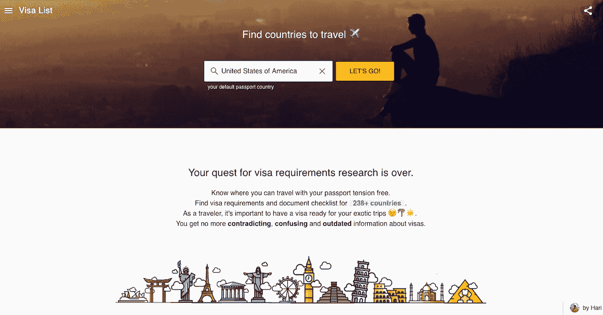
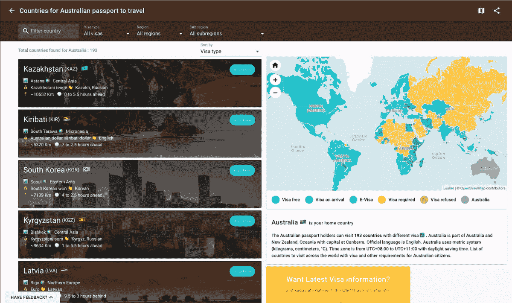
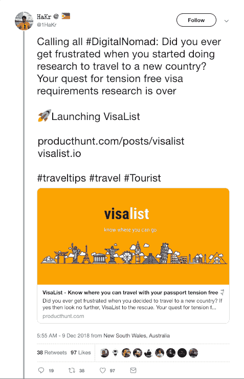
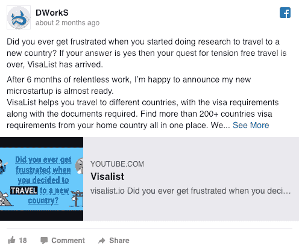
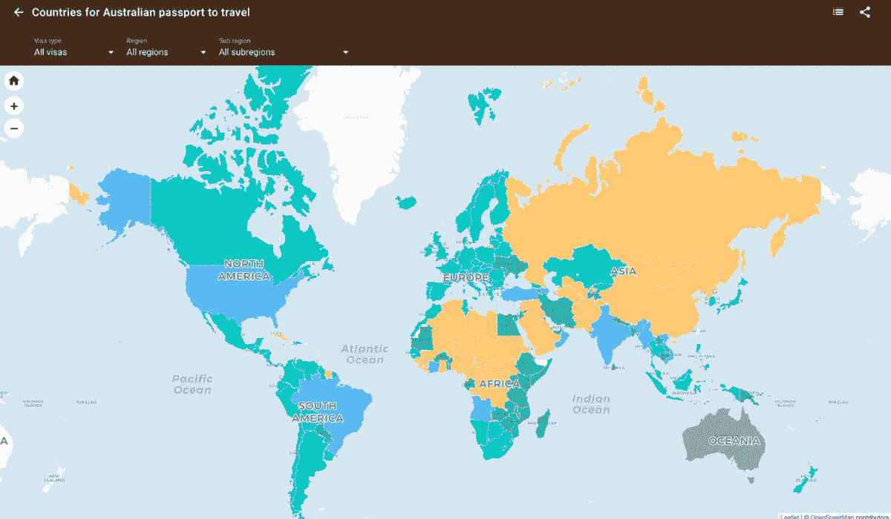

# 我如何去寻找灵感，找到它并成功启动

> 原文：<https://www.indiehackers.com/interview/how-i-went-looking-for-inspiration-found-it-launched-successfully-879d6f0892>

## 你好！你的背景是什么，你在做什么？

大家好，我是 [Hari Krishna](http://twitter.com/1HaKr) ，一名来自印度的计算机科学毕业生，住在悉尼。在过去的九年里，我一直是一名开发人员、一名工程经理、一名产品经理、一名企业家、一名增长黑客以及一名设计师。

我目前正在开发 [VisaList](https://visalist.io) ，它可以帮助你找到你可以访问的国家，并在一个地方获得签证要求、文件清单和签证申请。对于任何想知道可以带着护照去哪里旅行的人来说，VisaList 就是答案。

目前，VisaList 拥有超过 17 万用户，110 万页面浏览量，并以 20%的速度增长。

 

## 是什么促使你开始使用 VisaList？

2009 年毕业后，我创建了 [DWorkS](https://dworks.io) ，在我不做案头工作的时候，我一直在做开源图书馆和微型创业公司。我制作了一个浏览器，一个下载量超过 100K 的文件管理器。我也是一个面向 Android 开发者的流行网络库的作者， [VolleyPlus](https://github.com/DWorkS/VolleyPlus) 。2017 年，我制作了 [ACrypto](https://acrypto.io) ，这是一款加密货币应用，可以让用户跟踪他们所有的加密货币。

我和 ACrypto 有了很大的突破，花了六个月的时间把它放到了自动驾驶模式。我正在制作像样的 MRR，并在寻找新的想法来建立我的下一个微型创业公司。为了激发灵感，我成了一名数字流浪者，开始旅行，打算去所有我想去的国家。

很快我意识到，你需要签证才能进入大多数这些国家，虽然有几个国家有落地签证(VOA)，但大多数都要求你通过他们在你祖国的大使馆(就我而言，是印度)。我想找到不用等三周就能拿到签证的国家，所以我做了一些调查。我不得不费力地浏览一些博客和网站，但我最终找到了一份我需要的信息列表，然后我就出发了！几个月后，我想去另一个国家旅行，但我丢失了我找到的原始列表，所以我不得不重新开始我的研究。幸运的是，我发现了一个新网站，上面列出了更多提供 VOA 服务的国家。同样，我的一个朋友 Amit 告诉我，当他在搜索越南的签证信息时，他发现了几乎 10 个带有. gov 地址的网站，这真的令人困惑。在我自己的研究中，我发现许多博客没有大使馆官方网站的链接，这最终是无益的。

总的来说，试图找到我需要的信息是一个巨大的挑战。没有以任何有用的方式显示聚合的签证信息，所以每次我想去旅行时，每个不同的国家都需要相同数量的繁琐研究，我发现的大多数博客和网站都只有很少的信息，而且已经过时。也很难找到政府或大使馆的官方网站。这意味着我经常要向签证代理支付比应该支付的更多的钱。

沮丧之余，我寻找一种能有所帮助的产品，但我遇到的所有东西都只有一个非常基本的签证要求表，仅此而已。尽管我在旅行和签证相关问题上没有正式的经验，但我意识到我所有的研究和旅行时间让我能够满足这种需求。我决定收集所有我能找到的信息，组织起来，并以一种有用的、容易理解的方式呈现出来。于是，VisaList 诞生了！

我制作了一个网站的 MVP，并和几个朋友分享，他们很喜欢。他们积极的回应给了我前进的希望和动力，所以我开始建立一个成熟的网站。两个月后，它就准备好了。公开发布获得了巨大的成功，从那以后，它的发展势头越来越强劲。

 

## 构建最初的产品需要什么？

虽然网站显然是这项服务的最佳媒介，但我很快意识到我并不擅长网站开发。

我喜欢一个好的挑战，所以我做了一些挖掘，以找到最好和最简单的框架来建立一个支持 AMP 的 SSR(服务器端渲染)网站。我知道我也想把它建成 Android 和 iOS 的移动应用，所以渐进式 Web 应用(PWA)支持非常重要。对于增长来说，搜索引擎优化是至关重要的，因为几乎每个寻找签证信息的人都会像我一样在网上搜索。

我的好朋友 [Rizwan](https://www.linkedin.com/in/khanriz/) 推荐了 [VueJs](https://vuejs.org) ，我几乎立刻就爱上了它。使用 VueJS 学习和构建应用程序真的很容易，我还在它上面找到了一个名为 [NuxtJS](https://nuxtjs.org) 的框架，它有很多现成的东西，节省了我大量的时间。

一旦我开始到处玩，我就能在两周内完成 MVP。我一直远离 web 开发，因为我对移动应用程序有很强的亲和力，所以完成我的第一个 web 应用程序真的很令人满意，我真的为自己感到骄傲。

一旦你变得善于学习，善于探索和学习新事物，学习新的技能和技术就会变得更加容易和愉快。

TweetShare

之后，我使用一个非常棒的材料设计库 [VuetifyJS](https://vuetifyjs.com) 规划出了剩余功能的所有设计。感觉所有这些工具都是偶然为 VisaList 设计的，让我的开发工作变得简单多了。如果你和我一样是初学者，我强烈推荐使用 VueJS + NuxtJS + VuetifyJS 来构建你的第一个 web 应用。

网站工作进展顺利，但我很快意识到收集所有与签证相关的数据将是一个很大的障碍。这项服务的全部目的就是提供这些数据，所以我必须坚持下去。我寻找开源项目并找到了一些，但是它们并不能完全满足我的需求。事实证明，维基百科拥有所有这些信息，并且由社区定期更新。我找到了一个开源的[项目](https://github.com/vinaygopinath/visa-req-wiki-scraper)，它下载了我需要的所有基本数据，并对其进行了修改，以适用于 VisaList。

[Rizwan](https://www.linkedin.com/in/khanriz/) 相信 VisaList，帮我做后端，并在 MySQL 中托管数据。他用 Golang 构建了带有 gorm 和 gin 库的 API。实际上，我从他那里获得了 Golang，并一直用它来构建后端 API。Web 开发对我来说太新了，以至于我不知道如何使用 NGINX 进行托管、后端、代理等等。幸运的是，里兹万帮助了我，我真的不知道怎么感谢他。

我的另一个朋友 [Sateesh](https://www.linkedin.com/in/sateeshkumar/) ，很大方的和我分享了他的付费 SEO 课程。我很努力地研究这个问题，以了解 SEO 是如何工作的，并对网站进行了修改，以便 Google 可以开始索引。从那以后，我了解到 SEO 对于市场营销和增长来说是巨大的，为了保持更新，你必须投入无尽的工作。

在我构建 MVP 的时候，我对竞争对手和类似的网站做了一些研究，以了解他们如何处理 SEO 的各个方面，以及他们使用了什么样的内容。了解竞争对手的最佳实践非常有帮助。我本可以在 MVP 中加入很多东西，但我遵从了我的产品管理直觉，并保持它的基本性。最初的版本只有一个列表和详细信息页面。

我的哥哥，Tirumal，一直是我第一个也是最好的评论家，从第一天起就一直支持我。由于他的反馈和建议，我模糊的想法变成了产品的基本版本，对此我非常感激。

[https://www.youtube.com/embed/w3MUBxr7TCk](https://www.youtube.com/embed/w3MUBxr7TCk)

## 你是如何吸引用户并发展 VisaList 的？

到目前为止，我对给定产品的营销策略是制定一个粗略的计划并立即执行，但我为 VisaList 的推出制定了一个全面而周密的计划，它真的得到了回报。最初，我在谷歌文档上做了一个小清单来帮助指导我的过程。它规划了跨不同平台和社交网络的发布，以及来自家人、朋友和影响者的帮助。VisaList 在营销和增长游戏中有巨大的优势，因为它解决的问题是如此普遍；大多数人在一生中的某个时候都会想去某个地方旅行，所以任何人都是潜在用户。

在发布周之前，我创建了一个即将推出的产品搜索页面，但没有多少订阅者。我心灰意冷，用我的清单不断调整和改进我的发射计划。我原本打算在即将到来的页面发布后立即发布，但为了测试一些想法，在其他几个地方试运行，并收集一些反馈，最终推迟了几周，这被证明是一个伟大的决定。多亏了我朋友 [Ankit 的](https://www.linkedin.com/in/ankitja/)建议，我在发布日之前增加了电子邮件订阅。没有这些，我就不会和我的用户有任何接触。

我发现有两件事对发布或推广产品至关重要:标题和时机。甚至有研究建议在各种平台上发布的最佳时间。

上线仅一个月，VisaList 就拥有超过 17 万用户。以下是对我的过程的回顾，以及我对时机的一些统计和见解:

**产品搜寻**

产品搜索(PH)已经成为发布新产品并从其他制造商和搜索者那里获得良好反馈的默认平台。多年来，我把启动 PH 的过程归结为一门科学。带着这个想法，我跟踪了一些以前很棒的发布，并把它们作为模板。我的一个朋友[希德](https://twitter.com/siddharthkp)非常喜欢我的页面，他为 VisaList 制作了一个发布视频。这是当天的第一款产品，也是本周的第三款产品。它还获得了 PH[2018](https://www.producthunt.com/golden-kitty-awards-2018?#side-project)金猫奖的亚军。从各方面来看，这是一次完美的发射。

*   最佳时间:周日 00:00 后
*   使用的工具:[预览寻线](https://previewhunt.com)
*   用户:5K

**黑客新闻**

人们说你在《黑客新闻》( HN)上得到最诚实、最残酷的反馈，而且很难登上头版。我并没有抱太大希望，但是我很幸运，VisaList [跟踪了一整天](https://news.ycombinator.com/item?id=18640880)。我得到了大量有价值的反馈，尽管很残酷，但完全值得。

*   用户:11K

**reddit**

这对我来说是最大的惊喜之一。我原以为 reddit 会类似于 PH 或 HN，但结果比我想象的要好很多。reddit 的伟大之处在于它有如此多不同的子编辑，你可以向其中任意多的子编辑发帖(只要你遵守每个子编辑的规则)。在这里，我在 [r/SideProject](https://www.reddit.com/r/SideProject/comments/9zyw0t/do_you_know_for_which_country_you_need_a_visa_i/) 和 [r/Entrepreneur](https://www.reddit.com/r/Entrepreneur/comments/a2d99l/did_you_ever_get_frustrated_when_you_decided_to/) 做了一个试运行。我发布了 VisaList 来寻求反馈，这个社区真的很棒。这些子主题真正帮助 VisaList 形成了今天的样子，支持和积极情绪不断涌现，直到在 [r/dataisbeautiful](https://www.reddit.com/r/dataisbeautiful/comments/a6qlyr/i_made_a_site_where_you_can_visualize_visa/) 上正式发布，让它出现在数千人面前。

在 reddit 上成功发布的诀窍是将每个 subreddit 视为完全不同的发布和用户群，将你的产品宣传为对他们有用的东西，而不仅仅是复制粘贴和垃圾邮件。如果使用得当，reddit 可以带来很多东西，老实说，我得到的反馈数量真的是势不可挡的(以一种好的方式！).总的来说，VisaList 获得了 16K 张选票。我不能要求更好的发射。

*   最佳时间:[检查后](https://postinspect.com)
*   用户:65K

**WhatsApp**

我写了一条短信来征求反馈，并与我的朋友分享，让他们指向 PH 链接，因为我希望反馈是公开的。

*   观点:80%

**推特**

我从阅读 Pieter Level 的[MAKE:Bootstrapper ' s Handbook](https://makebook.io/)中学到的一件大事是你的帖子的标题，不管平台如何，都需要是动态的。它应该围绕你的产品创造兴奋感并脱颖而出，所以我在制作我的推文时牢记这一点。我还邀请了我的朋友，Sid 和 Hemanth，他们都是科技领域有影响力的人，在 VisaList 上发布他们的反馈。

 

*   最佳时间:周二、周三和周四下午 1-2 点
*   浏览量:15K

**领英**

我请我的好朋友萨提什和其他几个人在 LinkedIn 上发布了一份名单。在这个平台上发帖将产品展示给了完全不同的受众，最终我收到了一些收购要约。

*   最佳时间:周四下午 4 点
*   意见:4K

**脸书**

这张照片是我从公司主页上传的，看起来不错。

 

*   最佳时间:周一下午 3-4 点
*   浏览量:5K

**新闻出版物**

推出后，VisaList 很快被许多新闻出版物转载，并从那时起完全病毒式传播。它被 [Lifehacker](https://lifehacker.com/quickly-figure-out-what-the-visa-requirements-are-for-e-1831123185) 、 [Gizmodo](https://es.gizmodo.com/conoce-al-instante-que-tipo-de-visado-necesitas-para-en-1831128715) 、 [Gigazine](https://gigazine.net/gsc_news/en/20181211-visa-requirements-of-countries-visalist/) 、 [MakeUseOf](https://www.makeuseof.com/tag/travel-planning-apps-find-next-trip/) 、 [Esquire Magazine](https://www.esquiremag.ph/culture/lifestyle/visa-requirements-philippine-passport-a00200-20190103) 、 [CzechCrunch](https://www.czechcrunch.cz/2018/12/aplikace-visalist-vam-ukaze-do-jakych-zemi-muzete-ci-nemuzete-cestovat-bez-viz/) 以及俄罗斯、日本、阿根廷、中国、印度、菲律宾、美国等世界各地的许多媒体所报道。

*   用户:70K

## 你的商业模式是什么，你是如何增加收入的？

我认识到在许多不同的方向都有巨大的增长潜力，我不会仓促行事，而是一次一个来。收入不是我主要关心的问题，至少在上市后的前六个月不是。幸运的是，在发布期间，我通过各种渠道赚了不少钱，包括:

1.  广告收入
2.  三家签证机构的合作提议
3.  五个不同的人的收购要约
4.  API 服务客户端
5.  一家航班聚合公司的合作伙伴

运营的头几个月没有带来任何收入。2018 年 12 月，VisaList 带来了 700 美元的收入，其中大部分来自广告收入。合作和附属收入还没有发挥作用。由于这是一个内容服务，最好的办法是获得正确的搜索引擎优化，以增加我的广告收入。与不同签证机构的合作也是高收入来源，所以他们是我目前最优先考虑的事情。

 

## 你未来的目标是什么？

VisaList 正在稳步增长。最紧迫的目标是完成每个国家的文件清单数据集，并不断提高搜索引擎优化。虽然一个成功的发布是一个巨大的恩惠，但如果你想让人们继续来，搜索引擎优化是唯一的方法。

我最近整合了来自签证机构的签证处理服务，帮助那些希望自己的签证能够被快速便捷地处理的人。有可能与每个国家的签证机构建立合作伙伴关系，这将有利于收入。我还计划为签证机构和其他想围绕签证建立有用服务的人建立 API 服务。

获得签证后，事情的自然进展是预订航班和酒店，这是我希望整合到我的平台中的事情。我还想添加草稿地图，以便人们可以跟踪他们访问过的国家以及他们想去的国家。我认为这个功能尤其是平台的一个很好的社交角度，以及添加众包功能，以便社区可以不断更新信息，并给同路人提供提示。

除了这些新功能，我还在考虑为企业方面的事情构建解决方案。一旦我解决了旅游签证，我想增加工作和商务签证。

我不得不承认我被 VisaList 的成功冲昏了头脑。在调查过程中，我找不到任何竞争对手试图解决同样的问题或提供同样的解决方案。成为第一个上市的总是一个很好的着陆位置。

## 你面临的最大挑战和克服的障碍是什么？如果你必须重新开始，你会做什么不同的事？

我犯的一个最大的错误是建立了一个不恰当的 URL 结构，我后来意识到这对 SEO 有巨大的影响。两个月后，我决定改变整个 URL 结构，这意味着失去了之前收集的 SEO。抱着长期成长的想法，我还是做了。因此，我几乎丢失了 VisaList 的 45K 页的所有索引，看到所有的努力付诸东流是非常痛苦的。幸运的是，一个月后情况开始好转，仅仅两个月后就达到了基线。这是我在 web 开发中的一个大教训。

做任何事情都不要保守，积极地追求你的目标，学会处理失败。这是最困难的事情，但是一旦你克服了，没有什么能阻止你。

TweetShare

另一个大错误是发布时间比我最初计划的晚了很多。我一直在拖延，直到我收集了每个国家的文件清单、签证申请等，但在我启动时，只收集了 50 个国家的完整数据。事实证明，大多数人并不在乎，他们更感兴趣的是可以免签证的国家名单，而不是需要签证的国家的完整数据。当然，后见之明总是 20-20，但如果我必须从头再来一次，我会在 MVP 的一个月内推出。

我也希望我已经为大发布添加了众包功能，比如向上投票和给同路人的提示。随着 150，000+的流量在发布会前后被激活，它将会产生巨大的影响。

就构建网站的 AMP 版本而言，这不是一项简单的任务，因为不支持将普通网站和 AMP 网站结合使用。我不得不寻找一些小技巧来让一个代码库为他们两个工作，这让我有点退步。

## 有没有发现什么特别有帮助或者有优势的？

至少对我来说，产品成功的最大预测是当我在构建我个人需要的解决方案时。这是在游戏早期验证产品市场适合度的最快和最简单的方法之一。我所有的微型创业公司都很成功，因为我开始为自己创业——所以我立刻知道至少有一个客户会使用我的产品。一个额外的优势是，当你为自己构建东西时，你从里到外了解问题，这有助于找到更好的解决方案和构建更好的产品。

此外，我作为一名开发人员、产品经理、设计师和增长黑客的累积经验很容易地为我节省了几个月的时间，否则我可能会花这些时间自学所有必要的技能。话虽如此，一旦你变得善于学习本身，善于探索和学习新事物，学习新的技能和技术就会变得更加容易和愉快。

产品发布，我推荐[Pieter Levels 的《MAKE: Bootstrapper's Handbook](https://makebook.io) 》。这是一本令人惊叹的书，我必须为我成功的产品发布归功于它。提高 SEO，我建议 [SEO tester online](https://www.seotesteronline.com) 、 [KW Finder](https://kwfinder.com/?_ga=2.42790753.556793200.1547860875-44978489.1546088446) 、 [Varvy](https://varvy.com) ，对于性能我喜欢[网页测试](https://www.webpagetest.org/)。

## 对于刚刚起步的独立黑客，你有什么建议？

许多人告诉你使用 ReactJS 或其他一些技术栈。别听他们的。相反，你需要决定你想要做什么，然后找到工具和技术，以最快的速度和最少的努力实现你的想法。

只是建造和发射。人们经常犯的一个错误是想得太多，花太多时间来推出产品。我认为独立黑客的最佳策略是在不超过两周的时间内发布你的产品。

当你为自己构建东西时，你从里到外了解问题，这有助于找到更好的解决方案和构建更好的产品。

TweetShare

一旦你得到了你的 MVP，就要开始计划了。这才是你应该深思熟虑的地方。想想你想如何把你的产品卖给人们，让他们拿到手里。如果没有人使用，一个伟大的产品是没有用的。

冒险可能会令人畏缩，但不要让它阻止你实现梦想。做任何事情都不要保守，积极地追求你的目标，学会处理失败。这是最困难的事情，但是一旦你克服了，没有什么能阻止你。因此，重要的是要相信你正在建立的东西，即使你一开始就失败了。如果你坚持相信，你会找到成功的方法。这是创客的成功口头禅。

## 我们可以去哪里了解更多？

VisaList 每天都在增长，在每个国家都有。如果你想去旅行，想减轻一些压力，那就开始吧，因为我每天都在添加新功能。你可以随时在推特上联系我 [@1HaKr](http://twitter.com/1HaKr) 。如果你喜欢我的工作，想要支持我，你可以给我买一杯[咖啡](https://www.buymeacoffee.com/1hakr)。如果你有任何问题，或者想了解更多关于我是如何做到这一切的，欢迎在这里发表评论。

我要感谢钱宁邀请我参加独立黑客。我非常喜欢分享我的经历。😊

—[<picture id="ember5239916" class="user-avatar ember-view user-link__avatar"></picture>HaKr](/1hakr?id=DUeGPz3o8HXmTZFDrwNRYlKSKmj1)，签证清单创建人

## 想像 Visa List 一样建立自己的企业？

你应该加入[独立黑客社区](/)！🤗

我们是几千名创始人，互相帮助建立有利可图的业务和副业。来分享你正在做的事情，并从你的同事那里获得反馈。

还没准备好开始使用你的产品吗？没问题。这个社区是一个认识人、学习和实践的好地方。随意[随便浏览](/)！

—[<picture id="ember5239921" class="user-avatar ember-view user-link__avatar"></picture>考特兰艾伦](/csallen?id=ibTLPyjwVebnZjMGKvz6ztarnuV2)，独立黑客创始人

88votes