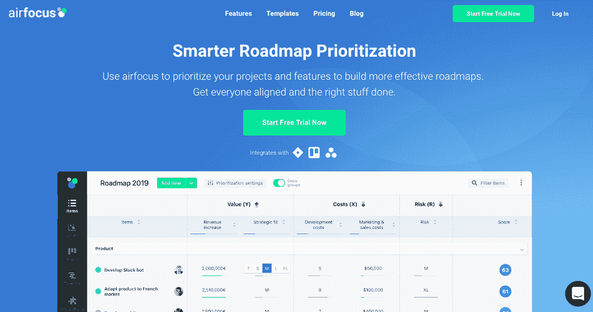
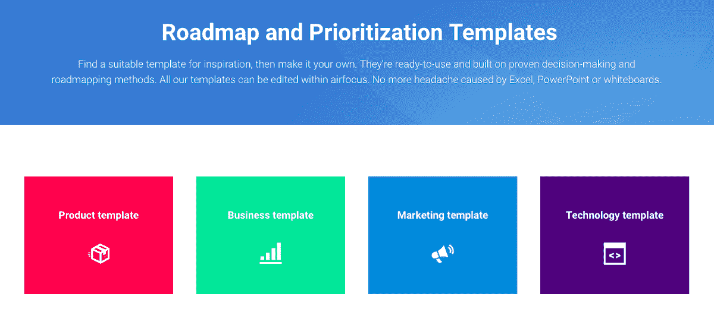
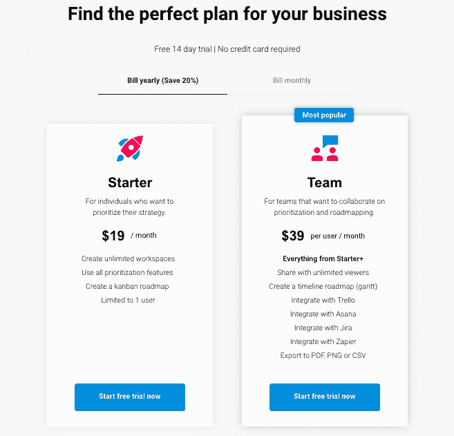
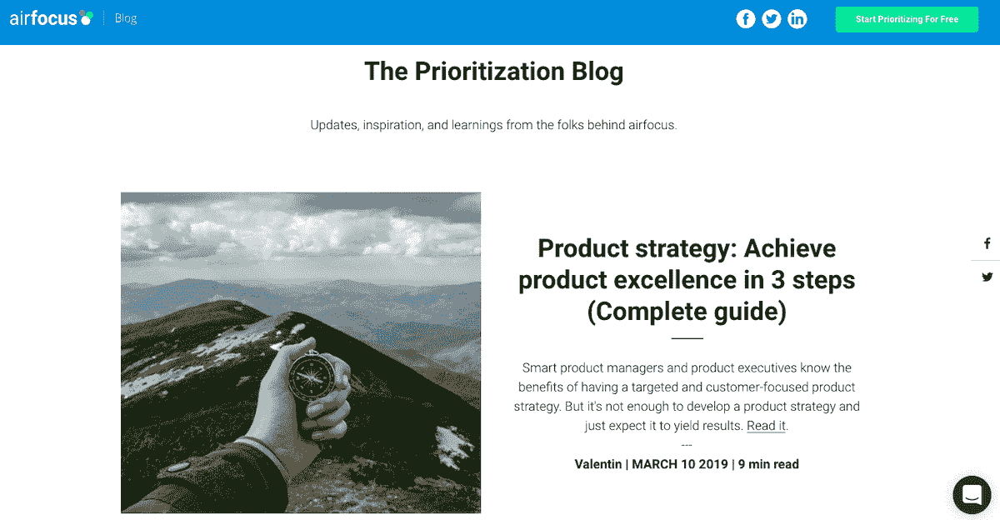

# 我如何平衡多家公司、我的家庭和一个激情项目

> 原文：<https://www.indiehackers.com/interview/how-im-balancing-multiple-companies-my-family-and-a-passion-project-1eba4e8ab7>

## 你好！你的背景是什么，你在做什么？

大家好，我是 Malte Scholz，我是 [airfocus.io](https://airfocus.io/) 的三位联合创始人之一。

我的背景是产品管理，我一直在寻找更好、更快、更聪明地做事的方法。

airfocus 是来自德国汉堡的 B2B SaaS，使决策者和团队能够优先考虑项目和功能，以构建更有效的路线图。我们经常被产品经理用作战略层，位于吉拉、特雷罗或阿萨纳等项目和任务管理平台之上，以确保你做正确的事情。

如今(发布后 11 个月)，我们从这项服务中每月赚取约 14，000 美元，并且每月增长约 20%。

 

## 是什么促使你开始使用 airfocus？

我想出了 airfocus 这个主意，因为我对无效的优先级电子表格和基于直觉的路线图感到沮丧。我是一家 200 名员工的 SaaS 公司的全职产品经理，我一次又一次地看到由于糟糕的战略决策而导致的项目失败、错过最后期限或超出预算。

由于我找不到一个 SaaS 来解决这一痛苦，我说服了我的联合创始人兼首席技术官 Christian，花了三个周末的时间来帮助建立一个 MVP。然后，我们在 BetaList 上发布了该产品，并获得了数百个注册用户和非常有价值的反馈。

## 构建最初的产品需要什么？

作为一个典型的附带项目，我们在大约六周的时间里建立了最初的网络应用和网站。我们认为我们正在做一件大事，但我们需要在路线图功能和集成方面进行大量投资，以使 airfocus 成为我们用户生活中不可或缺的一部分。

为了资助 airfocus 即将到来的发展，Christian 和我辞去了全职工作，共同创立了一个独立的技术机构 [WeLevel](https://welevel.com/) ，为德国企业(如汉莎航空)和初创公司开发网络和移动应用。这个团队很快发展到大约 15 名远程开发人员，克里斯和我把我们的时间对半分配在管理客户和开发 airfocus 上。所以我们把科技商店作为一个工具来加强空军基地。

无情地优先考虑你的任务和战略决策，这样你就不会浪费精力和宝贵的生命。

TweetShare

作为产品和技术人员，克里斯和我还了解到我们需要营销方面的帮助，并决定让瓦伦丁加入我们，成为第三位联合创始人。瓦伦丁和我从高中就认识了，他注重结果的心态正是我们所需要的。

经过另外六个月的开发，我们于 2018 年 4 月推出了 airfocus 付费计划。激动人心的时刻，尤其是对我来说，我美丽的女儿阿米莉亚在发射前三周出生了。

像所有初创公司一样，我们试图在快速启动和打造坚如磐石的技术之间取得平衡。然而，我们一直相信 airfocus 会起作用，所以在我们发布产品之前，我们花了相当多的时间来构建高级的拖放路线图功能和可扩展的堆栈(Scala/React)。

 

## 你是如何吸引用户和发展 airfocus 的？

一开始，我们遵循了行之有效的建议，做不可扩展的事情。我们将 airfocus 引入了我们的个人网络以及脸书和 LinkedIn 群组。直到几周前，我还在运行一个 Dux-Soup 活动，以自动连接 LinkedIn 上的相关用户。

我们还在脸书和推特上做了广告试验，还发了冷邮件。然而，我们今天最可靠、最有效的流量来源是 Capterra 和谷歌广告，以及[Trello Power-Up Store](https://trello.com/power-ups/5b3d006212145ced3457e36a/airfocus-prioritization)(Trello 用户通过我们的插件优先处理他们的 Trello 卡，并构建优雅的看板和甘特图)。

9 月，我们还推出了[产品搜索](https://www.producthunt.com/posts/airfocus)，吸引了数百名注册用户。回想起来，我们可能花了太多时间来准备发布，因为实际销售额最终低于我们的预期。

## 你的商业模式是什么，你是如何增加收入的？

从一开始就很清楚，我们将把 airfocus 作为 SaaS 订阅来销售。不清楚的是如何最好地构建不同的定价层级。受 Price intelligent/profit well 的聪明人的启发，我们旨在建立一种基于价值的定价方法。然而，事实证明，如果你想在中小型企业中吸引不同的目标人物角色，这并不是一件容易的事情。

最终，我们决定根据用户数量和特性(主要是集成)来划分我们的计划。我们从两个计划开始:一个针对个体创业者和小团队，每月 19 美元；另一个针对大团队，每个用户每月 39 美元。

我们在用户群中看到的一个有趣且出乎意料的趋势是自下而上的账户扩张。很多付费团队从一个许可证(用户)开始，然后通过邀请更多用户加入平台来升级。

 

## 你未来的目标是什么？

我们非常有使命感，希望围绕我们的主题——让公司做出更好的决策——开发更多有用的东西。

今天，airfocus 主要是一个战略规划工具，它帮助成千上万的用户创建基于优先级的路线图。然而，从我的经验来看，计划有时与实际执行脱节(通常发生在数百个任务和子任务中的吉拉、特雷罗、阿萨纳或 Basecamp 等工具中)。还记得某个聪明人说过的一句名言“每个人都有一个计划，直到他们被打了一拳”？我们现在还想缩小这一差距，以预测您计划的工作评估和预测的截止日期是否处于危险之中。为了做到这一点，我们将应用机器学习，并尝试理解您的任务和子任务中看似随机的数据。

推出 SaaS 相对容易。让它成功不是。

TweetShare

我们的目标是在汉堡建立一个有意义的 SaaS 公司，拥有成千上万快乐的客户和快乐的团队(无论他们在哪里远程工作)。为了实现这一切，我们将继续在产品上投资，我们将加倍使用迄今为止行之有效的营销技巧。

我们坚信合作伙伴关系，今年将致力于通过我们的市场整合为吉拉和特雷罗用户提供重大改进。

我们最近决定引入外部资本，以便在产品和营销方面获得更大的火力。然而，事实证明，所有这些筹款活动都要花很多时间。对我来说，在筹款、“富有成效的”工作和家庭之间平衡我有限的时间是一个巨大的挑战。

## 你面临的最大挑战和克服的障碍是什么？如果你必须重新开始，你会做什么不同的事？

我们可能花了太长时间来建立一个环境，让我们可以在 airfocus 上全职工作。我们或许应该更早开始与投资者对话。

我们面临的另一大挑战是内容营销。我们的目标是产品和项目管理中的决策者以及高层管理人员，我们一次又一次地失败于将博客内容创作外包给远程作者。我们了解到(现在听起来非常明显),我们需要能够说我们人民的语言的人，而不仅仅是擅长写 SEO 优化标题的人。我们现在有了一个可以运作的设置，但是我很高兴向你们所有的独立黑客学习你们是如何克服这个挑战的。

## 有没有发现什么特别有帮助或者有优势的？

我是杰森·卡拉卡尼斯的播客[的忠实粉丝。他现在有将近 1000 集，在播客成为主流之前，他就已经开始做了。他在中间的评论和言论真正教会了你科技和商业中的事情是如何运作的，并帮助你发展宏观思维。这并不是说他的任何内容直接影响了我的任何 airfocus 决定，但他肯定对我看待世界的方式有很大的影响，从而间接影响了我在这里如何做决定。](https://thisweekinstartups.com/)

如上所述，我们从[Capterra](https://www.capterra.com/p/172674/airfocus/)(B2B 软件的 Yelp)那里获得了很多有价值的线索。我们基本上是付费给 Capterra，让它在不同的软件类别中被突出列出。你要支付的价格是基于你的列表位置和竞价拍卖。我们很快了解到，当我们不为排名靠前的列表(#1)付费，但可以在第 4 或第 5 位找到时，我们会得到更便宜但仍有价值的流量。这个想法是，任何认真寻找新软件的人也在寻找超越第一点的东西。使用“定位竞价”将竞价方式降低到官方规定的最低 2 美元/次以下。我鼓励大家都来试试，以充分利用目录。

## 对于刚刚起步的独立黑客，你有什么建议？

推出 SaaS 相对容易。让它成功不是。要想赢，你需要可靠的技术和出色的营销技巧。我相信，随着更多产品的出现以及专业化和竞争水平的提高，后者在未来会变得更加重要。所以如果你没有这些技能，我建议你加入团队，而不是自学，什么都靠自己。

我看到团队努力解决的一件事是优先化，而不是在高影响力的主题上工作(我这样说不是因为它有助于我的案例😉).这对于策略、时间和任务管理都很重要。做一些让你忙碌的事情是很容易的，但是不会移动指针。我的建议是定义一个规则的结构化的工作流程，迫使你无情地优先考虑你的任务和战略决策，这样你就不会浪费精力和宝贵的生命。

 

## 我们可以去哪里了解更多？

你可以[免费试用 airfocus](https://airfocus.io/?utm_source=indiehackers&utm_campaign=interview)。想了解更多关于优先化和路线图的信息，请看一下我们的[博客](https://airfocus.io/blog/)。您也可以通过 [Twitter](https://twitter.com/airfocusapp) 与我们取得联系。

如果有人对我们有任何问题，请不要犹豫，在评论中提问。我们会尝试回答所有问题。谢谢你让我们上独立黑客。

—[<picture id="ember5264318" class="user-avatar ember-view user-link__avatar"></picture>马尔特·舒尔茨](/productproduct?id=4Ws56oXI38W1bhIXlhFRW70YdCj1)，airfocus 创始人

## 想像 airfocus 一样建立自己的事业吗？

你应该加入独立黑客社区！🤗

我们是几千名创始人，互相帮助建立有利可图的业务和副业。来分享你正在做的事情，并从你的同事那里获得反馈。

还没准备好开始使用你的产品吗？没问题。这个社区是一个认识人、学习和实践的好地方。随意[随便浏览](/)！

——[<picture id="ember5264323" class="user-avatar ember-view user-link__avatar"></picture>柯特兰艾伦](/csallen?id=ibTLPyjwVebnZjMGKvz6ztarnuV2)，独立黑客创始人

42votes