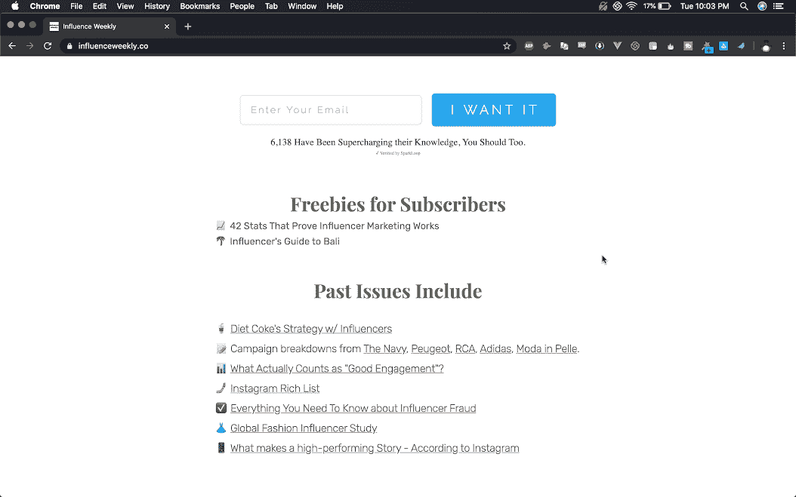
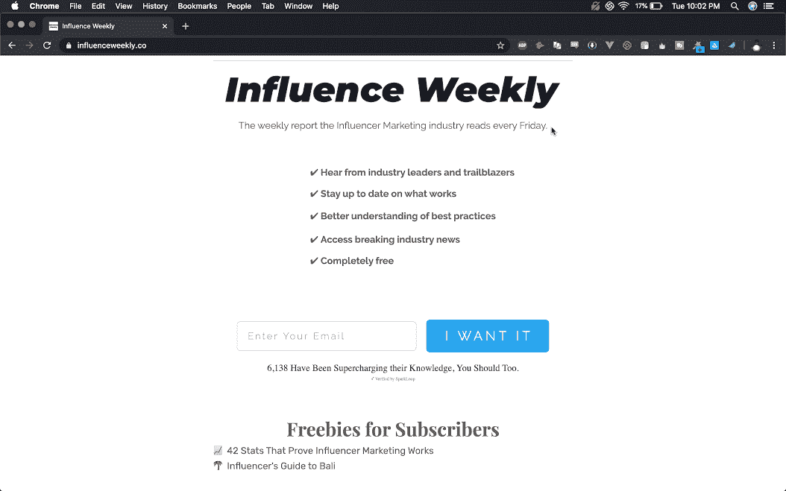

# 我如何通过我的时事通讯提供足够的价值来收费

> 原文：<https://www.indiehackers.com/interview/how-im-delivering-enough-value-with-my-newsletter-to-charge-for-it-ae7e09629c>

## 你好！你的背景是什么，你在做什么？

我是安德鲁·坎菲。我策划了一份名为《影响力周刊》的关于影响力营销行业的每周时事通讯。在这个行业工作了几年后，我想提升自己，但不确定该去哪里。我列出了 70 个好资源，并开始记录我每周阅读的内容。

我觉得《影响力周刊》是本周最有见地、最有数据依据的影响者营销文章。这就像是每周一次的行业状况报告。我的读者范围很广，从高管，到使用或希望使用影响者的公司的首席营销官和营销副总裁，到喜欢密切关注竞争对手的影响者营销机构，到影响者和代表他们的人。

我平均每月挣 704 美元。随着我做广告销售，这种情况时好时坏。根据我的最新调查，我有 6，073 个用户。

## 是什么促使你开始接触《影响力周刊》？

我已经在这个行业工作了，做定价和分析，但我想看得更远一些，把我们的工作和其他人进行比较。我想我通常想看看我们的工作是比行业平均水平好还是差。

【T2

很难找到持续的好工作。随着我在业余时间阅读的越来越多，我发现自己给公司的高管发了越来越多的电子邮件。这就是我每周把它编辑成一封邮件的想法。

我还想每周记录我所阅读的内容。我可以留一个口袋，或者一张谷歌表。现在我想我会有一个想法或漫游研究文件。但当时我认为其他人也会喜欢这个。

## 构建最初的产品需要什么？

花了一个长周末才开始。使用 [Carrd](https://carrd.co/) 作为登陆页面，我创建了一个零问题，并把它发给了我在业内尊敬的 20 个人，然后问他们我是否错过了什么。

用新的方法做旧的事情。

TweetShare

六天后，我把第一期发给了大约 50 个人。第二期到了 100。从那以后，每周几乎都有 50 个新用户。(6，000 名订户/ 127 周=每周 47.8 名订户。)

当时我利用晚上和周末来发表它。每周的周四晚上都是漫长的一夜。这花了几个月的时间，但我已经进入了一种节奏，在 127 周中，我还没有错过一周。

一年前，我辞掉了工作，并利用《影响力周刊》来维持生计，同时尝试制作其他产品。

## 你的技术是什么？

此刻:

*   Mailchimp 发送电子邮件并保存列表
*   [付费会员的子栈](https://substack.com/)
*   Google Sheets 每周都会组织和管理这些信息
*   [Stripe](https://stripe.com/) 接受广告付款
*   [Carrd](https://carrd.co/) 为登陆页面
*   [为博客代笔](https://ghost.org/)(我希望我最终可以用这个接管电子邮件和付费会员的职责)
*   用于推荐的[火花循环](https://sparkloop.app)
*   用于电子邮件 CRM 的[鸽子](Trypigeon.co)。

## 你是如何吸引用户和增加每周影响力的？

我的头号增长策略是内容营销。

1.  [影响力 100 人](http://influence.directory/100/):影响力营销最具影响力的 100 人名单。当时我只有大约 300 名订户，而在两周内，我的订户数翻了一番。这在 LinkedIn 上广为流传。

2.  [2019 年影响力 100](https://news.influenceweekly.co/100/):该版本获得简讯 700 订阅用户。

我的第二个成长策略是推荐。

我从一开始就知道 CEOS 是最有影响力的人，有一次一位首席执行官告诉我，他让所有新员工注册订阅时事通讯。

直到 2019 年末，我才添加了一个推荐计划。这并不意味着开始推介。这是为了衡量已经发生的推荐。到目前为止，它是我的订户数的主要贡献者。我要奖励那些帮助我的人！

许多人会犯这样的错误:看到别人使用一种策略，也盲目地使用这种策略。如果没有人分享你的简讯，你需要找出原因。激励他们分享它不会神奇地让他们分享它。

我创建了一个[电报](https://telegram.org/)群，作为对分享简讯的人的奖励。我们整个星期都在分享文章，讨论和会见业内其他人。很顺利！

## 你的商业模式是什么，你是如何增加收入的？

我从卖广告中赚了最多的钱。每周的时事通讯在顶部有一个广告，中间有两个文字广告。

我也有一些付费订户，他们可以提前 24 小时收到时事通讯。他们每周还会收到一封额外的电子邮件，要么深入到一份具体报告中，提供我对该行业的观点，要么预览即将发布的主要内容。

我也通过 BuyMeACoffee 的链接从捐款中赚了一些钱。除了让人们可以随时以任何理由捐款，我还使用 coffeelinks 来“销售”信息产品。我指的是我后来免费发布的信息图和报告。我在这里有一个有效的方法，(得到了一些捐款)是免费发布一个信息图，提前一周，在一个咖啡链接后面，宣布它可以用 3 美元捐款获得。当时，这是一份影响者营销行业 50 名顶级记者的名单。一些积极性很高的人想尽快看到这份名单。买不起的人可以等一周。

总的来说，这些“捐赠”贡献了我总收入的 5%。有是很棒，但不是重头戏。

每个季度我都会提高广告价格，这让我现在可以为人们制作广告包。我有些人一个月买一个广告，有些人一个月买三个广告。如果我坚持每周只卖一个广告，那就很难填满它。当有更多的空间需要填充时，这就更容易了，因为它让我的时事通讯看起来很受欢迎。

## 你未来的目标是什么？

我最大的目标是在 2020 年底达到 10，000 名订户。我计划通过每两周执行一次销售线索磁铁来做到这一点。我将创建一个可下载的 PDF 文件，并提供给新用户。我将首先把它发送给当前的订户，并宣布订户作为提前奖金获得了它。

我还为付费用户创建了一个新的会员网站。它有一个可搜索的过去文章数据库。它还将包含其他地方没有的关键信息。

## 你面临的最大挑战和克服的障碍是什么？

我愿意做任何事情来获得一些成长，而不需要我的积极参与。简讯最难的部分是几乎没有办法产生网络效应。增长是非常线性的。

我希望我能想出如何在 YouTube 上创造更好的内容。这将增加增长，而不涉及我的沉重负担。YouTube 的内容也能更有效地接触到更多的人，因为每个人学习的方式都不一样。我喜欢去年在[子栈](https://substack.com/)录制音频笔记。我现在已经开始使用[织机](https://www.loom.com/)来分发视频和截屏。

不同类型的人对不同的媒介有不同的反应，我可以利用这一点。太不可思议了！我可以重复使用旧内容，并以新的方式重新调整它的用途。

## 有没有发现什么特别有帮助或者有优势的？

KintuLabs 的 Chris 是我得到的最大帮助。他多年来的经验和建议使得这份时事通讯成为可能。Chris 写了一些关于创建时事通讯的非常有深度的博文。到目前为止，他正在研究一门新课程。我希望成百上千的人可以用他的建议开始时事通讯。创办时事通讯永远不会太晚。

以你的工作为荣，让人们知道。

TweetShare

对于创始人来说，Dip 是最好的、最短的书。知道什么时候退出，100%退出。向前看。无论是一个项目，一个公司，一个角度，只是一些你正在做的不起作用的小事。别说了。向前看。放弃并不是一件坏事，对专注于你正在做的事情很有好处。

## 对于刚刚起步的独立黑客，你有什么建议？

找到你的人。建立一个部落。

你不需要找到你的定位。*打造*小生。

用新的方法做旧的事情。

以你的工作为荣，让人们知道。

## 我们可以去哪里了解更多？

我一直在 IndieHackers 上发布更新，尤其是在时事通讯剧组。我也很开放，乐于看到别人成功。欢迎任何人在 [【邮箱保护】](andrew@kampheyapproved.com) 给我发邮件。

如果你是在线数字创作者或营销人员，请在我的网站上免费订阅。

——[<picture id="ember8072675" class="user-avatar ember-view user-link__avatar"></picture>安德鲁·坎普伊](/AndrewKamphey?id=mGWbr12aAjMcy5Pef0z1n7Nq1vF3)《影响力周刊》创始人

## 想像《影响力周刊》一样建立自己的事业？

你应该加入[独立黑客社区](/)！🤗

我们是几千名创始人，互相帮助建立有利可图的业务和副业。来分享你正在做的事情，并从你的同事那里获得反馈。

还没准备好开始使用你的产品吗？没问题。这个社区是一个认识人、学习和实践的好地方。随意[随便浏览](/)！

—[<picture id="ember8072680" class="user-avatar ember-view user-link__avatar"></picture>考特兰艾伦](/csallen?id=ibTLPyjwVebnZjMGKvz6ztarnuV2)，独立黑客创始人

22votes